## Final Recommendations

### 1. Learning Path Progression

**Beginner Level (Weeks 1-2)**:

```cpp
// Start with these fundamental concepts
1. Master basic queue operations (enqueue, dequeue, front)
2. Implement simple array-based and linked-list queues
3. Understand FIFO principle thoroughly
4. Practice basic problems like "Implement Stack using Queues"
5. Get comfortable with STL queue usage
```

**Intermediate Level (Weeks 3-4)**:

```cpp
// Move to these advanced topics
1. Learn circular queues and deques
2. Understand priority queues and their applications
3. Implement thread-safe queues
4. Practice BFS problems using queues
5. Study sliding window problems with deque optimization
```

**Advanced Level (Weeks 5-6)**:

```cpp
// Master these complex applications
1. Design system-level queue implementations
2. Solve complex algorithmic problems (shortest path, scheduling)
3. Implement custom queue variants (bounded, min-max)
4. Study lock-free concurrent queue designs
5. Practice competitive programming queue problems
```

### 2. Implementation Strategy Guide

```mermaid
graph TD
    A[Choose Queue Implementation] --> B{Use Case Analysis}

    B -->|Simple, Known Size| C[Array-based Queue]
    C --> C1[✓ Cache efficient]
    C --> C2[✓ Predictable memory]
    C --> C3[✗ Fixed capacity]

    B -->|Dynamic Size| D[Linked List Queue]
    D --> D1[✓ Flexible size]
    D --> D2[✓ No memory waste]
    D --> D3[✗ Pointer overhead]

    B -->|General Purpose| E[STL Queue]
    E --> E1[✓ Optimized & tested]
    E --> E2[✓ Standard interface]
    E --> E3[✓ Easy maintenance]

    B -->|High Performance| F[Custom Implementation]
    F --> F1[✓ Domain-specific optimization]
    F --> F2[✓ Memory pool usage]
    F --> F3[✗ Development overhead]

    style A fill:#e1f5fe
    style C fill:#f3e5f5
    style D fill:#e8f5e8
    style E fill:#fff3e0
    style F fill:#fce4ec
```



### 3. Best Practices Checklist

#### ✅ Code Quality

- [ ] Always handle empty queue cases
- [ ] Use appropriate exception handling
- [ ] Implement const-correctness for read operations
- [ ] Consider thread-safety requirements early
- [ ] Write comprehensive unit tests

#### ✅ Performance Optimization

- [ ] Choose implementation based on access patterns
- [ ] Consider memory locality for cache performance
- [ ] Use move semantics for expensive objects
- [ ] Profile before optimizing complex scenarios
- [ ] Benchmark different implementations for your use case

#### ✅ Design Principles

- [ ] Follow RAII for resource management
- [ ] Design for exception safety
- [ ] Use templates for type flexibility
- [ ] Implement clear and consistent interfaces
- [ ] Document time/space complexity

### 4. Common Pitfalls to Avoid

```cpp
// ❌ Don't do this: Unsafe operations
class BadQueue {
public:
    int front() { return data[frontIndex]; } // No empty check!
    void dequeue() { frontIndex++; }         // No bounds check!
};

// ✅ Do this: Safe operations
class GoodQueue {
public:
    int front() const {
        if (empty()) throw std::underflow_error("Queue is empty");
        return data[frontIndex];
    }

    void dequeue() {
        if (empty()) throw std::underflow_error("Queue is empty");
        frontIndex = (frontIndex + 1) % capacity;
        currentSize--;
    }
};
```

#### Common Mistakes:

1. **Forgetting edge cases**: Always test with empty queues
2. **Ignoring thread safety**: Consider concurrent access early
3. **Poor error handling**: Use exceptions appropriately
4. **Memory leaks**: Implement proper destructors
5. **Performance assumptions**: Profile before optimizing

### 5. Industry Applications & Career Relevance

**System Design Interviews**:

- Message queues in distributed systems
- Load balancing and request queuing
- Cache invalidation strategies
- Event-driven architectures

**Algorithm Interviews**:

- BFS graph traversal problems
- Sliding window optimizations
- Scheduling and priority problems
- Tree level-order traversals

**Production Systems**:

- Web server request handling
- Database transaction queues
- Real-time data processing
- Microservice communication

### 6. Next Steps for Mastery

```cpp
// Your learning roadmap
class QueueMasteryPath {
public:
    void executePhase1() {
        // Week 1-2: Foundation
        implementBasicQueues();
        solveEasyLeetCodeProblems();
        readSTLDocumentation();
    }

    void executePhase2() {
        // Week 3-4: Intermediate
        implementAdvancedVariants();
        solveMediumAlgorithmProblems();
        buildThreadSafeImplementations();
    }

    void executePhase3() {
        // Week 5-6: Advanced
        designSystemLevelSolutions();
        solveHardCompetitiveProgramming();
        contributeToOpenSourceProjects();
    }

    void continualImprovement() {
        // Ongoing
        stayUpdatedWithNewTechniques();
        practiceInterviewQuestions();
        shareKnowledgeWithCommunity();
    }
};
```

### 7. Resource Recommendations

**Books**:

- "Introduction to Algorithms" by Cormen, Leiserson, Rivest, and Stein
- "Data Structures and Algorithms in C++" by Goodrich, Tamassia, and Mount
- "Effective C++" by Scott Meyers

**Online Platforms**:

- LeetCode: Queue-tagged problems
- HackerRank: Data structures section
- GeeksforGeeks: Queue articles and problems
- Codeforces: Practice competitive programming

**Practice Problems** (Recommended Order):

1. Easy: Implement Stack using Queues, First Unique Character
2. Medium: Rotting Oranges, Sliding Window Maximum
3. Hard: Shortest Path in Binary Matrix, Bus Routes

### 8. Success Metrics

Track your progress with these measurable goals:

**Technical Proficiency**:

- [ ] Can implement 5 different queue variants from memory
- [ ] Solve 50+ queue-related algorithm problems
- [ ] Explain time/space complexity for all implementations
- [ ] Debug queue-related issues efficiently

**Problem-Solving Skills**:

- [ ] Recognize when to use queues vs other data structures
- [ ] Apply queue optimizations to reduce complexity
- [ ] Design queue-based solutions for real-world problems
- [ ] Optimize queue implementations for specific constraints

**Communication Skills**:

- [ ] Explain queue concepts to beginners clearly
- [ ] Present trade-offs between implementations
- [ ] Write clear documentation for queue code
- [ ] Conduct technical interviews on queue topics

---

## Closing Thoughts

Queues are more than just a fundamental data structure – they're a lens through which to understand order, fairness, and efficiency in computation. From the simple FIFO principle to complex concurrent systems, queues teach us about:

- **Order matters**: Understanding sequence and precedence
- **Efficiency through structure**: How proper organization enables performance
- **Real-world modeling**: Translating everyday concepts into code
- **System design**: Building scalable and reliable software

Whether you're preparing for technical interviews, building production systems, or advancing your computer science knowledge, a deep understanding of queues will serve you well throughout your career.

**Remember**: The goal isn't just to memorize implementations, but to develop the intuition for when and how to apply queue concepts to solve complex problems elegantly and efficiently.

Good luck with your queue mastery journey! 🚀
