# Comprehensive Tutorial on Queue Data Structures

_From Basics to Advanced Applications_

## Table of Contents

1. [Introduction to Queues](#introduction-to-queues)
2. [Basic Queue Operations](#basic-queue-operations)
3. [Types of Queues](#types-of-queues)
4. [Implementation Methods](#implementation-methods)
5. [Advanced Queue Variants](#advanced-queue-variants)
6. [Real-World Applications](#real-world-applications)
7. [Complex Problems and Solutions](#complex-problems-and-solutions)
8. [Performance Analysis](#performance-analysis)
9. [Interview Questions](#interview-questions)
10. [Best Practices](#best-practices)

---

## Introduction to Queues

A **Queue** is a linear data structure that follows the **First In, First Out (FIFO)** principle. Think of it like a real-world queue at a ticket counter - the first person to arrive is the first person to be served.

### Key Characteristics:

- **FIFO Behavior**: Elements are added at the rear and removed from the front
- **Linear Structure**: Elements are arranged in a sequential manner
- **Restricted Access**: Elements can only be accessed from the ends
- **Dynamic Size**: Can grow and shrink during runtime

### Queue Visualization


---

## Basic Queue Operations

### Core Operations

1. **Enqueue**: Add element to the rear
2. **Dequeue**: Remove element from the front
3. **Front/Peek**: View front element without removing
4. **IsEmpty**: Check if queue is empty
5. **Size**: Get number of elements

### Basic Queue Implementation (Array-based)

```cpp
#include <iostream>
#include <vector>
#include <stdexcept>

class Queue {
private:
    std::vector<int> arr;
    int frontIndex;
    int rearIndex;
    int capacity;
    int currentSize;

public:
    Queue(int cap) : capacity(cap), frontIndex(0), rearIndex(-1), currentSize(0) {
        arr.resize(capacity);
    }

    // Add element to rear of queue
    void enqueue(int element) {
        if (isFull()) {
            throw std::overflow_error("Queue is full");
        }
        rearIndex = (rearIndex + 1) % capacity; // Circular increment
        arr[rearIndex] = element;
        currentSize++;
    }

    // Remove and return front element
    int dequeue() {
        if (isEmpty()) {
            throw std::underflow_error("Queue is empty");
        }
        int element = arr[frontIndex];
        frontIndex = (frontIndex + 1) % capacity; // Circular increment
        currentSize--;
        return element;
    }

    // Get front element without removing
    int front() const {
        if (isEmpty()) {
            throw std::underflow_error("Queue is empty");
        }
        return arr[frontIndex];
    }

    bool isEmpty() const {
        return currentSize == 0;
    }

    bool isFull() const {
        return currentSize == capacity;
    }

    int size() const {
        return currentSize;
    }

    void display() const {
        if (isEmpty()) {
            std::cout << "Queue is empty\n";
            return;
        }

        std::cout << "Queue: ";
        for (int i = 0; i < currentSize; i++) {
            int index = (frontIndex + i) % capacity;
            std::cout << arr[index] << " ";
        }
        std::cout << "\n";
    }
};

// Example usage
int main() {
    Queue q(5);

    q.enqueue(10);
    q.enqueue(20);
    q.enqueue(30);
    q.display(); // Output: Queue: 10 20 30

    std::cout << "Front element: " << q.front() << std::endl; // 10
    std::cout << "Dequeued: " << q.dequeue() << std::endl;    // 10
    q.display(); // Output: Queue: 20 30

    return 0;
}
```

---

## Types of Queues

### 1. Simple Queue (Linear Queue)

The basic queue implementation where elements are added at rear and removed from front.


**Limitations**:

- Fixed size in array implementation
- Memory wastage in array implementation after dequeue operations

### 2. Circular Queue

Addresses the limitation of simple queue by treating the array as circular.


```cpp
class CircularQueue {
private:
    std::vector<int> arr;
    int front, rear;
    int capacity;

public:
    CircularQueue(int cap) : capacity(cap + 1), front(0), rear(0) {
        arr.resize(capacity); // Extra space to differentiate full and empty
    }

    void enqueue(int element) {
        if (isFull()) {
            throw std::overflow_error("Circular Queue is full");
        }
        arr[rear] = element;
        rear = (rear + 1) % capacity;
    }

    int dequeue() {
        if (isEmpty()) {
            throw std::underflow_error("Circular Queue is empty");
        }
        int element = arr[front];
        front = (front + 1) % capacity;
        return element;
    }

    bool isEmpty() const {
        return front == rear;
    }

    bool isFull() const {
        return (rear + 1) % capacity == front;
    }
};
```

### 3. Priority Queue

Elements are served based on priority rather than FIFO order.


```cpp
#include <queue>
#include <vector>

// Custom comparator for priority queue
struct Task {
    int id;
    int priority;
    std::string description;

    Task(int i, int p, std::string desc) : id(i), priority(p), description(desc) {}
};

struct TaskComparator {
    bool operator()(const Task& a, const Task& b) {
        return a.priority < b.priority; // Higher priority first
    }
};

class TaskScheduler {
private:
    std::priority_queue<Task, std::vector<Task>, TaskComparator> pq;

public:
    void addTask(int id, int priority, std::string description) {
        pq.push(Task(id, priority, description));
    }

    Task getNextTask() {
        if (pq.empty()) {
            throw std::runtime_error("No tasks available");
        }
        Task nextTask = pq.top();
        pq.pop();
        return nextTask;
    }

    bool hasTasks() const {
        return !pq.empty();
    }
};
```

### 4. Double-Ended Queue (Deque)

Allows insertion and deletion at both ends.


```cpp
#include <deque>

class AdvancedDeque {
private:
    std::deque<int> dq;

public:
    // Front operations
    void pushFront(int element) {
        dq.push_front(element);
    }

    int popFront() {
        if (dq.empty()) {
            throw std::underflow_error("Deque is empty");
        }
        int element = dq.front();
        dq.pop_front();
        return element;
    }

    // Rear operations
    void pushRear(int element) {
        dq.push_back(element);
    }

    int popRear() {
        if (dq.empty()) {
            throw std::underflow_error("Deque is empty");
        }
        int element = dq.back();
        dq.pop_back();
        return element;
    }

    // Access operations
    int front() const {
        if (dq.empty()) {
            throw std::underflow_error("Deque is empty");
        }
        return dq.front();
    }

    int rear() const {
        if (dq.empty()) {
            throw std::underflow_error("Deque is empty");
        }
        return dq.back();
    }

    bool isEmpty() const {
        return dq.empty();
    }

    size_t size() const {
        return dq.size();
    }
};
```

---

## Implementation Methods

### 1. Array-Based Implementation

**Advantages:**

- Simple to implement
- Memory efficient for known size
- Better cache locality

**Disadvantages:**

- Fixed size
- Memory wastage in simple queue

```mermaid
graph TD
    A[Array-Based Queue] --> B[Circular Array Structure]
    B --> C[Front Pointer]
    B --> D[Rear Pointer]
    B --> E[Size Counter]

    F[Operations] --> G[Enqueue: O(1)]
    F --> H[Dequeue: O(1)]
    F --> I[Space: O(n)]

    J[Advantages] --> K[Cache Friendly]
    J --> L[Simple Implementation]
    J --> M[Predictable Memory]

    N[Disadvantages] --> O[Fixed Size]
    N --> P[Potential Waste]

    style B fill:#e3f2fd
    style G fill:#c8e6c9
    style K fill:#fff3e0
    style O fill:#ffcdd2
```

### 2. Linked List Implementation

```cpp
template<typename T>
class LinkedQueue {
private:
    struct Node {
        T data;
        Node* next;

        Node(T value) : data(value), next(nullptr) {}
    };

    Node* frontPtr;
    Node* rearPtr;
    size_t queueSize;

public:
    LinkedQueue() : frontPtr(nullptr), rearPtr(nullptr), queueSize(0) {}

    ~LinkedQueue() {
        while (!isEmpty()) {
            dequeue();
        }
    }

    void enqueue(T element) {
        Node* newNode = new Node(element);

        if (isEmpty()) {
            frontPtr = rearPtr = newNode;
        } else {
            rearPtr->next = newNode;
            rearPtr = newNode;
        }
        queueSize++;
    }

    T dequeue() {
        if (isEmpty()) {
            throw std::underflow_error("Queue is empty");
        }

        Node* temp = frontPtr;
        T data = frontPtr->data;
        frontPtr = frontPtr->next;

        if (frontPtr == nullptr) { // Queue becomes empty
            rearPtr = nullptr;
        }

        delete temp;
        queueSize--;
        return data;
    }

    T front() const {
        if (isEmpty()) {
            throw std::underflow_error("Queue is empty");
        }
        return frontPtr->data;
    }

    bool isEmpty() const {
        return frontPtr == nullptr;
    }

    size_t size() const {
        return queueSize;
    }
};
```

**Advantages:**

- Dynamic size
- No memory wastage
- Flexible memory allocation

**Disadvantages:**

- Extra memory for pointers
- Poor cache locality
- Memory fragmentation


### 3. Using Standard Library

```cpp
#include <queue>
#include <iostream>

void demonstrateSTLQueue() {
    std::queue<int> q;

    // Enqueue operations
    q.push(10);
    q.push(20);
    q.push(30);

    std::cout << "Queue size: " << q.size() << std::endl;
    std::cout << "Front element: " << q.front() << std::endl;
    std::cout << "Rear element: " << q.back() << std::endl;

    // Dequeue operations
    while (!q.empty()) {
        std::cout << "Dequeued: " << q.front() << std::endl;
        q.pop();
    }
}
```

---

## Advanced Queue Variants

### 1. Concurrent Queue (Thread-Safe)

A thread-safe queue implementation that allows multiple threads to safely enqueue and dequeue operations simultaneously.

**Key Concepts**:

- **Mutual Exclusion**: Mutex ensures only one thread modifies queue at a time
- **Condition Variables**: Efficient waiting mechanism for empty queue scenarios
- **Exception Safety**: Operations maintain queue consistency even when exceptions occur

**Why thread-safety is needed**:

1. **Race Conditions**: Multiple threads accessing shared data simultaneously
2. **Data Corruption**: Concurrent modifications can lead to inconsistent state
3. **Synchronization**: Coordination between producer and consumer threads


```cpp
#include <queue>
#include <mutex>
#include <condition_variable>

template<typename T>
class ThreadSafeQueue {
private:
    mutable std::mutex mtx;
    std::queue<T> dataQueue;
    std::condition_variable condition;

public:
    void enqueue(T element) {
        std::lock_guard<std::mutex> lock(mtx);
        dataQueue.push(element);
        condition.notify_one();
    }

    bool tryDequeue(T& result) {
        std::lock_guard<std::mutex> lock(mtx);
        if (dataQueue.empty()) {
            return false;
        }
        result = dataQueue.front();
        dataQueue.pop();
        return true;
    }

    void waitAndDequeue(T& result) {
        std::unique_lock<std::mutex> lock(mtx);
        while (dataQueue.empty()) {
            condition.wait(lock);
        }
        result = dataQueue.front();
        dataQueue.pop();
    }

    bool empty() const {
        std::lock_guard<std::mutex> lock(mtx);
        return dataQueue.empty();
    }

    size_t size() const {
        std::lock_guard<std::mutex> lock(mtx);
        return dataQueue.size();
    }
};
```

### 2. Bounded Queue with Blocking

```cpp
template<typename T>
class BoundedBlockingQueue {
private:
    std::mutex mtx;
    std::condition_variable notFull;
    std::condition_variable notEmpty;
    std::queue<T> queue;
    size_t maxSize;

public:
    BoundedBlockingQueue(size_t capacity) : maxSize(capacity) {}

    void enqueue(T element) {
        std::unique_lock<std::mutex> lock(mtx);
        notFull.wait(lock, [this] { return queue.size() < maxSize; });

        queue.push(element);
        notEmpty.notify_one();
    }

    T dequeue() {
        std::unique_lock<std::mutex> lock(mtx);
        notEmpty.wait(lock, [this] { return !queue.empty(); });

        T element = queue.front();
        queue.pop();
        notFull.notify_one();
        return element;
    }
};
```

### 3. Min-Max Queue

```cpp
#include <deque>

class MinMaxQueue {
private:
    std::deque<int> data;
    std::deque<int> minDeque; // Stores indices for minimum elements
    std::deque<int> maxDeque; // Stores indices for maximum elements

public:
    void enqueue(int element) {
        int index = data.size();
        data.push_back(element);

        // Maintain min deque (increasing order)
        while (!minDeque.empty() && data[minDeque.back()] >= element) {
            minDeque.pop_back();
        }
        minDeque.push_back(index);

        // Maintain max deque (decreasing order)
        while (!maxDeque.empty() && data[maxDeque.back()] <= element) {
            maxDeque.pop_back();
        }
        maxDeque.push_back(index);
    }

    int dequeue() {
        if (data.empty()) {
            throw std::underflow_error("Queue is empty");
        }

        int element = data.front();
        data.pop_front();

        // Update indices in deques
        for (auto& idx : minDeque) idx--;
        for (auto& idx : maxDeque) idx--;

        // Remove invalid indices
        if (!minDeque.empty() && minDeque.front() < 0) {
            minDeque.pop_front();
        }
        if (!maxDeque.empty() && maxDeque.front() < 0) {
            maxDeque.pop_front();
        }

        return element;
    }

    int getMin() const {
        if (minDeque.empty()) {
            throw std::runtime_error("Queue is empty");
        }
        return data[minDeque.front()];
    }

    int getMax() const {
        if (maxDeque.empty()) {
            throw std::runtime_error("Queue is empty");
        }
        return data[maxDeque.front()];
    }
};
```

---

## Real-World Applications

### 1. CPU Process Scheduling

CPU scheduling is a fundamental operating system concept where queues manage process execution order. Different scheduling algorithms use queues in various ways.


```cpp
struct Process {
    int pid;
    int burstTime;
    int arrivalTime;
    int priority;

    Process(int id, int burst, int arrival, int prio = 0)
        : pid(id), burstTime(burst), arrivalTime(arrival), priority(prio) {}
};

class CPUScheduler {
private:
    std::queue<Process> readyQueue;
    int currentTime;

public:
    CPUScheduler() : currentTime(0) {}

    void addProcess(const Process& process) {
        readyQueue.push(process);
    }

    // First Come First Serve scheduling
    void fcfsScheduling() {
        std::cout << "FCFS Scheduling:\n";
        std::cout << "PID\tArrival\tBurst\tCompletion\tTurnaround\tWaiting\n";

        while (!readyQueue.empty()) {
            Process current = readyQueue.front();
            readyQueue.pop();

            if (currentTime < current.arrivalTime) {
                currentTime = current.arrivalTime;
            }

            int completionTime = currentTime + current.burstTime;
            int turnaroundTime = completionTime - current.arrivalTime;
            int waitingTime = turnaroundTime - current.burstTime;

            std::cout << current.pid << "\t" << current.arrivalTime << "\t"
                     << current.burstTime << "\t" << completionTime << "\t\t"
                     << turnaroundTime << "\t\t" << waitingTime << "\n";

            currentTime = completionTime;
        }
    }
};
```

### 2. Breadth-First Search Implementation

```cpp
#include <vector>
#include <queue>
#include <unordered_set>

class Graph {
private:
    std::vector<std::vector<int>> adjList;
    int vertices;

public:
    Graph(int v) : vertices(v) {
        adjList.resize(v);
    }

    void addEdge(int src, int dest) {
        adjList[src].push_back(dest);
        adjList[dest].push_back(src); // For undirected graph
    }

    void bfs(int startVertex) {
        std::vector<bool> visited(vertices, false);
        std::queue<int> bfsQueue;

        visited[startVertex] = true;
        bfsQueue.push(startVertex);

        std::cout << "BFS Traversal: ";

        while (!bfsQueue.empty()) {
            int currentVertex = bfsQueue.front();
            bfsQueue.pop();
            std::cout << currentVertex << " ";

            // Visit all adjacent vertices
            for (int neighbor : adjList[currentVertex]) {
                if (!visited[neighbor]) {
                    visited[neighbor] = true;
                    bfsQueue.push(neighbor);
                }
            }
        }
        std::cout << std::endl;
    }

    // Find shortest path between two vertices
    std::vector<int> shortestPath(int start, int end) {
        std::vector<bool> visited(vertices, false);
        std::vector<int> parent(vertices, -1);
        std::queue<int> bfsQueue;

        visited[start] = true;
        bfsQueue.push(start);

        while (!bfsQueue.empty()) {
            int current = bfsQueue.front();
            bfsQueue.pop();

            if (current == end) {
                break; // Found the destination
            }

            for (int neighbor : adjList[current]) {
                if (!visited[neighbor]) {
                    visited[neighbor] = true;
                    parent[neighbor] = current;
                    bfsQueue.push(neighbor);
                }
            }
        }

        // Reconstruct path
        std::vector<int> path;
        if (visited[end]) {
            int current = end;
            while (current != -1) {
                path.push_back(current);
                current = parent[current];
            }
            std::reverse(path.begin(), path.end());
        }

        return path;
    }
};
```

### 3. Web Server Request Handling

```cpp
#include <chrono>
#include <thread>

struct HTTPRequest {
    int requestId;
    std::string clientIP;
    std::string requestPath;
    std::chrono::steady_clock::time_point timestamp;

    HTTPRequest(int id, std::string ip, std::string path)
        : requestId(id), clientIP(ip), requestPath(path) {
        timestamp = std::chrono::steady_clock::now();
    }
};

class WebServerQueue {
private:
    std::queue<HTTPRequest> requestQueue;
    std::mutex queueMutex;
    std::condition_variable cv;
    bool isRunning;
    std::thread workerThread;

public:
    WebServerQueue() : isRunning(true) {
        workerThread = std::thread(&WebServerQueue::processRequests, this);
    }

    ~WebServerQueue() {
        isRunning = false;
        cv.notify_all();
        if (workerThread.joinable()) {
            workerThread.join();
        }
    }

    void addRequest(const HTTPRequest& request) {
        std::lock_guard<std::mutex> lock(queueMutex);
        requestQueue.push(request);
        cv.notify_one();
    }

private:
    void processRequests() {
        while (isRunning) {
            std::unique_lock<std::mutex> lock(queueMutex);
            cv.wait(lock, [this] { return !requestQueue.empty() || !isRunning; });

            if (!isRunning) break;

            HTTPRequest request = requestQueue.front();
            requestQueue.pop();
            lock.unlock();

            // Simulate request processing
            handleRequest(request);
        }
    }

    void handleRequest(const HTTPRequest& request) {
        auto now = std::chrono::steady_clock::now();
        auto waitTime = std::chrono::duration_cast<std::chrono::milliseconds>(
            now - request.timestamp).count();

        std::cout << "Processing request " << request.requestId
                 << " from " << request.clientIP
                 << " for " << request.requestPath
                 << " (waited " << waitTime << "ms)" << std::endl;

        // Simulate processing time
        std::this_thread::sleep_for(std::chrono::milliseconds(100));
    }
};
```

---

## Complex Problems and Solutions

### Problem 1: Sliding Window Maximum

**Problem Statement**: Given an array and a window size k, find the maximum element in each sliding window.

**Approach**: Use a deque to maintain elements in decreasing order of their values. The front always contains the maximum element of the current window.

**Why this approach works**: By maintaining decreasing order, we ensure that:

1. The front element is always the maximum
2. We can efficiently remove elements that go out of window
3. We can efficiently add new elements while maintaining the property

```cpp
#include <deque>
#include <vector>

class SlidingWindowMaximum {
public:
    std::vector<int> maxSlidingWindow(std::vector<int>& nums, int k) {
        std::deque<int> dq; // Stores indices
        std::vector<int> result;

        for (int i = 0; i < nums.size(); i++) {
            // Remove indices that are out of current window
            while (!dq.empty() && dq.front() <= i - k) {
                dq.pop_front();
            }

            // Remove indices of elements smaller than current element
            while (!dq.empty() && nums[dq.back()] <= nums[i]) {
                dq.pop_back();
            }

            dq.push_back(i);

            // Add maximum of current window to result
            if (i >= k - 1) {
                result.push_back(nums[dq.front()]);
            }
        }

        return result;
    }

    void demonstrate() {
        std::vector<int> nums = {1, 3, -1, -3, 5, 3, 6, 7};
        int k = 3;

        std::vector<int> result = maxSlidingWindow(nums, k);

        std::cout << "Array: ";
        for (int num : nums) std::cout << num << " ";
        std::cout << "\nWindow size: " << k << std::endl;
        std::cout << "Sliding window maximums: ";
        for (int max : result) std::cout << max << " ";
        std::cout << std::endl;
    }
};
```

### Problem 2: Design Hit Counter

**Problem Statement**: Design a hit counter that counts hits in the past 5 minutes (300 seconds).

**Approach**: Use a queue to store timestamps. Remove timestamps older than 300 seconds when querying.

**Why this approach works**:

1. Queue naturally maintains chronological order
2. We only need to check the front for expired timestamps
3. Time complexity is amortized O(1) for both hit and getHits operations

```cpp
#include <queue>
#include <chrono>

class HitCounter {
private:
    std::queue<int> hits;
    static const int TIME_WINDOW = 300; // 5 minutes in seconds

public:
    void hit(int timestamp) {
        hits.push(timestamp);
    }

    int getHits(int timestamp) {
        // Remove hits older than 300 seconds
        while (!hits.empty() && hits.front() <= timestamp - TIME_WINDOW) {
            hits.pop();
        }
        return hits.size();
    }

    void demonstrateUsage() {
        hit(1);
        hit(2);
        hit(3);

        std::cout << "Hits at timestamp 4: " << getHits(4) << std::endl; // 3

        hit(300);
        std::cout << "Hits at timestamp 300: " << getHits(300) << std::endl; // 4
        std::cout << "Hits at timestamp 301: " << getHits(301) << std::endl; // 3
    }
};
```

### Problem 3: Implement Stack using Two Queues

**Problem Statement**: Implement a stack's push and pop operations using only two queues.

**Approach**: Use one queue for storage and another as temporary during pop operations.

**Why this approach works**:

1. Push is O(1) - just add to the main queue
2. Pop requires moving all elements except the last one to the temporary queue
3. This simulates LIFO behavior using FIFO structures

```cpp
#include <queue>

class StackUsingTwoQueues {
private:
    std::queue<int> q1; // Main queue
    std::queue<int> q2; // Temporary queue

public:
    void push(int element) {
        q1.push(element);
    }

    int pop() {
        if (q1.empty()) {
            throw std::runtime_error("Stack is empty");
        }

        // Move all elements except the last one to q2
        while (q1.size() > 1) {
            q2.push(q1.front());
            q1.pop();
        }

        // Get the last element (top of stack)
        int topElement = q1.front();
        q1.pop();

        // Swap queues to restore order
        std::swap(q1, q2);

        return topElement;
    }

    int top() {
        if (q1.empty()) {
            throw std::runtime_error("Stack is empty");
        }

        // Similar to pop but don't remove the element
        while (q1.size() > 1) {
            q2.push(q1.front());
            q1.pop();
        }

        int topElement = q1.front();
        q2.push(q1.front()); // Keep the element
        q1.pop();

        std::swap(q1, q2);
        return topElement;
    }

    bool empty() {
        return q1.empty();
    }

    void demonstrate() {
        push(1);
        push(2);
        push(3);

        std::cout << "Top: " << top() << std::endl;    // 3
        std::cout << "Pop: " << pop() << std::endl;    // 3
        std::cout << "Pop: " << pop() << std::endl;    // 2
        std::cout << "Top: " << top() << std::endl;    // 1
    }
};
```

### Problem 4: Shortest Path in Binary Matrix

**Problem Statement**: Find the shortest path from top-left to bottom-right in a binary matrix where 0 represents a walkable cell.

**Approach**: Use BFS with a queue to explore all possible paths level by level.

**Why BFS works**: BFS guarantees that we find the shortest path because it explores nodes in order of their distance from the source.

```cpp
#include <vector>
#include <queue>

class BinaryMatrixShortestPath {
private:
    struct Cell {
        int row, col, distance;
        Cell(int r, int c, int d) : row(r), col(c), distance(d) {}
    };

    // 8 possible directions (including diagonals)
    std::vector<std::pair<int, int>> directions = {
        {-1, -1}, {-1, 0}, {-1, 1},
        {0, -1},           {0, 1},
        {1, -1},  {1, 0},  {1, 1}
    };

public:
    int shortestPathBinaryMatrix(std::vector<std::vector<int>>& grid) {
        int n = grid.size();

        // Check if start or end is blocked
        if (grid[0][0] == 1 || grid[n-1][n-1] == 1) {
            return -1;
        }

        // Special case: single cell
        if (n == 1) {
            return 1;
        }

        std::vector<std::vector<bool>> visited(n, std::vector<bool>(n, false));
        std::queue<Cell> bfsQueue;

        bfsQueue.push(Cell(0, 0, 1));
        visited[0][0] = true;

        while (!bfsQueue.empty()) {
            Cell current = bfsQueue.front();
            bfsQueue.pop();

            // Explore all 8 directions
            for (auto& dir : directions) {
                int newRow = current.row + dir.first;
                int newCol = current.col + dir.second;

                // Check bounds and if cell is walkable and unvisited
                if (newRow >= 0 && newRow < n && newCol >= 0 && newCol < n &&
                    grid[newRow][newCol] == 0 && !visited[newRow][newCol]) {

                    // Check if we reached the destination
                    if (newRow == n - 1 && newCol == n - 1) {
                        return current.distance + 1;
                    }

                    visited[newRow][newCol] = true;
                    bfsQueue.push(Cell(newRow, newCol, current.distance + 1));
                }
            }
        }

        return -1; // No path found
    }

    void demonstrate() {
        std::vector<std::vector<int>> grid = {
            {0, 0, 0},
            {1, 1, 0},
            {1, 1, 0}
        };

        int result = shortestPathBinaryMatrix(grid);
        std::cout << "Shortest path length: " << result << std::endl; // 4

        // Visualize the grid
        std::cout << "Grid:\n";
        for (auto& row : grid) {
            for (int cell : row) {
                std::cout << cell << " ";
            }
            std::cout << "\n";
        }
    }
};
```

### Problem 5: Design Circular Deque

**Problem Statement**: Design a circular double-ended queue that supports insertion and deletion at both ends.

**Approach**: Use a circular array with front and rear pointers that can move in both directions.

**Why this approach works**:

1. Circular array eliminates waste of space
2. Both front and rear pointers can move bidirectionally
3. Modular arithmetic handles wraparound efficiently
4. Size tracking helps distinguish between empty and full states

```cpp
class MyCircularDeque {
private:
    std::vector<int> buffer;
    int front, rear, size, capacity;

public:
    MyCircularDeque(int k) : capacity(k), size(0), front(0), rear(0) {
        buffer.resize(k);
    }

    bool insertFront(int value) {
        if (isFull()) return false;

        if (size == 0) {
            buffer[front] = value;
        } else {
            front = (front - 1 + capacity) % capacity;
            buffer[front] = value;
        }
        size++;
        return true;
    }

    bool insertLast(int value) {
        if (isFull()) return false;

        if (size == 0) {
            buffer[rear] = value;
        } else {
            rear = (rear + 1) % capacity;
            buffer[rear] = value;
        }
        size++;
        return true;
    }

    bool deleteFront() {
        if (isEmpty()) return false;

        if (size == 1) {
            // Reset pointers when deque becomes empty
            front = rear = 0;
        } else {
            front = (front + 1) % capacity;
        }
        size--;
        return true;
    }

    bool deleteLast() {
        if (isEmpty()) return false;

        if (size == 1) {
            front = rear = 0;
        } else {
            rear = (rear - 1 + capacity) % capacity;
        }
        size--;
        return true;
    }

    int getFront() {
        return isEmpty() ? -1 : buffer[front];
    }

    int getRear() {
        return isEmpty() ? -1 : buffer[rear];
    }

    bool isEmpty() {
        return size == 0;
    }

    bool isFull() {
        return size == capacity;
    }

    void display() {
        if (isEmpty()) {
            std::cout << "Deque is empty\n";
            return;
        }

        std::cout << "Deque: ";
        int current = front;
        for (int i = 0; i < size; i++) {
            std::cout << buffer[current] << " ";
            current = (current + 1) % capacity;
        }
        std::cout << "\n";
    }
};
```

### Problem 6: Maximum in Sliding Window (Advanced Deque)

**Problem Statement**: Given an array of integers and a window size k, find the maximum value in each sliding window as it moves from left to right.

**Approach**: Use a deque to store indices of array elements in decreasing order of their values.

**Why this approach works**:

1. Deque maintains elements in decreasing order, so front is always maximum
2. We can remove elements from both ends efficiently
3. Time complexity: O(n) - each element is added and removed at most once
4. Space complexity: O(k) - deque stores at most k elements


```cpp
class AdvancedSlidingWindow {
public:
    std::vector<int> maxSlidingWindow(std::vector<int>& nums, int k) {
        std::deque<int> dq; // Stores indices in decreasing order of values
        std::vector<int> result;

        for (int i = 0; i < nums.size(); i++) {
            // Remove indices outside current window
            while (!dq.empty() && dq.front() <= i - k) {
                dq.pop_front();
            }

            // Remove indices whose corresponding values are smaller than current
            while (!dq.empty() && nums[dq.back()] <= nums[i]) {
                dq.pop_back();
            }

            dq.push_back(i);

            // Add maximum to result once window is formed
            if (i >= k - 1) {
                result.push_back(nums[dq.front()]);
            }
        }

        return result;
    }

    void visualizeProcess(std::vector<int>& nums, int k) {
        std::cout << "Sliding Window Maximum Process:\n";
        std::cout << "Array: ";
        for (int x : nums) std::cout << x << " ";
        std::cout << "\nWindow size: " << k << "\n\n";

        std::deque<int> dq;
        for (int i = 0; i < nums.size(); i++) {
            // Clean up as before
            while (!dq.empty() && dq.front() <= i - k) dq.pop_front();
            while (!dq.empty() && nums[dq.back()] <= nums[i]) dq.pop_back();
            dq.push_back(i);

            std::cout << "Step " << i + 1 << ": ";
            if (i >= k - 1) {
                std::cout << "Window [" << (i - k + 1) << "," << i << "] = ";
                for (int j = i - k + 1; j <= i; j++) {
                    std::cout << nums[j] << " ";
                }
                std::cout << "-> Max: " << nums[dq.front()] << "\n";
            } else {
                std::cout << "Building window...\n";
            }
        }
    }
};
```

### Problem 7: Shortest Bridge (BFS with Queue)

**Problem Statement**: In a binary matrix, find the shortest bridge between two islands (represented by 1s).

**Approach**:

1. Use DFS to find all cells of the first island and mark them
2. Use BFS starting from all cells of the first island to find the shortest path to the second island

**Why this approach works**:

1. DFS efficiently finds all connected components (first island)
2. Multi-source BFS from first island guarantees shortest path
3. Level-by-level exploration ensures minimum distance


```cpp
class ShortestBridge {
private:
    std::vector<std::pair<int, int>> directions = {{-1,0}, {1,0}, {0,-1}, {0,1}};

public:
    int shortestBridge(std::vector<std::vector<int>>& grid) {
        int n = grid.size();
        std::queue<std::pair<int, int>> bfsQueue;

        // Find first island using DFS and add border cells to queue
        bool found = false;
        for (int i = 0; i < n && !found; i++) {
            for (int j = 0; j < n && !found; j++) {
                if (grid[i][j] == 1) {
                    dfsMarkIsland(grid, i, j, bfsQueue);
                    found = true;
                }
            }
        }

        // BFS to find shortest path to second island
        int distance = 0;
        while (!bfsQueue.empty()) {
            int size = bfsQueue.size();

            for (int i = 0; i < size; i++) {
                auto [row, col] = bfsQueue.front();
                bfsQueue.pop();

                for (auto& dir : directions) {
                    int newRow = row + dir.first;
                    int newCol = col + dir.second;

                    if (newRow >= 0 && newRow < n && newCol >= 0 && newCol < n) {
                        if (grid[newRow][newCol] == 1) {
                            return distance; // Found second island
                        }
                        if (grid[newRow][newCol] == 0) {
                            grid[newRow][newCol] = -1; // Mark as visited
                            bfsQueue.push({newRow, newCol});
                        }
                    }
                }
            }
            distance++;
        }

        return -1; // Should never reach here for valid input
    }

private:
    void dfsMarkIsland(std::vector<std::vector<int>>& grid, int row, int col,
                       std::queue<std::pair<int, int>>& bfsQueue) {
        int n = grid.size();
        if (row < 0 || row >= n || col < 0 || col >= n || grid[row][col] != 1) {
            return;
        }

        grid[row][col] = -1; // Mark as visited
        bfsQueue.push({row, col}); // Add to BFS queue for boundary expansion

        // Continue DFS to all 4 directions
        for (auto& dir : directions) {
            dfsMarkIsland(grid, row + dir.first, col + dir.second, bfsQueue);
        }
    }

public:
    void demonstrate() {
        std::vector<std::vector<int>> grid = {
            {0,1,0},
            {0,0,0},
            {0,0,1}
        };

        std::cout << "Grid:\n";
        for (auto& row : grid) {
            for (int cell : row) std::cout << cell << " ";
            std::cout << "\n";
        }

        int result = shortestBridge(grid);
        std::cout << "Shortest bridge length: " << result << std::endl;
    }
};
```

### Problem 8: Jump Game VI (Deque Optimization)

**Problem Statement**: Given an array and a maximum jump distance k, find the maximum score path from start to end where you can jump at most k positions forward.

**Approach**: Use dynamic programming with deque optimization to maintain maximum in sliding window.

**Why deque optimization works**:

1. For each position, we need maximum from previous k positions
2. Sliding window maximum can be solved optimally with deque
3. Reduces time complexity from O(nk) to O(n)

```cpp
class JumpGameVI {
public:
    int maxResult(std::vector<int>& nums, int k) {
        int n = nums.size();
        std::vector<int> dp(n);
        std::deque<int> dq; // Stores indices in decreasing order of dp values

        dp[0] = nums[0];
        dq.push_back(0);

        for (int i = 1; i < n; i++) {
            // Remove indices outside the jump range
            while (!dq.empty() && dq.front() < i - k) {
                dq.pop_front();
            }

            // Current position value = nums[i] + max of previous k positions
            dp[i] = nums[i] + dp[dq.front()];

            // Maintain deque in decreasing order of dp values
            while (!dq.empty() && dp[dq.back()] <= dp[i]) {
                dq.pop_back();
            }

            dq.push_back(i);
        }

        return dp[n - 1];
    }

    void demonstrateWithSteps(std::vector<int>& nums, int k) {
        int n = nums.size();
        std::vector<int> dp(n);
        std::deque<int> dq;

        std::cout << "Jump Game VI Simulation:\n";
        std::cout << "Array: ";
        for (int x : nums) std::cout << x << " ";
        std::cout << "\nMax jump distance: " << k << "\n\n";

        dp[0] = nums[0];
        dq.push_back(0);
        std::cout << "Step 0: dp[0] = " << dp[0] << "\n";

        for (int i = 1; i < n; i++) {
            while (!dq.empty() && dq.front() < i - k) dq.pop_front();

            dp[i] = nums[i] + dp[dq.front()];
            std::cout << "Step " << i << ": dp[" << i << "] = " << nums[i]
                     << " + dp[" << dq.front() << "] = " << dp[i] << "\n";

            while (!dq.empty() && dp[dq.back()] <= dp[i]) dq.pop_back();
            dq.push_back(i);
        }

        std::cout << "\nMaximum score: " << dp[n-1] << "\n";
    }
};
```

### Problem 9: Task Scheduler (Priority Queue + Cooling)

**Problem Statement**: Given tasks and a cooling period, find minimum time to complete all tasks.

**Approach**: Use frequency counting, priority queue for task selection, and queue for cooling management.

**Why this approach works**:

1. Always pick the most frequent available task
2. Use queue to track cooling period for each task type
3. Idle time is added when no tasks are available


```cpp
class TaskScheduler {
public:
    int leastInterval(std::vector<char>& tasks, int n) {
        // Count frequency of each task
        std::unordered_map<char, int> taskCount;
        for (char task : tasks) {
            taskCount[task]++;
        }

        // Max heap to store frequencies
        std::priority_queue<int> maxHeap;
        for (auto& [task, count] : taskCount) {
            maxHeap.push(count);
        }

        // Queue to store tasks in cooling period: {frequency, available_time}
        std::queue<std::pair<int, int>> coolingQueue;
        int time = 0;

        while (!maxHeap.empty() || !coolingQueue.empty()) {
            time++;

            // Check if any task's cooling period is over
            if (!coolingQueue.empty() && coolingQueue.front().second == time) {
                maxHeap.push(coolingQueue.front().first);
                coolingQueue.pop();
            }

            // Execute a task if available
            if (!maxHeap.empty()) {
                int freq = maxHeap.top();
                maxHeap.pop();
                freq--;

                // If task still has remaining executions, add to cooling queue
                if (freq > 0) {
                    coolingQueue.push({freq, time + n + 1});
                }
            }
        }

        return time;
    }

    void simulateScheduling(std::vector<char>& tasks, int n) {
        std::unordered_map<char, int> taskCount;
        for (char task : tasks) taskCount[task]++;

        std::priority_queue<std::pair<int, char>> maxHeap; // {frequency, task}
        for (auto& [task, count] : taskCount) {
            maxHeap.push({count, task});
        }

        std::queue<std::pair<std::pair<int, char>, int>> coolingQueue; // {{freq, task}, available_time}
        int time = 0;

        std::cout << "Task Scheduling Simulation (cooling period = " << n << "):\n";
        std::cout << "Tasks: ";
        for (char t : tasks) std::cout << t << " ";
        std::cout << "\n\nSchedule:\n";

        while (!maxHeap.empty() || !coolingQueue.empty()) {
            time++;

            // Check cooling queue
            if (!coolingQueue.empty() && coolingQueue.front().second == time) {
                auto [taskInfo, _] = coolingQueue.front();
                coolingQueue.pop();
                maxHeap.push(taskInfo);
            }

            // Execute task
            if (!maxHeap.empty()) {
                auto [freq, task] = maxHeap.top();
                maxHeap.pop();
                std::cout << "Time " << time << ": Execute task " << task << "\n";

                freq--;
                if (freq > 0) {
                    coolingQueue.push({{freq, task}, time + n + 1});
                }
            } else {
                std::cout << "Time " << time << ": Idle\n";
            }
        }

        std::cout << "Total time: " << time << "\n";
    }
};
```

### Problem 10: Open the Lock (BFS Shortest Path)

**Problem Statement**: You have a 4-digit lock with wheels. Find minimum turns to reach target from "0000", avoiding deadends.

**Approach**: Model as graph problem where each lock state is a node, use BFS to find shortest path.

**Why BFS works**:

1. Each turn represents an edge in the graph
2. BFS guarantees shortest path in unweighted graphs
3. State space is manageable (10^4 states)

```cpp
class OpenLock {
public:
    int openLock(std::vector<std::string>& deadends, std::string target) {
        std::unordered_set<std::string> deadSet(deadends.begin(), deadends.end());
        std::unordered_set<std::string> visited;
        std::queue<std::pair<std::string, int>> bfsQueue; // {state, turns}

        std::string start = "0000";
        if (deadSet.count(start) || deadSet.count(target)) {
            return -1;
        }

        if (start == target) return 0;

        bfsQueue.push({start, 0});
        visited.insert(start);

        while (!bfsQueue.empty()) {
            auto [current, turns] = bfsQueue.front();
            bfsQueue.pop();

            // Try all possible moves (8 total: 4 wheels × 2 directions)
            for (int i = 0; i < 4; i++) {
                // Turn wheel i up and down
                for (int direction : {-1, 1}) {
                    std::string next = current;
                    next[i] = ((next[i] - '0' + direction + 10) % 10) + '0';

                    if (next == target) {
                        return turns + 1;
                    }

                    if (!visited.count(next) && !deadSet.count(next)) {
                        visited.insert(next);
                        bfsQueue.push({next, turns + 1});
                    }
                }
            }
        }

        return -1; // Target unreachable
    }

    void demonstrateSearch(std::vector<std::string>& deadends, std::string target) {
        std::unordered_set<std::string> deadSet(deadends.begin(), deadends.end());
        std::unordered_set<std::string> visited;
        std::queue<std::pair<std::string, int>> bfsQueue;

        std::cout << "Lock Opening Search:\n";
        std::cout << "Target: " << target << "\nDeadends: ";
        for (const std::string& d : deadends) std::cout << d << " ";
        std::cout << "\n\nSearch process:\n";

        std::string start = "0000";
        bfsQueue.push({start, 0});
        visited.insert(start);

        while (!bfsQueue.empty() && bfsQueue.size() < 20) { // Limit output
            auto [current, turns] = bfsQueue.front();
            bfsQueue.pop();

            std::cout << "Exploring: " << current << " (turns: " << turns << ")\n";

            if (current == target) {
                std::cout << "Found target in " << turns << " turns!\n";
                return;
            }

            for (int i = 0; i < 4; i++) {
                for (int direction : {-1, 1}) {
                    std::string next = current;
                    next[i] = ((next[i] - '0' + direction + 10) % 10) + '0';

                    if (!visited.count(next) && !deadSet.count(next)) {
                        visited.insert(next);
                        bfsQueue.push({next, turns + 1});
                    }
                }
            }
        }
    }
};
```

---

## Performance Analysis

### Time Complexity Comparison

| Operation | Array-based | Linked List | STL queue |
| --------- | ----------- | ----------- | --------- |
| Enqueue   | O(1)        | O(1)        | O(1)      |
| Dequeue   | O(1)        | O(1)        | O(1)      |
| Front     | O(1)        | O(1)        | O(1)      |
| Size      | O(1)        | O(1)        | O(1)      |
| Empty     | O(1)        | O(1)        | O(1)      |

### Space Complexity Analysis

```cpp
class QueuePerformanceAnalyzer {
public:
    void analyzePerformance() {
        const int NUM_OPERATIONS = 1000000;

        // Test Array-based Queue
        auto start = std::chrono::high_resolution_clock::now();
        testArrayQueue(NUM_OPERATIONS);
        auto end = std::chrono::high_resolution_clock::now();
        auto arrayTime = std::chrono::duration_cast<std::chrono::microseconds>(end - start);

        // Test Linked List Queue
        start = std::chrono::high_resolution_clock::now();
        testLinkedQueue(NUM_OPERATIONS);
        end = std::chrono::high_resolution_clock::now();
        auto linkedTime = std::chrono::duration_cast<std::chrono::microseconds>(end - start);

        // Test STL Queue
        start = std::chrono::high_resolution_clock::now();
        testSTLQueue(NUM_OPERATIONS);
        end = std::chrono::high_resolution_clock::now();
        auto stlTime = std::chrono::duration_cast<std::chrono::microseconds>(end - start);

        std::cout << "Performance Analysis (" << NUM_OPERATIONS << " operations):\n";
        std::cout << "Array-based Queue: " << arrayTime.count() << " µs\n";
        std::cout << "Linked List Queue: " << linkedTime.count() << " µs\n";
        std::cout << "STL Queue: " << stlTime.count() << " µs\n";
    }

private:
    void testArrayQueue(int operations) {
        Queue q(operations / 2);
        for (int i = 0; i < operations / 2; i++) {
            q.enqueue(i);
        }
        for (int i = 0; i < operations / 2; i++) {
            q.dequeue();
        }
    }

    void testLinkedQueue(int operations) {
        LinkedQueue<int> q;
        for (int i = 0; i < operations / 2; i++) {
            q.enqueue(i);
        }
        for (int i = 0; i < operations / 2; i++) {
            q.dequeue();
        }
    }

    void testSTLQueue(int operations) {
        std::queue<int> q;
        for (int i = 0; i < operations / 2; i++) {
            q.push(i);
        }
        for (int i = 0; i < operations / 2; i++) {
            q.pop();
        }
    }
};
```

### Memory Usage Analysis


---

## Interview Questions

### Easy Level Questions

#### 1. Implement Queue using Stacks

**Problem Statement**: Design a queue using only two stacks. Implement `enqueue`, `dequeue`, `front`, and `empty` operations.

**Approach**: Use two stacks - one for input operations and one for output operations.

**Why this approach works**:

1. **Input stack** handles all enqueue operations in O(1)
2. **Output stack** handles dequeue/front operations
3. Elements are transferred from input to output stack only when output is empty
4. This maintains FIFO order because double reversal (stack→stack) preserves original order

**Time Complexity**:

- Enqueue: O(1)
- Dequeue: Amortized O(1) - worst case O(n) when transferring
- Front: Amortized O(1)


```cpp
class QueueUsingStacks {
private:
    std::stack<int> inStack;  // For enqueue operations
    std::stack<int> outStack; // For dequeue operations

public:
    void enqueue(int x) {
        inStack.push(x);
    }

    int dequeue() {
        if (outStack.empty()) {
            // Transfer all elements from inStack to outStack
            while (!inStack.empty()) {
                outStack.push(inStack.top());
                inStack.pop();
            }
        }

        if (outStack.empty()) {
            throw std::runtime_error("Queue is empty");
        }

        int front = outStack.top();
        outStack.pop();
        return front;
    }

    int front() {
        if (outStack.empty()) {
            while (!inStack.empty()) {
                outStack.push(inStack.top());
                inStack.pop();
            }
        }

        if (outStack.empty()) {
            throw std::runtime_error("Queue is empty");
        }

        return outStack.top();
    }

    bool empty() {
        return inStack.empty() && outStack.empty();
    }
};
```

#### 2. First Non-Repeating Character in Stream

**Problem Statement**: Given a stream of characters, find the first non-repeating character after each character arrival.

**Approach**: Use a queue to maintain order of characters and a hash map to track frequencies.

**Why this approach works**:

1. **Queue maintains order**: First non-repeating character is always at the front of valid characters
2. **Hash map tracks frequency**: Quickly identify when characters become repeating
3. **Lazy deletion**: Remove characters from queue front when they become repeating
4. **Efficient updates**: Each character processed exactly once

**Time Complexity**: O(n) where n is stream length
**Space Complexity**: O(k) where k is unique characters


**Problem**: Find the first non-repeating character in a stream of characters.

**Approach**: Use a queue to maintain order and a frequency map to track character counts.

```cpp
class FirstNonRepeatingChar {
private:
    std::queue<char> charQueue;
    std::unordered_map<char, int> frequency;

public:
    char getFirstNonRepeating(char newChar) {
        // Update frequency
        frequency[newChar]++;
        charQueue.push(newChar);

        // Remove characters that are now repeating
        while (!charQueue.empty() && frequency[charQueue.front()] > 1) {
            charQueue.pop();
        }

        return charQueue.empty() ? '#' : charQueue.front();
    }

    void processStream(const std::string& stream) {
        std::cout << "Stream processing:\n";
        for (char c : stream) {
            char result = getFirstNonRepeating(c);
            std::cout << "After '" << c << "': " << result << std::endl;
        }
    }
};
```

### Medium Level Questions

#### 3. Rotting Oranges

**Problem Statement**: In an m×n grid, some oranges are fresh (1) and some are rotten (2). Every minute, fresh oranges adjacent to rotten ones become rotten. Find minimum time for all oranges to rot, or -1 if impossible.

**Approach**: Multi-source BFS starting from all initially rotten oranges simultaneously.

**Why this approach works**:

1. **Multi-source BFS**: All rotten oranges spread simultaneously, not sequentially
2. **Level-order traversal**: Each BFS level represents one minute of time
3. **Optimal solution**: BFS guarantees minimum time since it explores closest oranges first
4. **State tracking**: Count fresh oranges to detect impossible cases

**Time Complexity**: O(m×n) - each cell visited once
**Space Complexity**: O(m×n) - queue can hold all cells in worst case


**Problem**: Find minimum time to rot all oranges in a grid where rotten oranges spread to adjacent fresh oranges.

**Approach**: Multi-source BFS using queue to simultaneously process all initially rotten oranges.

```cpp
class RottingOranges {
private:
    struct Position {
        int row, col, time;
        Position(int r, int c, int t) : row(r), col(c), time(t) {}
    };

    std::vector<std::pair<int, int>> directions = {{-1,0}, {1,0}, {0,-1}, {0,1}};

public:
    int orangesRotting(std::vector<std::vector<int>>& grid) {
        int rows = grid.size();
        int cols = grid[0].size();
        std::queue<Position> rottenQueue;
        int freshCount = 0;

        // Initialize queue with all rotten oranges and count fresh ones
        for (int i = 0; i < rows; i++) {
            for (int j = 0; j < cols; j++) {
                if (grid[i][j] == 2) {
                    rottenQueue.push(Position(i, j, 0));
                } else if (grid[i][j] == 1) {
                    freshCount++;
                }
            }
        }

        int maxTime = 0;

        while (!rottenQueue.empty()) {
            Position current = rottenQueue.front();
            rottenQueue.pop();
            maxTime = current.time;

            // Check all 4 directions
            for (auto& dir : directions) {
                int newRow = current.row + dir.first;
                int newCol = current.col + dir.second;

                if (newRow >= 0 && newRow < rows && newCol >= 0 && newCol < cols &&
                    grid[newRow][newCol] == 1) {

                    grid[newRow][newCol] = 2; // Make it rotten
                    freshCount--;
                    rottenQueue.push(Position(newRow, newCol, current.time + 1));
                }
            }
        }

        return freshCount == 0 ? maxTime : -1;
    }
};
```

#### 4. Perfect Squares

**Problem Statement**: Given an integer n, find the minimum number of perfect square numbers that sum to n.

**Approach**: Use BFS where each level represents the number of perfect squares used.

**Why BFS works**:

1. **Level-by-level exploration**: Each BFS level represents using one more perfect square
2. **Shortest path**: BFS guarantees minimum number of perfect squares
3. **State representation**: Each state is the remaining sum to achieve
4. **Pruning**: Use visited array to avoid recomputing same states

**Time Complexity**: O(n × √n) - for each number up to n, try all perfect squares up to √n
**Space Complexity**: O(n) - visited array and queue

```mermaid
graph TD
    A[Start: remaining = n, steps = 0] --> B[BFS Queue Processing]
    B --> C{remaining = 0?}
    C -->|Yes| D[Return steps]
    C -->|No| E[Try all perfect squares ≤ remaining]
    E --> F[For i² where i² ≤ remaining]
    F --> G[next = remaining - i²]
    G --> H{next visited?}
    H -->|No| I[Mark visited, add to queue]
    H -->|Yes| J[Skip]
    I --> K[Queue: next, steps + 1]
    J --> L{More perfect squares?}
    K --> L
    L -->|Yes| F
    L -->|No| B

    M[Example: n=12] --> N[Level 0: 12]
    N --> O[Level 1: 12-1=11, 12-4=8, 12-9=3]
    O --> P[Level 2: 8-1=7, 8-4=4, 3-1=2]
    P --> Q[Level 3: 4-4=0 → Answer: 3]

    style A fill:#e3f2fd
    style D fill:#c8e6c9
    style Q fill:#fff3e0
```



**Problem**: Find the minimum number of perfect squares that sum to a given number n.

**Approach**: BFS where each level represents the number of perfect squares used.

```cpp
class PerfectSquares {
public:
    int numSquares(int n) {
        std::queue<std::pair<int, int>> bfsQueue; // {remaining, steps}
        std::vector<bool> visited(n + 1, false);

        bfsQueue.push({n, 0});
        visited[n] = true;

        while (!bfsQueue.empty()) {
            auto [remaining, steps] = bfsQueue.front();
            bfsQueue.pop();

            if (remaining == 0) {
                return steps;
            }

            // Try all perfect squares less than or equal to remaining
            for (int i = 1; i * i <= remaining; i++) {
                int next = remaining - i * i;
                if (!visited[next]) {
                    visited[next] = true;
                    bfsQueue.push({next, steps + 1});
                }
            }
        }

        return -1; // Should never reach here for valid input
    }

    void demonstrate() {
        std::vector<int> testCases = {12, 13, 1, 4, 7};
        for (int n : testCases) {
            std::cout << "Number " << n << " can be represented as sum of "
                     << numSquares(n) << " perfect squares" << std::endl;
        }
    }
};
```

### Hard Level Questions

#### 5. Design Skip Iterator

**Problem Statement**: Design an iterator that can skip specific values during iteration.

**Approach**: Use a queue to buffer elements and a map to track skip counts, with lazy evaluation.

**Why this approach works**:

1. **Buffering**: Queue holds elements to be processed
2. **Skip tracking**: Map counts how many times each value should be skipped
3. **Lazy evaluation**: Only process elements when needed (hasNext/next calls)
4. **Efficient skipping**: Skip elements during advancement, not during skip() call

**Time Complexity**:

- hasNext(): O(1) amortized
- next(): O(1) amortized
- skip(): O(1)


**Problem**: Design an iterator that can skip specific values.

#### 6. Sliding Window Median (Hard)

**Problem Statement**: Given an array and window size k, find the median of each sliding window.

**Approach**: Use two priority queues (max heap for smaller half, min heap for larger half) with lazy deletion.

**Why this approach works**:

1. **Two heaps maintain median**: Max heap stores smaller half, min heap stores larger half
2. **Balance constraint**: Size difference ≤ 1 ensures median is always available
3. **Lazy deletion**: Mark elements for removal instead of expensive heap deletion
4. **Window management**: Track which elements are still valid in current window

**Time Complexity**: O(n log k) where n is array length
**Space Complexity**: O(k) for the heaps

```cpp
class SlidingWindowMedian {
private:
    std::priority_queue<int> maxHeap; // Smaller half
    std::priority_queue<int, std::vector<int>, std::greater<int>> minHeap; // Larger half
    std::unordered_map<int, int> toRemove; // Lazy deletion map

public:
    std::vector<double> medianSlidingWindow(std::vector<int>& nums, int k) {
        std::vector<double> result;

        // Initialize first window
        for (int i = 0; i < k; i++) {
            addNumber(nums[i]);
        }
        result.push_back(getMedian());

        // Process remaining elements
        for (int i = k; i < nums.size(); i++) {
            // Remove element going out of window
            int toRemoveNum = nums[i - k];
            toRemove[toRemoveNum]++;

            // Add new element
            addNumber(nums[i]);

            // Clean up heaps
            balance();

            result.push_back(getMedian());
        }

        return result;
    }

private:
    void addNumber(int num) {
        if (maxHeap.empty() || num <= maxHeap.top()) {
            maxHeap.push(num);
        } else {
            minHeap.push(num);
        }
        balance();
    }

    void balance() {
        // Remove invalid elements from heap tops
        while (!maxHeap.empty() && toRemove[maxHeap.top()] > 0) {
            toRemove[maxHeap.top()]--;
            maxHeap.pop();
        }
        while (!minHeap.empty() && toRemove[minHeap.top()] > 0) {
            toRemove[minHeap.top()]--;
            minHeap.pop();
        }

        // Balance heap sizes
        if (maxHeap.size() > minHeap.size() + 1) {
            minHeap.push(maxHeap.top());
            maxHeap.pop();
        } else if (minHeap.size() > maxHeap.size() + 1) {
            maxHeap.push(minHeap.top());
            minHeap.pop();
        }
    }

    double getMedian() {
        if (maxHeap.size() == minHeap.size()) {
            return ((long long)maxHeap.top() + minHeap.top()) / 2.0;
        } else if (maxHeap.size() > minHeap.size()) {
            return maxHeap.top();
        } else {
            return minHeap.top();
        }
    }
};
```

#### 7. Bus Routes (Complex BFS)

**Problem Statement**: Given bus routes and your current position, find minimum number of buses to reach target.

**Approach**: Model as graph where bus routes are nodes, use BFS to find shortest path between routes containing source and target.

**Why this approach works**:

1. **Route-based thinking**: Instead of stop-to-stop, think route-to-route
2. **Graph transformation**: Each route is a node, connected routes share common stops
3. **BFS for shortest path**: Minimum number of transfers = shortest path in route graph
4. **Efficient representation**: Build adjacency list of routes for fast traversal

**Time Complexity**: O(N²×M) where N is number of routes, M is average route length
**Space Complexity**: O(N×M) for the graph representation

````cpp
class BusRoutes {
public:
    int numBusesToDestination(std::vector<std::vector<int>>& routes, int source, int target) {
        if (source == target) return 0;

        // Build graph: stop -> list of routes containing that stop
        std::unordered_map<int, std::vector<int>> stopToRoutes;
        for (int i = 0; i < routes.size(); i++) {
            for (int stop : routes[i]) {
                stopToRoutes[stop].push_back(i);
            }
        }

        // BFS on routes
        std::queue<int> routeQueue;
        std::unordered_set<int> visitedRoutes;

        // Add all routes containing source
        for (int route : stopToRoutes[source]) {
            routeQueue.push(route);
            visitedRoutes.insert(route);
        }

        int buses = 1;

        while (!routeQueue.empty()) {
            int size = routeQueue.size();

            for (int i = 0; i < size; i++) {
                int currentRoute = routeQueue.front();
                routeQueue.pop();

                // Check if current route contains target
                for (int stop : routes[currentRoute]) {
                    if (stop == target) {
                        return buses;
                    }

                    // Add connected routes
                    for (int nextRoute : stopToRoutes[stop]) {
                        if (visitedRoutes.find(nextRoute) == visitedRoutes.end()) {
                            visitedRoutes.insert(nextRoute);
                            routeQueue.push(nextRoute);
                        }
                    }
                }
            }
            buses++;
        }

        return -1;
    }

    void demonstrateRouteGraph(std::vector<std::vector<int>>& routes, int source, int target) {
        std::cout << "Bus Routes Problem Analysis:\n";
        std::cout << "Source: " << source << ", Target: " << target << "\n";
        std::cout << "Routes:\n";
        for (int i = 0; i < routes.size(); i++) {
            std::cout << "Route " << i << ": ";
            for (int stop : routes[i]) std::cout << stop << " ";
            std::cout << "\n";
        }

        // Show route connections
        std::unordered_map<int, std::vector<int>> stopToRoutes;
        for (int i = 0; i < routes.size(); i++) {
            for (int stop : routes[i]) {
                stopToRoutes[stop].push_back(i);
            }
        }

        std::cout << "\nRoute connections (shared stops):\n";
        std::set<std::pair<int, int>> connections;
        for (auto& [stop, routeList] : stopToRoutes) {
            for (int i = 0; i < routeList.size(); i++) {
                for (int j = i + 1; j < routeList.size(); j++) {
                    int r1 = routeList[i], r2 = routeList[j];
                    if (r1 > r2) std::swap(r1, r2);
                    connections.insert({r1, r2});
                }
            }
        }

        for (auto& [r1, r2] : connections) {
            std::cout << "Route " << r1 << " connects to Route " << r2 << "\n";
        }
    }
};

```cpp
template<typename T>
class SkipIterator {
private:
    std::queue<T> elements;
    std::unordered_map<T, int> skipCount;
    T currentElement;
    bool hasCurrentElement;

public:
    SkipIterator(std::vector<T>& nums) : hasCurrentElement(false) {
        for (T num : nums) {
            elements.push(num);
        }
        advance();
    }

    bool hasNext() {
        return hasCurrentElement;
    }

    T next() {
        if (!hasCurrentElement) {
            throw std::runtime_error("No more elements");
        }

        T result = currentElement;
        advance();
        return result;
    }

    void skip(T val) {
        if (hasCurrentElement && currentElement == val) {
            advance();
        } else {
            skipCount[val]++;
        }
    }

private:
    void advance() {
        hasCurrentElement = false;

        while (!elements.empty()) {
            T element = elements.front();
            elements.pop();

            if (skipCount[element] > 0) {
                skipCount[element]--;
            } else {
                currentElement = element;
                hasCurrentElement = true;
                break;
            }
        }
    }
};
````

---

## Best Practices

### 1. Choose the Right Implementation

```cpp
// Decision matrix for queue implementation choice
class QueueImplementationGuide {
public:
    void printGuidance() {
        std::cout << "Queue Implementation Selection Guide:\n\n";

        std::cout << "Use Array-based Queue when:\n";
        std::cout << "- Maximum size is known in advance\n";
        std::cout << "- Memory usage needs to be predictable\n";
        std::cout << "- Performance is critical (cache-friendly)\n";
        std::cout << "- Simple implementation is preferred\n\n";

        std::cout << "Use Linked List Queue when:\n";
        std::cout << "- Size varies significantly\n";
        std::cout << "- Memory constraints are tight\n";
        std::cout << "- Dynamic resizing is required\n";
        std::cout << "- Memory allocation pattern is not critical\n\n";

        std::cout << "Use STL Queue when:\n";
        std::cout << "- Standard library optimization is desired\n";
        std::cout << "- Quick prototyping is needed\n";
        std::cout << "- Maintenance and reliability are priorities\n";
        std::cout << "- Integration with other STL containers is required\n\n";
    }
};
```

### 2. Exception Safety

```cpp
template<typename T>
class SafeQueue {
private:
    std::queue<T> data;
    mutable std::mutex mtx;

public:
    // Exception-safe enqueue
    void enqueue(const T& item) {
        std::lock_guard<std::mutex> lock(mtx);
        try {
            data.push(item);
        } catch (...) {
            // Queue remains in consistent state
            throw;
        }
    }

    // Exception-safe dequeue with optional return
    bool tryDequeue(T& result) noexcept {
        std::lock_guard<std::mutex> lock(mtx);
        if (data.empty()) {
            return false;
        }

        try {
            result = data.front();
            data.pop();
            return true;
        } catch (...) {
            // If copy constructor throws, queue state is preserved
            return false;
        }
    }

    // Strong exception safety guarantee
    std::shared_ptr<T> tryDequeue() {
        std::lock_guard<std::mutex> lock(mtx);
        if (data.empty()) {
            return std::shared_ptr<T>();
        }

        std::shared_ptr<T> result = std::make_shared<T>(data.front());
        data.pop();
        return result;
    }
};
```

### 3. Memory Management

```cpp
class MemoryEfficientQueue {
private:
    static const size_t CHUNK_SIZE = 1024;

    struct Chunk {
        std::array<int, CHUNK_SIZE> data;
        size_t start = 0;
        size_t end = 0;
        std::unique_ptr<Chunk> next;

        bool isEmpty() const { return start == end; }
        bool isFull() const { return (end + 1) % CHUNK_SIZE == start; }
    };

    std::unique_ptr<Chunk> frontChunk;
    std::unique_ptr<Chunk> rearChunk;
    size_t totalSize;

public:
    MemoryEfficientQueue() : totalSize(0) {
        frontChunk = std::make_unique<Chunk>();
        rearChunk = frontChunk.get();
    }

    void enqueue(int value) {
        if (rearChunk->isFull()) {
            auto newChunk = std::make_unique<Chunk>();
            rearChunk->next = std::move(newChunk);
            rearChunk = rearChunk->next.get();
        }

        rearChunk->data[rearChunk->end] = value;
        rearChunk->end = (rearChunk->end + 1) % CHUNK_SIZE;
        totalSize++;
    }

    int dequeue() {
        if (totalSize == 0) {
            throw std::underflow_error("Queue is empty");
        }

        int value = frontChunk->data[frontChunk->start];
        frontChunk->start = (frontChunk->start + 1) % CHUNK_SIZE;
        totalSize--;

        // Clean up empty chunks
        if (frontChunk->isEmpty() && frontChunk->next) {
            frontChunk = std::move(frontChunk->next);
        }

        return value;
    }

    size_t size() const { return totalSize; }
    bool empty() const { return totalSize == 0; }
};
```

### 4. Testing and Validation

```cpp
class QueueTester {
public:
    template<typename QueueType>
    void runComprehensiveTests(QueueType& queue) {
        std::cout << "Running comprehensive queue tests...\n";

        testBasicOperations(queue);
        testEdgeCases(queue);
        testPerformance(queue);

        std::cout << "All tests passed!\n";
    }

private:
    template<typename QueueType>
    void testBasicOperations(QueueType& queue) {
        // Test enqueue and dequeue
        queue.enqueue(1);
        queue.enqueue(2);
        queue.enqueue(3);

        assert(queue.front() == 1);
        assert(queue.dequeue() == 1);
        assert(queue.front() == 2);
        assert(queue.size() == 2);
    }

    template<typename QueueType>
    void testEdgeCases(QueueType& queue) {
        // Test empty queue operations
        while (!queue.empty()) {
            queue.dequeue();
        }

        assert(queue.empty());
        assert(queue.size() == 0);

        // Test single element
        queue.enqueue(42);
        assert(queue.front() == 42);
        assert(queue.dequeue() == 42);
        assert(queue.empty());
    }

    template<typename QueueType>
    void testPerformance(QueueType& queue) {
        const int NUM_OPERATIONS = 10000;

        auto start = std::chrono::high_resolution_clock::now();

        // Enqueue operations
        for (int i = 0; i < NUM_OPERATIONS; i++) {
            queue.enqueue(i);
        }

        // Dequeue operations
        for (int i = 0; i < NUM_OPERATIONS; i++) {
            queue.dequeue();
        }

        auto end = std::chrono::high_resolution_clock::now();
        auto duration = std::chrono::duration_cast<std::chrono::microseconds>(end - start);

        std::cout << "Performance test: " << NUM_OPERATIONS * 2
                 << " operations in " << duration.count() << " µs\n";
    }
};
```

---

## Conclusion

Queues are fundamental data structures with wide-ranging applications in computer science and software engineering. From basic FIFO operations to complex algorithmic problems, understanding queues and their variants is crucial for:

### Key Takeaways:

1. **Versatility**: Queues adapt to various problem domains through different implementations
2. **Performance**: Choose implementation based on specific requirements (memory, speed, thread-safety)
3. **Applications**: Essential for BFS, scheduling, buffering, and many real-world systems
4. **Advanced Variants**: Priority queues, deques, and concurrent queues solve specialized problems

### Future Learning Paths:

- **Advanced Data Structures**: Study more complex queue variants like Fibonacci heaps
- **Concurrent Programming**: Explore lock-free queue implementations
- **System Design**: Learn how queues fit into large-scale distributed systems
- **Algorithm Design**: Practice more queue-based algorithmic problems

### Final Implementation Example

Here's a complete, production-ready queue implementation that demonstrates best practices:

```cpp
#include <memory>
#include <mutex>
#include <condition_variable>
#include <stdexcept>

template<typename T>
class ProductionQueue {
private:
    struct Node {
        std::shared_ptr<T> data;
        std::unique_ptr<Node> next;
    };

    mutable std::mutex headMutex;
    mutable std::mutex tailMutex;
    std::unique_ptr<Node> head;
    Node* tail;
    std::condition_variable dataCondition;
    std::atomic<size_t> size_{0};

public:
    ProductionQueue() : head(std::make_unique<Node>()), tail(head.get()) {}

    // Disable copy operations for safety
    ProductionQueue(const ProductionQueue&) = delete;
    ProductionQueue& operator=(const ProductionQueue&) = delete;

    void enqueue(T item) {
        std::shared_ptr<T> data = std::make_shared<T>(std::move(item));
        std::unique_ptr<Node> newNode = std::make_unique<Node>();

        {
            std::lock_guard<std::mutex> tailLock(tailMutex);
            tail->data = data;
            Node* const newTail = newNode.get();
            tail->next = std::move(newNode);
            tail = newTail;
        }

        size_.fetch_add(1);
        dataCondition.notify_one();
    }

    std::shared_ptr<T> tryDequeue() {
        std::unique_ptr<Node> oldHead = tryPopHead();
        return oldHead ? oldHead->data : std::shared_ptr<T>();
    }

    void waitAndDequeue(T& result) {
        std::unique_ptr<Node> const oldHead = waitPopHead();
        result = *oldHead->data;
    }

    std::shared_ptr<T> waitAndDequeue() {
        std::unique_ptr<Node> const oldHead = waitPopHead();
        return oldHead->data;
    }

    bool empty() const {
        std::lock_guard<std::mutex> headLock(headMutex);
        return head.get() == getTail();
    }

    size_t size() const {
        return size_.load();
    }

private:
    Node* getTail() const {
        std::lock_guard<std::mutex> tailLock(tailMutex);
        return tail;
    }

    std::unique_ptr<Node> popHead() {
        std::unique_ptr<Node> oldHead = std::move(head);
        head = std::move(oldHead->next);
        size_.fetch_sub(1);
        return oldHead;
    }

    std::unique_lock<std::mutex> waitForData() {
        std::unique_lock<std::mutex> headLock(headMutex);
        dataCondition.wait(headLock, [&] { return head.get() != getTail(); });
        return headLock;
    }

    std::unique_ptr<Node> waitPopHead() {
        std::unique_lock<std::mutex> headLock(waitForData());
        return popHead();
    }

    std::unique_ptr<Node> tryPopHead() {
        std::lock_guard<std::mutex> headLock(headMutex);
        if (head.get() == getTail()) {
            return std::unique_ptr<Node>();
        }
        return popHead();
    }
};

// Usage example
void demonstrateProductionQueue() {
    ProductionQueue<int> queue;

    // Producer thread
    std::thread producer([&queue] {
        for (int i = 0; i < 100; ++i) {
            queue.enqueue(i);
            std::this_thread::sleep_for(std::chrono::milliseconds(10));
        }
    });

    // Consumer thread
    std::thread consumer([&queue] {
        for (int i = 0; i < 100; ++i) {
            int value;
            queue.waitAndDequeue(value);
            std::cout << "Consumed: " << value << std::endl;
        }
    });

    producer.join();
    consumer.join();
}
```

This comprehensive tutorial covers queues from fundamental concepts to advanced implementations, providing both theoretical understanding and practical coding skills essential for software development and technical interviews.

---

## Final Recommendations

### 1. Learning Path Progression

**Beginner Level (Weeks 1-2)**:

```cpp
// Start with these fundamental concepts
1. Master basic queue operations (enqueue, dequeue, front)
2. Implement simple array-based and linked-list queues
3. Understand FIFO principle thoroughly
4. Practice basic problems like "Implement Stack using Queues"
5. Get comfortable with STL queue usage
```

**Intermediate Level (Weeks 3-4)**:

```cpp
// Move to these advanced topics
1. Learn circular queues and deques
2. Understand priority queues and their applications
3. Implement thread-safe queues
4. Practice BFS problems using queues
5. Study sliding window problems with deque optimization
```

**Advanced Level (Weeks 5-6)**:

```cpp
// Master these complex applications
1. Design system-level queue implementations
2. Solve complex algorithmic problems (shortest path, scheduling)
3. Implement custom queue variants (bounded, min-max)
4. Study lock-free concurrent queue designs
5. Practice competitive programming queue problems
```

### 2. Implementation Strategy Guide

```mermaid
graph TD
    A[Choose Queue Implementation] --> B{Use Case Analysis}

    B -->|Simple, Known Size| C[Array-based Queue]
    C --> C1[✓ Cache efficient]
    C --> C2[✓ Predictable memory]
    C --> C3[✗ Fixed capacity]

    B -->|Dynamic Size| D[Linked List Queue]
    D --> D1[✓ Flexible size]
    D --> D2[✓ No memory waste]
    D --> D3[✗ Pointer overhead]

    B -->|General Purpose| E[STL Queue]
    E --> E1[✓ Optimized & tested]
    E --> E2[✓ Standard interface]
    E --> E3[✓ Easy maintenance]

    B -->|High Performance| F[Custom Implementation]
    F --> F1[✓ Domain-specific optimization]
    F --> F2[✓ Memory pool usage]
    F --> F3[✗ Development overhead]

    style A fill:#e1f5fe
    style C fill:#f3e5f5
    style D fill:#e8f5e8
    style E fill:#fff3e0
    style F fill:#fce4ec
```



### 3. Best Practices Checklist

#### ✅ Code Quality

- [ ] Always handle empty queue cases
- [ ] Use appropriate exception handling
- [ ] Implement const-correctness for read operations
- [ ] Consider thread-safety requirements early
- [ ] Write comprehensive unit tests

#### ✅ Performance Optimization

- [ ] Choose implementation based on access patterns
- [ ] Consider memory locality for cache performance
- [ ] Use move semantics for expensive objects
- [ ] Profile before optimizing complex scenarios
- [ ] Benchmark different implementations for your use case

#### ✅ Design Principles

- [ ] Follow RAII for resource management
- [ ] Design for exception safety
- [ ] Use templates for type flexibility
- [ ] Implement clear and consistent interfaces
- [ ] Document time/space complexity

### 4. Common Pitfalls to Avoid

```cpp
// ❌ Don't do this: Unsafe operations
class BadQueue {
public:
    int front() { return data[frontIndex]; } // No empty check!
    void dequeue() { frontIndex++; }         // No bounds check!
};

// ✅ Do this: Safe operations
class GoodQueue {
public:
    int front() const {
        if (empty()) throw std::underflow_error("Queue is empty");
        return data[frontIndex];
    }

    void dequeue() {
        if (empty()) throw std::underflow_error("Queue is empty");
        frontIndex = (frontIndex + 1) % capacity;
        currentSize--;
    }
};
```

#### Common Mistakes:

1. **Forgetting edge cases**: Always test with empty queues
2. **Ignoring thread safety**: Consider concurrent access early
3. **Poor error handling**: Use exceptions appropriately
4. **Memory leaks**: Implement proper destructors
5. **Performance assumptions**: Profile before optimizing

### 5. Industry Applications & Career Relevance

**System Design Interviews**:

- Message queues in distributed systems
- Load balancing and request queuing
- Cache invalidation strategies
- Event-driven architectures

**Algorithm Interviews**:

- BFS graph traversal problems
- Sliding window optimizations
- Scheduling and priority problems
- Tree level-order traversals

**Production Systems**:

- Web server request handling
- Database transaction queues
- Real-time data processing
- Microservice communication

### 6. Next Steps for Mastery

```cpp
// Your learning roadmap
class QueueMasteryPath {
public:
    void executePhase1() {
        // Week 1-2: Foundation
        implementBasicQueues();
        solveEasyLeetCodeProblems();
        readSTLDocumentation();
    }

    void executePhase2() {
        // Week 3-4: Intermediate
        implementAdvancedVariants();
        solveMediumAlgorithmProblems();
        buildThreadSafeImplementations();
    }

    void executePhase3() {
        // Week 5-6: Advanced
        designSystemLevelSolutions();
        solveHardCompetitiveProgramming();
        contributeToOpenSourceProjects();
    }

    void continualImprovement() {
        // Ongoing
        stayUpdatedWithNewTechniques();
        practiceInterviewQuestions();
        shareKnowledgeWithCommunity();
    }
};
```

### 7. Resource Recommendations

**Books**:

- "Introduction to Algorithms" by Cormen, Leiserson, Rivest, and Stein
- "Data Structures and Algorithms in C++" by Goodrich, Tamassia, and Mount
- "Effective C++" by Scott Meyers

**Online Platforms**:

- LeetCode: Queue-tagged problems
- HackerRank: Data structures section
- GeeksforGeeks: Queue articles and problems
- Codeforces: Practice competitive programming

**Practice Problems** (Recommended Order):

1. Easy: Implement Stack using Queues, First Unique Character
2. Medium: Rotting Oranges, Sliding Window Maximum
3. Hard: Shortest Path in Binary Matrix, Bus Routes

### 8. Success Metrics

Track your progress with these measurable goals:

**Technical Proficiency**:

- [ ] Can implement 5 different queue variants from memory
- [ ] Solve 50+ queue-related algorithm problems
- [ ] Explain time/space complexity for all implementations
- [ ] Debug queue-related issues efficiently

**Problem-Solving Skills**:

- [ ] Recognize when to use queues vs other data structures
- [ ] Apply queue optimizations to reduce complexity
- [ ] Design queue-based solutions for real-world problems
- [ ] Optimize queue implementations for specific constraints

**Communication Skills**:

- [ ] Explain queue concepts to beginners clearly
- [ ] Present trade-offs between implementations
- [ ] Write clear documentation for queue code
- [ ] Conduct technical interviews on queue topics

---

## Closing Thoughts

Queues are more than just a fundamental data structure – they're a lens through which to understand order, fairness, and efficiency in computation. From the simple FIFO principle to complex concurrent systems, queues teach us about:

- **Order matters**: Understanding sequence and precedence
- **Efficiency through structure**: How proper organization enables performance
- **Real-world modeling**: Translating everyday concepts into code
- **System design**: Building scalable and reliable software

Whether you're preparing for technical interviews, building production systems, or advancing your computer science knowledge, a deep understanding of queues will serve you well throughout your career.

**Remember**: The goal isn't just to memorize implementations, but to develop the intuition for when and how to apply queue concepts to solve complex problems elegantly and efficiently.

Good luck with your queue mastery journey! 🚀
