# Stack Data Structure

## From Basics to Advanced Applications

---

## Table of Contents

1. [Introduction to Stack](#introduction-to-stack)
2. [Core Stack Structure (Custom Implementation)](#core-stack-structure)
3. [STL Stack Implementation](#stl-stack-implementation)
4. [Basic Stack Operations](#basic-stack-operations)
5. [Uses of Stack Data Structure](#uses-of-stack)
6. [Stack Applications](#stack-applications)
7. [Monotonic Stack](#monotonic-stack)
8. [Expression Evaluation](#expression-evaluation)
9. [Recursion and Stack](#recursion-and-stack)
10. [Advanced Stack Problems](#advanced-stack-problems)
11. [More Practice Problems](#more-practice-problems)
12. [Real-World Applications](#real-world-applications)
13. [Time and Space Complexity Analysis](#complexity-analysis)

---

## Introduction to Stack

A **Stack** is a linear data structure that follows the **Last In First Out (LIFO)** principle. Think of it like a stack of plates - you can only add or remove plates from the top.

### Key Characteristics:

- **LIFO Ordering**: Last element added is the first one to be removed
- **Restricted Access**: Elements can only be accessed from one end (top)
- **Dynamic Size**: Can grow and shrink during runtime
- **Homogeneous**: Stores elements of the same data type

### Stack Visualization

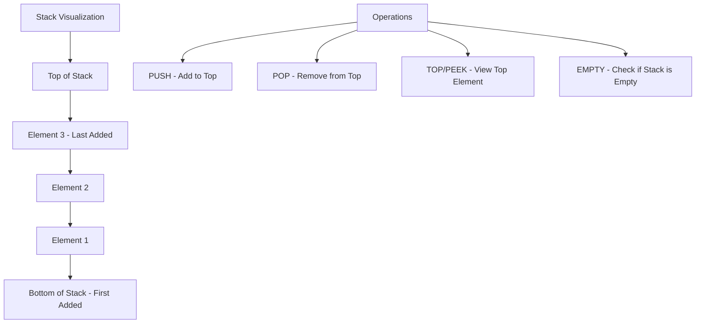

---

## Core Stack Structure (Custom Implementation)

Before using STL, let's understand how a stack works internally by implementing our own stack class.

### Array-Based Stack Implementation

```cpp
#include <iostream>
#include <stdexcept>
using namespace std;

template <typename T>
class Stack {
private:
    T* arr;           // Dynamic array to store stack elements
    int topIndex;     // Index of the top element
    int capacity;     // Maximum capacity of the stack

    // Helper function to resize the stack when full
    void resize() {
        int newCapacity = capacity * 2;
        T* newArr = new T[newCapacity];

        // Copy existing elements to new array
        for (int i = 0; i <= topIndex; i++) {
            newArr[i] = arr[i];
        }

        delete[] arr;
        arr = newArr;
        capacity = newCapacity;
    }

public:
    // Constructor: Initialize empty stack with given capacity
    Stack(int initialCapacity = 10) {
        capacity = initialCapacity;
        arr = new T[capacity];
        topIndex = -1;  // -1 indicates empty stack
    }

    // Destructor: Clean up dynamic memory
    ~Stack() {
        delete[] arr;
    }

    // Push operation: Add element to top of stack
    void push(const T& element) {
        // Resize if stack is full
        if (topIndex == capacity - 1) {
            resize();
        }
        arr[++topIndex] = element;
    }

    // Pop operation: Remove and return top element
    T pop() {
        if (isEmpty()) {
            throw runtime_error("Stack Underflow: Cannot pop from empty stack");
        }
        return arr[topIndex--];
    }

    // Top/Peek operation: Return top element without removing
    T top() const {
        if (isEmpty()) {
            throw runtime_error("Stack is empty: No top element");
        }
        return arr[topIndex];
    }

    // Check if stack is empty
    bool isEmpty() const {
        return topIndex == -1;
    }

    // Get current size of stack
    int size() const {
        return topIndex + 1;
    }

    // Display stack contents (for debugging)
    void display() const {
        if (isEmpty()) {
            cout << "Stack is empty" << endl;
            return;
        }

        cout << "Stack contents (top to bottom): ";
        for (int i = topIndex; i >= 0; i--) {
            cout << arr[i] << " ";
        }
        cout << endl;
    }
};

// Example usage of custom stack
void demonstrateCustomStack() {
    Stack<int> myStack;

    // Push elements
    myStack.push(10);
    myStack.push(20);
    myStack.push(30);

    cout << "After pushing 10, 20, 30:" << endl;
    myStack.display();

    // Access top element
    cout << "Top element: " << myStack.top() << endl;

    // Pop elements
    cout << "Popped: " << myStack.pop() << endl;
    cout << "Popped: " << myStack.pop() << endl;

    cout << "After popping twice:" << endl;
    myStack.display();
}
```

### Linked List-Based Stack Implementation

```cpp
#include <iostream>
using namespace std;

template <typename T>
class LinkedStack {
private:
    // Node structure for linked list implementation
    struct Node {
        T data;
        Node* next;

        Node(const T& value) : data(value), next(nullptr) {}
    };

    Node* topNode;    // Pointer to top node
    int stackSize;    // Current size of stack

public:
    // Constructor: Initialize empty stack
    LinkedStack() : topNode(nullptr), stackSize(0) {}

    // Destructor: Clean up all nodes
    ~LinkedStack() {
        while (!isEmpty()) {
            pop();
        }
    }

    // Push operation: Add new node at the beginning
    void push(const T& element) {
        Node* newNode = new Node(element);
        newNode->next = topNode;
        topNode = newNode;
        stackSize++;
    }

    // Pop operation: Remove and return top element
    T pop() {
        if (isEmpty()) {
            throw runtime_error("Stack Underflow: Cannot pop from empty stack");
        }

        Node* nodeToDelete = topNode;
        T data = topNode->data;
        topNode = topNode->next;
        delete nodeToDelete;
        stackSize--;

        return data;
    }

    // Top operation: Return top element without removing
    T top() const {
        if (isEmpty()) {
            throw runtime_error("Stack is empty: No top element");
        }
        return topNode->data;
    }

    // Check if stack is empty
    bool isEmpty() const {
        return topNode == nullptr;
    }

    // Get current size
    int size() const {
        return stackSize;
    }

    // Display stack contents
    void display() const {
        if (isEmpty()) {
            cout << "Stack is empty" << endl;
            return;
        }

        cout << "Stack contents (top to bottom): ";
        Node* current = topNode;
        while (current != nullptr) {
            cout << current->data << " ";
            current = current->next;
        }
        cout << endl;
    }
};
```

---

## STL Stack Implementation

C++ Standard Template Library provides a ready-to-use stack container that we'll use for solving DSA problems.

```cpp
#include <iostream>
#include <stack>
#include <vector>
using namespace std;

void demonstrateSTLStack() {
    // Creating stacks of different types
    stack<int> intStack;
    stack<string> stringStack;
    stack<char> charStack;

    // Basic operations with STL stack
    cout << "=== STL Stack Demonstration ===" << endl;

    // Push operations
    intStack.push(10);
    intStack.push(20);
    intStack.push(30);

    cout << "Stack size: " << intStack.size() << endl;
    cout << "Top element: " << intStack.top() << endl;

    // Pop operations
    while (!intStack.empty()) {
        cout << "Popping: " << intStack.top() << endl;
        intStack.pop();
    }

    cout << "Stack is now empty: " << (intStack.empty() ? "Yes" : "No") << endl;
}

// STL Stack with custom objects
struct Person {
    string name;
    int age;

    Person(string n, int a) : name(n), age(a) {}
};

void stackWithCustomObjects() {
    stack<Person> peopleStack;

    peopleStack.push(Person("Alice", 25));
    peopleStack.push(Person("Bob", 30));
    peopleStack.push(Person("Charlie", 35));

    cout << "=== Stack with Custom Objects ===" << endl;
    while (!peopleStack.empty()) {
        Person p = peopleStack.top();
        cout << "Name: " << p.name << ", Age: " << p.age << endl;
        peopleStack.pop();
    }
}
```

---

## Basic Stack Operations

### Operation Flow Diagram

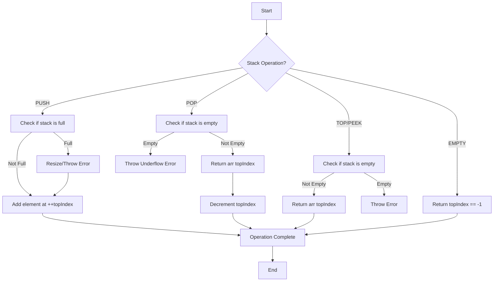

### Time Complexity Analysis

| Operation | Array Implementation | Linked List Implementation |
| --------- | -------------------- | -------------------------- |
| Push      | O(1) amortized\*     | O(1)                       |
| Pop       | O(1)                 | O(1)                       |
| Top/Peek  | O(1)                 | O(1)                       |
| Empty     | O(1)                 | O(1)                       |
| Size      | O(1)                 | O(1)                       |

\*Amortized because of occasional resizing

---

## Uses of Stack Data Structure

Stack is one of the most fundamental data structures with wide-ranging applications across computer science. Understanding when and why to use stacks is crucial for solving complex problems efficiently.

```mermaid
graph TD
    A[Stack Applications] --> B[System Level]
    A --> C[Algorithm Design]
    A --> D[Software Engineering]
    A --> E[Mathematical Computing]

    B --> B1[Function Call Management]
    B --> B2[Memory Management]
    B --> B3[Operating System Tasks]
    B --> B4[Compiler Design]

    C --> C1[Expression Evaluation]
    C --> C2[Tree Traversal]
    C --> C3[Graph Algorithms DFS]
    C --> C4[Backtracking Problems]

    D --> D1[Undo/Redo Operations]
    D --> D2[Browser History]
    D --> D3[Syntax Checking]
    D --> D4[Code Parsing]

    E --> E1[Arithmetic Operations]
    E --> E2[Function Composition]
    E --> E3[Recursion Simulation]
    E --> E4[Mathematical Notation]

    style A fill:#f9f,stroke:#333,stroke-width:4px
    style B fill:#bbf,stroke:#333,stroke-width:2px
    style C fill:#bfb,stroke:#333,stroke-width:2px
    style D fill:#ffb,stroke:#333,stroke-width:2px
    style E fill:#fbb,stroke:#333,stroke-width:2px
```

### 1. System Level Applications

#### Function Call Management

Every programming language uses a call stack to manage function calls, local variables, and return addresses.

```cpp
// Example: How function calls use stack internally
void functionC() {
    int localVar = 30;
    cout << "In Function C" << endl;
    // Stack: [main, functionA, functionB, functionC]
}

void functionB() {
    int localVar = 20;
    cout << "In Function B" << endl;
    functionC();  // Push functionC onto call stack
    // functionC completes, stack becomes: [main, functionA, functionB]
}

void functionA() {
    int localVar = 10;
    cout << "In Function A" << endl;
    functionB();  // Push functionB onto call stack
    // functionB completes, stack becomes: [main, functionA]
}

int main() {
    cout << "In Main" << endl;
    functionA();  // Push functionA onto call stack
    // functionA completes, stack becomes: [main]
    return 0;
}
```

#### Memory Management

Stack is used for automatic memory management of local variables.

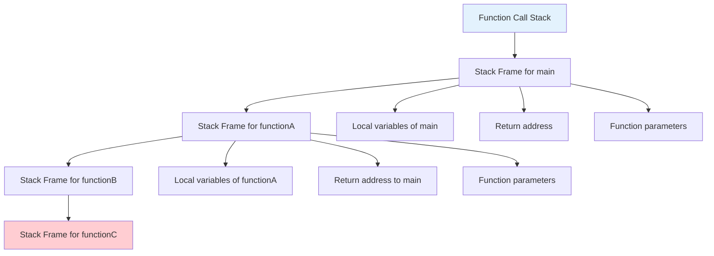

### 2. Algorithm Design Applications

#### Expression Evaluation and Parsing

Stacks are essential for converting between different mathematical notations and evaluating expressions.

**Why Stack is Perfect for This**:

- **LIFO matches operator precedence**: Higher precedence operators are processed first
- **Natural bracket handling**: Opening brackets push context, closing brackets pop context
- **Efficient evaluation**: Operators and operands are processed in correct order

#### Tree and Graph Traversal

Depth-First Search (DFS) naturally uses stack for traversal.

```cpp
class GraphDFS {
public:
    void dfsIterative(vector<vector<int>>& graph, int start) {
        int n = graph.size();
        vector<bool> visited(n, false);
        stack<int> dfsStack;

        dfsStack.push(start);

        while (!dfsStack.empty()) {
            int current = dfsStack.top();
            dfsStack.pop();

            if (!visited[current]) {
                visited[current] = true;
                cout << current << " ";

                // Add neighbors to stack (in reverse order for left-to-right traversal)
                for (int i = graph[current].size() - 1; i >= 0; i--) {
                    if (!visited[graph[current][i]]) {
                        dfsStack.push(graph[current][i]);
                    }
                }
            }
        }
    }
};
```

### 3. Software Engineering Applications

#### Undo/Redo Mechanisms

Software applications use stacks to implement undo/redo functionality.

**Why Stack is Ideal**:

- **Natural order**: Most recent action should be undone first
- **State preservation**: Each stack entry represents a complete state
- **Efficient operations**: O(1) push/pop for undo/redo

#### Syntax Checking and Code Parsing

Compilers and IDEs use stacks to check syntax correctness.

```cpp
class SyntaxChecker {
public:
    bool checkCodeSyntax(string code) {
        stack<char> bracketStack;
        stack<string> blockStack;  // For tracking code blocks

        for (int i = 0; i < code.length(); i++) {
            char c = code[i];

            // Handle brackets
            if (c == '{' || c == '[' || c == '(') {
                bracketStack.push(c);
                if (c == '{') blockStack.push("block");
            }
            else if (c == '}' || c == ']' || c == ')') {
                if (bracketStack.empty()) return false;

                char expected = getMatchingBracket(c);
                if (bracketStack.top() != expected) return false;

                bracketStack.pop();
                if (c == '}' && !blockStack.empty()) blockStack.pop();
            }
        }

        return bracketStack.empty() && blockStack.empty();
    }

private:
    char getMatchingBracket(char closing) {
        switch(closing) {
            case ')': return '(';
            case ']': return '[';
            case '}': return '{';
            default: return '\0';
        }
    }
};
```

### 4. Mathematical Computing Applications

#### Arithmetic Expression Processing

Mathematical calculators and computer algebra systems use stacks extensively.

**Benefits of Stack-based Computation**:

- **Operator precedence handling**: Natural precedence management
- **Function composition**: Nested function calls are handled elegantly
- **Memory efficiency**: Only necessary intermediate results are stored

### 5. When NOT to Use Stack

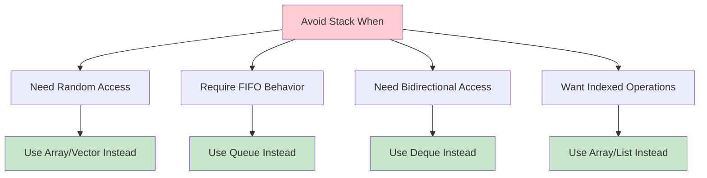

---

## Monotonic Stack

A **Monotonic Stack** is a specialized stack that maintains elements in either strictly increasing or decreasing order. It's a powerful technique for solving problems that require finding the next/previous greater or smaller element.

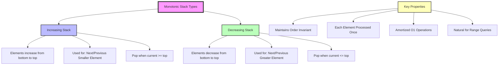

### Understanding Monotonic Stack Behavior

**Key Insight**: When we pop elements from a monotonic stack, we're finding relationships between elements that wouldn't be easily discoverable with other data structures.

### Monotonic Stack Templates

```cpp
class MonotonicStackTemplates {
public:
    // Template for Next Greater Element (Decreasing Stack)
    vector<int> nextGreaterElements(vector<int>& nums) {
        int n = nums.size();
        vector<int> result(n, -1);
        stack<int> decreasingStack;  // Stores indices in decreasing order of values

        for (int i = 0; i < n; i++) {
            // Pop all elements smaller than current
            while (!decreasingStack.empty() &&
                   nums[i] > nums[decreasingStack.top()]) {
                int index = decreasingStack.top();
                decreasingStack.pop();
                result[index] = nums[i];  // Found next greater element
            }
            decreasingStack.push(i);
        }

        return result;
    }

    // Template for Next Smaller Element (Increasing Stack)
    vector<int> nextSmallerElements(vector<int>& nums) {
        int n = nums.size();
        vector<int> result(n, -1);
        stack<int> increasingStack;  // Stores indices in increasing order of values

        for (int i = 0; i < n; i++) {
            // Pop all elements greater than current
            while (!increasingStack.empty() &&
                   nums[i] < nums[increasingStack.top()]) {
                int index = increasingStack.top();
                increasingStack.pop();
                result[index] = nums[i];  // Found next smaller element
            }
            increasingStack.push(i);
        }

        return result;
    }

    // Template for Previous Greater Element
    vector<int> previousGreaterElements(vector<int>& nums) {
        int n = nums.size();
        vector<int> result(n, -1);
        stack<int> decreasingStack;

        for (int i = 0; i < n; i++) {
            // Pop elements smaller than or equal to current
            while (!decreasingStack.empty() &&
                   nums[decreasingStack.top()] <= nums[i]) {
                decreasingStack.pop();
            }

            // If stack not empty, top is previous greater element
            if (!decreasingStack.empty()) {
                result[i] = nums[decreasingStack.top()];
            }

            decreasingStack.push(i);
        }

        return result;
    }

    void demonstrateMonotonicStack() {
        vector<int> nums = {2, 1, 2, 4, 3, 1};

        cout << "=== Monotonic Stack Demonstration ===" << endl;
        cout << "Input: ";
        for (int x : nums) cout << x << " ";
        cout << endl;

        vector<int> nextGreater = nextGreaterElements(nums);
        cout << "Next Greater: ";
        for (int x : nextGreater) cout << x << " ";
        cout << endl;

        vector<int> nextSmaller = nextSmallerElements(nums);
        cout << "Next Smaller: ";
        for (int x : nextSmaller) cout << x << " ";
        cout << endl;

        vector<int> prevGreater = previousGreaterElements(nums);
        cout << "Previous Greater: ";
        for (int x : prevGreater) cout << x << " ";
        cout << endl;
    }
};
```

### Advanced Monotonic Stack Problems

#### Problem 1: Largest Rectangle in Histogram (Enhanced)

**Problem Statement**: Given heights of bars in a histogram, find the area of the largest rectangle.

**Approach**: Use monotonic increasing stack to find the previous and next smaller elements for each bar efficiently.

**Why Monotonic Stack Works**:

1. **Increasing stack** helps us find boundaries where rectangle can extend
2. **When we pop**, we know we've found the right boundary for that height
3. **Stack top** gives us the left boundary after popping
4. **Current index** gives us the right boundary

```cpp
class LargestRectangleAdvanced {
public:
    int largestRectangleArea(vector<int>& heights) {
        stack<int> increasingStack;
        int maxArea = 0;
        int n = heights.size();

        for (int i = 0; i <= n; i++) {
            int currentHeight = (i == n) ? 0 : heights[i];

            while (!increasingStack.empty() &&
                   heights[increasingStack.top()] > currentHeight) {

                int height = heights[increasingStack.top()];
                increasingStack.pop();

                // Width calculation:
                // If stack empty: rectangle extends from 0 to i-1
                // Otherwise: rectangle extends from (stack.top() + 1) to (i - 1)
                int width = increasingStack.empty() ? i : (i - increasingStack.top() - 1);

                maxArea = max(maxArea, height * width);

                cout << "Height: " << height << ", Width: " << width
                     << ", Area: " << height * width << endl;
            }

            increasingStack.push(i);
        }

        return maxArea;
    }

    // Visualization helper
    void visualizeProcess(vector<int>& heights) {
        cout << "=== Largest Rectangle Visualization ===" << endl;
        cout << "Heights: ";
        for (int h : heights) cout << h << " ";
        cout << endl;

        int maxArea = largestRectangleArea(heights);
        cout << "Maximum Area: " << maxArea << endl;
    }
};
```

#### Problem 2: Trapping Rain Water (Monotonic Stack Approach)

**Problem Statement**: Given heights of bars, calculate how much rainwater can be trapped.

**Approach**: Use monotonic decreasing stack to find water pockets.

**Why This Works**:

1. **Decreasing stack** maintains potential water containers
2. **When height increases**, we can calculate trapped water
3. **Stack represents** left boundaries of water pockets

```cpp
class TrappingRainWater {
public:
    int trap(vector<int>& height) {
        stack<int> decreasingStack;
        int waterTrapped = 0;

        for (int i = 0; i < height.size(); i++) {
            while (!decreasingStack.empty() &&
                   height[i] > height[decreasingStack.top()]) {

                int bottomIndex = decreasingStack.top();
                decreasingStack.pop();

                if (decreasingStack.empty()) break;

                int leftBoundary = decreasingStack.top();
                int rightBoundary = i;

                int width = rightBoundary - leftBoundary - 1;
                int waterHeight = min(height[leftBoundary], height[rightBoundary]) - height[bottomIndex];

                int currentWater = width * waterHeight;
                waterTrapped += currentWater;

                cout << "Water trapped between indices " << leftBoundary
                     << " and " << rightBoundary << ": " << currentWater << endl;
            }

            decreasingStack.push(i);
        }

        return waterTrapped;
    }

    void demonstrateTrapping() {
        vector<int> heights = {0, 1, 0, 2, 1, 0, 1, 3, 2, 1, 2, 1};

        cout << "=== Rain Water Trapping ===" << endl;
        cout << "Heights: ";
        for (int h : heights) cout << h << " ";
        cout << endl;

        int totalWater = trap(heights);
        cout << "Total water trapped: " << totalWater << endl;
    }
};
```

#### Problem 3: Maximum Width Ramp

**Problem Statement**: Given an array, find the maximum width ramp where i < j and A[i] <= A[j].

**Approach**: Use monotonic decreasing stack to store potential left boundaries, then traverse from right to find maximum width.

```cpp
class MaximumWidthRamp {
public:
    int maxWidthRamp(vector<int>& nums) {
        int n = nums.size();
        stack<int> decreasingStack;

        // Build decreasing stack (potential left boundaries)
        for (int i = 0; i < n; i++) {
            if (decreasingStack.empty() || nums[i] < nums[decreasingStack.top()]) {
                decreasingStack.push(i);
            }
        }

        int maxWidth = 0;

        // Traverse from right to find maximum width
        for (int j = n - 1; j >= 0; j--) {
            while (!decreasingStack.empty() &&
                   nums[j] >= nums[decreasingStack.top()]) {
                int i = decreasingStack.top();
                decreasingStack.pop();
                maxWidth = max(maxWidth, j - i);
            }
        }

        return maxWidth;
    }

    void demonstrateMaxWidth() {
        vector<int> nums = {6, 0, 8, 2, 1, 5};

        cout << "=== Maximum Width Ramp ===" << endl;
        cout << "Array: ";
        for (int x : nums) cout << x << " ";
        cout << endl;
        cout << "Maximum width ramp: " << maxWidthRamp(nums) << endl;
    }
};
```

### When to Use Monotonic Stack

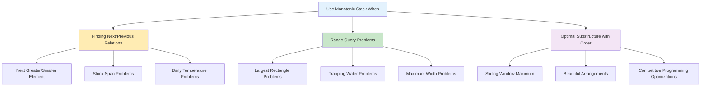

---

### 1. Balanced Parentheses Problem

**Problem Statement**: Given a string containing parentheses, brackets, and braces, determine if they are balanced.

**Example**:

- Input: `"()[]{}"` → Output: `true` (balanced)
- Input: `"([)]"` → Output: `false` (not balanced)

**Approach Explanation**:

1. **Use stack to track opening brackets**: Push every opening bracket onto the stack
2. **Match closing brackets**: For each closing bracket, check if it matches the most recent opening bracket (stack top)
3. **LIFO property ensures correct nesting**: Stack naturally handles nested structures
4. **Final check**: Stack should be empty if all brackets are properly matched

**Why this approach works**:

- Stack's LIFO property perfectly matches the nested nature of balanced parentheses
- Opening brackets create context that must be closed in reverse order
- Each closing bracket must match the most recently opened bracket

**Time Complexity**: O(n) - single pass through string
**Space Complexity**: O(n) - worst case all opening brackets

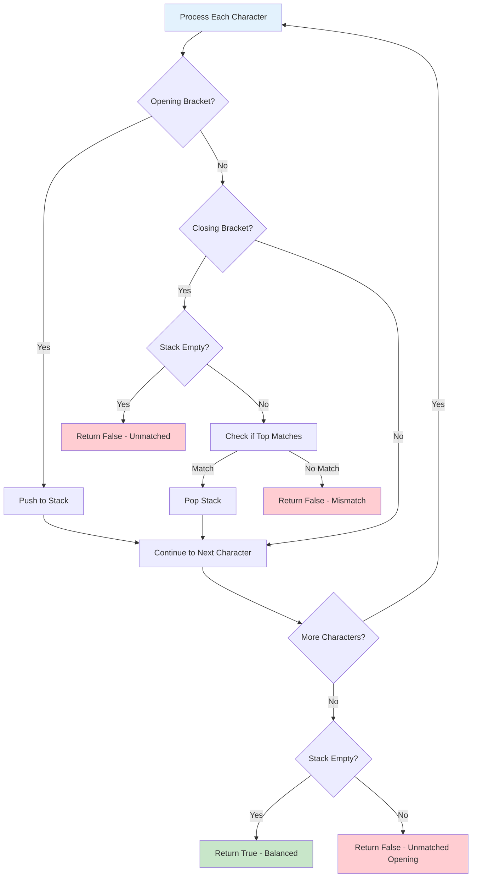

```cpp
#include <iostream>
#include <stack>
#include <string>
using namespace std;

class BalancedParentheses {
public:
    bool isBalanced(string s) {
        stack<char> bracketStack;

        for (char c : s) {
            // Push opening brackets onto stack
            if (c == '(' || c == '[' || c == '{') {
                bracketStack.push(c);
            }
            // Check closing brackets
            else if (c == ')' || c == ']' || c == '}') {
                // No matching opening bracket
                if (bracketStack.empty()) {
                    return false;
                }

                char top = bracketStack.top();
                bracketStack.pop();

                // Check if brackets match
                if ((c == ')' && top != '(') ||
                    (c == ']' && top != '[') ||
                    (c == '}' && top != '{')) {
                    return false;
                }
            }
        }

        // All brackets should be matched
        return bracketStack.empty();
    }

    void testBalancedParentheses() {
        vector<string> testCases = {
            "()",           // Balanced
            "()[]{}",       // Balanced
            "([{}])",       // Balanced
            "([)]",         // Not balanced
            "(((",          // Not balanced
            ")))",          // Not balanced
            "{[()]}",       // Balanced
            ""              // Balanced (empty)
        };

        cout << "=== Balanced Parentheses Test ===" << endl;
        for (const string& test : testCases) {
            cout << "\"" << test << "\" is "
                 << (isBalanced(test) ? "balanced" : "not balanced") << endl;
        }
    }
};
```

### 2. Next Greater Element

**Problem Statement**: For each element in an array, find the next greater element to its right. If no such element exists, return -1.

**Example**:

- Input: `[2, 1, 2, 4, 3, 1]`
- Output: `[4, 2, 4, -1, -1, -1]`

**Approach Explanation**:

1. **Use stack to store indices**: Keep track of elements waiting for their next greater element
2. **Process left to right**: For each element, it might be the answer for previous elements
3. **Maintain decreasing order**: Pop elements from stack while current element is greater
4. **Store indices, not values**: This allows us to update results efficiently

**Why this approach works**:

- Stack maintains elements in decreasing order of their values
- When we find a greater element, it's the answer for all smaller elements in stack
- Each element is pushed and popped at most once, ensuring O(n) complexity

**Detailed Algorithm**:

1. Initialize result array with -1 (default for no greater element)
2. For each element at index i:
   - While stack not empty AND current element > element at stack top index:
     - Pop index from stack and set result[index] = current element
   - Push current index to stack
3. Remaining elements in stack have no next greater element

**Time Complexity**: O(n) - each element pushed and popped at most once
**Space Complexity**: O(n) - for stack and result array

```mermaid
graph LR
    A[Input Array: 2,1,2,4,3,1] --> B[Process Index 0: value=2]
    B --> C[Stack: empty → push 0]
    C --> D[Process Index 1: value=1]
    D --> E[1 < 2, no pop → push 1]
    E --> F[Stack: 0,1]
    F --> G[Process Index 2: value=2]
    G --> H[2 > 1, pop 1, result[1]=2]
    H --> I[2 = 2, no more pops]
    I --> J[push 2, Stack: 0,2]
    J --> K[Process Index 3: value=4]
    K --> L[4 > 2, pop and update results]
    L --> M[Final: Stack maintains decreasing order]

    style A fill:#e3f2fd
    style M fill:#c8e6c9
```

```cpp
#include <iostream>
#include <stack>
#include <vector>
using namespace std;

class NextGreaterElement {
public:
    vector<int> findNextGreater(vector<int>& nums) {
        int n = nums.size();
        vector<int> result(n, -1);  // Initialize with -1 (no greater element)
        stack<int> indexStack;      // Store indices instead of values

        for (int i = 0; i < n; i++) {
            // While stack is not empty and current element is greater
            // than element at index stored in stack top
            while (!indexStack.empty() && nums[i] > nums[indexStack.top()]) {
                int index = indexStack.top();
                indexStack.pop();
                result[index] = nums[i];  // Found next greater element
            }

            indexStack.push(i);  // Push current index
        }

        return result;
    }

    // Optimized version for circular array
    vector<int> findNextGreaterCircular(vector<int>& nums) {
        int n = nums.size();
        vector<int> result(n, -1);
        stack<int> indexStack;

        // Process array twice to handle circular nature
        for (int i = 0; i < 2 * n; i++) {
            int currentIndex = i % n;

            while (!indexStack.empty() &&
                   nums[currentIndex] > nums[indexStack.top()]) {
                int index = indexStack.top();
                indexStack.pop();
                result[index] = nums[currentIndex];
            }

            // Only push indices in first iteration
            if (i < n) {
                indexStack.push(currentIndex);
            }
        }

        return result;
    }

    void demonstrateNextGreater() {
        vector<int> nums = {2, 1, 2, 4, 3, 1};

        cout << "=== Next Greater Element Demo ===" << endl;
        cout << "Input array: ";
        for (int num : nums) cout << num << " ";
        cout << endl;

        vector<int> result = findNextGreater(nums);
        cout << "Next greater: ";
        for (int res : result) cout << res << " ";
        cout << endl;

        vector<int> circularResult = findNextGreaterCircular(nums);
        cout << "Next greater (circular): ";
        for (int res : circularResult) cout << res << " ";
        cout << endl;
    }
};
```

### 3. Stock Span Problem

**Problem Statement**: Calculate the span of stock prices, where span is the number of consecutive days before the current day (including current day) where the price was less than or equal to current day's price.

**Example**:

- Input prices: `[100, 80, 60, 70, 60, 75, 85]`
- Output spans: `[1, 1, 1, 2, 1, 4, 6]`

**Detailed Explanation**:

- Day 0: Price=100, no previous days → span=1
- Day 1: Price=80 < 100, only current day → span=1
- Day 2: Price=60 < 80, only current day → span=1
- Day 3: Price=70 > 60, includes day 2 and 3 → span=2
- Day 4: Price=60 < 70, only current day → span=1
- Day 5: Price=75 > 60,70,60, includes days 2,3,4,5 → span=4
- Day 6: Price=85 > all previous, includes all days → span=6

**Approach Explanation**:

1. **Use stack to store indices**: Keep indices of days whose span calculation is pending
2. **Maintain decreasing prices**: Pop days with prices ≤ current day's price
3. **Calculate span efficiently**: Span = current_index - previous_higher_price_index
4. **Handle empty stack**: If stack empty, current price is highest so far

**Why this approach works**:

- Stack maintains days in decreasing order of prices
- When we pop elements, we're finding all days with lower prices
- The remaining top of stack (if any) gives us the boundary for span calculation
- Each day is processed exactly once

**Time Complexity**: O(n) - each element pushed and popped at most once
**Space Complexity**: O(n) - for stack storage

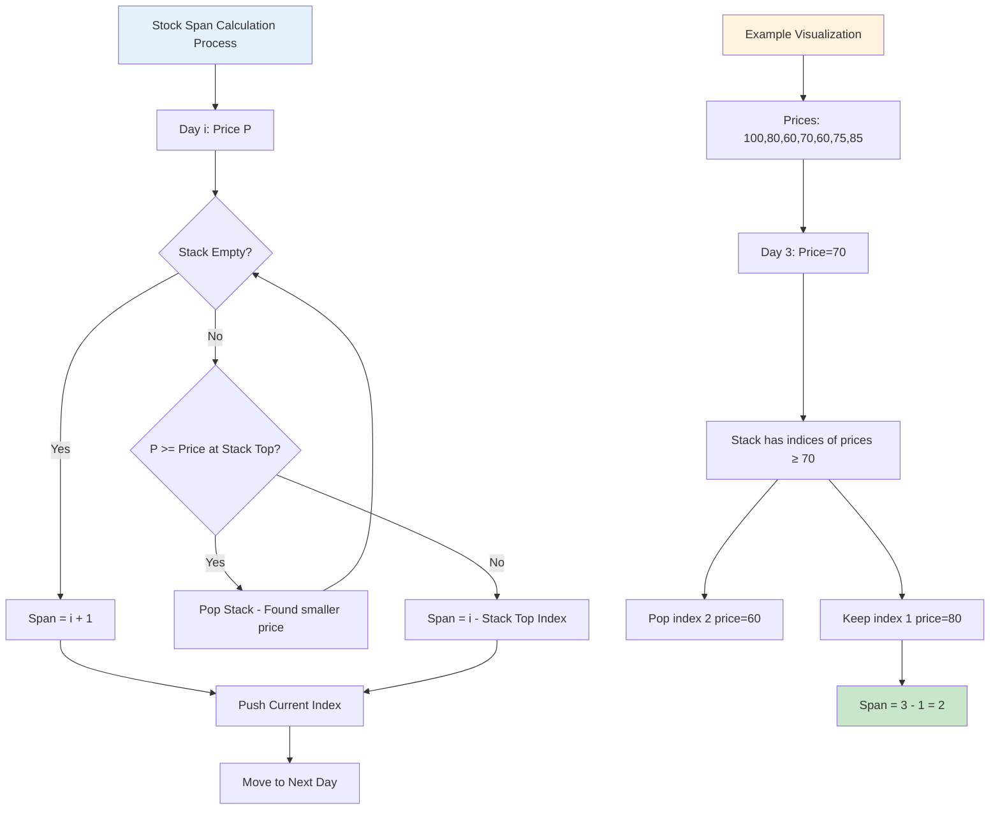

```cpp
#include <iostream>
#include <stack>
#include <vector>
using namespace std;

class StockSpan {
public:
    vector<int> calculateSpan(vector<int>& prices) {
        int n = prices.size();
        vector<int> span(n);
        stack<int> indexStack;  // Stack to store indices

        for (int i = 0; i < n; i++) {
            // Pop elements while stack is not empty and current price
            // is greater than or equal to price at stack top
            while (!indexStack.empty() && prices[i] >= prices[indexStack.top()]) {
                indexStack.pop();
            }

            // If stack is empty, current element is greater than all previous
            // Otherwise, span is distance from current index to index at stack top
            span[i] = indexStack.empty() ? (i + 1) : (i - indexStack.top());

            indexStack.push(i);  // Push current index
        }

        return span;
    }

    void demonstrateStockSpan() {
        vector<int> prices = {100, 80, 60, 70, 60, 75, 85};

        cout << "=== Stock Span Problem Demo ===" << endl;
        cout << "Stock prices: ";
        for (int price : prices) cout << price << " ";
        cout << endl;

        vector<int> spans = calculateSpan(prices);
        cout << "Stock spans:  ";
        for (int span : spans) cout << span << " ";
        cout << endl;

        // Explanation
        cout << "\nExplanation:" << endl;
        for (int i = 0; i < prices.size(); i++) {
            cout << "Day " << i + 1 << ": Price=" << prices[i]
                 << ", Span=" << spans[i] << endl;
        }
    }
};
```

---

## Expression Evaluation

### Infix to Postfix Conversion

**Problem Statement**: Convert infix expressions (normal mathematical notation) to postfix notation (Reverse Polish Notation).

**Example**:

- Infix: `"a+b*c"` → Postfix: `"abc*+"`
- Infix: `"(a+b)*c"` → Postfix: `"ab+c*"`

**Approach Explanation**:

1. **Operator precedence handling**: Higher precedence operators are processed first
2. **Left-to-right associativity**: For same precedence, left operator comes first
3. **Parentheses override precedence**: Expressions in parentheses are evaluated first
4. **Stack maintains operator context**: Operators wait in stack until their operands are ready

**Algorithm Steps**:

1. **Operands**: Direct output to result
2. **Opening parenthesis**: Push to stack (creates new precedence level)
3. **Operators**: Pop operators with higher/equal precedence, then push current operator
4. **Closing parenthesis**: Pop until opening parenthesis found
5. **End**: Pop all remaining operators

**Why this works**: Stack naturally handles operator precedence and associativity by delaying lower precedence operators until higher precedence ones are processed.

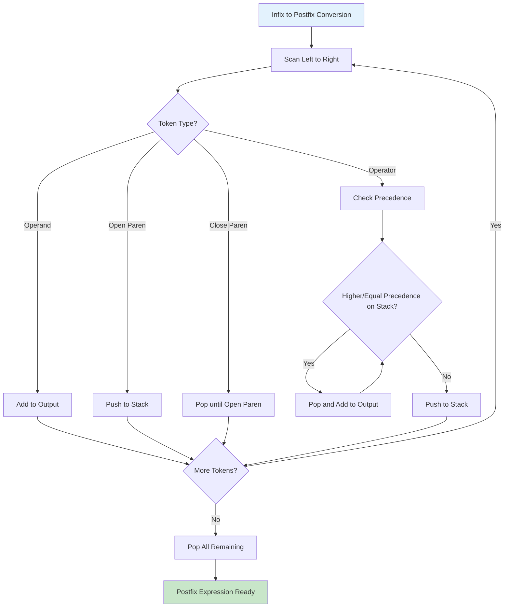

```cpp
#include <iostream>
#include <stack>
#include <string>
#include <cctype>
using namespace std;

class ExpressionConverter {
private:
    // Get precedence of operators
    int getPrecedence(char op) {
        switch (op) {
            case '+':
            case '-': return 1;
            case '*':
            case '/': return 2;
            case '^': return 3;
            default: return -1;
        }
    }

    // Check if operator is right associative
    bool isRightAssociative(char op) {
        return op == '^';
    }

    // Check if character is an operator
    bool isOperator(char c) {
        return c == '+' || c == '-' || c == '*' || c == '/' || c == '^';
    }

public:
    string infixToPostfix(string infix) {
        stack<char> operatorStack;
        string postfix = "";

        for (char c : infix) {
            // If operand, add to output
            if (isalnum(c)) {
                postfix += c;
            }
            // If opening parenthesis, push to stack
            else if (c == '(') {
                operatorStack.push(c);
            }
            // If closing parenthesis, pop until opening parenthesis
            else if (c == ')') {
                while (!operatorStack.empty() && operatorStack.top() != '(') {
                    postfix += operatorStack.top();
                    operatorStack.pop();
                }
                operatorStack.pop();  // Remove opening parenthesis
            }
            // If operator
            else if (isOperator(c)) {
                // Pop operators with higher or equal precedence
                while (!operatorStack.empty() &&
                       operatorStack.top() != '(' &&
                       (getPrecedence(operatorStack.top()) > getPrecedence(c) ||
                        (getPrecedence(operatorStack.top()) == getPrecedence(c) &&
                         !isRightAssociative(c)))) {
                    postfix += operatorStack.top();
                    operatorStack.pop();
                }
                operatorStack.push(c);
            }
        }

        // Pop remaining operators
        while (!operatorStack.empty()) {
            postfix += operatorStack.top();
            operatorStack.pop();
        }

        return postfix;
    }

    string infixToPrefix(string infix) {
        // Reverse the infix expression
        reverse(infix.begin(), infix.end());

        // Replace ( with ) and vice versa
        for (int i = 0; i < infix.length(); i++) {
            if (infix[i] == '(') {
                infix[i] = ')';
            } else if (infix[i] == ')') {
                infix[i] = '(';
            }
        }

        // Get postfix of modified expression
        string postfix = infixToPostfix(infix);

        // Reverse the postfix to get prefix
        reverse(postfix.begin(), postfix.end());

        return postfix;
    }

    void demonstrateConversion() {
        vector<string> expressions = {
            "a+b*c",
            "(a+b)*c",
            "a+b*c-d",
            "a^b^c",
            "((a+b)*c-d)*e"
        };

        cout << "=== Expression Conversion Demo ===" << endl;
        for (const string& expr : expressions) {
            cout << "Infix:   " << expr << endl;
            cout << "Postfix: " << infixToPostfix(expr) << endl;
            cout << "Prefix:  " << infixToPrefix(expr) << endl;
            cout << "---" << endl;
        }
    }
};
```

### Postfix Expression Evaluation

**Problem Statement**: Evaluate arithmetic expressions written in postfix notation (Reverse Polish Notation).

**Example**:

- Postfix: `"23+"` → Result: `5` (2+3)
- Postfix: `"23*54*+"` → Result: `26` (2*3 + 5*4 = 6+20)

**Approach Explanation**:

1. **Process left to right**: Scan postfix expression from left to right
2. **Operands go to stack**: Numbers are pushed onto stack for later use
3. **Operators consume operands**: Pop required operands, apply operator, push result
4. **LIFO ensures correct order**: Most recent operands are used first

**Why postfix is stack-perfect**:

- No parentheses needed (precedence already handled)
- No ambiguity in evaluation order
- Each operator immediately follows its operands
- Stack naturally provides operands in correct order

**Algorithm**:

1. For each token in postfix expression:
   - If operand: push to stack
   - If operator: pop required operands, apply operation, push result
2. Final stack top is the result

```mermaid
graph LR
    A[Postfix: 2 3 * 5 4 * +] --> B[Process 2]
    B --> C[Stack: 2]
    C --> D[Process 3]
    D --> E[Stack: 2,3]
    E --> F[Process *]
    F --> G[Pop 3,2 → 2*3=6]
    G --> H[Stack: 6]
    H --> I[Process 5]
    I --> J[Stack: 6,5]
    J --> K[Process 4]
    K --> L[Stack: 6,5,4]
    L --> M[Process *]
    M --> N[Pop 4,5 → 5*4=20]
    N --> O[Stack: 6,20]
    O --> P[Process +]
    P --> Q[Pop 20,6 → 6+20=26]
    Q --> R[Stack: 26 - Final Result]

    style A fill:#e3f2fd
    style R fill:#c8e6c9
```

```cpp
class PostfixEvaluator {
public:
    int evaluatePostfix(string postfix) {
        stack<int> operandStack;

        for (char c : postfix) {
            // If operand, push to stack
            if (isdigit(c)) {
                operandStack.push(c - '0');  // Convert char to int
            }
            // If operator, pop two operands and perform operation
            else {
                int operand2 = operandStack.top(); operandStack.pop();
                int operand1 = operandStack.top(); operandStack.pop();

                switch (c) {
                    case '+': operandStack.push(operand1 + operand2); break;
                    case '-': operandStack.push(operand1 - operand2); break;
                    case '*': operandStack.push(operand1 * operand2); break;
                    case '/': operandStack.push(operand1 / operand2); break;
                    case '^': operandStack.push(pow(operand1, operand2)); break;
                }
            }
        }

        return operandStack.top();
    }

    void demonstrateEvaluation() {
        vector<string> postfixExpressions = {
            "23+",      // 2 + 3 = 5
            "23*54*+",  // 2*3 + 5*4 = 6 + 20 = 26
            "15+2*",    // (1 + 5) * 2 = 12
            "42/3-"     // 4/2 - 3 = 2 - 3 = -1
        };

        cout << "=== Postfix Evaluation Demo ===" << endl;
        for (const string& expr : postfixExpressions) {
            cout << "Expression: " << expr
                 << " = " << evaluatePostfix(expr) << endl;
        }
    }
};
```

---

## Recursion and Stack

### Understanding Recursion Call Stack

**Concept**: Every recursive function call uses the system's call stack to store function state, parameters, and return addresses.

**Why recursion uses stack**:

1. **LIFO order**: Last called function returns first
2. **State preservation**: Each call maintains its own local variables
3. **Return address tracking**: System knows where to continue after function returns
4. **Memory management**: Automatic cleanup when function completes

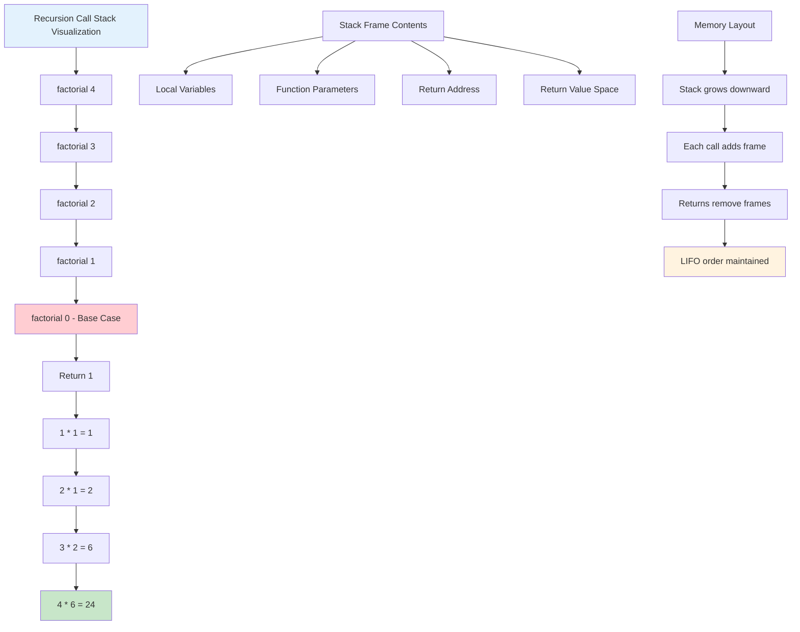

**Stack Overflow**: Occurs when recursive calls exceed available stack space, typically due to:

- Missing or incorrect base case
- Too deep recursion for available memory
- Infinite recursion loops

```mermaid
graph TD
    A[Factorial Function Call Stack] --> B[factorial(4)]
    B --> C[factorial(3)]
    C --> D[factorial(2)]
    D --> E[factorial(1)]
    E --> F[factorial(0) - Base Case]

    F --> G[Return 1]
    G --> H[Return 1 * 1 = 1]
    H --> I[Return 2 * 1 = 2]
    I --> J[Return 3 * 2 = 6]
    J --> K[Return 4 * 6 = 24]
```

```cpp
#include <iostream>
#include <stack>
using namespace std;

class RecursionStack {
public:
    // Recursive factorial
    long long factorialRecursive(int n) {
        cout << "Entering factorial(" << n << ")" << endl;

        if (n <= 1) {
            cout << "Base case reached: factorial(" << n << ") = 1" << endl;
            return 1;
        }

        long long result = n * factorialRecursive(n - 1);
        cout << "Returning from factorial(" << n << ") = " << result << endl;

        return result;
    }

    // Iterative factorial using explicit stack
    long long factorialIterative(int n) {
        if (n <= 1) return 1;

        stack<int> callStack;

        // Simulate function calls by pushing onto stack
        for (int i = n; i > 1; i--) {
            callStack.push(i);
        }

        long long result = 1;

        // Simulate returns by popping from stack
        while (!callStack.empty()) {
            result *= callStack.top();
            cout << "Processing: " << callStack.top()
                 << ", Current result: " << result << endl;
            callStack.pop();
        }

        return result;
    }

    // Tower of Hanoi - Classic recursion problem
    void towerOfHanoi(int n, char source, char destination, char auxiliary) {
        if (n == 1) {
            cout << "Move disk 1 from " << source << " to " << destination << endl;
            return;
        }

        // Move n-1 disks from source to auxiliary
        towerOfHanoi(n - 1, source, auxiliary, destination);

        // Move largest disk from source to destination
        cout << "Move disk " << n << " from " << source << " to " << destination << endl;

        // Move n-1 disks from auxiliary to destination
        towerOfHanoi(n - 1, auxiliary, destination, source);
    }

    void demonstrateRecursionStack() {
        cout << "=== Recursive vs Iterative Factorial ===" << endl;
        cout << "Recursive approach:" << endl;
        long long recursiveResult = factorialRecursive(4);
        cout << "Final result: " << recursiveResult << endl << endl;

        cout << "Iterative approach with explicit stack:" << endl;
        long long iterativeResult = factorialIterative(4);
        cout << "Final result: " << iterativeResult << endl << endl;

        cout << "=== Tower of Hanoi (3 disks) ===" << endl;
        towerOfHanoi(3, 'A', 'C', 'B');
    }
};
```

---

## Advanced Stack Problems

### 1. Largest Rectangle in Histogram

**Problem Statement**: Find the area of the largest rectangle that can be formed in a histogram where each bar has width 1.

**Example**:

- Input: `heights = [2,1,5,6,2,3]`
- Output: `10` (rectangle with height 5 and width 2)

**Approach Explanation**:

1. **Use monotonic increasing stack**: Stack stores indices of bars in increasing order of heights
2. **When height decreases**: Pop bars taller than current and calculate rectangles
3. **Width calculation**: Distance between current index and index after stack top
4. **Each bar as height**: Every bar gets a chance to be the smallest in some rectangle

**Detailed Algorithm**:

1. For each bar (including a sentinel 0 at the end):
   - While stack not empty and current height < height at stack top:
     - Pop index and use its height for rectangle calculation
     - Width = current_index - new_stack_top - 1 (if stack not empty) or current_index (if empty)
     - Update maximum area
   - Push current index

**Why this works**:

- **Monotonic stack property**: When we pop, we know all bars to the right are taller
- **Efficient boundary finding**: Stack gives us left boundary, current position gives right boundary
- **Complete coverage**: Every possible rectangle with each bar as minimum height is considered

**Time Complexity**: O(n) - each bar pushed and popped at most once
**Space Complexity**: O(n) - for stack storage

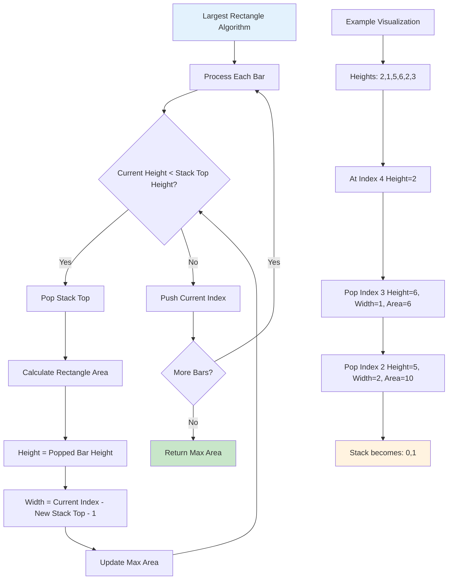

```cpp
#include <iostream>
#include <stack>
#include <vector>
#include <algorithm>
using namespace std;

class LargestRectangle {
public:
    int largestRectangleArea(vector<int>& heights) {
        stack<int> indexStack;  // Stack to store indices
        int maxArea = 0;
        int n = heights.size();

        for (int i = 0; i <= n; i++) {
            // Use 0 as sentinel value for last iteration
            int currentHeight = (i == n) ? 0 : heights[i];

            // Process all bars higher than current bar
            while (!indexStack.empty() &&
                   heights[indexStack.top()] > currentHeight) {

                int height = heights[indexStack.top()];
                indexStack.pop();

                // Calculate width: if stack is empty, width is i
                // Otherwise, width is distance between current index and stack top
                int width = indexStack.empty() ? i : (i - indexStack.top() - 1);

                maxArea = max(maxArea, height * width);
            }

            indexStack.push(i);
        }

        return maxArea;
    }

    void demonstrateLargestRectangle() {
        vector<vector<int>> testCases = {
            {2, 1, 5, 6, 2, 3},
            {2, 4},
            {1, 2, 3, 4, 5},
            {5, 4, 3, 2, 1}
        };

        cout << "=== Largest Rectangle in Histogram ===" << endl;
        for (auto& heights : testCases) {
            cout << "Heights: ";
            for (int h : heights) cout << h << " ";
            cout << "=> Max Area: " << largestRectangleArea(heights) << endl;
        }
    }
};
```

### 2. Maximum Rectangle in Binary Matrix

**Problem**: Find the area of the largest rectangle containing only 1s in a binary matrix.

**Approach**: Convert each row to histogram and apply largest rectangle algorithm.

```cpp
class MaxRectangleMatrix {
public:
    int maximalRectangle(vector<vector<char>>& matrix) {
        if (matrix.empty() || matrix[0].empty()) return 0;

        int rows = matrix.size();
        int cols = matrix[0].size();
        vector<int> heights(cols, 0);
        int maxArea = 0;

        for (int i = 0; i < rows; i++) {
            // Update heights for current row
            for (int j = 0; j < cols; j++) {
                if (matrix[i][j] == '1') {
                    heights[j]++;
                } else {
                    heights[j] = 0;
                }
            }

            // Find largest rectangle in current histogram
            LargestRectangle lr;
            maxArea = max(maxArea, lr.largestRectangleArea(heights));
        }

        return maxArea;
    }

    void demonstrateMaxRectangle() {
        vector<vector<char>> matrix = {
            {'1', '0', '1', '0', '0'},
            {'1', '0', '1', '1', '1'},
            {'1', '1', '1', '1', '1'},
            {'1', '0', '0', '1', '0'}
        };

        cout << "=== Maximum Rectangle in Binary Matrix ===" << endl;
        cout << "Matrix:" << endl;
        for (auto& row : matrix) {
            for (char c : row) cout << c << " ";
            cout << endl;
        }

        cout << "Maximum Rectangle Area: " << maximalRectangle(matrix) << endl;
    }
};
```

### 3. Min Stack with O(1) Space

**Problem Statement**: Design a stack that supports push, pop, top, and getMin operations all in O(1) time.

**Example**:

```
MinStack minStack = new MinStack();
minStack.push(-2);
minStack.push(0);
minStack.push(-3);
minStack.getMin(); // return -3
minStack.pop();
minStack.top();    // return 0
minStack.getMin(); // return -2
```

**Approach Explanation**:

1. **Store differences instead of actual values**: Stack stores (value - currentMin)
2. **Negative differences indicate new minimum**: When difference < 0, current value is new minimum
3. **Restore previous minimum on pop**: When popping negative difference, restore previous minimum
4. **Space optimization**: No extra space needed beyond the main stack

**Key Insights**:

- **Encoding information**: Differences encode both value and minimum information
- **Sign significance**: Negative differences mark minimum changes
- **Restoration formula**: previous_min = current_min - difference

**Algorithm Details**:

- **Push**: Store (value - min), update min if value < min
- **Pop**: If top < 0, restore previous min = current_min - top
- **Top**: If top < 0, return current_min; else return min + top
- **GetMin**: Return current minimum

**Why this works**:

- Differences preserve relative ordering
- Negative values serve as markers for minimum changes
- Mathematical properties ensure correct restoration

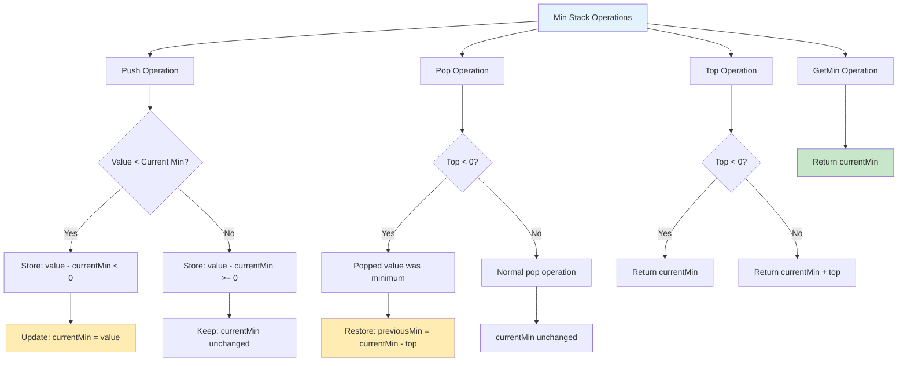

```cpp
class MinStack {
private:
    stack<long long> st;
    long long minElement;

public:
    MinStack() {
        minElement = LLONG_MAX;
    }

    void push(int val) {
        if (st.empty()) {
            st.push(0);
            minElement = val;
        } else {
            // Store difference between current value and minimum
            st.push((long long)val - minElement);

            // Update minimum if current value is smaller
            if (val < minElement) {
                minElement = val;
            }
        }
    }

    void pop() {
        if (st.empty()) return;

        long long top = st.top();
        st.pop();

        // If top is negative, it means the popped element was minimum
        if (top < 0) {
            minElement = minElement - top;  // Restore previous minimum
        }
    }

    int top() {
        if (st.empty()) return -1;

        long long top = st.top();

        // If top is negative, actual value is current minimum
        if (top < 0) {
            return minElement;
        } else {
            return minElement + top;
        }
    }

    int getMin() {
        return minElement;
    }

    void demonstrateMinStack() {
        cout << "=== Min Stack Demonstration ===" << endl;

        push(5);
        cout << "Pushed 5, Min: " << getMin() << ", Top: " << top() << endl;

        push(3);
        cout << "Pushed 3, Min: " << getMin() << ", Top: " << top() << endl;

        push(7);
        cout << "Pushed 7, Min: " << getMin() << ", Top: " << top() << endl;

        push(1);
        cout << "Pushed 1, Min: " << getMin() << ", Top: " << top() << endl;

        pop();
        cout << "Popped, Min: " << getMin() << ", Top: " << top() << endl;

        pop();
        cout << "Popped, Min: " << getMin() << ", Top: " << top() << endl;
    }
};
```

### 4. Sliding Window Maximum

**Problem**: Find the maximum element in every sliding window of size k.

**Approach**: Use deque (double-ended queue) to maintain elements in decreasing order.

```cpp
#include <deque>

class SlidingWindowMaximum {
public:
    vector<int> maxSlidingWindow(vector<int>& nums, int k) {
        deque<int> dq;  // Store indices in decreasing order of values
        vector<int> result;

        for (int i = 0; i < nums.size(); i++) {
            // Remove indices outside current window
            while (!dq.empty() && dq.front() <= i - k) {
                dq.pop_front();
            }

            // Remove indices whose corresponding values are smaller
            // than current element (they can never be maximum)
            while (!dq.empty() && nums[dq.back()] < nums[i]) {
                dq.pop_back();
            }

            dq.push_back(i);

            // Add maximum of current window to result
            if (i >= k - 1) {
                result.push_back(nums[dq.front()]);
            }
        }

        return result;
    }

    void demonstrateSlidingWindow() {
        vector<int> nums = {1, 3, -1, -3, 5, 3, 6, 7};
        int k = 3;

        cout << "=== Sliding Window Maximum ===" << endl;
        cout << "Array: ";
        for (int num : nums) cout << num << " ";
        cout << endl << "Window size: " << k << endl;

        vector<int> result = maxSlidingWindow(nums, k);
        cout << "Maximum in each window: ";
        for (int max : result) cout << max << " ";
        cout << endl;
    }
};
```

---

## More Practice Problems

### Problem 1: Valid Parentheses with Minimum Removals

**Problem Statement**: Given a string with parentheses, find the minimum number of parentheses to remove to make the string valid.

**Example**:

- Input: `"()())()"` → Output: `1` (remove one ')')
- Input: `"((("` → Output: `3` (remove all '(')

**Approach Explanation**:

1. **Track unmatched parentheses**: Use stack for unmatched opening brackets
2. **Count excess closing brackets**: Count closing brackets without matching opening
3. **Final calculation**: unmatched_opening + excess_closing

```cpp
class MinimumParenthesesRemoval {
public:
    int minRemoveToMakeValid(string s) {
        int unmatched_open = 0;  // Count of unmatched '('
        int excess_close = 0;    // Count of excess ')'

        for (char c : s) {
            if (c == '(') {
                unmatched_open++;
            } else if (c == ')') {
                if (unmatched_open > 0) {
                    unmatched_open--;  // Match found
                } else {
                    excess_close++;    // Excess closing bracket
                }
            }
        }

        return unmatched_open + excess_close;
    }

    // Alternative: Return the valid string after removing invalid parentheses
    string removeInvalidParentheses(string s) {
        stack<int> indexStack;
        set<int> toRemove;

        // First pass: identify indices to remove
        for (int i = 0; i < s.length(); i++) {
            if (s[i] == '(') {
                indexStack.push(i);
            } else if (s[i] == ')') {
                if (!indexStack.empty()) {
                    indexStack.pop();  // Matched pair
                } else {
                    toRemove.insert(i);  // Unmatched closing
                }
            }
        }

        // Add remaining unmatched opening brackets
        while (!indexStack.empty()) {
            toRemove.insert(indexStack.top());
            indexStack.pop();
        }

        // Build result string
        string result = "";
        for (int i = 0; i < s.length(); i++) {
            if (toRemove.find(i) == toRemove.end()) {
                result += s[i];
            }
        }

        return result;
    }

    void demonstrateMinRemoval() {
        vector<string> testCases = {
            "()())",
            "(((",
            "()()())",
            ")(",
            "((a))",
            "a)b(c"
        };

        cout << "=== Minimum Parentheses Removal ===" << endl;
        for (const string& test : testCases) {
            cout << "Input: '" << test << "'" << endl;
            cout << "Min removals: " << minRemoveToMakeValid(test) << endl;
            cout << "Valid string: '" << removeInvalidParentheses(test) << "'" << endl;
            cout << "---" << endl;
        }
    }
};
```

### Problem 2: Maximum Rectangle in Binary Matrix

**Problem Statement**: Given a binary matrix filled with 0s and 1s, find the largest rectangle containing only 1s and return its area.

**Example**:

```
Matrix:
1 0 1 0 0
1 0 1 1 1
1 1 1 1 1
1 0 0 1 0
Output: 6 (rectangle from row 1-2, col 2-4)
```

**Approach Explanation**:

1. **Convert to histogram problem**: For each row, calculate heights of consecutive 1s ending at that row
2. **Apply largest rectangle algorithm**: Use the histogram algorithm for each row
3. **Dynamic height calculation**: Update heights as we process each row

**Why this works**: Each row can be viewed as the base of a histogram where heights represent consecutive 1s ending at that row.

```cpp
class MaxRectangleInMatrix {
public:
    int maximalRectangle(vector<vector<char>>& matrix) {
        if (matrix.empty() || matrix[0].empty()) return 0;

        int rows = matrix.size();
        int cols = matrix[0].size();
        vector<int> heights(cols, 0);
        int maxArea = 0;

        for (int i = 0; i < rows; i++) {
            // Update heights for current row
            for (int j = 0; j < cols; j++) {
                if (matrix[i][j] == '1') {
                    heights[j]++;  // Extend height
                } else {
                    heights[j] = 0;  // Reset height
                }
            }

            // Find largest rectangle in current histogram
            int currentArea = largestRectangleInHistogram(heights);
            maxArea = max(maxArea, currentArea);

            cout << "Row " << i << " heights: ";
            for (int h : heights) cout << h << " ";
            cout << "→ Max area so far: " << maxArea << endl;
        }

        return maxArea;
    }

private:
    int largestRectangleInHistogram(vector<int>& heights) {
        stack<int> indexStack;
        int maxArea = 0;
        int n = heights.size();

        for (int i = 0; i <= n; i++) {
            int currentHeight = (i == n) ? 0 : heights[i];

            while (!indexStack.empty() &&
                   heights[indexStack.top()] > currentHeight) {

                int height = heights[indexStack.top()];
                indexStack.pop();

                int width = indexStack.empty() ? i : (i - indexStack.top() - 1);
                maxArea = max(maxArea, height * width);
            }

            indexStack.push(i);
        }

        return maxArea;
    }

public:
    void demonstrateMaxRectangle() {
        vector<vector<char>> matrix = {
            {'1', '0', '1', '0', '0'},
            {'1', '0', '1', '1', '1'},
            {'1', '1', '1', '1', '1'},
            {'1', '0', '0', '1', '0'}
        };

        cout << "=== Maximum Rectangle in Binary Matrix ===" << endl;
        cout << "Matrix:" << endl;
        for (const auto& row : matrix) {
            for (char c : row) cout << c << " ";
            cout << endl;
        }
        cout << endl;

        int result = maximalRectangle(matrix);
        cout << "Maximum Rectangle Area: " << result << endl;
    }
};
```

### Problem 3: Evaluate Reverse Polish Notation

**Problem Statement**: Evaluate the value of an arithmetic expression in Reverse Polish Notation (RPN).

**Example**:

- Input: `["2","1","+","3","*"]` → Output: `9` ((2+1)\*3)
- Input: `["4","13","5","/","+"]` → Output: `6` (4+(13/5))

**Approach Explanation**:

1. **Process tokens left to right**: Numbers are operands, symbols are operators
2. **Stack for operands**: Push numbers onto stack
3. **Apply operators**: Pop two operands, apply operator, push result back
4. **Final result**: Last remaining element in stack

**Why RPN is stack-friendly**: RPN eliminates need for parentheses and precedence rules by using postfix notation where operators come after their operands.

```cpp
class EvaluateRPN {
public:
    int evalRPN(vector<string>& tokens) {
        stack<int> operandStack;

        for (const string& token : tokens) {
            if (isOperator(token)) {
                // Pop two operands (order matters for - and /)
                int operand2 = operandStack.top(); operandStack.pop();
                int operand1 = operandStack.top(); operandStack.pop();

                int result = applyOperator(operand1, operand2, token);
                operandStack.push(result);

                cout << operand1 << " " << token << " " << operand2
                     << " = " << result << endl;
            } else {
                // It's a number
                operandStack.push(stoi(token));
                cout << "Push: " << token << endl;
            }
        }

        return operandStack.top();
    }

private:
    bool isOperator(const string& token) {
        return token == "+" || token == "-" || token == "*" || token == "/";
    }

    int applyOperator(int operand1, int operand2, const string& op) {
        if (op == "+") return operand1 + operand2;
        if (op == "-") return operand1 - operand2;
        if (op == "*") return operand1 * operand2;
        if (op == "/") return operand1 / operand2;
        return 0;
    }

public:
    void demonstrateRPN() {
        vector<vector<string>> testCases = {
            {"2", "1", "+", "3", "*"},
            {"4", "13", "5", "/", "+"},
            {"10", "6", "9", "3", "+", "-11", "*", "/", "*", "17", "+", "5", "+"}
        };

        cout << "=== Reverse Polish Notation Evaluation ===" << endl;
        for (const auto& tokens : testCases) {
            cout << "Expression: ";
            for (const string& token : tokens) cout << token << " ";
            cout << endl;

            vector<string> tokensCopy = tokens;  // Copy for demonstration
            int result = evalRPN(tokensCopy);
            cout << "Result: " << result << endl;
            cout << "---" << endl;
        }
    }
};
```

### Problem 4: Basic Calculator

**Problem Statement**: Implement a basic calculator to evaluate a simple expression string containing '+', '-', '(', ')' and non-negative integers.

**Example**:

- Input: `"1 + 1"` → Output: `2`
- Input: `"2-1 + 2"` → Output: `3`
- Input: `"(1+(4+5+2)-3)+(6+8)"` → Output: `23`

**Approach Explanation**:

1. **Stack for nested calculations**: Handle parentheses by pushing intermediate results
2. **Current number and operator tracking**: Process digit by digit
3. **Parentheses handling**: Push current state when '(', restore when ')'

```cpp
class BasicCalculator {
public:
    int calculate(string s) {
        stack<int> resultStack;
        int result = 0;
        int number = 0;
        int sign = 1;  // 1 for positive, -1 for negative

        for (char c : s) {
            if (isdigit(c)) {
                number = number * 10 + (c - '0');
            } else if (c == '+') {
                result += sign * number;
                number = 0;
                sign = 1;
            } else if (c == '-') {
                result += sign * number;
                number = 0;
                sign = -1;
            } else if (c == '(') {
                // Push current result and sign to stack
                resultStack.push(result);
                resultStack.push(sign);

                // Reset for new sub-expression
                result = 0;
                sign = 1;
            } else if (c == ')') {
                // Complete current sub-expression
                result += sign * number;
                number = 0;

                // Pop sign and previous result
                result *= resultStack.top(); resultStack.pop();  // sign
                result += resultStack.top(); resultStack.pop();  // previous result
            }
        }

        return result + (sign * number);
    }

    void demonstrateCalculator() {
        vector<string> expressions = {
            "1 + 1",
            "2-1 + 2",
            "(1+(4+5+2)-3)+(6+8)",
            "2147483647",
            "1-(     -2)"
        };

        cout << "=== Basic Calculator ===" << endl;
        for (const string& expr : expressions) {
            cout << "Expression: '" << expr << "'" << endl;
            cout << "Result: " << calculate(expr) << endl;
            cout << "---" << endl;
        }
    }
};
```

### Problem 5: Remove K Digits

**Problem Statement**: Given a non-negative integer num represented as a string and an integer k, remove k digits from the number so that the new number is the smallest possible.

**Example**:

- Input: `num = "1432219", k = 3` → Output: `"1219"`
- Input: `num = "10200", k = 1` → Output: `"200"`

**Approach Explanation**:

1. **Use monotonic increasing stack**: Maintain digits in increasing order
2. **Remove larger digits**: When we see a smaller digit, remove larger digits from stack
3. **Handle remaining removals**: If we haven't removed k digits, remove from end
4. **Handle leading zeros**: Remove leading zeros from final result

**Why this works**: To get the smallest number, we want smaller digits to appear before larger digits. Monotonic stack ensures this property.

```cpp
class RemoveKDigits {
public:
    string removeKdigits(string num, int k) {
        stack<char> monotonicStack;
        int toRemove = k;

        for (char digit : num) {
            // Remove larger digits to maintain increasing order
            while (!monotonicStack.empty() &&
                   monotonicStack.top() > digit &&
                   toRemove > 0) {
                monotonicStack.pop();
                toRemove--;
            }
            monotonicStack.push(digit);
        }

        // Remove remaining digits from end if needed
        while (toRemove > 0 && !monotonicStack.empty()) {
            monotonicStack.pop();
            toRemove--;
        }

        // Build result string
        string result = "";
        while (!monotonicStack.empty()) {
            result = monotonicStack.top() + result;
            monotonicStack.pop();
        }

        // Remove leading zeros
        int startIndex = 0;
        while (startIndex < result.length() && result[startIndex] == '0') {
            startIndex++;
        }

        result = result.substr(startIndex);
        return result.empty() ? "0" : result;
    }

    void demonstrateRemoveKDigits() {
        vector<pair<string, int>> testCases = {
            {"1432219", 3},
            {"10200", 1},
            {"10", 2},
            {"9", 1},
            {"54321", 2}
        };

        cout << "=== Remove K Digits ===" << endl;
        for (const auto& test : testCases) {
            cout << "Number: " << test.first << ", Remove: " << test.second << endl;
            cout << "Result: " << removeKdigits(test.first, test.second) << endl;
            cout << "---" << endl;
        }
    }
};
```

### Problem 6: Online Stock Span

**Problem Statement**: Design an algorithm that collects daily price quotes for some stock and returns the span of that stock's price for the current day.

**Approach**: Implement a class that processes stock prices one by one and maintains a stack of indices with decreasing prices.

```cpp
class StockSpanner {
private:
    stack<pair<int, int>> priceIndexStack;  // {price, index}
    int dayIndex;

public:
    StockSpanner() : dayIndex(0) {}

    int next(int price) {
        int span = 1;

        // Pop all days with price <= current price
        while (!priceIndexStack.empty() &&
               priceIndexStack.top().first <= price) {
            priceIndexStack.pop();
        }

        // Calculate span
        if (priceIndexStack.empty()) {
            span = dayIndex + 1;  // All previous days have lower price
        } else {
            span = dayIndex - priceIndexStack.top().second;
        }

        priceIndexStack.push({price, dayIndex});
        dayIndex++;

        return span;
    }

    void demonstrateStockSpanner() {
        cout << "=== Online Stock Span ===" << endl;
        vector<int> prices = {100, 80, 60, 70, 60, 75, 85};

        StockSpanner spanner;
        for (int i = 0; i < prices.size(); i++) {
            int span = spanner.next(prices[i]);
            cout << "Day " << i + 1 << ": Price=" << prices[i]
                 << ", Span=" << span << endl;
        }
    }
};
```

---

## Real-World Applications

Stack data structure is ubiquitous in software systems, from low-level system operations to high-level application features. Understanding these applications helps appreciate the practical importance of stacks.

```mermaid
graph TD
    A[Real-World Stack Applications] --> B[System Software]
    A --> C[Application Software]
    A --> D[Web Technologies]
    A --> E[Compilers & Interpreters]

    B --> B1[Operating System Call Stack]
    B --> B2[Memory Management]
    B --> B3[Interrupt Handling]
    B --> B4[Process Context Switching]

    C --> C1[Undo/Redo in Editors]
    C --> C2[Browser History]
    C --> C3[Game State Management]
    C --> C4[Expression Calculators]

    D --> D1[JavaScript Call Stack]
    D --> D2[HTTP Request/Response]
    D --> D3[Navigation Stack]
    D --> D4[Session Management]

    E --> E1[Syntax Parsing]
    E --> E2[Symbol Table Management]
    E --> E3[Code Generation]
    E --> E4[Runtime Environment]

    style A fill:#f9f,stroke:#333,stroke-width:4px
    style B fill:#bbf,stroke:#333,stroke-width:2px
    style C fill:#bfb,stroke:#333,stroke-width:2px
    style D fill:#ffb,stroke:#333,stroke-width:2px
    style E fill:#fbb,stroke:#333,stroke-width:2px
```

### 1. Browser History Management

**Real-World Context**: Every web browser implements back/forward navigation using stack-like structures to manage user browsing history.

**Why Stack is Perfect**:

- **Back navigation**: LIFO order naturally shows recently visited pages first
- **Forward stack**: Maintains pages user can navigate forward to
- **New page visits**: Clear forward history (user chose new path)
- **Memory efficiency**: Only store necessary navigation context

**Browser Implementation Insights**:

- Back button → Pop from back stack, push to forward stack
- Forward button → Pop from forward stack, push to back stack
- New URL → Clear forward stack, push current page to back stack
- Memory limits → Implement maximum history size


```cpp
#include <iostream>
#include <stack>
#include <string>
using namespace std;

class BrowserHistory {
private:
    stack<string> backStack;    // Pages we can go back to
    stack<string> forwardStack; // Pages we can go forward to
    string currentPage;

public:
    BrowserHistory(string homepage) {
        currentPage = homepage;
    }

    void visit(string url) {
        backStack.push(currentPage);
        currentPage = url;

        // Clear forward history when visiting new page
        while (!forwardStack.empty()) {
            forwardStack.pop();
        }

        cout << "Visited: " << url << endl;
    }

    string back(int steps) {
        while (steps > 0 && !backStack.empty()) {
            forwardStack.push(currentPage);
            currentPage = backStack.top();
            backStack.pop();
            steps--;
        }

        cout << "Went back to: " << currentPage << endl;
        return currentPage;
    }

    string forward(int steps) {
        while (steps > 0 && !forwardStack.empty()) {
            backStack.push(currentPage);
            currentPage = forwardStack.top();
            forwardStack.pop();
            steps--;
        }

        cout << "Went forward to: " << currentPage << endl;
        return currentPage;
    }

    void demonstrateBrowserHistory() {
        cout << "=== Browser History Demo ===" << endl;

        visit("google.com");
        visit("facebook.com");
        visit("youtube.com");

        back(1);        // youtube.com -> facebook.com
        back(1);        // facebook.com -> google.com
        forward(1);     // google.com -> facebook.com
        visit("linkedin.com");  // Clear forward history
        forward(1);     // Can't go forward
    }
};
```

### 2. Undo/Redo Functionality

**Real-World Context**: Text editors, image editors, IDEs, and most interactive software implement undo/redo using dual stack architecture.

**Why Dual Stack Design**:

- **Undo stack**: Stores previous states in reverse chronological order
- **Redo stack**: Stores undone operations that can be reapplied
- **State preservation**: Each entry represents complete state or command
- **Efficiency**: O(1) operations for both undo and redo

**Advanced Considerations**:

- **Memory management**: Limit undo history to prevent memory exhaustion
- **State compression**: Store deltas instead of full states when possible
- **Command pattern**: Store operations instead of states for better efficiency
- **Persistent storage**: Some applications save undo history to disk

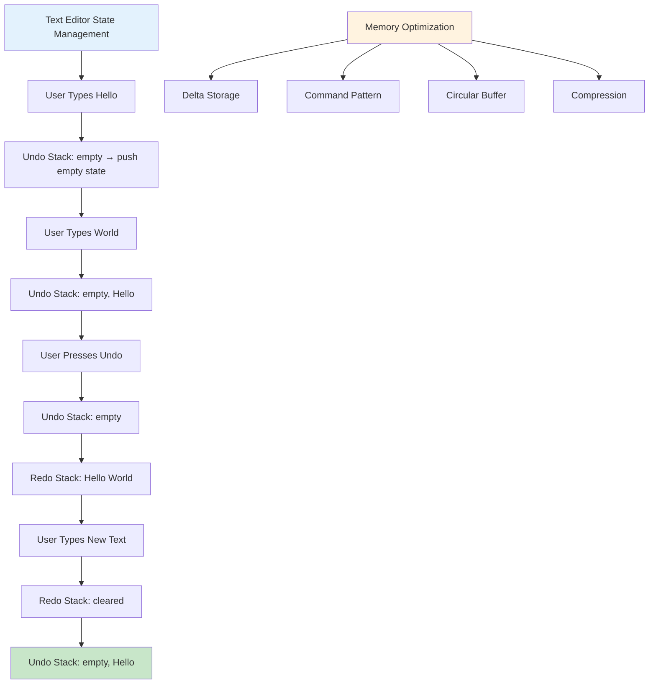

```cpp
class TextEditor {
private:
    string text;
    stack<string> undoStack;
    stack<string> redoStack;

public:
    TextEditor() : text("") {}

    void type(string characters) {
        undoStack.push(text);  // Save current state
        text += characters;

        // Clear redo stack
        while (!redoStack.empty()) {
            redoStack.pop();
        }

        cout << "Typed: '" << characters << "' | Text: '" << text << "'" << endl;
    }

    void undo() {
        if (!undoStack.empty()) {
            redoStack.push(text);
            text = undoStack.top();
            undoStack.pop();
            cout << "Undo | Text: '" << text << "'" << endl;
        } else {
            cout << "Nothing to undo" << endl;
        }
    }

    void redo() {
        if (!redoStack.empty()) {
            undoStack.push(text);
            text = redoStack.top();
            redoStack.pop();
            cout << "Redo | Text: '" << text << "'" << endl;
        } else {
            cout << "Nothing to redo" << endl;
        }
    }

    void demonstrateTextEditor() {
        cout << "=== Text Editor Demo ===" << endl;

        type("Hello");
        type(" World");
        type("!");

        undo();  // Remove "!"
        undo();  // Remove " World"

        redo();  // Add back " World"

        type(" from C++");  // This clears redo stack
        redo();  // Nothing to redo
    }
};
```

### 4. JavaScript Call Stack and Event Loop

**Real-World Context**: JavaScript engines use a call stack to manage function execution, which is crucial for understanding asynchronous programming and debugging.

**Call Stack Behavior**:

- **Synchronous execution**: Functions execute in LIFO order
- **Stack frames**: Each function call creates a stack frame
- **Error propagation**: Stack traces show call chain
- **Stack overflow**: Recursive calls can exceed stack limit

**Web Development Applications**:

1. **Event handling**: User interactions create function calls
2. **AJAX callbacks**: Asynchronous operations use callback stack
3. **Promise chains**: Then/catch handlers managed by stack
4. **Debugging**: Browser dev tools show call stack

```cpp
// Simulating JavaScript call stack behavior
class JavaScriptCallStack {
private:
    struct StackFrame {
        string functionName;
        int lineNumber;
        map<string, string> localVariables;

        StackFrame(string name, int line) : functionName(name), lineNumber(line) {}
    };

    stack<StackFrame> callStack;

public:
    void enterFunction(string functionName, int lineNumber) {
        callStack.push(StackFrame(functionName, lineNumber));
        cout << "Entering: " << functionName << " at line " << lineNumber << endl;
        printCallStack();
    }

    void exitFunction() {
        if (!callStack.empty()) {
            string functionName = callStack.top().functionName;
            callStack.pop();
            cout << "Exiting: " << functionName << endl;
            printCallStack();
        }
    }

    void setVariable(string name, string value) {
        if (!callStack.empty()) {
            callStack.top().localVariables[name] = value;
        }
    }

    void printCallStack() {
        cout << "Call Stack:" << endl;
        stack<StackFrame> temp = callStack;
        vector<StackFrame> frames;

        while (!temp.empty()) {
            frames.push_back(temp.top());
            temp.pop();
        }

        for (const auto& frame : frames) {
            cout << "  " << frame.functionName << ":" << frame.lineNumber << endl;
        }
        cout << "---" << endl;
    }

    void simulateJavaScript() {
        cout << "=== JavaScript Call Stack Simulation ===" << endl;

        enterFunction("main", 1);
        setVariable("x", "10");

        enterFunction("calculateSum", 5);
        setVariable("a", "5");
        setVariable("b", "3");

        enterFunction("add", 10);
        setVariable("result", "8");
        exitFunction();

        exitFunction();
        exitFunction();
    }
};
```

### 5. Compiler and Parser Applications

**Real-World Context**: Compilers, interpreters, and code analysis tools extensively use stacks for parsing and code generation.

**Parsing Applications**:

1. **Syntax analysis**: Recursive descent parsers use implicit call stack
2. **Expression parsing**: Operator precedence handled by stack
3. **Symbol table management**: Nested scopes managed with stack
4. **Error recovery**: Stack helps backtrack during syntax errors

**Code Generation**:

1. **Intermediate code**: Stack machines for virtual execution
2. **Register allocation**: Stack for managing temporary values
3. **Optimization**: Stack for tracking optimization contexts

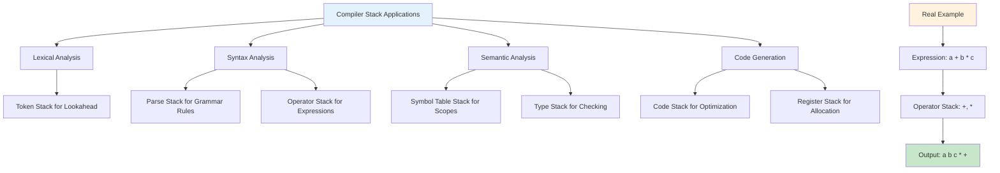

### 6. Game Development Applications

**Real-World Context**: Game engines and interactive applications use stacks for state management, AI, and user interface systems.

**Game State Management**:

1. **Game state stack**: Menu → Game → Pause → Settings
2. **AI decision trees**: Depth-first search with backtracking
3. **Pathfinding**: DFS algorithms for navigation
4. **Animation sequencing**: Stack of animation states

```cpp
class GameStateManager {
private:
    enum GameState { MENU, PLAYING, PAUSED, SETTINGS, INVENTORY };
    stack<GameState> stateStack;

public:
    void pushState(GameState newState) {
        stateStack.push(newState);
        cout << "Entered state: " << stateToString(newState) << endl;
    }

    void popState() {
        if (!stateStack.empty()) {
            GameState poppedState = stateStack.top();
            stateStack.pop();
            cout << "Exited state: " << stateToString(poppedState) << endl;
        }
    }

    GameState getCurrentState() {
        return stateStack.empty() ? MENU : stateStack.top();
    }

    string stateToString(GameState state) {
        switch(state) {
            case MENU: return "Menu";
            case PLAYING: return "Playing";
            case PAUSED: return "Paused";
            case SETTINGS: return "Settings";
            case INVENTORY: return "Inventory";
            default: return "Unknown";
        }
    }

    void simulateGameplay() {
        cout << "=== Game State Management ===" << endl;

        pushState(MENU);        // Start at menu
        pushState(PLAYING);     // Start game
        pushState(PAUSED);      // Player pauses
        pushState(SETTINGS);    // Open settings

        popState();             // Close settings
        popState();             // Resume game
        pushState(INVENTORY);   // Open inventory
        popState();             // Close inventory
        popState();             // End game, back to menu
    }
};
```

---

```cpp
class CallStackSimulator {
private:
    struct FunctionCall {
        string functionName;
        vector<string> parameters;
        string returnValue;

        FunctionCall(string name, vector<string> params)
            : functionName(name), parameters(params), returnValue("") {}
    };

    stack<FunctionCall> callStack;

public:
    void enterFunction(string functionName, vector<string> parameters) {
        callStack.push(FunctionCall(functionName, parameters));

        cout << "Entering " << functionName << "(";
        for (int i = 0; i < parameters.size(); i++) {
            cout << parameters[i];
            if (i < parameters.size() - 1) cout << ", ";
        }
        cout << ")" << endl;

        printCallStack();
    }

    void exitFunction(string returnValue) {
        if (!callStack.empty()) {
            FunctionCall& topCall = callStack.top();
            topCall.returnValue = returnValue;

            cout << "Exiting " << topCall.functionName
                 << " with return value: " << returnValue << endl;

            callStack.pop();
            printCallStack();
        }
    }

    void printCallStack() {
        cout << "Call Stack (top to bottom):" << endl;

        stack<FunctionCall> tempStack = callStack;
        vector<FunctionCall> stackContents;

        while (!tempStack.empty()) {
            stackContents.push_back(tempStack.top());
            tempStack.pop();
        }

        for (const auto& call : stackContents) {
            cout << "  " << call.functionName << "(";
            for (int i = 0; i < call.parameters.size(); i++) {
                cout << call.parameters[i];
                if (i < call.parameters.size() - 1) cout << ", ";
            }
            cout << ")" << endl;
        }
        cout << "---" << endl;
    }

    void demonstrateCallStack() {
        cout << "=== Call Stack Simulation ===" << endl;

        enterFunction("main", {});
        enterFunction("calculateSum", {"a", "b"});
        enterFunction("add", {"5", "3"});
        exitFunction("8");
        exitFunction("8");
        enterFunction("printResult", {"8"});
        exitFunction("void");
        exitFunction("0");
    }
};
```

---

## Complexity Analysis

### Time Complexity Summary

| Operation/Algorithm        | Best Case | Average Case | Worst Case | Space Complexity |
| -------------------------- | --------- | ------------ | ---------- | ---------------- |
| **Basic Stack Operations** |
| Push                       | O(1)      | O(1)         | O(1)\*     | O(1)             |
| Pop                        | O(1)      | O(1)         | O(1)       | O(1)             |
| Top/Peek                   | O(1)      | O(1)         | O(1)       | O(1)             |
| **Stack Applications**     |
| Balanced Parentheses       | O(n)      | O(n)         | O(n)       | O(n)             |
| Next Greater Element       | O(n)      | O(n)         | O(n)       | O(n)             |
| Stock Span                 | O(n)      | O(n)         | O(n)       | O(n)             |
| Infix to Postfix           | O(n)      | O(n)         | O(n)       | O(n)             |
| Postfix Evaluation         | O(n)      | O(n)         | O(n)       | O(n)             |
| **Advanced Problems**      |
| Largest Rectangle          | O(n)      | O(n)         | O(n)       | O(n)             |
| Min Stack                  | O(1)      | O(1)         | O(1)       | O(1)             |
| Sliding Window Max         | O(n)      | O(n)         | O(n)       | O(k)             |

\*Amortized O(1) for dynamic array implementation due to occasional resizing

### Space Complexity Analysis

```mermaid
graph TD
    A[Stack Space Complexity] --> B[Array Implementation]
    A --> C[Linked List Implementation]

    B --> D[Fixed Size: O(n)]
    B --> E[Dynamic Size: O(n) + resize overhead]

    C --> F[Node Overhead: O(n) + pointer space]
    C --> G[No resize needed]

    H[Stack Applications] --> I[Auxiliary Space]
    I --> J[Balanced Parentheses: O(n) worst case]
    I --> K[Expression Evaluation: O(n) for operators]
    I --> L[Next Greater Element: O(n) for indices]
```

---

## Advanced Topics and Optimizations

### 1. Stack with Multiple Data Types

```cpp
#include <variant>
#include <iostream>
using namespace std;

class MultiTypeStack {
private:
    stack<variant<int, string, double>> multiStack;

public:
    template<typename T>
    void push(const T& value) {
        multiStack.push(value);
    }

    template<typename T>
    T pop() {
        if (multiStack.empty()) {
            throw runtime_error("Stack is empty");
        }

        auto value = multiStack.top();
        multiStack.pop();

        if (holds_alternative<T>(value)) {
            return get<T>(value);
        } else {
            throw runtime_error("Type mismatch");
        }
    }

    void printTop() {
        if (multiStack.empty()) {
            cout << "Stack is empty" << endl;
            return;
        }

        auto value = multiStack.top();

        visit([](const auto& v) {
            cout << "Top element: " << v << " (type: " << typeid(v).name() << ")" << endl;
        }, value);
    }

    void demonstrateMultiTypeStack() {
        cout << "=== Multi-Type Stack Demo ===" << endl;

        push<int>(42);
        push<string>("Hello");
        push<double>(3.14);

        printTop();  // 3.14

        double d = pop<double>();
        cout << "Popped double: " << d << endl;

        printTop();  // "Hello"

        string s = pop<string>();
        cout << "Popped string: " << s << endl;

        printTop();  // 42
    }
};
```

### 2. Thread-Safe Stack

```cpp
#include <mutex>
#include <condition_variable>

template<typename T>
class ThreadSafeStack {
private:
    mutable mutex mtx;
    stack<T> data;
    condition_variable cv;

public:
    void push(T item) {
        lock_guard<mutex> lock(mtx);
        data.push(move(item));
        cv.notify_one();
    }

    bool tryPop(T& item) {
        lock_guard<mutex> lock(mtx);
        if (data.empty()) {
            return false;
        }
        item = move(data.top());
        data.pop();
        return true;
    }

    shared_ptr<T> tryPop() {
        lock_guard<mutex> lock(mtx);
        if (data.empty()) {
            return shared_ptr<T>();
        }
        shared_ptr<T> result = make_shared<T>(move(data.top()));
        data.pop();
        return result;
    }

    void waitAndPop(T& item) {
        unique_lock<mutex> lock(mtx);
        cv.wait(lock, [this] { return !data.empty(); });
        item = move(data.top());
        data.pop();
    }

    shared_ptr<T> waitAndPop() {
        unique_lock<mutex> lock(mtx);
        cv.wait(lock, [this] { return !data.empty(); });
        shared_ptr<T> result = make_shared<T>(move(data.top()));
        data.pop();
        return result;
    }

    bool empty() const {
        lock_guard<mutex> lock(mtx);
        return data.empty();
    }

    size_t size() const {
        lock_guard<mutex> lock(mtx);
        return data.size();
    }
};
```

---

## Practice Problems and Solutions

### Problem Set 1: Basic Stack Operations

```cpp
class BasicStackProblems {
public:
    // Problem: Remove All Adjacent Duplicates
    string removeDuplicates(string s) {
        stack<char> st;

        for (char c : s) {
            if (!st.empty() && st.top() == c) {
                st.pop();  // Remove duplicate
            } else {
                st.push(c);
            }
        }

        string result = "";
        while (!st.empty()) {
            result = st.top() + result;
            st.pop();
        }

        return result;
    }

    // Problem: Valid Parentheses with Multiple Types
    bool isValidParentheses(string s) {
        stack<char> st;
        unordered_map<char, char> mapping = {
            {')', '('}, {']', '['}, {'}', '{'}
        };

        for (char c : s) {
            if (mapping.find(c) != mapping.end()) {
                if (st.empty() || st.top() != mapping[c]) {
                    return false;
                }
                st.pop();
            } else {
                st.push(c);
            }
        }

        return st.empty();
    }

    // Problem: Simplify Unix Path
    string simplifyPath(string path) {
        stack<string> st;
        stringstream ss(path);
        string directory;

        while (getline(ss, directory, '/')) {
            if (directory == "" || directory == ".") {
                continue;  // Skip empty and current directory
            } else if (directory == "..") {
                if (!st.empty()) {
                    st.pop();  // Go to parent directory
                }
            } else {
                st.push(directory);
            }
        }

        string result = "";
        while (!st.empty()) {
            result = "/" + st.top() + result;
            st.pop();
        }

        return result.empty() ? "/" : result;
    }

    void demonstrateBasicProblems() {
        cout << "=== Basic Stack Problems Demo ===" << endl;

        cout << "Remove Duplicates 'abbaca': " << removeDuplicates("abbaca") << endl;
        cout << "Valid Parentheses '()[]{}': " << isValidParentheses("()[]{}") << endl;
        cout << "Simplify Path '/a//b////c/d//././/..': "
             << simplifyPath("/a//b////c/d//././/..") << endl;
    }
};
```

### Problem Set 2: Advanced Applications

```cpp
class AdvancedStackProblems {
public:
    // Problem: Asteroid Collision
    vector<int> asteroidCollision(vector<int>& asteroids) {
        stack<int> st;

        for (int asteroid : asteroids) {
            bool destroyed = false;

            while (!st.empty() && asteroid < 0 && st.top() > 0) {
                if (st.top() < -asteroid) {
                    st.pop();  // Top asteroid destroyed
                    continue;
                } else if (st.top() == -asteroid) {
                    st.pop();  // Both destroyed
                }
                destroyed = true;  // Current asteroid destroyed
                break;
            }

            if (!destroyed) {
                st.push(asteroid);
            }
        }

        vector<int> result;
        while (!st.empty()) {
            result.push_back(st.top());
            st.pop();
        }

        reverse(result.begin(), result.end());
        return result;
    }

    // Problem: Daily Temperatures
    vector<int> dailyTemperatures(vector<int>& temperatures) {
        int n = temperatures.size();
        vector<int> result(n, 0);
        stack<int> indexStack;

        for (int i = 0; i < n; i++) {
            while (!indexStack.empty() &&
                   temperatures[i] > temperatures[indexStack.top()]) {
                int index = indexStack.top();
                indexStack.pop();
                result[index] = i - index;
            }
            indexStack.push(i);
        }

        return result;
    }

    // Problem: Decode String
    string decodeString(string s) {
        stack<int> countStack;
        stack<string> stringStack;
        string currentString = "";
        int currentCount = 0;

        for (char c : s) {
            if (isdigit(c)) {
                currentCount = currentCount * 10 + (c - '0');
            } else if (c == '[') {
                countStack.push(currentCount);
                stringStack.push(currentString);
                currentCount = 0;
                currentString = "";
            } else if (c == ']') {
                int count = countStack.top();
                countStack.pop();
                string prevString = stringStack.top();
                stringStack.pop();

                string temp = "";
                for (int i = 0; i < count; i++) {
                    temp += currentString;
                }
                currentString = prevString + temp;
            } else {
                currentString += c;
            }
        }

        return currentString;
    }

    void demonstrateAdvancedProblems() {
        cout << "=== Advanced Stack Problems Demo ===" << endl;

        vector<int> asteroids = {5, 10, -5};
        vector<int> result = asteroidCollision(asteroids);
        cout << "Asteroid Collision [5,10,-5]: ";
        for (int r : result) cout << r << " ";
        cout << endl;

        vector<int> temps = {73, 74, 75, 71, 69, 72, 76, 73};
        vector<int> days = dailyTemperatures(temps);
        cout << "Daily Temperatures: ";
        for (int d : days) cout << d << " ";
        cout << endl;

        cout << "Decode String '3[a2[c]]': " << decodeString("3[a2[c]]") << endl;
    }
};
```

---

## Conclusion and Best Practices

### Stack Problem Recognition Patterns

Understanding when to use a stack is crucial for efficient problem-solving. Here are the key patterns that indicate stack usage:

```mermaid
graph TD
    A[Stack Usage Patterns] --> B[Structure Recognition]
    A --> C[Order Requirements]
    A --> D[Matching Problems]
    A --> E[State Management]

    B --> B1[Nested Structures]
    B --> B2[Hierarchical Data]
    B --> B3[Tree-like Relations]

    C --> C1[LIFO Processing]
    C --> C2[Recent First Access]
    C --> C3[Reverse Order Needs]

    D --> D1[Bracket Matching]
    D --> D2[Tag Validation]
    D --> D3[Expression Parsing]

    E --> E1[Undo/Redo Systems]
    E --> E2[Navigation History]
    E --> E3[Function Call Management]

    F[Performance Indicators] --> G[O1 Push/Pop Needed]
    F --> H[Memory Efficiency Important]
    F --> I[Simple Access Pattern]

    style A fill:#f9f,stroke:#333,stroke-width:4px
    style F fill:#e3f2fd
```

### When to Use Stack vs Other Data Structures

| **Use Stack When**           | **Use Alternative When**   | **Alternative** |
| ---------------------------- | -------------------------- | --------------- |
| Need LIFO behavior           | Need FIFO behavior         | Queue           |
| Bracket/parentheses matching | Need random access         | Array/Vector    |
| Expression evaluation        | Need bidirectional access  | Deque           |
| Undo/Redo functionality      | Need indexed operations    | List/Array      |
| DFS traversal                | Need BFS traversal         | Queue           |
| Function call simulation     | Need priority-based access | Priority Queue  |
| Backtracking algorithms      | Need sorted data           | Balanced BST    |

### Performance Optimization Guidelines

#### 1. Memory Management

```cpp
// Good: Pre-allocate when size is known
class OptimizedStack {
private:
    vector<int> data;
    int topIndex;

public:
    OptimizedStack(int expectedSize) {
        data.reserve(expectedSize);  // Pre-allocate memory
        topIndex = -1;
    }

    void push(int value) {
        if (topIndex + 1 < data.capacity()) {
            data[++topIndex] = value;
        } else {
            data.push_back(value);
            topIndex = data.size() - 1;
        }
    }
};
```

#### 2. Avoid Common Pitfalls

```cpp
class SafeStack {
public:
    int pop() {
        if (empty()) {
            throw underflow_error("Cannot pop from empty stack");
        }
        // ... rest of implementation
    }

    int top() const {  // Make const when not modifying
        if (empty()) {
            throw runtime_error("Stack is empty");
        }
        // ... rest of implementation
    }

    // Always provide size and empty methods
    bool empty() const noexcept { return topIndex < 0; }
    size_t size() const noexcept { return topIndex + 1; }
};
```

### Algorithm Complexity Reference

#### Basic Operations

- **Push**: O(1) average, O(n) worst case (resizing)
- **Pop**: O(1) always
- **Top/Peek**: O(1) always
- **Empty**: O(1) always
- **Size**: O(1) if maintained, O(n) if calculated

#### Application Complexities

- **Balanced Parentheses**: O(n) time, O(n) space
- **Expression Evaluation**: O(n) time, O(n) space
- **Next Greater Element**: O(n) time, O(n) space (amortized)
- **Largest Rectangle**: O(n) time, O(n) space
- **Stock Span**: O(n) time, O(n) space (amortized)

### Design Patterns with Stacks

#### 1. Command Pattern for Undo/Redo

```cpp
class Command {
public:
    virtual void execute() = 0;
    virtual void undo() = 0;
    virtual ~Command() = default;
};

class CommandManager {
private:
    stack<unique_ptr<Command>> undoStack;
    stack<unique_ptr<Command>> redoStack;

public:
    void executeCommand(unique_ptr<Command> command) {
        command->execute();
        undoStack.push(move(command));

        // Clear redo stack when new command is executed
        while (!redoStack.empty()) {
            redoStack.pop();
        }
    }

    void undo() {
        if (!undoStack.empty()) {
            auto command = move(undoStack.top());
            undoStack.pop();
            command->undo();
            redoStack.push(move(command));
        }
    }

    void redo() {
        if (!redoStack.empty()) {
            auto command = move(redoStack.top());
            redoStack.pop();
            command->execute();
            undoStack.push(move(command));
        }
    }
};
```

#### 2. State Machine with Stack

```cpp
template<typename StateType>
class StateMachine {
private:
    stack<StateType> stateStack;

public:
    void pushState(StateType newState) {
        stateStack.push(newState);
    }

    void popState() {
        if (!stateStack.empty()) {
            stateStack.pop();
        }
    }

    StateType getCurrentState() {
        return stateStack.empty() ? StateType{} : stateStack.top();
    }

    bool hasStates() const {
        return !stateStack.empty();
    }
};
```

### Testing and Debugging Stack Code

#### Essential Test Cases

1. **Empty stack operations**: Test pop(), top() on empty stack
2. **Single element**: Test all operations with one element
3. **Capacity limits**: Test resizing behavior
4. **Large datasets**: Test performance with many elements
5. **Exception safety**: Ensure proper cleanup on exceptions

#### Debugging Techniques

```cpp
class DebuggableStack {
private:
    stack<int> data;
    bool debugMode;

public:
    void enableDebug(bool enable) { debugMode = enable; }

    void push(int value) {
        if (debugMode) {
            cout << "Pushing " << value << ", size will be " << data.size() + 1 << endl;
        }
        data.push(value);
    }

    int pop() {
        if (debugMode) {
            cout << "Popping " << data.top() << ", size will be " << data.size() - 1 << endl;
        }
        int value = data.top();
        data.pop();
        return value;
    }

    void printState() const {
        cout << "Stack size: " << data.size() << endl;
        if (!data.empty()) {
            cout << "Top element: " << data.top() << endl;
        }
    }
};
```

### Final Recommendations

#### For Beginners

1. **Master basic operations** before attempting complex problems
2. **Practice with simple examples** like balanced parentheses
3. **Understand LIFO principle** through visualization
4. **Start with STL stack** before implementing custom versions

#### For Intermediate Developers

1. **Learn monotonic stack patterns** for optimization problems
2. **Practice expression evaluation** and parsing problems
3. **Understand recursion-stack relationship** deeply
4. **Implement thread-safe versions** for concurrent applications

#### For Advanced Developers

1. **Optimize for specific use cases** (memory, speed, functionality)
2. **Design stack-based DSLs** and interpreters
3. **Implement custom memory management** for performance-critical applications
4. **Contribute to stack-based algorithms** in competitive programming

### Common Interview Questions Summary

#### Easy Level

- Implement stack using arrays/linked lists
- Valid parentheses checking
- Remove duplicates using stack
- Implement queue using two stacks

#### Medium Level

- Next greater element variants
- Largest rectangle in histogram
- Basic calculator implementation
- Stock span problem variations

#### Hard Level

- Expression evaluation with complex operators
- Minimum number of insertions for valid parentheses
- Maximum rectangle in binary matrix
- Design browser with back/forward functionality

### Resources for Further Learning

1. **Algorithm Textbooks**: CLRS, Sedgewick's Algorithms
2. **Online Platforms**: LeetCode, HackerRank, Codeforces
3. **System Design**: Understanding call stacks in operating systems
4. **Compiler Design**: Stack usage in parsing and code generation
5. **Game Development**: State management and AI applications

Remember: **Stack is not just a data structure—it's a fundamental concept that appears everywhere in computer science. Mastering stacks opens doors to understanding recursion, parsing, system design, and many advanced algorithms.**

---

# Queue Data Structure

_From Basics to Advanced Applications_

## Table of Contents

1. [Introduction to Queues](#introduction-to-queues)
2. [Basic Queue Operations](#basic-queue-operations)
3. [Types of Queues](#types-of-queues)
4. [Implementation Methods](#implementation-methods)
5. [Advanced Queue Variants](#advanced-queue-variants)
6. [Real-World Applications](#real-world-applications)
7. [Complex Problems and Solutions](#complex-problems-and-solutions)
8. [Performance Analysis](#performance-analysis)
9. [Interview Questions](#interview-questions)
10. [Best Practices](#best-practices)

---

## Introduction to Queues

A **Queue** is a linear data structure that follows the **First In, First Out (FIFO)** principle. Think of it like a real-world queue at a ticket counter - the first person to arrive is the first person to be served.

### Key Characteristics:

- **FIFO Behavior**: Elements are added at the rear and removed from the front
- **Linear Structure**: Elements are arranged in a sequential manner
- **Restricted Access**: Elements can only be accessed from the ends
- **Dynamic Size**: Can grow and shrink during runtime

### Queue Visualization

```mermaid
graph LR
    A[Front] --> B[Element 1]
    B --> C[Element 2]
    C --> D[Element 3]
    D --> E[Rear]

    F[New Element] -.->|enqueue| E
    B -.->|dequeue| G[Removed Element]

    style A fill:#ff9999
    style E fill:#99ff99
    style F fill:#ffff99
    style G fill:#ffcc99
```

---

## Basic Queue Operations

### Core Operations

1. **Enqueue**: Add element to the rear
2. **Dequeue**: Remove element from the front
3. **Front/Peek**: View front element without removing
4. **IsEmpty**: Check if queue is empty
5. **Size**: Get number of elements

### Basic Queue Implementation (Array-based)

```cpp
#include <iostream>
#include <vector>
#include <stdexcept>

class Queue {
private:
    std::vector<int> arr;
    int frontIndex;
    int rearIndex;
    int capacity;
    int currentSize;

public:
    Queue(int cap) : capacity(cap), frontIndex(0), rearIndex(-1), currentSize(0) {
        arr.resize(capacity);
    }

    // Add element to rear of queue
    void enqueue(int element) {
        if (isFull()) {
            throw std::overflow_error("Queue is full");
        }
        rearIndex = (rearIndex + 1) % capacity; // Circular increment
        arr[rearIndex] = element;
        currentSize++;
    }

    // Remove and return front element
    int dequeue() {
        if (isEmpty()) {
            throw std::underflow_error("Queue is empty");
        }
        int element = arr[frontIndex];
        frontIndex = (frontIndex + 1) % capacity; // Circular increment
        currentSize--;
        return element;
    }

    // Get front element without removing
    int front() const {
        if (isEmpty()) {
            throw std::underflow_error("Queue is empty");
        }
        return arr[frontIndex];
    }

    bool isEmpty() const {
        return currentSize == 0;
    }

    bool isFull() const {
        return currentSize == capacity;
    }

    int size() const {
        return currentSize;
    }

    void display() const {
        if (isEmpty()) {
            std::cout << "Queue is empty\n";
            return;
        }

        std::cout << "Queue: ";
        for (int i = 0; i < currentSize; i++) {
            int index = (frontIndex + i) % capacity;
            std::cout << arr[index] << " ";
        }
        std::cout << "\n";
    }
};

// Example usage
int main() {
    Queue q(5);

    q.enqueue(10);
    q.enqueue(20);
    q.enqueue(30);
    q.display(); // Output: Queue: 10 20 30

    std::cout << "Front element: " << q.front() << std::endl; // 10
    std::cout << "Dequeued: " << q.dequeue() << std::endl;    // 10
    q.display(); // Output: Queue: 20 30

    return 0;
}
```

---

## Types of Queues

### 1. Simple Queue (Linear Queue)

The basic queue implementation where elements are added at rear and removed from front.

```mermaid
graph LR
    A[Element 1] --> B[Element 2]
    B --> C[Element 3]
    C --> D[Element 4]

    E[New Element] -.->|enqueue| D
    A -.->|dequeue| F[Removed]

    G[Front Pointer] --> A
    H[Rear Pointer] --> D

    style A fill:#ffcdd2
    style D fill:#c8e6c9
    style E fill:#fff3e0
    style F fill:#f3e5f5
```

**Limitations**:

- Fixed size in array implementation
- Memory wastage in array implementation after dequeue operations

### 2. Circular Queue

Addresses the limitation of simple queue by treating the array as circular.

```mermaid
graph TB
    subgraph "Circular Queue Structure"
        A[0] --> B[1]
        B --> C[2]
        C --> D[3]
        D --> E[4]
        E --> A
    end

    F[Front: 1] -.-> B
    G[Rear: 4] -.-> E
    H[Size: 4]

    style B fill:#ffcdd2
    style E fill:#c8e6c9
    style A fill:#e8f5e8
    style C fill:#e8f5e8
    style D fill:#e8f5e8
```

```cpp
class CircularQueue {
private:
    std::vector<int> arr;
    int front, rear;
    int capacity;

public:
    CircularQueue(int cap) : capacity(cap + 1), front(0), rear(0) {
        arr.resize(capacity); // Extra space to differentiate full and empty
    }

    void enqueue(int element) {
        if (isFull()) {
            throw std::overflow_error("Circular Queue is full");
        }
        arr[rear] = element;
        rear = (rear + 1) % capacity;
    }

    int dequeue() {
        if (isEmpty()) {
            throw std::underflow_error("Circular Queue is empty");
        }
        int element = arr[front];
        front = (front + 1) % capacity;
        return element;
    }

    bool isEmpty() const {
        return front == rear;
    }

    bool isFull() const {
        return (rear + 1) % capacity == front;
    }
};
```

### 3. Priority Queue

Elements are served based on priority rather than FIFO order.

```mermaid
graph TD
    A[Priority Queue Structure] --> B[High Priority Tasks]
    A --> C[Medium Priority Tasks]
    A --> D[Low Priority Tasks]

    B --> B1[Task P=9]
    B --> B2[Task P=8]

    C --> C1[Task P=5]
    C --> C2[Task P=4]

    D --> D1[Task P=2]
    D --> D2[Task P=1]

    E[New Task P=7] -.->|Insert| C
    B1 -.->|Dequeue| F[Executed First]

    style B fill:#ffcdd2
    style B1 fill:#ff9999
    style E fill:#fff3e0
    style F fill:#c8e6c9
```

```cpp
#include <queue>
#include <vector>

// Custom comparator for priority queue
struct Task {
    int id;
    int priority;
    std::string description;

    Task(int i, int p, std::string desc) : id(i), priority(p), description(desc) {}
};

struct TaskComparator {
    bool operator()(const Task& a, const Task& b) {
        return a.priority < b.priority; // Higher priority first
    }
};

class TaskScheduler {
private:
    std::priority_queue<Task, std::vector<Task>, TaskComparator> pq;

public:
    void addTask(int id, int priority, std::string description) {
        pq.push(Task(id, priority, description));
    }

    Task getNextTask() {
        if (pq.empty()) {
            throw std::runtime_error("No tasks available");
        }
        Task nextTask = pq.top();
        pq.pop();
        return nextTask;
    }

    bool hasTasks() const {
        return !pq.empty();
    }
};
```

### 4. Double-Ended Queue (Deque)

Allows insertion and deletion at both ends.

```mermaid
graph LR
    A[Front Operations] --> B[pushFront/popFront]
    C[Deque Structure] --> D[Element 1]
    D --> E[Element 2]
    E --> F[Element 3]
    G[Rear Operations] --> H[pushRear/popRear]

    B -.->|Access| D
    H -.->|Access| F

    I[New Front] -.->|pushFront| D
    F -.->|popRear| J[Removed Rear]

    style C fill:#e3f2fd
    style D fill:#ffcdd2
    style F fill:#c8e6c9
    style I fill:#fff3e0
    style J fill:#f3e5f5
```

```cpp
#include <deque>

class AdvancedDeque {
private:
    std::deque<int> dq;

public:
    // Front operations
    void pushFront(int element) {
        dq.push_front(element);
    }

    int popFront() {
        if (dq.empty()) {
            throw std::underflow_error("Deque is empty");
        }
        int element = dq.front();
        dq.pop_front();
        return element;
    }

    // Rear operations
    void pushRear(int element) {
        dq.push_back(element);
    }

    int popRear() {
        if (dq.empty()) {
            throw std::underflow_error("Deque is empty");
        }
        int element = dq.back();
        dq.pop_back();
        return element;
    }

    // Access operations
    int front() const {
        if (dq.empty()) {
            throw std::underflow_error("Deque is empty");
        }
        return dq.front();
    }

    int rear() const {
        if (dq.empty()) {
            throw std::underflow_error("Deque is empty");
        }
        return dq.back();
    }

    bool isEmpty() const {
        return dq.empty();
    }

    size_t size() const {
        return dq.size();
    }
};
```

---

## Implementation Methods

### 1. Array-Based Implementation

**Advantages:**

- Simple to implement
- Memory efficient for known size
- Better cache locality

**Disadvantages:**

- Fixed size
- Memory wastage in simple queue

```mermaid
graph TD
    A[Array-Based Queue] --> B[Circular Array Structure]
    B --> C[Front Pointer]
    B --> D[Rear Pointer]
    B --> E[Size Counter]

    F[Operations] --> G[Enqueue: O(1)]
    F --> H[Dequeue: O(1)]
    F --> I[Space: O(n)]

    J[Advantages] --> K[Cache Friendly]
    J --> L[Simple Implementation]
    J --> M[Predictable Memory]

    N[Disadvantages] --> O[Fixed Size]
    N --> P[Potential Waste]

    style B fill:#e3f2fd
    style G fill:#c8e6c9
    style K fill:#fff3e0
    style O fill:#ffcdd2
```

### 2. Linked List Implementation

```cpp
template<typename T>
class LinkedQueue {
private:
    struct Node {
        T data;
        Node* next;

        Node(T value) : data(value), next(nullptr) {}
    };

    Node* frontPtr;
    Node* rearPtr;
    size_t queueSize;

public:
    LinkedQueue() : frontPtr(nullptr), rearPtr(nullptr), queueSize(0) {}

    ~LinkedQueue() {
        while (!isEmpty()) {
            dequeue();
        }
    }

    void enqueue(T element) {
        Node* newNode = new Node(element);

        if (isEmpty()) {
            frontPtr = rearPtr = newNode;
        } else {
            rearPtr->next = newNode;
            rearPtr = newNode;
        }
        queueSize++;
    }

    T dequeue() {
        if (isEmpty()) {
            throw std::underflow_error("Queue is empty");
        }

        Node* temp = frontPtr;
        T data = frontPtr->data;
        frontPtr = frontPtr->next;

        if (frontPtr == nullptr) { // Queue becomes empty
            rearPtr = nullptr;
        }

        delete temp;
        queueSize--;
        return data;
    }

    T front() const {
        if (isEmpty()) {
            throw std::underflow_error("Queue is empty");
        }
        return frontPtr->data;
    }

    bool isEmpty() const {
        return frontPtr == nullptr;
    }

    size_t size() const {
        return queueSize;
    }
};
```

**Advantages:**

- Dynamic size
- No memory wastage
- Flexible memory allocation

**Disadvantages:**

- Extra memory for pointers
- Poor cache locality
- Memory fragmentation

```mermaid
graph LR
    A[Linked List Queue] --> B[Node Structure]
    B --> C[Data + Next Pointer]

    D[Front Pointer] --> E[First Node]
    E --> F[Second Node]
    F --> G[Third Node]
    G --> H[NULL]

    I[Rear Pointer] --> G

    J[Advantages] --> K[Dynamic Size]
    J --> L[No Waste]
    J --> M[Flexible Growth]

    N[Disadvantages] --> O[Pointer Overhead]
    N --> P[Cache Misses]
    N --> Q[Fragmentation]

    style B fill:#e3f2fd
    style K fill:#c8e6c9
    style O fill:#ffcdd2
```

### 3. Using Standard Library

```cpp
#include <queue>
#include <iostream>

void demonstrateSTLQueue() {
    std::queue<int> q;

    // Enqueue operations
    q.push(10);
    q.push(20);
    q.push(30);

    std::cout << "Queue size: " << q.size() << std::endl;
    std::cout << "Front element: " << q.front() << std::endl;
    std::cout << "Rear element: " << q.back() << std::endl;

    // Dequeue operations
    while (!q.empty()) {
        std::cout << "Dequeued: " << q.front() << std::endl;
        q.pop();
    }
}
```

---

## Advanced Queue Variants

### 1. Concurrent Queue (Thread-Safe)

A thread-safe queue implementation that allows multiple threads to safely enqueue and dequeue operations simultaneously.

**Key Concepts**:

- **Mutual Exclusion**: Mutex ensures only one thread modifies queue at a time
- **Condition Variables**: Efficient waiting mechanism for empty queue scenarios
- **Exception Safety**: Operations maintain queue consistency even when exceptions occur

**Why thread-safety is needed**:

1. **Race Conditions**: Multiple threads accessing shared data simultaneously
2. **Data Corruption**: Concurrent modifications can lead to inconsistent state
3. **Synchronization**: Coordination between producer and consumer threads

```mermaid
graph TD
    A[Thread-Safe Queue] --> B[Multiple Producer Threads]
    A --> C[Multiple Consumer Threads]

    B --> D[Mutex Lock]
    C --> D
    D --> E[Critical Section]
    E --> F[Queue Operations]
    F --> G[Condition Variable]

    H[Producer] --> I[Acquire Lock]
    I --> J[Enqueue Item]
    J --> K[Notify Consumer]
    K --> L[Release Lock]

    M[Consumer] --> N[Acquire Lock]
    N --> O{Queue Empty?}
    O -->|Yes| P[Wait on Condition]
    O -->|No| Q[Dequeue Item]
    P --> R[Awakened by Producer]
    R --> Q
    Q --> S[Release Lock]

    style D fill:#ffcdd2
    style G fill:#c8e6c9
    style K fill:#fff3e0
```

```cpp
#include <queue>
#include <mutex>
#include <condition_variable>

template<typename T>
class ThreadSafeQueue {
private:
    mutable std::mutex mtx;
    std::queue<T> dataQueue;
    std::condition_variable condition;

public:
    void enqueue(T element) {
        std::lock_guard<std::mutex> lock(mtx);
        dataQueue.push(element);
        condition.notify_one();
    }

    bool tryDequeue(T& result) {
        std::lock_guard<std::mutex> lock(mtx);
        if (dataQueue.empty()) {
            return false;
        }
        result = dataQueue.front();
        dataQueue.pop();
        return true;
    }

    void waitAndDequeue(T& result) {
        std::unique_lock<std::mutex> lock(mtx);
        while (dataQueue.empty()) {
            condition.wait(lock);
        }
        result = dataQueue.front();
        dataQueue.pop();
    }

    bool empty() const {
        std::lock_guard<std::mutex> lock(mtx);
        return dataQueue.empty();
    }

    size_t size() const {
        std::lock_guard<std::mutex> lock(mtx);
        return dataQueue.size();
    }
};
```

### 2. Bounded Queue with Blocking

```cpp
template<typename T>
class BoundedBlockingQueue {
private:
    std::mutex mtx;
    std::condition_variable notFull;
    std::condition_variable notEmpty;
    std::queue<T> queue;
    size_t maxSize;

public:
    BoundedBlockingQueue(size_t capacity) : maxSize(capacity) {}

    void enqueue(T element) {
        std::unique_lock<std::mutex> lock(mtx);
        notFull.wait(lock, [this] { return queue.size() < maxSize; });

        queue.push(element);
        notEmpty.notify_one();
    }

    T dequeue() {
        std::unique_lock<std::mutex> lock(mtx);
        notEmpty.wait(lock, [this] { return !queue.empty(); });

        T element = queue.front();
        queue.pop();
        notFull.notify_one();
        return element;
    }
};
```

### 3. Min-Max Queue

```cpp
#include <deque>

class MinMaxQueue {
private:
    std::deque<int> data;
    std::deque<int> minDeque; // Stores indices for minimum elements
    std::deque<int> maxDeque; // Stores indices for maximum elements

public:
    void enqueue(int element) {
        int index = data.size();
        data.push_back(element);

        // Maintain min deque (increasing order)
        while (!minDeque.empty() && data[minDeque.back()] >= element) {
            minDeque.pop_back();
        }
        minDeque.push_back(index);

        // Maintain max deque (decreasing order)
        while (!maxDeque.empty() && data[maxDeque.back()] <= element) {
            maxDeque.pop_back();
        }
        maxDeque.push_back(index);
    }

    int dequeue() {
        if (data.empty()) {
            throw std::underflow_error("Queue is empty");
        }

        int element = data.front();
        data.pop_front();

        // Update indices in deques
        for (auto& idx : minDeque) idx--;
        for (auto& idx : maxDeque) idx--;

        // Remove invalid indices
        if (!minDeque.empty() && minDeque.front() < 0) {
            minDeque.pop_front();
        }
        if (!maxDeque.empty() && maxDeque.front() < 0) {
            maxDeque.pop_front();
        }

        return element;
    }

    int getMin() const {
        if (minDeque.empty()) {
            throw std::runtime_error("Queue is empty");
        }
        return data[minDeque.front()];
    }

    int getMax() const {
        if (maxDeque.empty()) {
            throw std::runtime_error("Queue is empty");
        }
        return data[maxDeque.front()];
    }
};
```

---

## Real-World Applications

### 1. CPU Process Scheduling

CPU scheduling is a fundamental operating system concept where queues manage process execution order. Different scheduling algorithms use queues in various ways.

```mermaid
graph TD
    A[Process Arrival] --> B[Ready Queue]
    B --> C{CPU Available?}
    C -->|Yes| D[CPU Execution]
    C -->|No| E[Wait in Queue]
    E --> C
    D --> F{Process Complete?}
    F -->|Yes| G[Process Termination]
    F -->|No| H{Time Slice Over?}
    H -->|Yes| I[Back to Ready Queue]
    H -->|No| D
    I --> B

    J[FCFS: First Come First Serve] --> K[Simple FIFO Queue]
    L[Round Robin] --> M[FIFO + Time Quantum]
    N[Priority Scheduling] --> O[Priority Queue]

    style B fill:#e3f2fd
    style D fill:#c8e6c9
    style G fill:#fff3e0
```

```cpp
struct Process {
    int pid;
    int burstTime;
    int arrivalTime;
    int priority;

    Process(int id, int burst, int arrival, int prio = 0)
        : pid(id), burstTime(burst), arrivalTime(arrival), priority(prio) {}
};

class CPUScheduler {
private:
    std::queue<Process> readyQueue;
    int currentTime;

public:
    CPUScheduler() : currentTime(0) {}

    void addProcess(const Process& process) {
        readyQueue.push(process);
    }

    // First Come First Serve scheduling
    void fcfsScheduling() {
        std::cout << "FCFS Scheduling:\n";
        std::cout << "PID\tArrival\tBurst\tCompletion\tTurnaround\tWaiting\n";

        while (!readyQueue.empty()) {
            Process current = readyQueue.front();
            readyQueue.pop();

            if (currentTime < current.arrivalTime) {
                currentTime = current.arrivalTime;
            }

            int completionTime = currentTime + current.burstTime;
            int turnaroundTime = completionTime - current.arrivalTime;
            int waitingTime = turnaroundTime - current.burstTime;

            std::cout << current.pid << "\t" << current.arrivalTime << "\t"
                     << current.burstTime << "\t" << completionTime << "\t\t"
                     << turnaroundTime << "\t\t" << waitingTime << "\n";

            currentTime = completionTime;
        }
    }
};
```

### 2. Breadth-First Search Implementation

```cpp
#include <vector>
#include <queue>
#include <unordered_set>

class Graph {
private:
    std::vector<std::vector<int>> adjList;
    int vertices;

public:
    Graph(int v) : vertices(v) {
        adjList.resize(v);
    }

    void addEdge(int src, int dest) {
        adjList[src].push_back(dest);
        adjList[dest].push_back(src); // For undirected graph
    }

    void bfs(int startVertex) {
        std::vector<bool> visited(vertices, false);
        std::queue<int> bfsQueue;

        visited[startVertex] = true;
        bfsQueue.push(startVertex);

        std::cout << "BFS Traversal: ";

        while (!bfsQueue.empty()) {
            int currentVertex = bfsQueue.front();
            bfsQueue.pop();
            std::cout << currentVertex << " ";

            // Visit all adjacent vertices
            for (int neighbor : adjList[currentVertex]) {
                if (!visited[neighbor]) {
                    visited[neighbor] = true;
                    bfsQueue.push(neighbor);
                }
            }
        }
        std::cout << std::endl;
    }

    // Find shortest path between two vertices
    std::vector<int> shortestPath(int start, int end) {
        std::vector<bool> visited(vertices, false);
        std::vector<int> parent(vertices, -1);
        std::queue<int> bfsQueue;

        visited[start] = true;
        bfsQueue.push(start);

        while (!bfsQueue.empty()) {
            int current = bfsQueue.front();
            bfsQueue.pop();

            if (current == end) {
                break; // Found the destination
            }

            for (int neighbor : adjList[current]) {
                if (!visited[neighbor]) {
                    visited[neighbor] = true;
                    parent[neighbor] = current;
                    bfsQueue.push(neighbor);
                }
            }
        }

        // Reconstruct path
        std::vector<int> path;
        if (visited[end]) {
            int current = end;
            while (current != -1) {
                path.push_back(current);
                current = parent[current];
            }
            std::reverse(path.begin(), path.end());
        }

        return path;
    }
};
```

### 3. Web Server Request Handling

```cpp
#include <chrono>
#include <thread>

struct HTTPRequest {
    int requestId;
    std::string clientIP;
    std::string requestPath;
    std::chrono::steady_clock::time_point timestamp;

    HTTPRequest(int id, std::string ip, std::string path)
        : requestId(id), clientIP(ip), requestPath(path) {
        timestamp = std::chrono::steady_clock::now();
    }
};

class WebServerQueue {
private:
    std::queue<HTTPRequest> requestQueue;
    std::mutex queueMutex;
    std::condition_variable cv;
    bool isRunning;
    std::thread workerThread;

public:
    WebServerQueue() : isRunning(true) {
        workerThread = std::thread(&WebServerQueue::processRequests, this);
    }

    ~WebServerQueue() {
        isRunning = false;
        cv.notify_all();
        if (workerThread.joinable()) {
            workerThread.join();
        }
    }

    void addRequest(const HTTPRequest& request) {
        std::lock_guard<std::mutex> lock(queueMutex);
        requestQueue.push(request);
        cv.notify_one();
    }

private:
    void processRequests() {
        while (isRunning) {
            std::unique_lock<std::mutex> lock(queueMutex);
            cv.wait(lock, [this] { return !requestQueue.empty() || !isRunning; });

            if (!isRunning) break;

            HTTPRequest request = requestQueue.front();
            requestQueue.pop();
            lock.unlock();

            // Simulate request processing
            handleRequest(request);
        }
    }

    void handleRequest(const HTTPRequest& request) {
        auto now = std::chrono::steady_clock::now();
        auto waitTime = std::chrono::duration_cast<std::chrono::milliseconds>(
            now - request.timestamp).count();

        std::cout << "Processing request " << request.requestId
                 << " from " << request.clientIP
                 << " for " << request.requestPath
                 << " (waited " << waitTime << "ms)" << std::endl;

        // Simulate processing time
        std::this_thread::sleep_for(std::chrono::milliseconds(100));
    }
};
```

---

## Complex Problems and Solutions

### Problem 1: Sliding Window Maximum

**Problem Statement**: Given an array and a window size k, find the maximum element in each sliding window.

**Approach**: Use a deque to maintain elements in decreasing order of their values. The front always contains the maximum element of the current window.

**Why this approach works**: By maintaining decreasing order, we ensure that:

1. The front element is always the maximum
2. We can efficiently remove elements that go out of window
3. We can efficiently add new elements while maintaining the property

```cpp
#include <deque>
#include <vector>

class SlidingWindowMaximum {
public:
    std::vector<int> maxSlidingWindow(std::vector<int>& nums, int k) {
        std::deque<int> dq; // Stores indices
        std::vector<int> result;

        for (int i = 0; i < nums.size(); i++) {
            // Remove indices that are out of current window
            while (!dq.empty() && dq.front() <= i - k) {
                dq.pop_front();
            }

            // Remove indices of elements smaller than current element
            while (!dq.empty() && nums[dq.back()] <= nums[i]) {
                dq.pop_back();
            }

            dq.push_back(i);

            // Add maximum of current window to result
            if (i >= k - 1) {
                result.push_back(nums[dq.front()]);
            }
        }

        return result;
    }

    void demonstrate() {
        std::vector<int> nums = {1, 3, -1, -3, 5, 3, 6, 7};
        int k = 3;

        std::vector<int> result = maxSlidingWindow(nums, k);

        std::cout << "Array: ";
        for (int num : nums) std::cout << num << " ";
        std::cout << "\nWindow size: " << k << std::endl;
        std::cout << "Sliding window maximums: ";
        for (int max : result) std::cout << max << " ";
        std::cout << std::endl;
    }
};
```

### Problem 2: Design Hit Counter

**Problem Statement**: Design a hit counter that counts hits in the past 5 minutes (300 seconds).

**Approach**: Use a queue to store timestamps. Remove timestamps older than 300 seconds when querying.

**Why this approach works**:

1. Queue naturally maintains chronological order
2. We only need to check the front for expired timestamps
3. Time complexity is amortized O(1) for both hit and getHits operations

```cpp
#include <queue>
#include <chrono>

class HitCounter {
private:
    std::queue<int> hits;
    static const int TIME_WINDOW = 300; // 5 minutes in seconds

public:
    void hit(int timestamp) {
        hits.push(timestamp);
    }

    int getHits(int timestamp) {
        // Remove hits older than 300 seconds
        while (!hits.empty() && hits.front() <= timestamp - TIME_WINDOW) {
            hits.pop();
        }
        return hits.size();
    }

    void demonstrateUsage() {
        hit(1);
        hit(2);
        hit(3);

        std::cout << "Hits at timestamp 4: " << getHits(4) << std::endl; // 3

        hit(300);
        std::cout << "Hits at timestamp 300: " << getHits(300) << std::endl; // 4
        std::cout << "Hits at timestamp 301: " << getHits(301) << std::endl; // 3
    }
};
```

### Problem 3: Implement Stack using Two Queues

**Problem Statement**: Implement a stack's push and pop operations using only two queues.

**Approach**: Use one queue for storage and another as temporary during pop operations.

**Why this approach works**:

1. Push is O(1) - just add to the main queue
2. Pop requires moving all elements except the last one to the temporary queue
3. This simulates LIFO behavior using FIFO structures

```cpp
#include <queue>

class StackUsingTwoQueues {
private:
    std::queue<int> q1; // Main queue
    std::queue<int> q2; // Temporary queue

public:
    void push(int element) {
        q1.push(element);
    }

    int pop() {
        if (q1.empty()) {
            throw std::runtime_error("Stack is empty");
        }

        // Move all elements except the last one to q2
        while (q1.size() > 1) {
            q2.push(q1.front());
            q1.pop();
        }

        // Get the last element (top of stack)
        int topElement = q1.front();
        q1.pop();

        // Swap queues to restore order
        std::swap(q1, q2);

        return topElement;
    }

    int top() {
        if (q1.empty()) {
            throw std::runtime_error("Stack is empty");
        }

        // Similar to pop but don't remove the element
        while (q1.size() > 1) {
            q2.push(q1.front());
            q1.pop();
        }

        int topElement = q1.front();
        q2.push(q1.front()); // Keep the element
        q1.pop();

        std::swap(q1, q2);
        return topElement;
    }

    bool empty() {
        return q1.empty();
    }

    void demonstrate() {
        push(1);
        push(2);
        push(3);

        std::cout << "Top: " << top() << std::endl;    // 3
        std::cout << "Pop: " << pop() << std::endl;    // 3
        std::cout << "Pop: " << pop() << std::endl;    // 2
        std::cout << "Top: " << top() << std::endl;    // 1
    }
};
```

### Problem 4: Shortest Path in Binary Matrix

**Problem Statement**: Find the shortest path from top-left to bottom-right in a binary matrix where 0 represents a walkable cell.

**Approach**: Use BFS with a queue to explore all possible paths level by level.

**Why BFS works**: BFS guarantees that we find the shortest path because it explores nodes in order of their distance from the source.

```cpp
#include <vector>
#include <queue>

class BinaryMatrixShortestPath {
private:
    struct Cell {
        int row, col, distance;
        Cell(int r, int c, int d) : row(r), col(c), distance(d) {}
    };

    // 8 possible directions (including diagonals)
    std::vector<std::pair<int, int>> directions = {
        {-1, -1}, {-1, 0}, {-1, 1},
        {0, -1},           {0, 1},
        {1, -1},  {1, 0},  {1, 1}
    };

public:
    int shortestPathBinaryMatrix(std::vector<std::vector<int>>& grid) {
        int n = grid.size();

        // Check if start or end is blocked
        if (grid[0][0] == 1 || grid[n-1][n-1] == 1) {
            return -1;
        }

        // Special case: single cell
        if (n == 1) {
            return 1;
        }

        std::vector<std::vector<bool>> visited(n, std::vector<bool>(n, false));
        std::queue<Cell> bfsQueue;

        bfsQueue.push(Cell(0, 0, 1));
        visited[0][0] = true;

        while (!bfsQueue.empty()) {
            Cell current = bfsQueue.front();
            bfsQueue.pop();

            // Explore all 8 directions
            for (auto& dir : directions) {
                int newRow = current.row + dir.first;
                int newCol = current.col + dir.second;

                // Check bounds and if cell is walkable and unvisited
                if (newRow >= 0 && newRow < n && newCol >= 0 && newCol < n &&
                    grid[newRow][newCol] == 0 && !visited[newRow][newCol]) {

                    // Check if we reached the destination
                    if (newRow == n - 1 && newCol == n - 1) {
                        return current.distance + 1;
                    }

                    visited[newRow][newCol] = true;
                    bfsQueue.push(Cell(newRow, newCol, current.distance + 1));
                }
            }
        }

        return -1; // No path found
    }

    void demonstrate() {
        std::vector<std::vector<int>> grid = {
            {0, 0, 0},
            {1, 1, 0},
            {1, 1, 0}
        };

        int result = shortestPathBinaryMatrix(grid);
        std::cout << "Shortest path length: " << result << std::endl; // 4

        // Visualize the grid
        std::cout << "Grid:\n";
        for (auto& row : grid) {
            for (int cell : row) {
                std::cout << cell << " ";
            }
            std::cout << "\n";
        }
    }
};
```

### Problem 5: Design Circular Deque

**Problem Statement**: Design a circular double-ended queue that supports insertion and deletion at both ends.

**Approach**: Use a circular array with front and rear pointers that can move in both directions.

**Why this approach works**:

1. Circular array eliminates waste of space
2. Both front and rear pointers can move bidirectionally
3. Modular arithmetic handles wraparound efficiently
4. Size tracking helps distinguish between empty and full states

```cpp
class MyCircularDeque {
private:
    std::vector<int> buffer;
    int front, rear, size, capacity;

public:
    MyCircularDeque(int k) : capacity(k), size(0), front(0), rear(0) {
        buffer.resize(k);
    }

    bool insertFront(int value) {
        if (isFull()) return false;

        if (size == 0) {
            buffer[front] = value;
        } else {
            front = (front - 1 + capacity) % capacity;
            buffer[front] = value;
        }
        size++;
        return true;
    }

    bool insertLast(int value) {
        if (isFull()) return false;

        if (size == 0) {
            buffer[rear] = value;
        } else {
            rear = (rear + 1) % capacity;
            buffer[rear] = value;
        }
        size++;
        return true;
    }

    bool deleteFront() {
        if (isEmpty()) return false;

        if (size == 1) {
            // Reset pointers when deque becomes empty
            front = rear = 0;
        } else {
            front = (front + 1) % capacity;
        }
        size--;
        return true;
    }

    bool deleteLast() {
        if (isEmpty()) return false;

        if (size == 1) {
            front = rear = 0;
        } else {
            rear = (rear - 1 + capacity) % capacity;
        }
        size--;
        return true;
    }

    int getFront() {
        return isEmpty() ? -1 : buffer[front];
    }

    int getRear() {
        return isEmpty() ? -1 : buffer[rear];
    }

    bool isEmpty() {
        return size == 0;
    }

    bool isFull() {
        return size == capacity;
    }

    void display() {
        if (isEmpty()) {
            std::cout << "Deque is empty\n";
            return;
        }

        std::cout << "Deque: ";
        int current = front;
        for (int i = 0; i < size; i++) {
            std::cout << buffer[current] << " ";
            current = (current + 1) % capacity;
        }
        std::cout << "\n";
    }
};
```

### Problem 6: Maximum in Sliding Window (Advanced Deque)

**Problem Statement**: Given an array of integers and a window size k, find the maximum value in each sliding window as it moves from left to right.

**Approach**: Use a deque to store indices of array elements in decreasing order of their values.

**Why this approach works**:

1. Deque maintains elements in decreasing order, so front is always maximum
2. We can remove elements from both ends efficiently
3. Time complexity: O(n) - each element is added and removed at most once
4. Space complexity: O(k) - deque stores at most k elements

```mermaid
graph TD
    A[Array: 1,3,-1,-3,5,3,6,7] --> B[Window k=3]
    B --> C[Process each element]
    C --> D{Is deque empty?}
    D -->|No| E[Remove indices outside window]
    D -->|Yes| F[Add current index]
    E --> G[Remove indices with smaller values]
    G --> F
    F --> H[Front of deque = max of window]
    H --> I[Add to result]
    I --> J{More elements?}
    J -->|Yes| C
    J -->|No| K[Return result]

    style A fill:#e1f5fe
    style K fill:#c8e6c9
```

```cpp
class AdvancedSlidingWindow {
public:
    std::vector<int> maxSlidingWindow(std::vector<int>& nums, int k) {
        std::deque<int> dq; // Stores indices in decreasing order of values
        std::vector<int> result;

        for (int i = 0; i < nums.size(); i++) {
            // Remove indices outside current window
            while (!dq.empty() && dq.front() <= i - k) {
                dq.pop_front();
            }

            // Remove indices whose corresponding values are smaller than current
            while (!dq.empty() && nums[dq.back()] <= nums[i]) {
                dq.pop_back();
            }

            dq.push_back(i);

            // Add maximum to result once window is formed
            if (i >= k - 1) {
                result.push_back(nums[dq.front()]);
            }
        }

        return result;
    }

    void visualizeProcess(std::vector<int>& nums, int k) {
        std::cout << "Sliding Window Maximum Process:\n";
        std::cout << "Array: ";
        for (int x : nums) std::cout << x << " ";
        std::cout << "\nWindow size: " << k << "\n\n";

        std::deque<int> dq;
        for (int i = 0; i < nums.size(); i++) {
            // Clean up as before
            while (!dq.empty() && dq.front() <= i - k) dq.pop_front();
            while (!dq.empty() && nums[dq.back()] <= nums[i]) dq.pop_back();
            dq.push_back(i);

            std::cout << "Step " << i + 1 << ": ";
            if (i >= k - 1) {
                std::cout << "Window [" << (i - k + 1) << "," << i << "] = ";
                for (int j = i - k + 1; j <= i; j++) {
                    std::cout << nums[j] << " ";
                }
                std::cout << "-> Max: " << nums[dq.front()] << "\n";
            } else {
                std::cout << "Building window...\n";
            }
        }
    }
};
```

### Problem 7: Shortest Bridge (BFS with Queue)

**Problem Statement**: In a binary matrix, find the shortest bridge between two islands (represented by 1s).

**Approach**:

1. Use DFS to find all cells of the first island and mark them
2. Use BFS starting from all cells of the first island to find the shortest path to the second island

**Why this approach works**:

1. DFS efficiently finds all connected components (first island)
2. Multi-source BFS from first island guarantees shortest path
3. Level-by-level exploration ensures minimum distance

```mermaid
graph TB
    A[Find First Island using DFS] --> B[Mark all cells of first island]
    B --> C[Add all border cells to BFS queue]
    C --> D[Start BFS from all border cells]
    D --> E{Found cell of second island?}
    E -->|No| F[Expand to neighbors, increment distance]
    E -->|Yes| G[Return current distance]
    F --> D

    style A fill:#ffecb3
    style G fill:#c8e6c9
```

```cpp
class ShortestBridge {
private:
    std::vector<std::pair<int, int>> directions = {{-1,0}, {1,0}, {0,-1}, {0,1}};

public:
    int shortestBridge(std::vector<std::vector<int>>& grid) {
        int n = grid.size();
        std::queue<std::pair<int, int>> bfsQueue;

        // Find first island using DFS and add border cells to queue
        bool found = false;
        for (int i = 0; i < n && !found; i++) {
            for (int j = 0; j < n && !found; j++) {
                if (grid[i][j] == 1) {
                    dfsMarkIsland(grid, i, j, bfsQueue);
                    found = true;
                }
            }
        }

        // BFS to find shortest path to second island
        int distance = 0;
        while (!bfsQueue.empty()) {
            int size = bfsQueue.size();

            for (int i = 0; i < size; i++) {
                auto [row, col] = bfsQueue.front();
                bfsQueue.pop();

                for (auto& dir : directions) {
                    int newRow = row + dir.first;
                    int newCol = col + dir.second;

                    if (newRow >= 0 && newRow < n && newCol >= 0 && newCol < n) {
                        if (grid[newRow][newCol] == 1) {
                            return distance; // Found second island
                        }
                        if (grid[newRow][newCol] == 0) {
                            grid[newRow][newCol] = -1; // Mark as visited
                            bfsQueue.push({newRow, newCol});
                        }
                    }
                }
            }
            distance++;
        }

        return -1; // Should never reach here for valid input
    }

private:
    void dfsMarkIsland(std::vector<std::vector<int>>& grid, int row, int col,
                       std::queue<std::pair<int, int>>& bfsQueue) {
        int n = grid.size();
        if (row < 0 || row >= n || col < 0 || col >= n || grid[row][col] != 1) {
            return;
        }

        grid[row][col] = -1; // Mark as visited
        bfsQueue.push({row, col}); // Add to BFS queue for boundary expansion

        // Continue DFS to all 4 directions
        for (auto& dir : directions) {
            dfsMarkIsland(grid, row + dir.first, col + dir.second, bfsQueue);
        }
    }

public:
    void demonstrate() {
        std::vector<std::vector<int>> grid = {
            {0,1,0},
            {0,0,0},
            {0,0,1}
        };

        std::cout << "Grid:\n";
        for (auto& row : grid) {
            for (int cell : row) std::cout << cell << " ";
            std::cout << "\n";
        }

        int result = shortestBridge(grid);
        std::cout << "Shortest bridge length: " << result << std::endl;
    }
};
```

### Problem 8: Jump Game VI (Deque Optimization)

**Problem Statement**: Given an array and a maximum jump distance k, find the maximum score path from start to end where you can jump at most k positions forward.

**Approach**: Use dynamic programming with deque optimization to maintain maximum in sliding window.

**Why deque optimization works**:

1. For each position, we need maximum from previous k positions
2. Sliding window maximum can be solved optimally with deque
3. Reduces time complexity from O(nk) to O(n)

```cpp
class JumpGameVI {
public:
    int maxResult(std::vector<int>& nums, int k) {
        int n = nums.size();
        std::vector<int> dp(n);
        std::deque<int> dq; // Stores indices in decreasing order of dp values

        dp[0] = nums[0];
        dq.push_back(0);

        for (int i = 1; i < n; i++) {
            // Remove indices outside the jump range
            while (!dq.empty() && dq.front() < i - k) {
                dq.pop_front();
            }

            // Current position value = nums[i] + max of previous k positions
            dp[i] = nums[i] + dp[dq.front()];

            // Maintain deque in decreasing order of dp values
            while (!dq.empty() && dp[dq.back()] <= dp[i]) {
                dq.pop_back();
            }

            dq.push_back(i);
        }

        return dp[n - 1];
    }

    void demonstrateWithSteps(std::vector<int>& nums, int k) {
        int n = nums.size();
        std::vector<int> dp(n);
        std::deque<int> dq;

        std::cout << "Jump Game VI Simulation:\n";
        std::cout << "Array: ";
        for (int x : nums) std::cout << x << " ";
        std::cout << "\nMax jump distance: " << k << "\n\n";

        dp[0] = nums[0];
        dq.push_back(0);
        std::cout << "Step 0: dp[0] = " << dp[0] << "\n";

        for (int i = 1; i < n; i++) {
            while (!dq.empty() && dq.front() < i - k) dq.pop_front();

            dp[i] = nums[i] + dp[dq.front()];
            std::cout << "Step " << i << ": dp[" << i << "] = " << nums[i]
                     << " + dp[" << dq.front() << "] = " << dp[i] << "\n";

            while (!dq.empty() && dp[dq.back()] <= dp[i]) dq.pop_back();
            dq.push_back(i);
        }

        std::cout << "\nMaximum score: " << dp[n-1] << "\n";
    }
};
```

### Problem 9: Task Scheduler (Priority Queue + Cooling)

**Problem Statement**: Given tasks and a cooling period, find minimum time to complete all tasks.

**Approach**: Use frequency counting, priority queue for task selection, and queue for cooling management.

**Why this approach works**:

1. Always pick the most frequent available task
2. Use queue to track cooling period for each task type
3. Idle time is added when no tasks are available

```mermaid
graph LR
    A[Count Task Frequencies] --> B[Max Heap of Frequencies]
    B --> C{Any task available?}
    C -->|Yes| D[Pick most frequent task]
    C -->|No| E[Add idle time]
    D --> F[Decrease frequency]
    F --> G[Add to cooling queue]
    G --> H[Check cooling queue]
    E --> H
    H --> I{Cooling period over?}
    I -->|Yes| J[Return task to heap]
    I -->|No| K[Continue]
    J --> L{All tasks done?}
    K --> L
    L -->|No| C
    L -->|Yes| M[Return total time]

    style A fill:#e1f5fe
    style M fill:#c8e6c9
```

```cpp
class TaskScheduler {
public:
    int leastInterval(std::vector<char>& tasks, int n) {
        // Count frequency of each task
        std::unordered_map<char, int> taskCount;
        for (char task : tasks) {
            taskCount[task]++;
        }

        // Max heap to store frequencies
        std::priority_queue<int> maxHeap;
        for (auto& [task, count] : taskCount) {
            maxHeap.push(count);
        }

        // Queue to store tasks in cooling period: {frequency, available_time}
        std::queue<std::pair<int, int>> coolingQueue;
        int time = 0;

        while (!maxHeap.empty() || !coolingQueue.empty()) {
            time++;

            // Check if any task's cooling period is over
            if (!coolingQueue.empty() && coolingQueue.front().second == time) {
                maxHeap.push(coolingQueue.front().first);
                coolingQueue.pop();
            }

            // Execute a task if available
            if (!maxHeap.empty()) {
                int freq = maxHeap.top();
                maxHeap.pop();
                freq--;

                // If task still has remaining executions, add to cooling queue
                if (freq > 0) {
                    coolingQueue.push({freq, time + n + 1});
                }
            }
        }

        return time;
    }

    void simulateScheduling(std::vector<char>& tasks, int n) {
        std::unordered_map<char, int> taskCount;
        for (char task : tasks) taskCount[task]++;

        std::priority_queue<std::pair<int, char>> maxHeap; // {frequency, task}
        for (auto& [task, count] : taskCount) {
            maxHeap.push({count, task});
        }

        std::queue<std::pair<std::pair<int, char>, int>> coolingQueue; // {{freq, task}, available_time}
        int time = 0;

        std::cout << "Task Scheduling Simulation (cooling period = " << n << "):\n";
        std::cout << "Tasks: ";
        for (char t : tasks) std::cout << t << " ";
        std::cout << "\n\nSchedule:\n";

        while (!maxHeap.empty() || !coolingQueue.empty()) {
            time++;

            // Check cooling queue
            if (!coolingQueue.empty() && coolingQueue.front().second == time) {
                auto [taskInfo, _] = coolingQueue.front();
                coolingQueue.pop();
                maxHeap.push(taskInfo);
            }

            // Execute task
            if (!maxHeap.empty()) {
                auto [freq, task] = maxHeap.top();
                maxHeap.pop();
                std::cout << "Time " << time << ": Execute task " << task << "\n";

                freq--;
                if (freq > 0) {
                    coolingQueue.push({{freq, task}, time + n + 1});
                }
            } else {
                std::cout << "Time " << time << ": Idle\n";
            }
        }

        std::cout << "Total time: " << time << "\n";
    }
};
```

### Problem 10: Open the Lock (BFS Shortest Path)

**Problem Statement**: You have a 4-digit lock with wheels. Find minimum turns to reach target from "0000", avoiding deadends.

**Approach**: Model as graph problem where each lock state is a node, use BFS to find shortest path.

**Why BFS works**:

1. Each turn represents an edge in the graph
2. BFS guarantees shortest path in unweighted graphs
3. State space is manageable (10^4 states)

```cpp
class OpenLock {
public:
    int openLock(std::vector<std::string>& deadends, std::string target) {
        std::unordered_set<std::string> deadSet(deadends.begin(), deadends.end());
        std::unordered_set<std::string> visited;
        std::queue<std::pair<std::string, int>> bfsQueue; // {state, turns}

        std::string start = "0000";
        if (deadSet.count(start) || deadSet.count(target)) {
            return -1;
        }

        if (start == target) return 0;

        bfsQueue.push({start, 0});
        visited.insert(start);

        while (!bfsQueue.empty()) {
            auto [current, turns] = bfsQueue.front();
            bfsQueue.pop();

            // Try all possible moves (8 total: 4 wheels × 2 directions)
            for (int i = 0; i < 4; i++) {
                // Turn wheel i up and down
                for (int direction : {-1, 1}) {
                    std::string next = current;
                    next[i] = ((next[i] - '0' + direction + 10) % 10) + '0';

                    if (next == target) {
                        return turns + 1;
                    }

                    if (!visited.count(next) && !deadSet.count(next)) {
                        visited.insert(next);
                        bfsQueue.push({next, turns + 1});
                    }
                }
            }
        }

        return -1; // Target unreachable
    }

    void demonstrateSearch(std::vector<std::string>& deadends, std::string target) {
        std::unordered_set<std::string> deadSet(deadends.begin(), deadends.end());
        std::unordered_set<std::string> visited;
        std::queue<std::pair<std::string, int>> bfsQueue;

        std::cout << "Lock Opening Search:\n";
        std::cout << "Target: " << target << "\nDeadends: ";
        for (const std::string& d : deadends) std::cout << d << " ";
        std::cout << "\n\nSearch process:\n";

        std::string start = "0000";
        bfsQueue.push({start, 0});
        visited.insert(start);

        while (!bfsQueue.empty() && bfsQueue.size() < 20) { // Limit output
            auto [current, turns] = bfsQueue.front();
            bfsQueue.pop();

            std::cout << "Exploring: " << current << " (turns: " << turns << ")\n";

            if (current == target) {
                std::cout << "Found target in " << turns << " turns!\n";
                return;
            }

            for (int i = 0; i < 4; i++) {
                for (int direction : {-1, 1}) {
                    std::string next = current;
                    next[i] = ((next[i] - '0' + direction + 10) % 10) + '0';

                    if (!visited.count(next) && !deadSet.count(next)) {
                        visited.insert(next);
                        bfsQueue.push({next, turns + 1});
                    }
                }
            }
        }
    }
};
```

---

## Performance Analysis

### Time Complexity Comparison

| Operation | Array-based | Linked List | STL queue |
| --------- | ----------- | ----------- | --------- |
| Enqueue   | O(1)        | O(1)        | O(1)      |
| Dequeue   | O(1)        | O(1)        | O(1)      |
| Front     | O(1)        | O(1)        | O(1)      |
| Size      | O(1)        | O(1)        | O(1)      |
| Empty     | O(1)        | O(1)        | O(1)      |

### Space Complexity Analysis

```cpp
class QueuePerformanceAnalyzer {
public:
    void analyzePerformance() {
        const int NUM_OPERATIONS = 1000000;

        // Test Array-based Queue
        auto start = std::chrono::high_resolution_clock::now();
        testArrayQueue(NUM_OPERATIONS);
        auto end = std::chrono::high_resolution_clock::now();
        auto arrayTime = std::chrono::duration_cast<std::chrono::microseconds>(end - start);

        // Test Linked List Queue
        start = std::chrono::high_resolution_clock::now();
        testLinkedQueue(NUM_OPERATIONS);
        end = std::chrono::high_resolution_clock::now();
        auto linkedTime = std::chrono::duration_cast<std::chrono::microseconds>(end - start);

        // Test STL Queue
        start = std::chrono::high_resolution_clock::now();
        testSTLQueue(NUM_OPERATIONS);
        end = std::chrono::high_resolution_clock::now();
        auto stlTime = std::chrono::duration_cast<std::chrono::microseconds>(end - start);

        std::cout << "Performance Analysis (" << NUM_OPERATIONS << " operations):\n";
        std::cout << "Array-based Queue: " << arrayTime.count() << " µs\n";
        std::cout << "Linked List Queue: " << linkedTime.count() << " µs\n";
        std::cout << "STL Queue: " << stlTime.count() << " µs\n";
    }

private:
    void testArrayQueue(int operations) {
        Queue q(operations / 2);
        for (int i = 0; i < operations / 2; i++) {
            q.enqueue(i);
        }
        for (int i = 0; i < operations / 2; i++) {
            q.dequeue();
        }
    }

    void testLinkedQueue(int operations) {
        LinkedQueue<int> q;
        for (int i = 0; i < operations / 2; i++) {
            q.enqueue(i);
        }
        for (int i = 0; i < operations / 2; i++) {
            q.dequeue();
        }
    }

    void testSTLQueue(int operations) {
        std::queue<int> q;
        for (int i = 0; i < operations / 2; i++) {
            q.push(i);
        }
        for (int i = 0; i < operations / 2; i++) {
            q.pop();
        }
    }
};
```

### Memory Usage Analysis

```mermaid
graph TB
    A["Queue Memory Usage"] --> B["Array-based"]
    A --> C["Linked List"]
    A --> D["STL Queue"]

    B --> B1["Fixed: O(n) where n is capacity"]
    B --> B2["Pros: Predictable, Cache-friendly"]
    B --> B3["Cons: May waste space"]

    C --> C1["Dynamic: O(n) + pointer overhead"]
    C --> C2["Pros: No space waste, Flexible"]
    C --> C3["Cons: Memory fragmentation"]

    D --> D1["Container-dependent"]
    D --> D2["Usually deque-based"]
    D --> D3["Optimized for most use cases"]

    style A fill:#f9f,stroke:#333,stroke-width:4px
    style B fill:#bbf,stroke:#333,stroke-width:2px
    style C fill:#bfb,stroke:#333,stroke-width:2px
    style D fill:#ffb,stroke:#333,stroke-width:2px
```

---

## Interview Questions

### Easy Level Questions

#### 1. Implement Queue using Stacks

**Problem Statement**: Design a queue using only two stacks. Implement `enqueue`, `dequeue`, `front`, and `empty` operations.

**Approach**: Use two stacks - one for input operations and one for output operations.

**Why this approach works**:

1. **Input stack** handles all enqueue operations in O(1)
2. **Output stack** handles dequeue/front operations
3. Elements are transferred from input to output stack only when output is empty
4. This maintains FIFO order because double reversal (stack→stack) preserves original order

**Time Complexity**:

- Enqueue: O(1)
- Dequeue: Amortized O(1) - worst case O(n) when transferring
- Front: Amortized O(1)

```mermaid
graph TD
    A[Enqueue Operations] --> B[Input Stack]
    B --> C[Push to top]

    D[Dequeue Operations] --> E{Output Stack Empty?}
    E -->|Yes| F[Transfer all from Input to Output]
    E -->|No| G[Pop from Output Stack]
    F --> G

    H[Example: Enqueue 1,2,3] --> I[Input: 3,2,1 from top]
    I --> J[Transfer to Output: 1,2,3 from top]
    J --> K[Dequeue gets 1 first - FIFO!]

    style B fill:#e3f2fd
    style G fill:#c8e6c9
    style K fill:#fff3e0
```

```cpp
class QueueUsingStacks {
private:
    std::stack<int> inStack;  // For enqueue operations
    std::stack<int> outStack; // For dequeue operations

public:
    void enqueue(int x) {
        inStack.push(x);
    }

    int dequeue() {
        if (outStack.empty()) {
            // Transfer all elements from inStack to outStack
            while (!inStack.empty()) {
                outStack.push(inStack.top());
                inStack.pop();
            }
        }

        if (outStack.empty()) {
            throw std::runtime_error("Queue is empty");
        }

        int front = outStack.top();
        outStack.pop();
        return front;
    }

    int front() {
        if (outStack.empty()) {
            while (!inStack.empty()) {
                outStack.push(inStack.top());
                inStack.pop();
            }
        }

        if (outStack.empty()) {
            throw std::runtime_error("Queue is empty");
        }

        return outStack.top();
    }

    bool empty() {
        return inStack.empty() && outStack.empty();
    }
};
```

#### 2. First Non-Repeating Character in Stream

**Problem Statement**: Given a stream of characters, find the first non-repeating character after each character arrival.

**Approach**: Use a queue to maintain order of characters and a hash map to track frequencies.

**Why this approach works**:

1. **Queue maintains order**: First non-repeating character is always at the front of valid characters
2. **Hash map tracks frequency**: Quickly identify when characters become repeating
3. **Lazy deletion**: Remove characters from queue front when they become repeating
4. **Efficient updates**: Each character processed exactly once

**Time Complexity**: O(n) where n is stream length
**Space Complexity**: O(k) where k is unique characters

```mermaid
graph TD
    A[New Character Arrives] --> B[Increment Frequency]
    B --> C[Add to Queue]
    C --> D{Queue Front Frequency > 1?}
    D -->|Yes| E[Remove from Queue Front]
    D -->|No| F[Queue Front is First Non-Repeating]
    E --> D
    F --> G[Return Result]

    H[Example Stream: a,a,b,c] --> I[After 'a': result='a']
    I --> J[After 'a': result='#' empty queue]
    J --> K[After 'b': result='b']
    K --> L[After 'c': result='b']

    style A fill:#e3f2fd
    style F fill:#c8e6c9
    style L fill:#fff3e0
```

**Problem**: Find the first non-repeating character in a stream of characters.

**Approach**: Use a queue to maintain order and a frequency map to track character counts.

```cpp
class FirstNonRepeatingChar {
private:
    std::queue<char> charQueue;
    std::unordered_map<char, int> frequency;

public:
    char getFirstNonRepeating(char newChar) {
        // Update frequency
        frequency[newChar]++;
        charQueue.push(newChar);

        // Remove characters that are now repeating
        while (!charQueue.empty() && frequency[charQueue.front()] > 1) {
            charQueue.pop();
        }

        return charQueue.empty() ? '#' : charQueue.front();
    }

    void processStream(const std::string& stream) {
        std::cout << "Stream processing:\n";
        for (char c : stream) {
            char result = getFirstNonRepeating(c);
            std::cout << "After '" << c << "': " << result << std::endl;
        }
    }
};
```

### Medium Level Questions

#### 3. Rotting Oranges

**Problem Statement**: In an m×n grid, some oranges are fresh (1) and some are rotten (2). Every minute, fresh oranges adjacent to rotten ones become rotten. Find minimum time for all oranges to rot, or -1 if impossible.

**Approach**: Multi-source BFS starting from all initially rotten oranges simultaneously.

**Why this approach works**:

1. **Multi-source BFS**: All rotten oranges spread simultaneously, not sequentially
2. **Level-order traversal**: Each BFS level represents one minute of time
3. **Optimal solution**: BFS guarantees minimum time since it explores closest oranges first
4. **State tracking**: Count fresh oranges to detect impossible cases

**Time Complexity**: O(m×n) - each cell visited once
**Space Complexity**: O(m×n) - queue can hold all cells in worst case

```mermaid
graph TD
    A[Initialize Queue with All Rotten Oranges] --> B[Count Fresh Oranges]
    B --> C[BFS Level by Level]
    C --> D{Process Current Level}
    D --> E[Check 4 Adjacent Cells]
    E --> F{Cell is Fresh Orange?}
    F -->|Yes| G[Make it Rotten]
    F -->|No| H[Skip Cell]
    G --> I[Add to Next Level Queue]
    G --> J[Decrease Fresh Count]
    I --> K{More Cells in Level?}
    H --> K
    J --> K
    K -->|Yes| E
    K -->|No| L[Increment Time]
    L --> M{Queue Empty?}
    M -->|No| C
    M -->|Yes| N{Fresh Count = 0?}
    N -->|Yes| O[Return Time]
    N -->|No| P[Return -1]

    style A fill:#e3f2fd
    style O fill:#c8e6c9
    style P fill:#ffcdd2
```

**Problem**: Find minimum time to rot all oranges in a grid where rotten oranges spread to adjacent fresh oranges.

**Approach**: Multi-source BFS using queue to simultaneously process all initially rotten oranges.

```cpp
class RottingOranges {
private:
    struct Position {
        int row, col, time;
        Position(int r, int c, int t) : row(r), col(c), time(t) {}
    };

    std::vector<std::pair<int, int>> directions = {{-1,0}, {1,0}, {0,-1}, {0,1}};

public:
    int orangesRotting(std::vector<std::vector<int>>& grid) {
        int rows = grid.size();
        int cols = grid[0].size();
        std::queue<Position> rottenQueue;
        int freshCount = 0;

        // Initialize queue with all rotten oranges and count fresh ones
        for (int i = 0; i < rows; i++) {
            for (int j = 0; j < cols; j++) {
                if (grid[i][j] == 2) {
                    rottenQueue.push(Position(i, j, 0));
                } else if (grid[i][j] == 1) {
                    freshCount++;
                }
            }
        }

        int maxTime = 0;

        while (!rottenQueue.empty()) {
            Position current = rottenQueue.front();
            rottenQueue.pop();
            maxTime = current.time;

            // Check all 4 directions
            for (auto& dir : directions) {
                int newRow = current.row + dir.first;
                int newCol = current.col + dir.second;

                if (newRow >= 0 && newRow < rows && newCol >= 0 && newCol < cols &&
                    grid[newRow][newCol] == 1) {

                    grid[newRow][newCol] = 2; // Make it rotten
                    freshCount--;
                    rottenQueue.push(Position(newRow, newCol, current.time + 1));
                }
            }
        }

        return freshCount == 0 ? maxTime : -1;
    }
};
```

#### 4. Perfect Squares

**Problem Statement**: Given an integer n, find the minimum number of perfect square numbers that sum to n.

**Approach**: Use BFS where each level represents the number of perfect squares used.

**Why BFS works**:

1. **Level-by-level exploration**: Each BFS level represents using one more perfect square
2. **Shortest path**: BFS guarantees minimum number of perfect squares
3. **State representation**: Each state is the remaining sum to achieve
4. **Pruning**: Use visited array to avoid recomputing same states

**Time Complexity**: O(n × √n) - for each number up to n, try all perfect squares up to √n
**Space Complexity**: O(n) - visited array and queue

```mermaid
graph TD
    A[Start: remaining = n, steps = 0] --> B[BFS Queue Processing]
    B --> C{remaining = 0?}
    C -->|Yes| D[Return steps]
    C -->|No| E[Try all perfect squares ≤ remaining]
    E --> F[For i² where i² ≤ remaining]
    F --> G[next = remaining - i²]
    G --> H{next visited?}
    H -->|No| I[Mark visited, add to queue]
    H -->|Yes| J[Skip]
    I --> K[Queue: next, steps + 1]
    J --> L{More perfect squares?}
    K --> L
    L -->|Yes| F
    L -->|No| B

    M[Example: n=12] --> N[Level 0: 12]
    N --> O[Level 1: 12-1=11, 12-4=8, 12-9=3]
    O --> P[Level 2: 8-1=7, 8-4=4, 3-1=2]
    P --> Q[Level 3: 4-4=0 → Answer: 3]

    style A fill:#e3f2fd
    style D fill:#c8e6c9
    style Q fill:#fff3e0
```

**Problem**: Find the minimum number of perfect squares that sum to a given number n.

**Approach**: BFS where each level represents the number of perfect squares used.

```cpp
class PerfectSquares {
public:
    int numSquares(int n) {
        std::queue<std::pair<int, int>> bfsQueue; // {remaining, steps}
        std::vector<bool> visited(n + 1, false);

        bfsQueue.push({n, 0});
        visited[n] = true;

        while (!bfsQueue.empty()) {
            auto [remaining, steps] = bfsQueue.front();
            bfsQueue.pop();

            if (remaining == 0) {
                return steps;
            }

            // Try all perfect squares less than or equal to remaining
            for (int i = 1; i * i <= remaining; i++) {
                int next = remaining - i * i;
                if (!visited[next]) {
                    visited[next] = true;
                    bfsQueue.push({next, steps + 1});
                }
            }
        }

        return -1; // Should never reach here for valid input
    }

    void demonstrate() {
        std::vector<int> testCases = {12, 13, 1, 4, 7};
        for (int n : testCases) {
            std::cout << "Number " << n << " can be represented as sum of "
                     << numSquares(n) << " perfect squares" << std::endl;
        }
    }
};
```

### Hard Level Questions

#### 5. Design Skip Iterator

**Problem Statement**: Design an iterator that can skip specific values during iteration.

**Approach**: Use a queue to buffer elements and a map to track skip counts, with lazy evaluation.

**Why this approach works**:

1. **Buffering**: Queue holds elements to be processed
2. **Skip tracking**: Map counts how many times each value should be skipped
3. **Lazy evaluation**: Only process elements when needed (hasNext/next calls)
4. **Efficient skipping**: Skip elements during advancement, not during skip() call

**Time Complexity**:

- hasNext(): O(1) amortized
- next(): O(1) amortized
- skip(): O(1)

```mermaid
graph TD
    A[Iterator with Queue of Elements] --> B{skip value called?}
    B -->|Yes| C{Current element = skip value?}
    C -->|Yes| D[Advance to next element]
    C -->|No| E[Increment skip count for value]
    B -->|No| F[hasNext/next called]
    F --> G[advance method]
    G --> H{Queue empty?}
    H -->|Yes| I[hasCurrentElement = false]
    H -->|No| J[Get front element]
    J --> K{Element in skip count?}
    K -->|Yes| L[Decrement skip count, pop element]
    K -->|No| M[Set as current element]
    L --> G
    M --> N[hasCurrentElement = true]

    style A fill:#e3f2fd
    style N fill:#c8e6c9
    style I fill:#ffcdd2
```

**Problem**: Design an iterator that can skip specific values.

#### 6. Sliding Window Median (Hard)

**Problem Statement**: Given an array and window size k, find the median of each sliding window.

**Approach**: Use two priority queues (max heap for smaller half, min heap for larger half) with lazy deletion.

**Why this approach works**:

1. **Two heaps maintain median**: Max heap stores smaller half, min heap stores larger half
2. **Balance constraint**: Size difference ≤ 1 ensures median is always available
3. **Lazy deletion**: Mark elements for removal instead of expensive heap deletion
4. **Window management**: Track which elements are still valid in current window

**Time Complexity**: O(n log k) where n is array length
**Space Complexity**: O(k) for the heaps

```cpp
class SlidingWindowMedian {
private:
    std::priority_queue<int> maxHeap; // Smaller half
    std::priority_queue<int, std::vector<int>, std::greater<int>> minHeap; // Larger half
    std::unordered_map<int, int> toRemove; // Lazy deletion map

public:
    std::vector<double> medianSlidingWindow(std::vector<int>& nums, int k) {
        std::vector<double> result;

        // Initialize first window
        for (int i = 0; i < k; i++) {
            addNumber(nums[i]);
        }
        result.push_back(getMedian());

        // Process remaining elements
        for (int i = k; i < nums.size(); i++) {
            // Remove element going out of window
            int toRemoveNum = nums[i - k];
            toRemove[toRemoveNum]++;

            // Add new element
            addNumber(nums[i]);

            // Clean up heaps
            balance();

            result.push_back(getMedian());
        }

        return result;
    }

private:
    void addNumber(int num) {
        if (maxHeap.empty() || num <= maxHeap.top()) {
            maxHeap.push(num);
        } else {
            minHeap.push(num);
        }
        balance();
    }

    void balance() {
        // Remove invalid elements from heap tops
        while (!maxHeap.empty() && toRemove[maxHeap.top()] > 0) {
            toRemove[maxHeap.top()]--;
            maxHeap.pop();
        }
        while (!minHeap.empty() && toRemove[minHeap.top()] > 0) {
            toRemove[minHeap.top()]--;
            minHeap.pop();
        }

        // Balance heap sizes
        if (maxHeap.size() > minHeap.size() + 1) {
            minHeap.push(maxHeap.top());
            maxHeap.pop();
        } else if (minHeap.size() > maxHeap.size() + 1) {
            maxHeap.push(minHeap.top());
            minHeap.pop();
        }
    }

    double getMedian() {
        if (maxHeap.size() == minHeap.size()) {
            return ((long long)maxHeap.top() + minHeap.top()) / 2.0;
        } else if (maxHeap.size() > minHeap.size()) {
            return maxHeap.top();
        } else {
            return minHeap.top();
        }
    }
};
```

#### 7. Bus Routes (Complex BFS)

**Problem Statement**: Given bus routes and your current position, find minimum number of buses to reach target.

**Approach**: Model as graph where bus routes are nodes, use BFS to find shortest path between routes containing source and target.

**Why this approach works**:

1. **Route-based thinking**: Instead of stop-to-stop, think route-to-route
2. **Graph transformation**: Each route is a node, connected routes share common stops
3. **BFS for shortest path**: Minimum number of transfers = shortest path in route graph
4. **Efficient representation**: Build adjacency list of routes for fast traversal

**Time Complexity**: O(N²×M) where N is number of routes, M is average route length
**Space Complexity**: O(N×M) for the graph representation

````cpp
class BusRoutes {
public:
    int numBusesToDestination(std::vector<std::vector<int>>& routes, int source, int target) {
        if (source == target) return 0;

        // Build graph: stop -> list of routes containing that stop
        std::unordered_map<int, std::vector<int>> stopToRoutes;
        for (int i = 0; i < routes.size(); i++) {
            for (int stop : routes[i]) {
                stopToRoutes[stop].push_back(i);
            }
        }

        // BFS on routes
        std::queue<int> routeQueue;
        std::unordered_set<int> visitedRoutes;

        // Add all routes containing source
        for (int route : stopToRoutes[source]) {
            routeQueue.push(route);
            visitedRoutes.insert(route);
        }

        int buses = 1;

        while (!routeQueue.empty()) {
            int size = routeQueue.size();

            for (int i = 0; i < size; i++) {
                int currentRoute = routeQueue.front();
                routeQueue.pop();

                // Check if current route contains target
                for (int stop : routes[currentRoute]) {
                    if (stop == target) {
                        return buses;
                    }

                    // Add connected routes
                    for (int nextRoute : stopToRoutes[stop]) {
                        if (visitedRoutes.find(nextRoute) == visitedRoutes.end()) {
                            visitedRoutes.insert(nextRoute);
                            routeQueue.push(nextRoute);
                        }
                    }
                }
            }
            buses++;
        }

        return -1;
    }

    void demonstrateRouteGraph(std::vector<std::vector<int>>& routes, int source, int target) {
        std::cout << "Bus Routes Problem Analysis:\n";
        std::cout << "Source: " << source << ", Target: " << target << "\n";
        std::cout << "Routes:\n";
        for (int i = 0; i < routes.size(); i++) {
            std::cout << "Route " << i << ": ";
            for (int stop : routes[i]) std::cout << stop << " ";
            std::cout << "\n";
        }

        // Show route connections
        std::unordered_map<int, std::vector<int>> stopToRoutes;
        for (int i = 0; i < routes.size(); i++) {
            for (int stop : routes[i]) {
                stopToRoutes[stop].push_back(i);
            }
        }

        std::cout << "\nRoute connections (shared stops):\n";
        std::set<std::pair<int, int>> connections;
        for (auto& [stop, routeList] : stopToRoutes) {
            for (int i = 0; i < routeList.size(); i++) {
                for (int j = i + 1; j < routeList.size(); j++) {
                    int r1 = routeList[i], r2 = routeList[j];
                    if (r1 > r2) std::swap(r1, r2);
                    connections.insert({r1, r2});
                }
            }
        }

        for (auto& [r1, r2] : connections) {
            std::cout << "Route " << r1 << " connects to Route " << r2 << "\n";
        }
    }
};

```cpp
//Not needed
template<typename T>
class SkipIterator {
private:
    std::queue<T> elements;
    std::unordered_map<T, int> skipCount;
    T currentElement;
    bool hasCurrentElement;

public:
    SkipIterator(std::vector<T>& nums) : hasCurrentElement(false) {
        for (T num : nums) {
            elements.push(num);
        }
        advance();
    }

    bool hasNext() {
        return hasCurrentElement;
    }

    T next() {
        if (!hasCurrentElement) {
            throw std::runtime_error("No more elements");
        }

        T result = currentElement;
        advance();
        return result;
    }

    void skip(T val) {
        if (hasCurrentElement && currentElement == val) {
            advance();
        } else {
            skipCount[val]++;
        }
    }

private:
    void advance() {
        hasCurrentElement = false;

        while (!elements.empty()) {
            T element = elements.front();
            elements.pop();

            if (skipCount[element] > 0) {
                skipCount[element]--;
            } else {
                currentElement = element;
                hasCurrentElement = true;
                break;
            }
        }
    }
};
````

---

## Best Practices

### 1. Choose the Right Implementation

```cpp
// Decision matrix for queue implementation choice
class QueueImplementationGuide {
public:
    void printGuidance() {
        std::cout << "Queue Implementation Selection Guide:\n\n";

        std::cout << "Use Array-based Queue when:\n";
        std::cout << "- Maximum size is known in advance\n";
        std::cout << "- Memory usage needs to be predictable\n";
        std::cout << "- Performance is critical (cache-friendly)\n";
        std::cout << "- Simple implementation is preferred\n\n";

        std::cout << "Use Linked List Queue when:\n";
        std::cout << "- Size varies significantly\n";
        std::cout << "- Memory constraints are tight\n";
        std::cout << "- Dynamic resizing is required\n";
        std::cout << "- Memory allocation pattern is not critical\n\n";

        std::cout << "Use STL Queue when:\n";
        std::cout << "- Standard library optimization is desired\n";
        std::cout << "- Quick prototyping is needed\n";
        std::cout << "- Maintenance and reliability are priorities\n";
        std::cout << "- Integration with other STL containers is required\n\n";
    }
};
```

### 2. Exception Safety

```cpp
template<typename T>
class SafeQueue {
private:
    std::queue<T> data;
    mutable std::mutex mtx;

public:
    // Exception-safe enqueue
    void enqueue(const T& item) {
        std::lock_guard<std::mutex> lock(mtx);
        try {
            data.push(item);
        } catch (...) {
            // Queue remains in consistent state
            throw;
        }
    }

    // Exception-safe dequeue with optional return
    bool tryDequeue(T& result) noexcept {
        std::lock_guard<std::mutex> lock(mtx);
        if (data.empty()) {
            return false;
        }

        try {
            result = data.front();
            data.pop();
            return true;
        } catch (...) {
            // If copy constructor throws, queue state is preserved
            return false;
        }
    }

    // Strong exception safety guarantee
    std::shared_ptr<T> tryDequeue() {
        std::lock_guard<std::mutex> lock(mtx);
        if (data.empty()) {
            return std::shared_ptr<T>();
        }

        std::shared_ptr<T> result = std::make_shared<T>(data.front());
        data.pop();
        return result;
    }
};
```

### 3. Memory Management

```cpp
class MemoryEfficientQueue {
private:
    static const size_t CHUNK_SIZE = 1024;

    struct Chunk {
        std::array<int, CHUNK_SIZE> data;
        size_t start = 0;
        size_t end = 0;
        std::unique_ptr<Chunk> next;

        bool isEmpty() const { return start == end; }
        bool isFull() const { return (end + 1) % CHUNK_SIZE == start; }
    };

    std::unique_ptr<Chunk> frontChunk;
    std::unique_ptr<Chunk> rearChunk;
    size_t totalSize;

public:
    MemoryEfficientQueue() : totalSize(0) {
        frontChunk = std::make_unique<Chunk>();
        rearChunk = frontChunk.get();
    }

    void enqueue(int value) {
        if (rearChunk->isFull()) {
            auto newChunk = std::make_unique<Chunk>();
            rearChunk->next = std::move(newChunk);
            rearChunk = rearChunk->next.get();
        }

        rearChunk->data[rearChunk->end] = value;
        rearChunk->end = (rearChunk->end + 1) % CHUNK_SIZE;
        totalSize++;
    }

    int dequeue() {
        if (totalSize == 0) {
            throw std::underflow_error("Queue is empty");
        }

        int value = frontChunk->data[frontChunk->start];
        frontChunk->start = (frontChunk->start + 1) % CHUNK_SIZE;
        totalSize--;

        // Clean up empty chunks
        if (frontChunk->isEmpty() && frontChunk->next) {
            frontChunk = std::move(frontChunk->next);
        }

        return value;
    }

    size_t size() const { return totalSize; }
    bool empty() const { return totalSize == 0; }
};
```

### 4. Testing and Validation

```cpp
class QueueTester {
public:
    template<typename QueueType>
    void runComprehensiveTests(QueueType& queue) {
        std::cout << "Running comprehensive queue tests...\n";

        testBasicOperations(queue);
        testEdgeCases(queue);
        testPerformance(queue);

        std::cout << "All tests passed!\n";
    }

private:
    template<typename QueueType>
    void testBasicOperations(QueueType& queue) {
        // Test enqueue and dequeue
        queue.enqueue(1);
        queue.enqueue(2);
        queue.enqueue(3);

        assert(queue.front() == 1);
        assert(queue.dequeue() == 1);
        assert(queue.front() == 2);
        assert(queue.size() == 2);
    }

    template<typename QueueType>
    void testEdgeCases(QueueType& queue) {
        // Test empty queue operations
        while (!queue.empty()) {
            queue.dequeue();
        }

        assert(queue.empty());
        assert(queue.size() == 0);

        // Test single element
        queue.enqueue(42);
        assert(queue.front() == 42);
        assert(queue.dequeue() == 42);
        assert(queue.empty());
    }

    template<typename QueueType>
    void testPerformance(QueueType& queue) {
        const int NUM_OPERATIONS = 10000;

        auto start = std::chrono::high_resolution_clock::now();

        // Enqueue operations
        for (int i = 0; i < NUM_OPERATIONS; i++) {
            queue.enqueue(i);
        }

        // Dequeue operations
        for (int i = 0; i < NUM_OPERATIONS; i++) {
            queue.dequeue();
        }

        auto end = std::chrono::high_resolution_clock::now();
        auto duration = std::chrono::duration_cast<std::chrono::microseconds>(end - start);

        std::cout << "Performance test: " << NUM_OPERATIONS * 2
                 << " operations in " << duration.count() << " µs\n";
    }
};
```

---

## Conclusion

Queues are fundamental data structures with wide-ranging applications in computer science and software engineering. From basic FIFO operations to complex algorithmic problems, understanding queues and their variants is crucial for:

### Key Takeaways:

1. **Versatility**: Queues adapt to various problem domains through different implementations
2. **Performance**: Choose implementation based on specific requirements (memory, speed, thread-safety)
3. **Applications**: Essential for BFS, scheduling, buffering, and many real-world systems
4. **Advanced Variants**: Priority queues, deques, and concurrent queues solve specialized problems

### Future Learning Paths:

- **Advanced Data Structures**: Study more complex queue variants like Fibonacci heaps
- **Concurrent Programming**: Explore lock-free queue implementations
- **System Design**: Learn how queues fit into large-scale distributed systems
- **Algorithm Design**: Practice more queue-based algorithmic problems

### Final Implementation Example

Here's a complete, production-ready queue implementation that demonstrates best practices:

```cpp
#include <memory>
#include <mutex>
#include <condition_variable>
#include <stdexcept>

template<typename T>
class ProductionQueue {
private:
    struct Node {
        std::shared_ptr<T> data;
        std::unique_ptr<Node> next;
    };

    mutable std::mutex headMutex;
    mutable std::mutex tailMutex;
    std::unique_ptr<Node> head;
    Node* tail;
    std::condition_variable dataCondition;
    std::atomic<size_t> size_{0};

public:
    ProductionQueue() : head(std::make_unique<Node>()), tail(head.get()) {}

    // Disable copy operations for safety
    ProductionQueue(const ProductionQueue&) = delete;
    ProductionQueue& operator=(const ProductionQueue&) = delete;

    void enqueue(T item) {
        std::shared_ptr<T> data = std::make_shared<T>(std::move(item));
        std::unique_ptr<Node> newNode = std::make_unique<Node>();

        {
            std::lock_guard<std::mutex> tailLock(tailMutex);
            tail->data = data;
            Node* const newTail = newNode.get();
            tail->next = std::move(newNode);
            tail = newTail;
        }

        size_.fetch_add(1);
        dataCondition.notify_one();
    }

    std::shared_ptr<T> tryDequeue() {
        std::unique_ptr<Node> oldHead = tryPopHead();
        return oldHead ? oldHead->data : std::shared_ptr<T>();
    }

    void waitAndDequeue(T& result) {
        std::unique_ptr<Node> const oldHead = waitPopHead();
        result = *oldHead->data;
    }

    std::shared_ptr<T> waitAndDequeue() {
        std::unique_ptr<Node> const oldHead = waitPopHead();
        return oldHead->data;
    }

    bool empty() const {
        std::lock_guard<std::mutex> headLock(headMutex);
        return head.get() == getTail();
    }

    size_t size() const {
        return size_.load();
    }

private:
    Node* getTail() const {
        std::lock_guard<std::mutex> tailLock(tailMutex);
        return tail;
    }

    std::unique_ptr<Node> popHead() {
        std::unique_ptr<Node> oldHead = std::move(head);
        head = std::move(oldHead->next);
        size_.fetch_sub(1);
        return oldHead;
    }

    std::unique_lock<std::mutex> waitForData() {
        std::unique_lock<std::mutex> headLock(headMutex);
        dataCondition.wait(headLock, [&] { return head.get() != getTail(); });
        return headLock;
    }

    std::unique_ptr<Node> waitPopHead() {
        std::unique_lock<std::mutex> headLock(waitForData());
        return popHead();
    }

    std::unique_ptr<Node> tryPopHead() {
        std::lock_guard<std::mutex> headLock(headMutex);
        if (head.get() == getTail()) {
            return std::unique_ptr<Node>();
        }
        return popHead();
    }
};

// Usage example
void demonstrateProductionQueue() {
    ProductionQueue<int> queue;

    // Producer thread
    std::thread producer([&queue] {
        for (int i = 0; i < 100; ++i) {
            queue.enqueue(i);
            std::this_thread::sleep_for(std::chrono::milliseconds(10));
        }
    });

    // Consumer thread
    std::thread consumer([&queue] {
        for (int i = 0; i < 100; ++i) {
            int value;
            queue.waitAndDequeue(value);
            std::cout << "Consumed: " << value << std::endl;
        }
    });

    producer.join();
    consumer.join();
}
```

This comprehensive tutorial covers queues from fundamental concepts to advanced implementations, providing both theoretical understanding and practical coding skills essential for software development and technical interviews.
