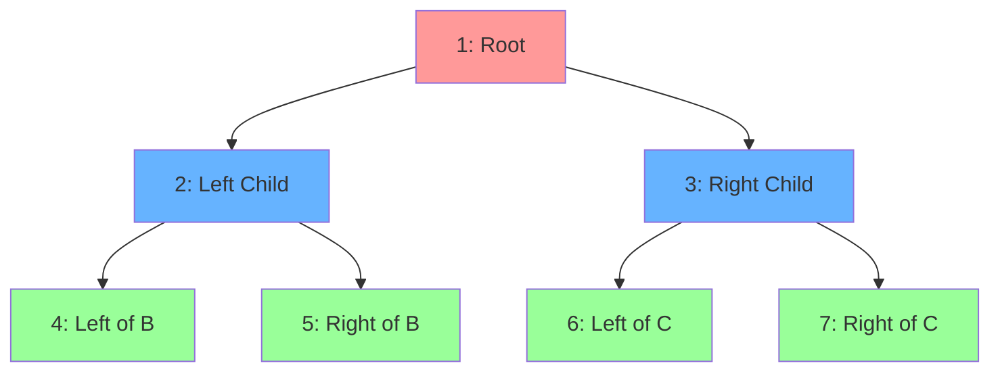
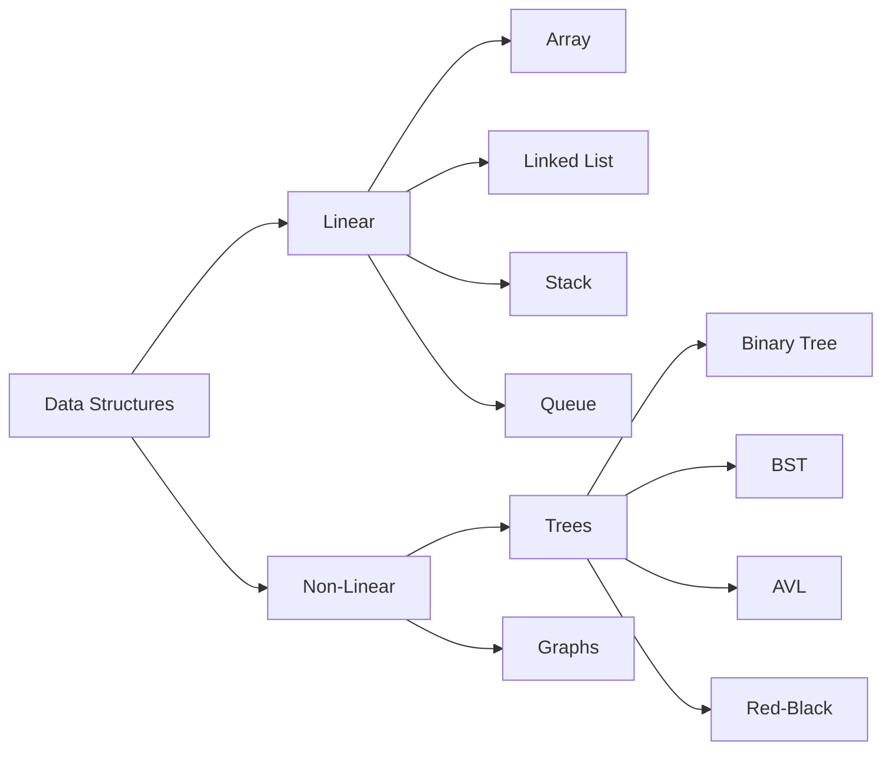
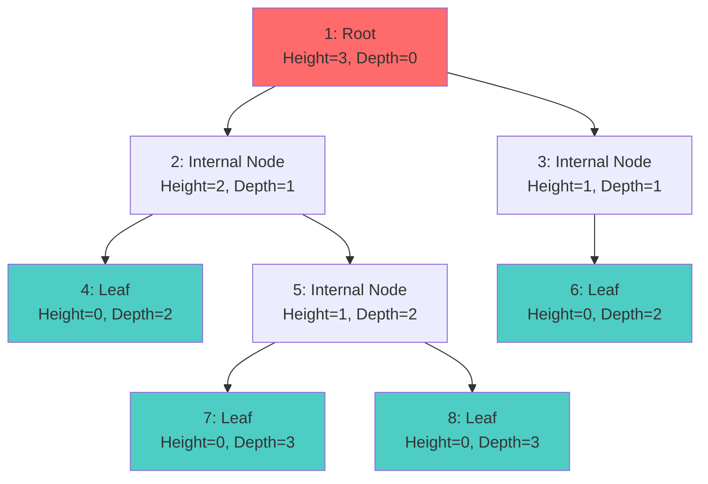
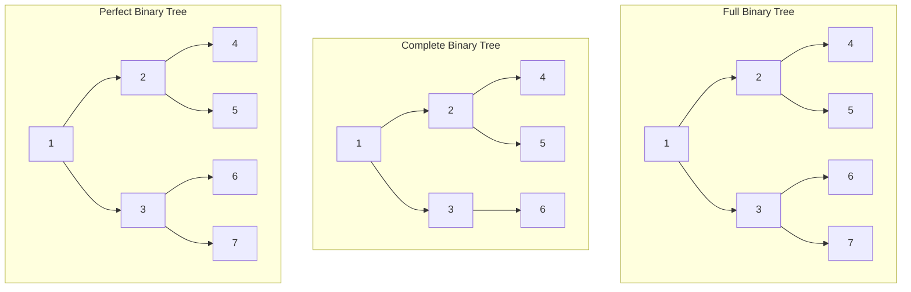
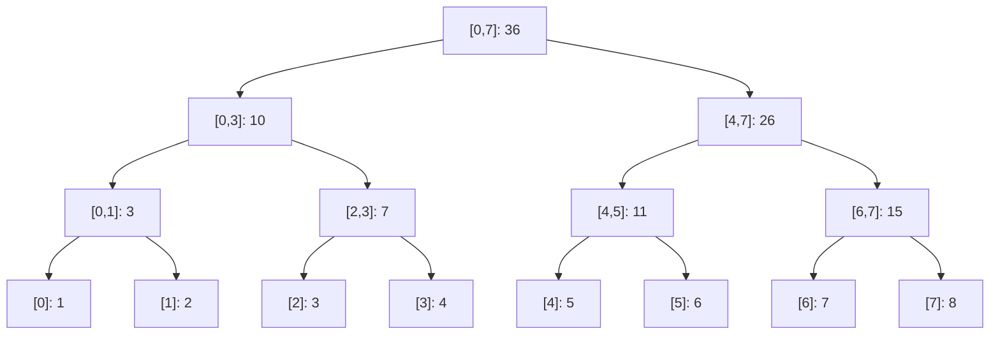
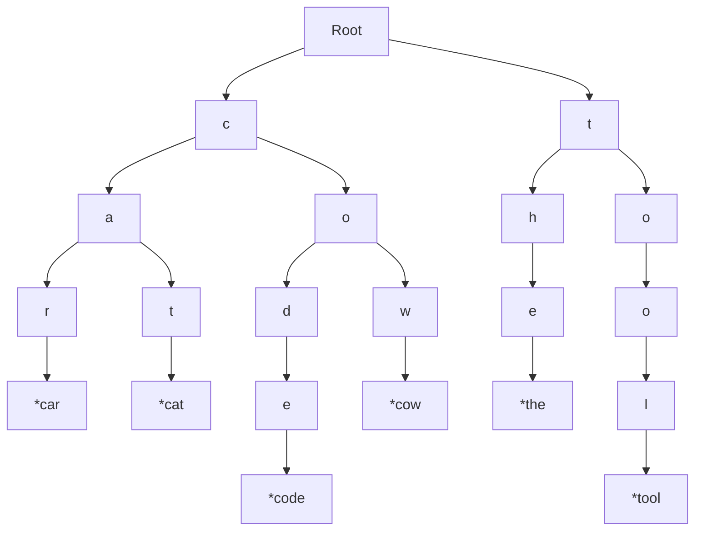
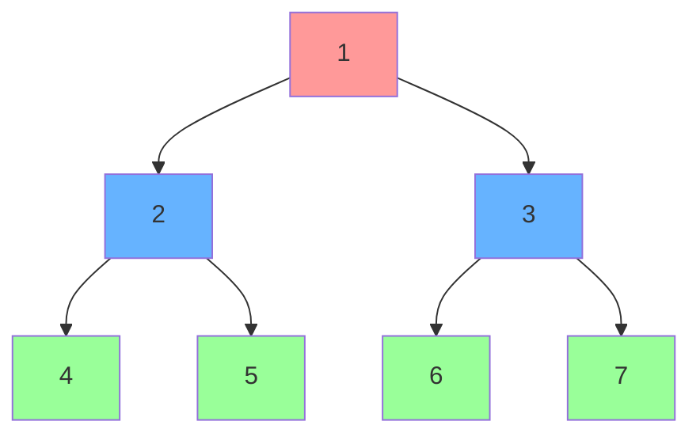
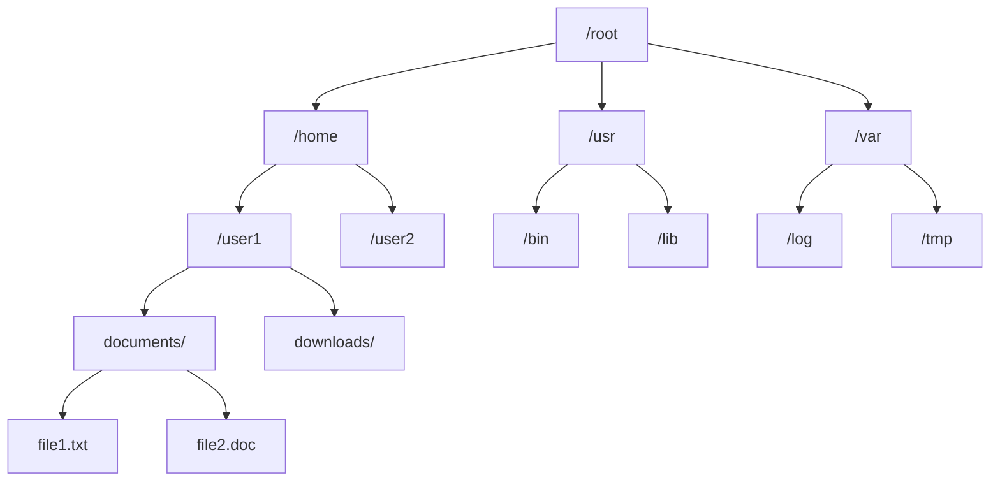

# Comprehensive Tutorial on Tree Data Structures (From Basics to Advanced)

## Table of Contents

1. **Introduction to Trees** - _Fundamental concepts, properties, and why trees matter in computer science_
2. **Tree Terminologies** - _Essential vocabulary and mathematical definitions with visual examples_
3. **Types of Trees** - _Comprehensive overview of specialized tree structures and their applications_

   - **Binary Trees** - _Basic tree structure with at most two children per node_
   - **Binary Search Trees** - _Ordered binary trees enabling efficient search operations_
   - **AVL Trees** - _Self-balancing BSTs maintaining logarithmic height_
   - **Red-Black Trees** - _Balanced trees used in STL containers and system libraries_
   - **Segment Trees** - _Range query trees for efficient array operations_
   - **Fenwick Trees (Binary Indexed Trees)** - _Compact trees for prefix sum queries_
   - **Trie (Prefix Tree)** - _String storage trees for pattern matching and autocomplete_
   - **N-ary Trees** - _General trees with unlimited children per node_
   - **B-Trees** - _Multi-way search trees optimized for disk storage and databases_

4. **Tree Traversals** - _Methods for visiting every node in a tree systematically_

   - **Depth-First Search (DFS)** - _Recursive exploration going deep before wide_

     - **Inorder** - _Left → Root → Right traversal, gives sorted order for BSTs_
     - **Preorder** - _Root → Left → Right traversal, useful for tree copying_
     - **Postorder** - _Left → Right → Root traversal, ideal for tree deletion_

   - **Breadth-First Search (BFS) / Level Order** - _Level-by-level traversal using queues_

5. **Tree Representation in Code** - _Different ways to implement trees in memory_
6. **Common Tree Problems (with C++ Code Examples)** - _Essential interview and competitive programming problems_
7. **Advanced Tree Topics** - _Complex algorithms and techniques for specialized applications_

   - **Lowest Common Ancestor (LCA)** - _Finding deepest common ancestor of two nodes_
   - **Tree Diameter** - _Computing longest path between any two nodes_
   - **Euler Tour** - _Flattening trees for range queries and subtree operations_
   - **Binary Lifting** - _Preprocessing technique for fast ancestor queries_
   - **Heavy Light Decomposition (HLD)** - _Path decomposition for complex tree queries_

8. **Practical Use-Cases of Trees** - _Real-world applications across different domains_
9. **Tips to Master Trees** - _Learning strategies, practice methodology, and interview preparation_
10. **Conclusion** - _Summary and roadmap for continued learning_

---

## 1. Introduction to Trees

A **Tree** is a hierarchical data structure consisting of nodes, with a single node as the root and potentially many levels of additional nodes that form a tree-like structure. Trees are a specialized case of graphs without cycles and with a specific direction (parent to child).

### Understanding Trees in Computer Science

Trees are one of the most fundamental and versatile data structures in computer science, serving as the backbone for numerous algorithms and systems. Unlike linear data structures such as arrays or linked lists, trees represent hierarchical relationships between data elements, making them ideal for modeling real-world scenarios where data has natural parent-child relationships.

The power of trees lies in their ability to organize data in a way that supports efficient searching, insertion, and deletion operations. When properly balanced, many tree operations can be performed in O(log n) time complexity, making them significantly more efficient than linear data structures for large datasets.

### Why Trees Are Important

**1. Natural Hierarchy Representation**: Trees mirror many real-world hierarchical structures - from organizational charts to file systems, from family trees to decision-making processes. This natural mapping makes trees intuitive to understand and work with.

**2. Efficient Operations**: Well-balanced trees provide logarithmic time complexity for search, insertion, and deletion operations. This efficiency is crucial when dealing with large datasets where linear search would be impractical.

**3. Versatile Applications**: Trees form the foundation for numerous advanced data structures and algorithms, including databases (B-trees), networks (spanning trees), artificial intelligence (decision trees), and compiler design (syntax trees).

**4. Memory Organization**: Trees help organize memory efficiently, enabling features like garbage collection, memory management, and hierarchical storage systems.

### Key Properties of Trees:

Understanding these fundamental properties is crucial for working with trees effectively:

- **Connected**: There is exactly one path between any two nodes. This means you can reach any node from any other node by following a unique sequence of edges.
- **Acyclic**: No cycles exist in the tree. This prevents infinite loops during traversal and ensures that each node has a unique path from the root.
- **Hierarchical**: Clear parent-child relationships exist between nodes. Each node (except the root) has exactly one parent, but can have multiple children.
- **N-1 edges**: A tree with N nodes has exactly N-1 edges. This is a fundamental property that distinguishes trees from other graph structures.
- **Single root**: Only one node has no parent. The root serves as the entry point for all tree operations and defines the tree's hierarchy.

### Mathematical Properties:

- For a binary tree with height h: Maximum nodes = 2^(h+1) - 1
- Minimum height for N nodes: ⌊log₂(N)⌋
- Maximum height for N nodes: N-1 (degenerate tree)

> **Real-life examples**: File systems, HTML DOM tree, organization charts, family trees, decision processes, compiler parse trees.

### Mermaid Chart - Example Binary Tree



### Tree vs Other Data Structures Comparison



---

## 2. Tree Terminologies

_Essential vocabulary and mathematical definitions with visual examples._

Mastering tree terminology is crucial for understanding tree algorithms and communicating effectively about tree structures. Each term represents a fundamental concept that appears repeatedly in tree-based algorithms and data structures.

### Basic Terminology with Visual Examples



### Detailed Definitions:

Understanding these core concepts is essential for working with any tree-based algorithm or data structure:

- **Root**: The topmost node with no parent. Every tree has exactly one root. The root serves as the starting point for all tree traversals and defines the tree's orientation. In many algorithms, we begin processing from the root and work our way down to the leaves.

- **Node**: Basic unit containing data and references to children. Each node stores the actual data we want to organize and maintains connections to its child nodes. The structure of a node varies depending on the tree type - binary tree nodes have at most two children, while n-ary tree nodes can have any number of children.

- **Edge**: Connection/link between parent and child nodes. Edges represent the hierarchical relationships in the tree. The total number of edges in a tree is always exactly one less than the number of nodes (n-1 edges for n nodes).

- **Leaf Node (External Node)**: Node with no children (degree = 0). Leaf nodes represent the endpoints of the tree and are often where we store the actual data in specialized trees like B-trees. Many tree algorithms use leaf nodes as base cases for recursion.

- **Internal Node**: Node with at least one child (degree ≥ 1). Internal nodes serve as decision points or routing nodes in tree structures. They help organize and direct the flow of data within the tree hierarchy.

- **Parent**: Node directly above another node in hierarchy. The parent-child relationship is fundamental to tree structure. Each node (except the root) has exactly one parent, creating the acyclic property that defines trees.

- **Child**: Node directly below another node in hierarchy. A node can have multiple children, and the number of children determines the node's degree. The arrangement of children affects tree balance and performance.

- **Siblings**: Nodes sharing the same parent. Sibling relationships are important in tree balancing algorithms and certain traversal methods. Siblings are at the same depth level in the tree.

- **Ancestors**: All nodes on path from root to given node. The ancestor relationship is crucial for many tree algorithms, especially those dealing with lowest common ancestors (LCA) and path-finding problems.

- **Descendants**: All nodes in subtree rooted at given node. Understanding descendants is important for calculating subtree sizes and implementing efficient tree operations.

- **Subtree**: Tree consisting of a node and all its descendants. Subtrees are fundamental to recursive tree algorithms, as many tree problems can be broken down into subproblems on subtrees.

### Measurement Terminology:

These measurements are critical for analyzing tree performance and implementing balanced tree structures:

- **Depth of a node**: Number of edges from root to the node.

  - Root has depth 0
  - Formula: depth(parent) + 1
  - **Importance**: Depth determines how many steps are needed to reach a node from the root. In balanced trees, the maximum depth is O(log n), ensuring efficient operations.

- **Height of a node**: Number of edges from node to its deepest leaf.
  - Leaves have height 0
  - Formula: max(height(children)) + 1
  - **Importance**: Height is crucial for tree balancing. The height of the root determines the worst-case time complexity for tree operations.
- **Height of tree**: Height of the root node.
- **Level**: All nodes at same depth form a level.
- **Degree of node**: Number of children a node has.
- **Degree of tree**: Maximum degree among all nodes.

### Size and Structure Terminology:

- **Size**: Total number of nodes in tree.
- **Width**: Maximum number of nodes at any level.
- **Diameter**: Longest path between any two nodes.
- **Path**: Sequence of nodes connected by edges.
- **Complete Tree**: All levels filled except possibly last level.
- **Full Tree**: Every node has either 0 or 2 children.
- **Perfect Tree**: All internal nodes have 2 children, all leaves at same level.

### Tree Properties Examples:

```cpp
// Example tree node structure with additional properties
struct TreeNode {
    int data;
    TreeNode* left;
    TreeNode* right;
    TreeNode* parent;  // For easier traversal
    int height;        // Cached height
    int size;          // Subtree size

    TreeNode(int val) : data(val), left(nullptr), right(nullptr),
                       parent(nullptr), height(0), size(1) {}
};

// Function to calculate and demonstrate properties
void calculateProperties(TreeNode* root) {
    if (!root) return;

    // Calculate height (bottom-up)
    int leftHeight = root->left ? root->left->height : -1;
    int rightHeight = root->right ? root->right->height : -1;
    root->height = max(leftHeight, rightHeight) + 1;

    // Calculate size (bottom-up)
    int leftSize = root->left ? root->left->size : 0;
    int rightSize = root->right ? root->right->size : 0;
    root->size = leftSize + rightSize + 1;
}
```

---

## 3. Types of Trees

### 3.1 Binary Tree

_A foundational tree structure where each node has at most two children, serving as the basis for more specialized trees._

A binary tree is one of the most fundamental tree structures where each node has **at most two children**, typically referred to as left and right child. This constraint creates a simple yet powerful structure that serves as the foundation for many advanced tree types and algorithms.

#### Understanding Binary Trees

**Why Binary Trees Matter:**
Binary trees strike an optimal balance between simplicity and functionality. The binary constraint (at most two children) makes them:

1. **Easy to Implement**: Simple recursive algorithms work naturally with binary structures
2. **Memory Efficient**: Each node needs only two child pointers, minimizing memory overhead
3. **Algorithmically Rich**: Many efficient algorithms are designed specifically for binary trees
4. **Naturally Recursive**: Problems can be easily divided into left and right subproblems

**Binary Tree Variants:**

Understanding different types of binary trees is crucial for choosing the right structure for your application:

- **Full Binary Tree**: Every node has either 0 or 2 children. No node has exactly 1 child. This property ensures optimal space utilization and balanced recursive calls.

- **Complete Binary Tree**: All levels are filled except possibly the last level, which is filled from left to right. Complete binary trees can be efficiently stored in arrays and are used in heap implementations.

- **Perfect Binary Tree**: All internal nodes have exactly 2 children, and all leaves are at the same level. Perfect binary trees have exactly 2^h - 1 nodes where h is the height, making them extremely balanced.

- **Balanced Binary Tree**: The height difference between left and right subtrees of any node is at most 1. Balanced trees ensure O(log n) operation times.

#### When to Use Binary Trees:

1. **Hierarchical Data**: When your data naturally forms a hierarchy with at most two branches at each level
2. **Search Operations**: Binary search trees provide efficient O(log n) search times when balanced
3. **Expression Trees**: Mathematical expressions naturally map to binary trees (operators have at most two operands)
4. **Decision Trees**: Binary decisions (yes/no, true/false) map perfectly to binary tree structures

A tree where each node has **at most two children**, typically referred to as left and right child.

#### Binary Tree Types Visualization:



#### Binary Tree Implementation:

```cpp
#include <iostream>
#include <queue>
#include <vector>
using namespace std;

class BinaryTree {
private:
    struct Node {
        int data;
        Node* left;
        Node* right;

        Node(int val) : data(val), left(nullptr), right(nullptr) {}
    };

    Node* root;

public:
    BinaryTree() : root(nullptr) {}

    // Insert level-wise (for complete binary tree)
    void insert(int val) {
        Node* newNode = new Node(val);
        if (!root) {
            root = newNode;
            return;
        }

        queue<Node*> q;
        q.push(root);

        while (!q.empty()) {
            Node* curr = q.front();
            q.pop();

            if (!curr->left) {
                curr->left = newNode;
                return;
            } else if (!curr->right) {
                curr->right = newNode;
                return;
            } else {
                q.push(curr->left);
                q.push(curr->right);
            }
        }
    }

    // Check if tree is full
    bool isFull(Node* node = nullptr) {
        if (!node) node = root;
        if (!node) return true;

        if ((!node->left && node->right) || (node->left && !node->right))
            return false;

        return isFull(node->left) && isFull(node->right);
    }

    // Check if tree is complete
    bool isComplete() {
        if (!root) return true;

        queue<Node*> q;
        q.push(root);
        bool flag = false;

        while (!q.empty()) {
            Node* curr = q.front();
            q.pop();

            if (curr->left) {
                if (flag) return false;
                q.push(curr->left);
            } else {
                flag = true;
            }

            if (curr->right) {
                if (flag) return false;
                q.push(curr->right);
            } else {
                flag = true;
            }
        }
        return true;
    }

    Node* getRoot() { return root; }
};
```

**🔍 Code Explanation:**

**Insert Method - Level Order Insertion Approach:**

```cpp
void insert(int val) {
    Node* newNode = new Node(val);  // Create new node
    if (!root) {                    // If tree is empty
        root = newNode;             // Make it root
        return;
    }

    queue<Node*> q;                 // BFS queue for level-order traversal
    q.push(root);                   // Start from root

    while (!q.empty()) {
        Node* curr = q.front();     // Get current node
        q.pop();

        // Try to insert as left child first
        if (!curr->left) {
            curr->left = newNode;   // Insert here and done
            return;
        }
        // Then try right child
        else if (!curr->right) {
            curr->right = newNode;  // Insert here and done
            return;
        }
        // Both children exist, add them to queue for next level
        else {
            q.push(curr->left);     // Add left child to queue
            q.push(curr->right);    // Add right child to queue
        }
    }
}
```

**Why This Approach Works:**

1. **Level-order insertion**: Ensures the tree remains complete
2. **BFS traversal**: Visits nodes level by level, left to right
3. **First available spot**: Finds the first available position for insertion
4. **Complete tree property**: Maintains the structure where all levels are filled except possibly the last

**isFull Method - Recursive Validation:**

```cpp
bool isFull(Node* node = nullptr) {
    if (!node) node = root;         // Default to root if no node specified
    if (!node) return true;         // Empty tree is considered full

    // Check if node has exactly 0 or 2 children (full binary tree property)
    if ((!node->left && node->right) || (node->left && !node->right))
        return false;               // Node has exactly 1 child - not full

    // Recursively check both subtrees
    return isFull(node->left) && isFull(node->right);
}
```

**Algorithm Logic:**

1. **Base case**: Empty nodes are considered "full"
2. **Invalid case**: Any node with exactly one child violates full tree property
3. **Recursive case**: Both subtrees must be full for tree to be full
4. **Full tree definition**: Every node has either 0 or 2 children

**isComplete Method - Level Order with Flag:**

```cpp
bool isComplete() {
    if (!root) return true;         // Empty tree is complete

    queue<Node*> q;
    q.push(root);
    bool flag = false;              // Flag to track if we've seen a "gap"

    while (!q.empty()) {
        Node* curr = q.front();
        q.pop();

        if (curr->left) {
            if (flag) return false; // Found child after gap - not complete
            q.push(curr->left);
        } else {
            flag = true;            // Mark that we've seen a gap
        }

        if (curr->right) {
            if (flag) return false; // Found child after gap - not complete
            q.push(curr->right);
        } else {
            flag = true;            // Mark that we've seen a gap
        }
    }
    return true;
}
```

**Complete Tree Logic:**

1. **Level-order traversal**: Process nodes left to right, level by level
2. **Gap detection**: Once we see a missing child, set flag = true
3. **Validation rule**: After seeing a gap, no more children should exist
4. **Complete property**: All levels filled except last level (filled left to right)

````

### 3.2 Binary Search Tree (BST)

_An ordered binary tree that maintains the property: left < root < right, enabling efficient O(log n) search operations._

A Binary Search Tree (BST) is a specialized binary tree that maintains a crucial ordering property: **Left subtree < Root < Right subtree**. This simple yet powerful constraint transforms a basic binary tree into an efficient data structure for searching, insertion, and deletion operations.

#### Understanding the BST Property

**The BST Invariant:**
For every node in a BST:

- All values in the left subtree are less than the node's value
- All values in the right subtree are greater than the node's value
- Both left and right subtrees are also valid BSTs

This property must hold for every single node in the tree, not just the root. This recursive definition is what makes BSTs so powerful and elegant.

#### Why BSTs Are Powerful

**1. Efficient Search**: The ordering property allows us to eliminate half of the remaining nodes at each step during search, achieving O(log n) time complexity in balanced trees.

**2. In-order Traversal Gives Sorted Data**: When we traverse a BST in in-order (left-root-right), we get the elements in sorted order. This property is fundamental to many BST algorithms.

**3. Dynamic Operations**: Unlike sorted arrays, BSTs support efficient insertion and deletion while maintaining the sorted order.

**4. Range Queries**: BSTs naturally support range queries, finding all elements between two values efficiently.

#### BST Operations Explained

**Search Operation:**

- Start at root, compare target with current node
- If equal, found; if less, go left; if greater, go right
- Continue until found or reach null pointer
- Time Complexity: O(h) where h is height

**Insertion Operation:**

- Similar to search, but when we reach a null pointer, we insert the new node there
- The insertion point is determined by the BST property
- No restructuring needed (unlike balanced trees)

**Deletion Operation:**
Three cases to handle:

1. **No children (leaf)**: Simply remove the node
2. **One child**: Replace node with its child
3. **Two children**: Replace with either inorder predecessor or successor

#### When BSTs Become Inefficient

The major weakness of basic BSTs is that they can become **skewed** (essentially a linked list) if data is inserted in sorted order. In worst case:

- Height becomes O(n) instead of O(log n)
- All operations degrade to O(n) time complexity
- This is why self-balancing trees (AVL, Red-Black) were developed

A binary tree with ordering property: **Left subtree < Root < Right subtree**

#### BST Visualization:

```mermaid
graph TD
    A[50] --> B[30]
    A --> C[70]
    B --> D[20]
    B --> E[40]
    C --> F[60]
    C --> G[80]
    D --> H[10]
    E --> I[35]
    E --> J[45]

    style A fill:#ff9999
    style B fill:#99ccff
    style C fill:#99ccff
````

#### Complete BST Implementation:

```cpp
class BST {
private:
    struct Node {
        int data;
        Node* left;
        Node* right;

        Node(int val) : data(val), left(nullptr), right(nullptr) {}
    };

    Node* root;

    Node* insertRec(Node* node, int val) {
        if (!node) return new Node(val);

        if (val < node->data)
            node->left = insertRec(node->left, val);
        else if (val > node->data)
            node->right = insertRec(node->right, val);

        return node;
    }

    Node* deleteRec(Node* node, int val) {
        if (!node) return nullptr;

        if (val < node->data) {
            node->left = deleteRec(node->left, val);
        } else if (val > node->data) {
            node->right = deleteRec(node->right, val);
        } else {
            // Node to delete found
            if (!node->left) {
                Node* temp = node->right;
                delete node;
                return temp;
            } else if (!node->right) {
                Node* temp = node->left;
                delete node;
                return temp;
            }

            // Node has two children
            Node* temp = findMin(node->right);
            node->data = temp->data;
            node->right = deleteRec(node->right, temp->data);
        }
        return node;
    }

    Node* findMin(Node* node) {
        while (node && node->left)
            node = node->left;
        return node;
    }

    bool searchRec(Node* node, int val) {
        if (!node) return false;
        if (node->data == val) return true;

        if (val < node->data)
            return searchRec(node->left, val);
        else
            return searchRec(node->right, val);
    }

public:
    BST() : root(nullptr) {}

    void insert(int val) { root = insertRec(root, val); }
    void remove(int val) { root = deleteRec(root, val); }
    bool search(int val) { return searchRec(root, val); }

    // Time Complexities:
    // Average: O(log n) for search, insert, delete
    // Worst: O(n) for skewed tree
};
```

**🔍 BST Code Explanation:**

**1. Search Operation - Binary Search Approach:**

```cpp
bool searchRec(Node* node, int val) {
    if (!node) return false;        // Base case: not found
    if (node->data == val) return true;  // Found the value

    if (val < node->data)           // Search left subtree
        return searchRec(node->left, val);
    else                            // Search right subtree
        return searchRec(node->right, val);
}
```

**Search Algorithm Logic:**

1. **Base cases**: Handle null nodes (not found) and exact matches
2. **BST property utilization**: Use ordering to eliminate half the tree
3. **Recursive descent**: Go left if target < current, right if target > current
4. **Time complexity**: O(log n) average, O(n) worst case (skewed tree)

**2. Insert Operation - Recursive Placement:**

```cpp
Node* insertRec(Node* node, int val) {
    if (!node) return new Node(val);    // Base case: create new node

    if (val < node->data)               // Insert in left subtree
        node->left = insertRec(node->left, val);
    else if (val > node->data)          // Insert in right subtree
        node->right = insertRec(node->right, val);

    return node;                        // Return current node (unchanged)
}
```

**Insert Algorithm Strategy:**

1. **Find insertion point**: Traverse tree using BST property
2. **Create new node**: When we reach null position, insert new node
3. **Maintain BST property**: Left < Parent < Right at every level
4. **No rebalancing**: Simple insertion, may create skewed tree

**3. Delete Operation - Three Cases Handling:**

```cpp
Node* deleteRec(Node* node, int val) {
    if (!node) return nullptr;          // Base case: value not found

    // Navigate to the node to delete
    if (val < node->data) {
        node->left = deleteRec(node->left, val);
    } else if (val > node->data) {
        node->right = deleteRec(node->right, val);
    } else {
        // Found the node to delete - handle three cases

        // Case 1: No left child (includes leaf node)
        if (!node->left) {
            Node* temp = node->right;
            delete node;
            return temp;                // Return right child (may be null)
        }
        // Case 2: No right child
        else if (!node->right) {
            Node* temp = node->left;
            delete node;
            return temp;                // Return left child
        }

        // Case 3: Two children - use inorder successor
        Node* temp = findMin(node->right);      // Find inorder successor
        node->data = temp->data;                // Copy successor's data
        node->right = deleteRec(node->right, temp->data);  // Delete successor
    }
    return node;
}
```

**Delete Algorithm - Three Cases:**

**Case 1: Leaf Node (No Children)**

- Simply remove the node
- Parent's pointer becomes null

**Case 2: One Child**

- Replace node with its child
- Maintain BST property (child is correctly positioned)

**Case 3: Two Children (Most Complex)**

- Cannot simply remove node (would break tree structure)
- Find inorder successor (smallest value in right subtree)
- Replace node's data with successor's data
- Delete the successor (which has at most one child)

**4. FindMin Helper - Leftmost Node:**

```cpp
Node* findMin(Node* node) {
    while (node && node->left)          // Keep going left
        node = node->left;
    return node;                        // Leftmost node = minimum value
}
```

**FindMin Logic:**

1. **BST property**: Smallest value is always leftmost node
2. **Iterative traversal**: Keep going left until no left child
3. **Used in deletion**: Finds inorder successor for two-children case
4. **Time complexity**: O(log n) average, O(n) worst case

````

### 3.3 AVL Tree (Adelson-Velsky and Landis)

_A self-balancing BST where the height difference between left and right subtrees is at most 1, guaranteeing O(log n) operations._

AVL Trees represent one of the most elegant solutions to the BST balancing problem. Named after mathematicians Adelson-Velsky and Landis, AVL trees maintain the BST property while ensuring that the tree remains balanced through automatic rotations.

#### The AVL Balance Condition

**Balance Factor**: For any node, the balance factor is defined as:
`Balance Factor = Height(Left Subtree) - Height(Right Subtree)`

**AVL Property**: The balance factor of every node must be -1, 0, or +1.

This seemingly simple constraint has profound implications:

- **Guaranteed O(log n) height**: The height of an AVL tree with n nodes is always O(log n)
- **Worst-case height**: Approximately 1.44 \* log₂(n), which is very close to optimal
- **Automatic rebalancing**: The tree fixes itself after each insertion/deletion

#### Understanding AVL Rotations

When the AVL property is violated (balance factor becomes -2 or +2), the tree performs rotations to restore balance. There are four types of rotations:

**1. Left-Left (LL) Case - Right Rotation:**

- Occurs when left subtree of left child is taller
- Heavy subtree is on the left side of left child
- Solution: Single right rotation

**2. Right-Right (RR) Case - Left Rotation:**

- Occurs when right subtree of right child is taller
- Heavy subtree is on the right side of right child
- Solution: Single left rotation

**3. Left-Right (LR) Case - Left-Right Rotation:**

- Occurs when right subtree of left child is taller
- Heavy subtree is on the right side of left child
- Solution: Left rotation on left child, then right rotation on root

**4. Right-Left (RL) Case - Right-Left Rotation:**

- Occurs when left subtree of right child is taller
- Heavy subtree is on the left side of right child
- Solution: Right rotation on right child, then left rotation on root

#### Why AVL Trees Matter

**1. Predictable Performance**: Unlike basic BSTs, AVL trees guarantee O(log n) operations regardless of input order.

**2. Real-time Systems**: The guaranteed performance makes AVL trees suitable for real-time applications where worst-case timing is critical.

**3. Read-Heavy Applications**: AVL trees are more strictly balanced than Red-Black trees, making them ideal for applications with frequent searches but fewer insertions/deletions.

**4. Historical Importance**: AVL trees were the first self-balancing binary search trees, paving the way for other balanced tree structures.

#### Trade-offs of AVL Trees

**Advantages:**

- Strictly balanced (better for search-heavy workloads)
- Guaranteed O(log n) operations
- Simple conceptual model

**Disadvantages:**

- More rotations needed during insertion/deletion compared to Red-Black trees
- Higher overhead for maintaining balance information
- Less efficient for write-heavy applications

Self-balancing BST where height difference between left and right subtrees ≤ 1.

#### AVL Tree Rotations:

```mermaid
graph TD
    subgraph "Right Rotation (LL Case)"
    A[y] --> B[x]
    A --> C[T3]
    B --> D[T1]
    B --> E[T2]
    end

    subgraph "After Right Rotation"
    F[x] --> G[T1]
    F --> H[y]
    H --> I[T2]
    H --> J[T3]
    end
````

#### AVL Tree Implementation:

```cpp
class AVLTree {
private:
    struct Node {
        int data;
        Node* left;
        Node* right;
        int height;

        Node(int val) : data(val), left(nullptr), right(nullptr), height(1) {}
    };

    Node* root;

    int getHeight(Node* node) {
        return node ? node->height : 0;
    }

    int getBalance(Node* node) {
        return node ? getHeight(node->left) - getHeight(node->right) : 0;
    }

    void updateHeight(Node* node) {
        if (node)
            node->height = 1 + max(getHeight(node->left), getHeight(node->right));
    }

    Node* rightRotate(Node* y) {
        Node* x = y->left;
        Node* T2 = x->right;

        x->right = y;
        y->left = T2;

        updateHeight(y);
        updateHeight(x);

        return x;
    }

    Node* leftRotate(Node* x) {
        Node* y = x->right;
        Node* T2 = y->left;

        y->left = x;
        x->right = T2;

        updateHeight(x);
        updateHeight(y);

        return y;
    }

    Node* insertRec(Node* node, int val) {
        // Step 1: Normal BST insertion
        if (!node) return new Node(val);

        if (val < node->data)
            node->left = insertRec(node->left, val);
        else if (val > node->data)
            node->right = insertRec(node->right, val);
        else
            return node; // Duplicate values not allowed

        // Step 2: Update height
        updateHeight(node);

        // Step 3: Get balance factor
        int balance = getBalance(node);

        // Step 4: Perform rotations if unbalanced
        // Left Left Case
        if (balance > 1 && val < node->left->data)
            return rightRotate(node);

        // Right Right Case
        if (balance < -1 && val > node->right->data)
            return leftRotate(node);

        // Left Right Case
        if (balance > 1 && val > node->left->data) {
            node->left = leftRotate(node->left);
            return rightRotate(node);
        }

        // Right Left Case
        if (balance < -1 && val < node->right->data) {
            node->right = rightRotate(node->right);
            return leftRotate(node);
        }

        return node;
    }

public:
    AVLTree() : root(nullptr) {}

    void insert(int val) { root = insertRec(root, val); }

    // Guaranteed O(log n) operations due to balancing
};
```

**🔍 AVL Tree Code Explanation:**

**1. Height and Balance Management:**

```cpp
int getHeight(Node* node) {
    return node ? node->height : 0;     // Return 0 for null nodes
}

int getBalance(Node* node) {
    return node ? getHeight(node->left) - getHeight(node->right) : 0;
}

void updateHeight(Node* node) {
    if (node)
        node->height = 1 + max(getHeight(node->left), getHeight(node->right));
}
```

**Height Management Strategy:**

1. **Cached heights**: Each node stores its height for O(1) access
2. **Balance factor calculation**: Left height - Right height
3. **Height update**: Always 1 + max of children's heights
4. **Null handling**: Null nodes have height 0

**2. Rotation Operations - Tree Restructuring:**

**Right Rotation (LL Case):**

```cpp
Node* rightRotate(Node* y) {
    Node* x = y->left;          // x becomes new root
    Node* T2 = x->right;        // Save x's right subtree

    // Perform rotation
    x->right = y;               // y becomes right child of x
    y->left = T2;               // T2 becomes left child of y

    // Update heights (y first, then x)
    updateHeight(y);
    updateHeight(x);

    return x;                   // x is new root of this subtree
}
```

**Left Rotation (RR Case):**

```cpp
Node* leftRotate(Node* x) {
    Node* y = x->right;         // y becomes new root
    Node* T2 = y->left;         // Save y's left subtree

    // Perform rotation
    y->left = x;                // x becomes left child of y
    x->right = T2;              // T2 becomes right child of x

    // Update heights (x first, then y)
    updateHeight(x);
    updateHeight(y);

    return y;                   // y is new root of this subtree
}
```

**3. AVL Insertion Algorithm - 4-Step Process:**

```cpp
Node* insertRec(Node* node, int val) {
    // Step 1: Normal BST insertion
    if (!node) return new Node(val);

    if (val < node->data)
        node->left = insertRec(node->left, val);
    else if (val > node->data)
        node->right = insertRec(node->right, val);
    else
        return node;    // No duplicates allowed

    // Step 2: Update height of current node
    updateHeight(node);

    // Step 3: Calculate balance factor
    int balance = getBalance(node);

    // Step 4: Check for imbalance and fix with rotations

    // Left-Left Case (balance > 1 and insertion in left subtree)
    if (balance > 1 && val < node->left->data)
        return rightRotate(node);

    // Right-Right Case (balance < -1 and insertion in right subtree)
    if (balance < -1 && val > node->right->data)
        return leftRotate(node);

    // Left-Right Case (balance > 1 and insertion in right of left subtree)
    if (balance > 1 && val > node->left->data) {
        node->left = leftRotate(node->left);    // First: left rotate left child
        return rightRotate(node);               // Then: right rotate current node
    }

    // Right-Left Case (balance < -1 and insertion in left of right subtree)
    if (balance < -1 && val < node->right->data) {
        node->right = rightRotate(node->right); // First: right rotate right child
        return leftRotate(node);                // Then: left rotate current node
    }

    return node;    // Return unchanged node if balanced
}
```

**AVL Insertion Logic:**

**Four Imbalance Cases:**

1. **Left-Left (LL)**: Heavy left subtree, insertion in left of left child
   - Solution: Single right rotation
2. **Right-Right (RR)**: Heavy right subtree, insertion in right of right child
   - Solution: Single left rotation
3. **Left-Right (LR)**: Heavy left subtree, insertion in right of left child
   - Solution: Left rotation on left child, then right rotation on current
4. **Right-Left (RL)**: Heavy right subtree, insertion in left of right child
   - Solution: Right rotation on right child, then left rotation on current

**Why AVL Works:**

1. **Balance invariant**: |balance factor| ≤ 1 for every node
2. **Automatic rebalancing**: Rotations restore balance after insertion
3. **Height guarantee**: Tree height is always O(log n)
4. **BST property preservation**: Rotations maintain ordering property

````

### 3.4 Red-Black Tree

_A self-balancing BST with color-coded nodes that ensures balanced operations, widely used in STL containers and operating systems._

Self-balancing BST with color properties ensuring O(log n) operations.

#### Red-Black Properties:

1. Every node is either red or black
2. Root is always black
3. All leaves (NIL) are black
4. Red nodes have black children
5. All paths from node to descendant leaves have same number of black nodes

```cpp
enum Color { RED, BLACK };

class RedBlackTree {
private:
    struct Node {
        int data;
        Color color;
        Node* left;
        Node* right;
        Node* parent;

        Node(int val) : data(val), color(RED), left(nullptr),
                       right(nullptr), parent(nullptr) {}
    };

    Node* root;
    Node* NIL; // Sentinel node

public:
    RedBlackTree() {
        NIL = new Node(0);
        NIL->color = BLACK;
        root = NIL;
    }

    // Complex implementation with rotations and recoloring
    // Used in C++ STL map, set, multimap, multiset
};
````

### 3.5 Segment Tree

_A binary tree built on arrays to efficiently answer range queries (sum, min, max) and perform range updates in O(log n) time._

Used for efficient range queries and updates on arrays.

#### Segment Tree Visualization:



```cpp
class SegmentTree {
private:
    vector<int> tree;
    int n;

    void build(vector<int>& arr, int node, int start, int end) {
        if (start == end) {
            tree[node] = arr[start];
        } else {
            int mid = (start + end) / 2;
            build(arr, 2*node, start, mid);
            build(arr, 2*node+1, mid+1, end);
            tree[node] = tree[2*node] + tree[2*node+1];
        }
    }

    void updateRec(int node, int start, int end, int idx, int val) {
        if (start == end) {
            tree[node] = val;
        } else {
            int mid = (start + end) / 2;
            if (idx <= mid)
                updateRec(2*node, start, mid, idx, val);
            else
                updateRec(2*node+1, mid+1, end, idx, val);
            tree[node] = tree[2*node] + tree[2*node+1];
        }
    }

    int queryRec(int node, int start, int end, int l, int r) {
        if (r < start || end < l) return 0;
        if (l <= start && end <= r) return tree[node];

        int mid = (start + end) / 2;
        return queryRec(2*node, start, mid, l, r) +
               queryRec(2*node+1, mid+1, end, l, r);
    }

public:
    SegmentTree(vector<int>& arr) {
        n = arr.size();
        tree.resize(4 * n);
        build(arr, 1, 0, n-1);
    }

    void update(int idx, int val) {
        updateRec(1, 0, n-1, idx, val);
    }

    int query(int l, int r) {
        return queryRec(1, 0, n-1, l, r);
    }

    // Time Complexity: O(log n) for both query and update
};
```

### 3.6 Fenwick Tree (Binary Indexed Tree)

_A space-efficient tree structure that provides O(log n) prefix sum queries and point updates using clever bit manipulation._

Efficient data structure for prefix sum queries and point updates.

```cpp
class FenwickTree {
private:
    vector<int> tree;
    int n;

public:
    FenwickTree(int size) : n(size) {
        tree.assign(n + 1, 0);
    }

    void update(int idx, int delta) {
        for (++idx; idx <= n; idx += idx & -idx)
            tree[idx] += delta;
    }

    int query(int idx) {
        int sum = 0;
        for (++idx; idx > 0; idx -= idx & -idx)
            sum += tree[idx];
        return sum;
    }

    int rangeQuery(int l, int r) {
        return query(r) - query(l - 1);
    }

    // Time Complexity: O(log n) for both operations
    // Space Complexity: O(n)
};
```

### 3.7 Trie (Prefix Tree)

_A tree-like structure for storing strings where each path from root to leaf represents a word, enabling fast prefix-based searches._

Tree-like data structure for storing strings efficiently.

#### Trie Visualization:



```cpp
class Trie {
private:
    struct TrieNode {
        unordered_map<char, TrieNode*> children;
        bool isEnd;
        int count; // Number of words ending here

        TrieNode() : isEnd(false), count(0) {}
    };

    TrieNode* root;

public:
    Trie() : root(new TrieNode()) {}

    void insert(string word) {
        TrieNode* curr = root;
        for (char c : word) {
            if (curr->children.find(c) == curr->children.end())
                curr->children[c] = new TrieNode();
            curr = curr->children[c];
        }
        curr->isEnd = true;
        curr->count++;
    }

    bool search(string word) {
        TrieNode* curr = root;
        for (char c : word) {
            if (curr->children.find(c) == curr->children.end())
                return false;
            curr = curr->children[c];
        }
        return curr->isEnd;
    }

    bool startsWith(string prefix) {
        TrieNode* curr = root;
        for (char c : prefix) {
            if (curr->children.find(c) == curr->children.end())
                return false;
            curr = curr->children[c];
        }
        return true;
    }

    vector<string> getAllWordsWithPrefix(string prefix) {
        vector<string> result;
        TrieNode* curr = root;

        // Navigate to prefix end
        for (char c : prefix) {
            if (curr->children.find(c) == curr->children.end())
                return result;
            curr = curr->children[c];
        }

        // DFS to collect all words
        dfsCollect(curr, prefix, result);
        return result;
    }

private:
    void dfsCollect(TrieNode* node, string prefix, vector<string>& result) {
        if (node->isEnd) result.push_back(prefix);

        for (auto& [ch, child] : node->children) {
            dfsCollect(child, prefix + ch, result);
        }
    }
};
```

### 3.8 N-ary Tree

_A generalization of binary trees where each node can have any number of children, useful for hierarchical data representation._

Tree where each node can have more than two children.

```cpp
class NaryTree {
private:
    struct Node {
        int data;
        vector<Node*> children;

        Node(int val) : data(val) {}
    };

    Node* root;

public:
    // Traversal methods
    void preorder(Node* node, vector<int>& result) {
        if (!node) return;
        result.push_back(node->data);
        for (Node* child : node->children)
            preorder(child, result);
    }

    void postorder(Node* node, vector<int>& result) {
        if (!node) return;
        for (Node* child : node->children)
            postorder(child, result);
        result.push_back(node->data);
    }

    void levelOrder(Node* root) {
        if (!root) return;
        queue<Node*> q;
        q.push(root);

        while (!q.empty()) {
            Node* curr = q.front();
            q.pop();
            cout << curr->data << " ";

            for (Node* child : curr->children)
                q.push(child);
        }
    }
};
```

### 3.9 B-Trees

_Multi-way search trees designed for disk storage systems, keeping data sorted and allowing searches, insertions, and deletions in logarithmic time._

Self-balancing search tree optimized for systems with large blocks of data.

#### B-Tree Properties:

- All leaves at same level
- Minimum degree t: Every node (except root) has ≥ t-1 keys
- Every node has ≤ 2t-1 keys
- Used in databases and file systems

```cpp
class BTree {
private:
    struct BTreeNode {
        vector<int> keys;
        vector<BTreeNode*> children;
        bool isLeaf;
        int degree;

        BTreeNode(int t, bool leaf) : degree(t), isLeaf(leaf) {
            keys.reserve(2*t - 1);
            children.reserve(2*t);
        }
    };

    BTreeNode* root;
    int minDegree;

public:
    BTree(int t) : minDegree(t), root(nullptr) {}

    // Complex implementation for insertion, deletion, search
    // Guarantees O(log n) operations even for very large datasets
};
```

---

## 4. Tree Traversals

_Systematic methods for visiting every node in a tree exactly once, each serving different purposes and applications._

Tree traversal is the fundamental operation of visiting each node in a tree data structure exactly once in a specific order. The choice of traversal method depends on the problem requirements and the type of processing needed at each node.

### Understanding Tree Traversal Fundamentals

**Why Traversal Matters:**
Tree traversal is essential because:

1. **Data Processing**: We need systematic ways to process all data in the tree
2. **Search Operations**: Finding specific nodes requires organized exploration
3. **Tree Algorithms**: Most tree algorithms are built upon traversal patterns
4. **Data Extraction**: Converting tree data to linear formats (arrays, lists)

**Traversal Categories:**
There are two main categories: **Depth-First Search (DFS)** and **Breadth-First Search (BFS)**.

**DFS Approaches**: Go as deep as possible before backtracking

- **Inorder**: Left → Root → Right
- **Preorder**: Root → Left → Right
- **Postorder**: Left → Right → Root

**BFS Approach**: Visit all nodes at current level before moving to next level

- **Level Order**: Process nodes level by level from top to bottom

### Choosing the Right Traversal

**Use Inorder When:**

- Working with Binary Search Trees (gives sorted order)
- Need to process data in sorted sequence
- Implementing expression tree evaluation (for infix notation)

**Use Preorder When:**

- Creating a copy of the tree
- Implementing prefix expression evaluation
- Need to process parent before children
- Serializing tree structure

**Use Postorder When:**

- Deleting or freeing tree nodes (children before parent)
- Calculating subtree properties (size, height)
- Implementing postfix expression evaluation
- Need to process children before parent

**Use Level Order When:**

- Finding shortest path in trees
- Level-by-level processing
- Printing tree in level format
- BFS-based algorithms

Tree traversal is the process of visiting each node in a tree data structure exactly once. There are two main categories: **Depth-First Search (DFS)** and **Breadth-First Search (BFS)**.

### Traversal Visualization:



**For the above tree:**

- **Inorder**: 4 → 2 → 5 → 1 → 6 → 3 → 7
- **Preorder**: 1 → 2 → 4 → 5 → 3 → 6 → 7
- **Postorder**: 4 → 5 → 2 → 6 → 7 → 3 → 1
- **Level Order**: 1 → 2 → 3 → 4 → 5 → 6 → 7

### 4.1 DFS Traversals

_Depth-first exploration strategies that go as deep as possible before backtracking, each with specific use cases._

#### 4.1.1 Inorder Traversal (Left, Root, Right)

_Visit left subtree, process current node, then visit right subtree - produces sorted sequence for BSTs._

Inorder traversal follows the pattern: **Left → Root → Right**. This traversal method is particularly significant for Binary Search Trees because it produces nodes in sorted order.

**Why Inorder Traversal is Special:**

1. **Natural Sorting for BSTs**: When applied to a BST, inorder traversal visits nodes in ascending sorted order. This property is fundamental to many BST algorithms.

2. **Mathematical Expression Trees**: In expression trees, inorder traversal produces the infix notation of the expression (though parentheses may be needed for correct precedence).

3. **Symmetric Processing**: The traversal naturally respects the symmetric structure of binary trees, processing left subtree completely before moving to right.

**Key Applications:**

- **Data Retrieval**: Getting sorted data from BST
- **Tree Validation**: Checking if a tree maintains BST property
- **Range Queries**: Finding all values within a specific range
- **Expression Evaluation**: Converting tree-based expressions to infix notation

**Implementation Strategies:**

**Recursive Approach**: Most intuitive and clean implementation

- Natural fit for tree structure
- Easy to understand and implement
- Stack space proportional to tree height

**Iterative Approach**: Uses explicit stack to simulate recursion

- Better control over memory usage
- Useful when recursion depth is a concern
- Slightly more complex but avoids stack overflow

**Morris Traversal**: Achieves O(1) space complexity

- Uses threading technique to eliminate stack
- Temporarily modifies tree structure (then restores)
- Most space-efficient but more complex to implement

**Use Case**: For BST, gives sorted order of elements.

##### Recursive Implementation:

```cpp
void inorderRecursive(TreeNode* root) {
    if (!root) return;

    inorderRecursive(root->left);   // Visit left subtree
    cout << root->val << " ";       // Process root
    inorderRecursive(root->right);  // Visit right subtree
}

// With result vector
void inorderRecursive(TreeNode* root, vector<int>& result) {
    if (!root) return;

    inorderRecursive(root->left, result);
    result.push_back(root->val);
    inorderRecursive(root->right, result);
}
```

**🔍 Recursive Inorder Explanation:**

```cpp
void inorderRecursive(TreeNode* root) {
    if (!root) return;              // Base case: null node

    inorderRecursive(root->left);   // 1. Process left subtree completely
    cout << root->val << " ";       // 2. Process current node
    inorderRecursive(root->right);  // 3. Process right subtree completely
}
```

**Algorithm Flow:**

1. **Base case**: If node is null, return immediately
2. **Left subtree**: Recursively process entire left subtree first
3. **Current node**: Process the current node (print/store value)
4. **Right subtree**: Recursively process entire right subtree

**Why This Produces Sorted Order in BST:**

- Left subtree contains values < current node
- Current node processed after left subtree
- Right subtree contains values > current node
- Result: Left (smaller) → Current → Right (larger) = Sorted order

##### Iterative Implementation:

```cpp
vector<int> inorderIterative(TreeNode* root) {
    vector<int> result;
    stack<TreeNode*> stk;
    TreeNode* curr = root;

    while (curr || !stk.empty()) {
        // Go to leftmost node
        while (curr) {
            stk.push(curr);
            curr = curr->left;
        }

        // Process current node
        curr = stk.top();
        stk.pop();
        result.push_back(curr->val);

        // Move to right subtree
        curr = curr->right;
    }

    return result;
}
```

**🔍 Iterative Inorder Explanation:**

```cpp
vector<int> inorderIterative(TreeNode* root) {
    vector<int> result;
    stack<TreeNode*> stk;       // Stack simulates recursion call stack
    TreeNode* curr = root;

    while (curr || !stk.empty()) {
        // Phase 1: Go to leftmost node
        while (curr) {
            stk.push(curr);     // Push current node to stack
            curr = curr->left;  // Keep going left
        }

        // Phase 2: Process node (leftmost reached)
        curr = stk.top();       // Get node from stack
        stk.pop();              // Remove from stack
        result.push_back(curr->val);  // Process current node

        // Phase 3: Move to right subtree
        curr = curr->right;     // Check if right subtree exists
    }

    return result;
}
```

**Algorithm Steps:**

1. **Leftmost traversal**: Push nodes to stack while going left
2. **Process node**: When can't go left anymore, process top of stack
3. **Right subtree**: Move to right child and repeat
4. **Stack usage**: Simulates the recursive call stack

**Why Stack Works:**

- Stack stores nodes in "waiting to be processed" state
- LIFO property ensures correct processing order
- Mimics the recursive call behavior

##### Morris Traversal (O(1) Space):

```cpp
vector<int> inorderMorris(TreeNode* root) {
    vector<int> result;
    TreeNode* curr = root;

    while (curr) {
        if (!curr->left) {
            result.push_back(curr->val);
            curr = curr->right;
        } else {
            // Find inorder predecessor
            TreeNode* pred = curr->left;
            while (pred->right && pred->right != curr)
                pred = pred->right;

            if (!pred->right) {
                pred->right = curr;  // Create thread
                curr = curr->left;
            } else {
                pred->right = nullptr;  // Remove thread
                result.push_back(curr->val);
                curr = curr->right;
            }
        }
    }

    return result;
}
```

**🔍 Morris Traversal Explanation:**

```cpp
vector<int> inorderMorris(TreeNode* root) {
    vector<int> result;
    TreeNode* curr = root;

    while (curr) {
        if (!curr->left) {
            // No left subtree: process current and move right
            result.push_back(curr->val);
            curr = curr->right;
        } else {
            // Find inorder predecessor (rightmost node in left subtree)
            TreeNode* pred = curr->left;
            while (pred->right && pred->right != curr)
                pred = pred->right;

            if (!pred->right) {
                // Create threading: predecessor points to current
                pred->right = curr;
                curr = curr->left;      // Go to left subtree
            } else {
                // Thread exists: we've processed left subtree
                pred->right = nullptr;  // Remove thread (restore tree)
                result.push_back(curr->val);  // Process current
                curr = curr->right;     // Move to right subtree
            }
        }
    }
    return result;
}
```

**Morris Algorithm Concept:**

1. **Threading**: Temporarily modify tree structure to create "shortcuts"
2. **Predecessor finding**: Locate inorder predecessor for navigation
3. **Two-phase processing**: Create thread, then use and remove thread
4. **Space efficiency**: No extra stack/recursion needed
5. **Tree restoration**: Remove all threads to restore original structure

**Threading Logic:**

- **Thread creation**: Connect predecessor's right pointer to current node
- **Thread detection**: If predecessor already points to current, thread exists
- **Thread removal**: Restore null pointer after processing

#### 4.1.2 Preorder Traversal (Root, Left, Right)

_Process current node first, then visit left and right subtrees - ideal for tree copying and prefix expressions._

**Use Case**: Creating copy of tree, expression tree evaluation.

##### Recursive Implementation:

```cpp
void preorderRecursive(TreeNode* root) {
    if (!root) return;

    cout << root->val << " ";       // Process root
    preorderRecursive(root->left);  // Visit left subtree
    preorderRecursive(root->right); // Visit right subtree
}
```

**🔍 Recursive Preorder Explanation:**

```cpp
void preorderRecursive(TreeNode* root) {
    if (!root) return;              // Base case: null node

    cout << root->val << " ";       // 1. Process current node FIRST
    preorderRecursive(root->left);  // 2. Then process left subtree
    preorderRecursive(root->right); // 3. Finally process right subtree
}
```

**Preorder Logic:**

- **Root first**: Process current node before children
- **Natural for copying**: Create parent before children
- **Prefix expressions**: Operator comes before operands
- **Tree serialization**: Root information needed first

##### Iterative Implementation:

```cpp
vector<int> preorderIterative(TreeNode* root) {
    vector<int> result;
    if (!root) return result;

    stack<TreeNode*> stk;
    stk.push(root);

    while (!stk.empty()) {
        TreeNode* curr = stk.top();
        stk.pop();

        result.push_back(curr->val);

        // Push right first, then left (stack is LIFO)
        if (curr->right) stk.push(curr->right);
        if (curr->left) stk.push(curr->left);
    }

    return result;
}
```

**🔍 Iterative Preorder Explanation:**

```cpp
vector<int> preorderIterative(TreeNode* root) {
    vector<int> result;
    if (!root) return result;

    stack<TreeNode*> stk;
    stk.push(root);             // Start with root

    while (!stk.empty()) {
        TreeNode* curr = stk.top();
        stk.pop();              // Get next node to process

        result.push_back(curr->val);  // Process current node immediately

        // IMPORTANT: Push right child first, then left child
        if (curr->right) stk.push(curr->right);  // Right goes on stack first
        if (curr->left) stk.push(curr->left);    // Left goes on top
    }

    return result;
}
```

**Key Insight - Why Push Right First:**

- Stack is LIFO (Last In, First Out)
- We want to process left child before right child
- Push right first → left goes on top → left comes out first
- This ensures correct left-to-right processing order
  stk.pop();

          result.push_back(curr->val);

          // Push right first, then left (stack is LIFO)
          if (curr->right) stk.push(curr->right);
          if (curr->left) stk.push(curr->left);
      }

      return result;

  }

````

#### 4.1.3 Postorder Traversal (Left, Right, Root)

_Visit children first, then process current node - essential for tree deletion and calculating subtree properties._

**Use Case**: Deleting tree, calculating size/height.

##### Recursive Implementation:

```cpp
void postorderRecursive(TreeNode* root) {
    if (!root) return;

    postorderRecursive(root->left);  // Visit left subtree
    postorderRecursive(root->right); // Visit right subtree
    cout << root->val << " ";        // Process root
}
````

##### Iterative Implementation (Two Stacks):

```cpp
vector<int> postorderIterative(TreeNode* root) {
    vector<int> result;
    if (!root) return result;

    stack<TreeNode*> stk1, stk2;
    stk1.push(root);

    while (!stk1.empty()) {
        TreeNode* curr = stk1.top();
        stk1.pop();
        stk2.push(curr);

        if (curr->left) stk1.push(curr->left);
        if (curr->right) stk1.push(curr->right);
    }

    while (!stk2.empty()) {
        result.push_back(stk2.top()->val);
        stk2.pop();
    }

    return result;
}
```

##### Iterative Implementation (One Stack):

```cpp
vector<int> postorderIterativeOneStack(TreeNode* root) {
    vector<int> result;
    if (!root) return result;

    stack<TreeNode*> stk;
    TreeNode* curr = root;
    TreeNode* lastVisited = nullptr;

    while (curr || !stk.empty()) {
        if (curr) {
            stk.push(curr);
            curr = curr->left;
        } else {
            TreeNode* peekNode = stk.top();

            if (peekNode->right && lastVisited != peekNode->right) {
                curr = peekNode->right;
            } else {
                result.push_back(peekNode->val);
                lastVisited = stk.top();
                stk.pop();
            }
        }
    }

    return result;
}
```

### 4.2 BFS / Level Order Traversal

_Breadth-first exploration that visits all nodes at the current level before moving to the next level._

**Use Case**: Finding level-wise nodes, shortest path in trees.

#### Basic Level Order:

```cpp
vector<int> levelOrder(TreeNode* root) {
    vector<int> result;
    if (!root) return result;

    queue<TreeNode*> q;
    q.push(root);

    while (!q.empty()) {
        TreeNode* curr = q.front();
        q.pop();

        result.push_back(curr->val);

        if (curr->left) q.push(curr->left);
        if (curr->right) q.push(curr->right);
    }

    return result;
}
```

#### Level Order with Level Separation:

```cpp
vector<vector<int>> levelOrderWithLevels(TreeNode* root) {
    vector<vector<int>> result;
    if (!root) return result;

    queue<TreeNode*> q;
    q.push(root);

    while (!q.empty()) {
        int levelSize = q.size();
        vector<int> currentLevel;

        for (int i = 0; i < levelSize; i++) {
            TreeNode* curr = q.front();
            q.pop();

            currentLevel.push_back(curr->val);

            if (curr->left) q.push(curr->left);
            if (curr->right) q.push(curr->right);
        }

        result.push_back(currentLevel);
    }

    return result;
}
```

#### Zigzag Level Order:

```cpp
vector<vector<int>> zigzagLevelOrder(TreeNode* root) {
    vector<vector<int>> result;
    if (!root) return result;

    queue<TreeNode*> q;
    q.push(root);
    bool leftToRight = true;

    while (!q.empty()) {
        int levelSize = q.size();
        vector<int> currentLevel(levelSize);

        for (int i = 0; i < levelSize; i++) {
            TreeNode* curr = q.front();
            q.pop();

            int index = leftToRight ? i : levelSize - 1 - i;
            currentLevel[index] = curr->val;

            if (curr->left) q.push(curr->left);
            if (curr->right) q.push(curr->right);
        }

        leftToRight = !leftToRight;
        result.push_back(currentLevel);
    }

    return result;
}
```

#### Vertical Order Traversal:

```cpp
vector<vector<int>> verticalOrder(TreeNode* root) {
    if (!root) return {};

    map<int, vector<int>> columnTable;
    queue<pair<TreeNode*, int>> q;
    q.push({root, 0});

    while (!q.empty()) {
        auto [node, column] = q.front();
        q.pop();

        columnTable[column].push_back(node->val);

        if (node->left) q.push({node->left, column - 1});
        if (node->right) q.push({node->right, column + 1});
    }

    vector<vector<int>> result;
    for (auto& [col, nodes] : columnTable) {
        result.push_back(nodes);
    }

    return result;
}
```

### 4.3 Traversal Comparison and Use Cases

| Traversal   | Order          | Use Cases                            | Time | Space |
| ----------- | -------------- | ------------------------------------ | ---- | ----- |
| Inorder     | L-Root-R       | BST → Sorted, Expression evaluation  | O(n) | O(h)  |
| Preorder    | Root-L-R       | Copy tree, Prefix expressions        | O(n) | O(h)  |
| Postorder   | L-R-Root       | Delete tree, Postfix expressions     | O(n) | O(h)  |
| Level Order | Level by level | BFS, Shortest path, Level processing | O(n) | O(w)  |

Where:

- **n** = number of nodes
- **h** = height of tree
- **w** = maximum width of tree

### 4.4 Advanced Traversal Techniques

#### Boundary Traversal:

```cpp
vector<int> boundaryTraversal(TreeNode* root) {
    vector<int> result;
    if (!root) return result;

    result.push_back(root->val);

    // Left boundary (excluding leaves)
    addLeftBoundary(root->left, result);

    // All leaves
    addLeaves(root, result);

    // Right boundary (excluding leaves, bottom to top)
    addRightBoundary(root->right, result);

    return result;
}

void addLeftBoundary(TreeNode* node, vector<int>& result) {
    if (!node || (!node->left && !node->right)) return;

    result.push_back(node->val);

    if (node->left) addLeftBoundary(node->left, result);
    else addLeftBoundary(node->right, result);
}

void addLeaves(TreeNode* node, vector<int>& result) {
    if (!node) return;

    if (!node->left && !node->right) {
        result.push_back(node->val);
        return;
    }

    addLeaves(node->left, result);
    addLeaves(node->right, result);
}

void addRightBoundary(TreeNode* node, vector<int>& result) {
    if (!node || (!node->left && !node->right)) return;

    if (node->right) addRightBoundary(node->right, result);
    else addRightBoundary(node->left, result);

    result.push_back(node->val);
}
```

#### Diagonal Traversal:

```cpp
vector<vector<int>> diagonalTraversal(TreeNode* root) {
    vector<vector<int>> result;
    if (!root) return result;

    map<int, vector<int>> diagonalMap;
    queue<pair<TreeNode*, int>> q;
    q.push({root, 0});

    while (!q.empty()) {
        auto [node, diagonal] = q.front();
        q.pop();

        diagonalMap[diagonal].push_back(node->val);

        if (node->left) q.push({node->left, diagonal + 1});
        if (node->right) q.push({node->right, diagonal});
    }

    for (auto& [diag, nodes] : diagonalMap) {
        result.push_back(nodes);
    }

    return result;
}
```

---

## 5. Tree Representation in Code

_Different approaches to implement trees in memory, each optimized for specific use cases and performance requirements._

There are several ways to represent trees in memory, each with its own advantages and use cases.

### 5.1 Using Pointers (Dynamic Trees)

_The most flexible approach using linked structures with explicit parent-child relationships._

Most common and flexible representation for general trees.

#### Basic Node Structure:

```cpp
struct TreeNode {
    int val;
    TreeNode* left;
    TreeNode* right;

    // Constructor
    TreeNode(int x) : val(x), left(nullptr), right(nullptr) {}
};
```

#### Enhanced Node Structure:

```cpp
struct EnhancedTreeNode {
    int data;
    TreeNode* left;
    TreeNode* right;
    TreeNode* parent;    // For easier upward traversal
    int height;          // Cached height for efficiency
    int size;            // Subtree size
    bool isRed;          // For Red-Black trees

    EnhancedTreeNode(int val)
        : data(val), left(nullptr), right(nullptr), parent(nullptr),
          height(0), size(1), isRed(true) {}
};
```

#### Tree Class with Pointer Representation:

```cpp
class BinaryTree {
private:
    TreeNode* root;

    // Helper function to delete tree
    void deleteTree(TreeNode* node) {
        if (!node) return;
        deleteTree(node->left);
        deleteTree(node->right);
        delete node;
    }

    // Helper function to copy tree
    TreeNode* copyTree(TreeNode* node) {
        if (!node) return nullptr;
        TreeNode* newNode = new TreeNode(node->val);
        newNode->left = copyTree(node->left);
        newNode->right = copyTree(node->right);
        return newNode;
    }

public:
    BinaryTree() : root(nullptr) {}

    // Copy constructor
    BinaryTree(const BinaryTree& other) {
        root = copyTree(other.root);
    }

    // Assignment operator
    BinaryTree& operator=(const BinaryTree& other) {
        if (this != &other) {
            deleteTree(root);
            root = copyTree(other.root);
        }
        return *this;
    }

    // Destructor
    ~BinaryTree() {
        deleteTree(root);
    }

    TreeNode* getRoot() { return root; }
    void setRoot(TreeNode* node) { root = node; }
};
```

### 5.2 Using Arrays (Complete Binary Tree)

_Memory-efficient representation for complete binary trees using mathematical relationships between parent and child indices._

Efficient for complete binary trees, especially heaps.

#### Array Representation Properties:

- **Root** at index 0 (or 1 for 1-indexed)
- For node at index **i**:
  - **Left child**: 2*i + 1 (or 2*i for 1-indexed)
  - **Right child**: 2*i + 2 (or 2*i + 1 for 1-indexed)
  - **Parent**: (i-1)/2 (or i/2 for 1-indexed)

#### Array-Based Tree Implementation:

```cpp
class ArrayBinaryTree {
private:
    vector<int> tree;
    int capacity;
    int size;

public:
    ArrayBinaryTree(int cap) : capacity(cap), size(0) {
        tree.resize(capacity, -1);  // -1 indicates empty
    }

    // Insert at specific index
    void insert(int index, int val) {
        if (index >= capacity) {
            cout << "Index out of bounds\n";
            return;
        }
        tree[index] = val;
        size++;
    }

    // Get left child index
    int getLeftChild(int index) {
        int leftIndex = 2 * index + 1;
        return (leftIndex < capacity && tree[leftIndex] != -1) ? leftIndex : -1;
    }

    // Get right child index
    int getRightChild(int index) {
        int rightIndex = 2 * index + 2;
        return (rightIndex < capacity && tree[rightIndex] != -1) ? rightIndex : -1;
    }

    // Get parent index
    int getParent(int index) {
        if (index == 0) return -1;
        return (index - 1) / 2;
    }

    // Level order traversal (natural with array)
    void levelOrder() {
        for (int i = 0; i < capacity; i++) {
            if (tree[i] != -1) {
                cout << tree[i] << " ";
            }
        }
        cout << "\n";
    }

    // Inorder traversal
    void inorder(int index = 0) {
        if (index >= capacity || tree[index] == -1) return;

        inorder(getLeftChild(index));
        cout << tree[index] << " ";
        inorder(getRightChild(index));
    }

    // Check if tree is complete
    bool isComplete() {
        bool flag = false;
        for (int i = 0; i < capacity; i++) {
            if (tree[i] == -1) {
                flag = true;
            } else if (flag) {
                return false;  // Found non-empty after empty
            }
        }
        return true;
    }
};
```

#### Heap Implementation using Array:

```cpp
class MaxHeap {
private:
    vector<int> heap;
    int heapSize;

    void heapifyUp(int index) {
        if (index == 0) return;

        int parent = (index - 1) / 2;
        if (heap[index] > heap[parent]) {
            swap(heap[index], heap[parent]);
            heapifyUp(parent);
        }
    }

    void heapifyDown(int index) {
        int largest = index;
        int left = 2 * index + 1;
        int right = 2 * index + 2;

        if (left < heapSize && heap[left] > heap[largest])
            largest = left;

        if (right < heapSize && heap[right] > heap[largest])
            largest = right;

        if (largest != index) {
            swap(heap[index], heap[largest]);
            heapifyDown(largest);
        }
    }

public:
    MaxHeap() : heapSize(0) {}

    void insert(int val) {
        heap.push_back(val);
        heapSize++;
        heapifyUp(heapSize - 1);
    }

    int extractMax() {
        if (heapSize == 0) return -1;

        int maxVal = heap[0];
        heap[0] = heap[heapSize - 1];
        heap.pop_back();
        heapSize--;

        if (heapSize > 0) heapifyDown(0);

        return maxVal;
    }

    int getMax() {
        return heapSize > 0 ? heap[0] : -1;
    }

    bool isEmpty() {
        return heapSize == 0;
    }

    int size() {
        return heapSize;
    }
};
```

### 5.3 Using Adjacency List (General Tree)

_Graph-based representation suitable for trees with variable numbers of children and complex relationships._

Best for trees with variable number of children (N-ary trees).

#### Simple Adjacency List:

```cpp
class GeneralTree {
private:
    int n;  // Number of nodes
    vector<vector<int>> adj;  // Adjacency list
    vector<int> parent;       // Parent array
    int root;

public:
    GeneralTree(int nodes) : n(nodes), root(-1) {
        adj.resize(n);
        parent.resize(n, -1);
    }

    void addEdge(int u, int v) {
        adj[u].push_back(v);
        parent[v] = u;
        if (parent[u] == -1 && root == -1) {
            root = u;  // First node with no parent becomes root
        }
    }

    void setRoot(int r) {
        root = r;
        parent[root] = -1;
    }

    // DFS traversal
    void dfs(int node, vector<bool>& visited) {
        visited[node] = true;
        cout << node << " ";

        for (int child : adj[node]) {
            if (!visited[child]) {
                dfs(child, visited);
            }
        }
    }

    // BFS traversal
    void bfs() {
        if (root == -1) return;

        vector<bool> visited(n, false);
        queue<int> q;
        q.push(root);
        visited[root] = true;

        while (!q.empty()) {
            int curr = q.front();
            q.pop();
            cout << curr << " ";

            for (int child : adj[curr]) {
                if (!visited[child]) {
                    visited[child] = true;
                    q.push(child);
                }
            }
        }
    }

    // Find path from root to target
    bool findPath(int target, vector<int>& path) {
        path.clear();
        return findPathHelper(root, target, path);
    }

private:
    bool findPathHelper(int curr, int target, vector<int>& path) {
        path.push_back(curr);

        if (curr == target) return true;

        for (int child : adj[curr]) {
            if (findPathHelper(child, target, path)) {
                return true;
            }
        }

        path.pop_back();
        return false;
    }
};
```

#### N-ary Tree with Node Structure:

```cpp
struct NaryNode {
    int val;
    vector<NaryNode*> children;

    NaryNode(int x) : val(x) {}

    void addChild(NaryNode* child) {
        children.push_back(child);
    }
};

class NaryTree {
private:
    NaryNode* root;

public:
    NaryTree() : root(nullptr) {}

    void setRoot(NaryNode* r) { root = r; }

    // Preorder traversal
    void preorder(NaryNode* node, vector<int>& result) {
        if (!node) return;

        result.push_back(node->val);
        for (NaryNode* child : node->children) {
            preorder(child, result);
        }
    }

    // Postorder traversal
    void postorder(NaryNode* node, vector<int>& result) {
        if (!node) return;

        for (NaryNode* child : node->children) {
            postorder(child, result);
        }
        result.push_back(node->val);
    }

    // Level order traversal
    vector<vector<int>> levelOrder() {
        vector<vector<int>> result;
        if (!root) return result;

        queue<NaryNode*> q;
        q.push(root);

        while (!q.empty()) {
            int levelSize = q.size();
            vector<int> currentLevel;

            for (int i = 0; i < levelSize; i++) {
                NaryNode* curr = q.front();
                q.pop();

                currentLevel.push_back(curr->val);

                for (NaryNode* child : curr->children) {
                    q.push(child);
                }
            }

            result.push_back(currentLevel);
        }

        return result;
    }

    // Calculate maximum depth
    int maxDepth(NaryNode* node = nullptr) {
        if (!node) node = root;
        if (!node) return 0;

        int depth = 0;
        for (NaryNode* child : node->children) {
            depth = max(depth, maxDepth(child));
        }

        return depth + 1;
    }
};
```

### 5.4 Memory-Efficient Representations

#### Threading (Morris Traversal Ready):

```cpp
struct ThreadedNode {
    int data;
    ThreadedNode* left;
    ThreadedNode* right;
    bool isThreaded;  // True if right pointer is thread

    ThreadedNode(int val) : data(val), left(nullptr), right(nullptr), isThreaded(false) {}
};
```

#### Compressed Tree (for large sparse trees):

```cpp
struct CompressedNode {
    int data;
    unordered_map<char, CompressedNode*> children;  // Only store existing children
    bool isEnd;  // For tries

    CompressedNode(int val) : data(val), isEnd(false) {}
};
```

### 5.5 Representation Comparison

| Representation | Space Complexity | Access Time    | Best Use Case          |
| -------------- | ---------------- | -------------- | ---------------------- |
| Pointer-based  | O(n)             | O(h)           | General trees, dynamic |
| Array-based    | O(capacity)      | O(1)           | Complete trees, heaps  |
| Adjacency List | O(n + edges)     | O(degree)      | N-ary trees, graphs    |
| Threaded       | O(n)             | O(1) traversal | Memory-constrained     |

### 5.6 Practical Implementation Tips

```cpp
// Memory pool for better performance
class TreeNodePool {
private:
    vector<TreeNode> pool;
    stack<TreeNode*> available;

public:
    TreeNodePool(int size) : pool(size) {
        for (int i = 0; i < size; i++) {
            available.push(&pool[i]);
        }
    }

    TreeNode* allocate(int val) {
        if (available.empty()) return nullptr;

        TreeNode* node = available.top();
        available.pop();

        node->val = val;
        node->left = node->right = nullptr;

        return node;
    }

    void deallocate(TreeNode* node) {
        available.push(node);
    }
};
```

---

## 6. Common Tree Problems (with C++ Examples)

_Essential algorithmic challenges that frequently appear in interviews and competitive programming, with detailed solutions._

This section covers the most frequently encountered tree problems in interviews and competitive programming. Mastering these problems is crucial for several reasons:

**Why These Problems Matter:**

1. **Interview Preparation**: These problems appear in 80% of technical interviews involving trees
2. **Algorithmic Foundation**: Each problem teaches fundamental tree manipulation techniques
3. **Pattern Recognition**: Many complex problems are variations of these basic patterns
4. **Real-world Applications**: These problems solve actual issues in system design and data processing

**Problem Categories Overview:**

- **Structure Analysis**: Problems that examine tree properties (height, balance, symmetry)
- **Tree Validation**: Ensuring trees meet specific constraints (BST property, completeness)
- **Path Problems**: Finding and manipulating paths between nodes
- **Tree Construction**: Building trees from various input formats
- **Serialization**: Converting trees to/from linear representations

**Approaching Tree Problems:**

1. **Identify the Pattern**: Most tree problems follow recursive patterns
2. **Define Base Cases**: What happens with null nodes or leaves?
3. **Recursive Relation**: How does the problem break down into subproblems?
4. **Edge Cases**: Consider empty trees, single nodes, skewed trees
5. **Optimization**: Can iterative solutions improve space complexity?

This section covers the most frequently encountered tree problems in interviews and competitive programming.

### 6.1 Tree Structure Properties

_Fundamental problems that analyze and validate the structural characteristics of trees._

#### 6.1.1 Height/Depth of Tree

_Calculate the maximum distance from root to any leaf node, essential for understanding tree balance._

**Problem Understanding:**
Tree height is one of the most fundamental properties that affects the performance of tree operations. Understanding how to calculate height is crucial because:

1. **Performance Analysis**: Height determines the time complexity of tree operations
2. **Balance Detection**: Comparing heights of subtrees helps detect imbalance
3. **Algorithm Design**: Many tree algorithms use height as a decision factor
4. **Memory Estimation**: Height affects the recursion depth and stack usage

**Key Concepts:**

- **Height Definition**: Number of edges from node to its deepest leaf
- **Depth Definition**: Number of edges from root to the node
- **Tree Height**: Height of the root node
- **Empty Tree**: Conventionally has height -1 (or 0 if counting nodes)

**Different Height Definitions:**

- **Edge-based Height**: Counts edges (leaf nodes have height 0)
- **Node-based Height**: Counts nodes (leaf nodes have height 1)
- **Empty Tree Height**: Usually -1 for edge-based, 0 for node-based

**Algorithm Approach:**
The height calculation follows a bottom-up recursive approach:

1. Base case: null nodes have height -1 (or 0)
2. Recursive case: height = 1 + max(left_height, right_height)
3. The algorithm naturally explores all paths to find the maximum

**Time Complexity**: O(n) - must visit every node once
**Space Complexity**: O(h) - recursion stack depth equals tree height

```cpp
// Calculate height of binary tree
int height(TreeNode* root) {
    if (!root) return -1;  // Height of empty tree is -1
    return 1 + max(height(root->left), height(root->right));
}

// Alternative: Height as number of nodes
int heightAsNodes(TreeNode* root) {
    if (!root) return 0;
    return 1 + max(heightAsNodes(root->left), heightAsNodes(root->right));
}

// Iterative approach using level order
int heightIterative(TreeNode* root) {
    if (!root) return 0;

    queue<TreeNode*> q;
    q.push(root);
    int height = 0;

    while (!q.empty()) {
        int levelSize = q.size();
        height++;

        for (int i = 0; i < levelSize; i++) {
            TreeNode* curr = q.front();
            q.pop();

            if (curr->left) q.push(curr->left);
            if (curr->right) q.push(curr->right);
        }
    }

    return height;
}
```

**🔍 Height Calculation Code Explanation:**

**1. Recursive Height Calculation:**

```cpp
int height(TreeNode* root) {
    if (!root) return -1;       // Base case: null node has height -1

    // Recursive case: height = 1 + max height of children
    return 1 + max(height(root->left), height(root->right));
}
```

**Recursive Algorithm Logic:**

1. **Base case**: Null nodes have height -1 (by convention)
2. **Recursive relation**: Node height = 1 + maximum child height
3. **Bottom-up calculation**: Leaf nodes have height 0, builds upward
4. **Max function**: Takes the deeper of the two subtrees

**2. Iterative Height Using Level-Order:**

```cpp
int heightIterative(TreeNode* root) {
    if (!root) return 0;

    queue<TreeNode*> q;
    q.push(root);
    int height = 0;             // Count levels processed

    while (!q.empty()) {
        int levelSize = q.size();   // Nodes at current level
        height++;                   // Increment level count

        // Process all nodes at current level
        for (int i = 0; i < levelSize; i++) {
            TreeNode* curr = q.front();
            q.pop();

            // Add children for next level
            if (curr->left) q.push(curr->left);
            if (curr->right) q.push(curr->right);
        }
    }

    return height;
}
```

**Iterative Approach Logic:**

1. **Level-by-level processing**: Use queue for BFS traversal
2. **Level size tracking**: Process exactly one level at a time
3. **Height counting**: Increment height for each level processed
4. **Queue management**: Add children to queue for next level

**Algorithm Comparison:**

- **Recursive**: Simpler code, uses function call stack
- **Iterative**: Uses explicit queue, more memory efficient for deep trees
- **Both O(n) time**: Must visit every node to determine maximum depth

#### 6.1.2 Check if Tree is Balanced

_Verify if the tree maintains optimal height properties for efficient operations._

A balanced tree has height difference ≤ 1 between left and right subtrees for every node.

```cpp
// Approach 1: Simple but inefficient O(n²)
bool isBalanced(TreeNode* root) {
    if (!root) return true;

    int leftHeight = height(root->left);
    int rightHeight = height(root->right);

    return abs(leftHeight - rightHeight) <= 1 &&
           isBalanced(root->left) &&
           isBalanced(root->right);
}

// Approach 2: Optimized O(n) - bottom up
int checkBalanced(TreeNode* root) {
    if (!root) return 0;

    int leftHeight = checkBalanced(root->left);
    if (leftHeight == -1) return -1;  // Left subtree unbalanced

    int rightHeight = checkBalanced(root->right);
    if (rightHeight == -1) return -1;  // Right subtree unbalanced

    if (abs(leftHeight - rightHeight) > 1) return -1;  // Current node unbalanced

    return 1 + max(leftHeight, rightHeight);
}

bool isBalancedOptimized(TreeNode* root) {
    return checkBalanced(root) != -1;
}
```

**🔍 Balanced Tree Check Explanation:**

**Approach 1 - Naive Method (O(n²)):**

```cpp
bool isBalanced(TreeNode* root) {
    if (!root) return true;     // Empty tree is balanced

    // Calculate heights of left and right subtrees
    int leftHeight = height(root->left);
    int rightHeight = height(root->right);

    // Check three conditions:
    return abs(leftHeight - rightHeight) <= 1 &&  // 1. Height diff ≤ 1
           isBalanced(root->left) &&               // 2. Left subtree balanced
           isBalanced(root->right);                 // 3. Right subtree balanced
}
```

**Why This is O(n²):**

- For each node, we calculate height (O(n) operation)
- We do this for all n nodes
- Total: O(n) × O(n) = O(n²)

**Approach 2 - Optimized Bottom-Up (O(n)):**

```cpp
int checkBalanced(TreeNode* root) {
    if (!root) return 0;        // Base case: empty tree has height 0

    // Check left subtree
    int leftHeight = checkBalanced(root->left);
    if (leftHeight == -1) return -1;    // Propagate imbalance upward

    // Check right subtree
    int rightHeight = checkBalanced(root->right);
    if (rightHeight == -1) return -1;   // Propagate imbalance upward

    // Check current node balance
    if (abs(leftHeight - rightHeight) > 1) return -1;  // Current unbalanced

    // Return height if balanced
    return 1 + max(leftHeight, rightHeight);
}
```

**Optimized Algorithm Logic:**

1.  **Single traversal**: Visit each node only once
2.  **Early termination**: Return -1 immediately when imbalance detected
3.  **Bottom-up checking**: Check children before parent
4.  **Height calculation**: Calculate height as part of balance check
5.  **Error propagation**: -1 signals imbalance up the recursion chain

        return abs(leftHeight - rightHeight) <= 1 &&
               isBalanced(root->left) &&
               isBalanced(root->right);

    }

// Approach 2: Optimized O(n) - bottom up
int checkBalanced(TreeNode\* root) {
if (!root) return 0;

    int leftHeight = checkBalanced(root->left);
    if (leftHeight == -1) return -1;  // Left subtree unbalanced

    int rightHeight = checkBalanced(root->right);
    if (rightHeight == -1) return -1;  // Right subtree unbalanced

    if (abs(leftHeight - rightHeight) > 1) return -1;  // Current node unbalanced

    return 1 + max(leftHeight, rightHeight);

}

bool isBalancedOptimized(TreeNode\* root) {
return checkBalanced(root) != -1;
}

````

#### 6.1.3 Check if Tree is Symmetric

_Determine if the tree is a mirror image of itself around the center axis._

```cpp
bool isSymmetric(TreeNode* root) {
    if (!root) return true;
    return isMirror(root->left, root->right);
}

bool isMirror(TreeNode* t1, TreeNode* t2) {
    if (!t1 && !t2) return true;
    if (!t1 || !t2) return false;

    return (t1->val == t2->val) &&
           isMirror(t1->left, t2->right) &&
           isMirror(t1->right, t2->left);
}

// Iterative approach
bool isSymmetricIterative(TreeNode* root) {
    if (!root) return true;

    queue<TreeNode*> q;
    q.push(root->left);
    q.push(root->right);

    while (!q.empty()) {
        TreeNode* t1 = q.front(); q.pop();
        TreeNode* t2 = q.front(); q.pop();

        if (!t1 && !t2) continue;
        if (!t1 || !t2) return false;
        if (t1->val != t2->val) return false;

        q.push(t1->left);
        q.push(t2->right);
        q.push(t1->right);
        q.push(t2->left);
    }

    return true;
}
````

#### 6.1.4 Diameter of Tree

_Find the longest path between any two nodes in the tree, crucial for understanding tree span._

The longest path between any two nodes in the tree.

```cpp
class DiameterSolution {
private:
    int maxDiameter;

    int calculateHeight(TreeNode* root) {
        if (!root) return 0;

        int leftHeight = calculateHeight(root->left);
        int rightHeight = calculateHeight(root->right);

        // Update diameter: path through current node
        maxDiameter = max(maxDiameter, leftHeight + rightHeight);

        return 1 + max(leftHeight, rightHeight);
    }

public:
    int diameterOfBinaryTree(TreeNode* root) {
        maxDiameter = 0;
        calculateHeight(root);
        return maxDiameter;
    }
};

// Alternative implementation
int diameter(TreeNode* root, int& result) {
    if (!root) return 0;

    int left = diameter(root->left, result);
    int right = diameter(root->right, result);

    result = max(result, left + right);

    return 1 + max(left, right);
}
```

### 6.2 Tree Comparison and Validation

_Problems involving comparing tree structures and validating tree properties like BST ordering._

#### 6.2.1 Same Tree

_Check if two trees have identical structure and node values._

```cpp
bool isSameTree(TreeNode* p, TreeNode* q) {
    if (!p && !q) return true;
    if (!p || !q) return false;

    return (p->val == q->val) &&
           isSameTree(p->left, q->left) &&
           isSameTree(p->right, q->right);
}

// Iterative approach
bool isSameTreeIterative(TreeNode* p, TreeNode* q) {
    stack<TreeNode*> stk;
    stk.push(p);
    stk.push(q);

    while (!stk.empty()) {
        TreeNode* node1 = stk.top(); stk.pop();
        TreeNode* node2 = stk.top(); stk.pop();

        if (!node1 && !node2) continue;
        if (!node1 || !node2 || node1->val != node2->val) return false;

        stk.push(node1->left);
        stk.push(node2->left);
        stk.push(node1->right);
        stk.push(node2->right);
    }

    return true;
}
```

#### 6.2.2 Subtree of Another Tree

_Determine if one tree is a subtree of another, commonly used in pattern matching._

```cpp
bool isSubtree(TreeNode* root, TreeNode* subRoot) {
    if (!root) return false;

    return isSameTree(root, subRoot) ||
           isSubtree(root->left, subRoot) ||
           isSubtree(root->right, subRoot);
}

// Optimized using string matching
string serialize(TreeNode* root) {
    if (!root) return "null";
    return "#" + to_string(root->val) + " " +
           serialize(root->left) + " " +
           serialize(root->right);
}

bool isSubtreeOptimized(TreeNode* root, TreeNode* subRoot) {
    string rootStr = serialize(root);
    string subStr = serialize(subRoot);

    return rootStr.find(subStr) != string::npos;
}
```

#### 6.2.3 Validate Binary Search Tree

_Verify if a binary tree satisfies the BST property: left < root < right for all nodes._

```cpp
bool isValidBST(TreeNode* root) {
    return validate(root, LLONG_MIN, LLONG_MAX);
}

bool validate(TreeNode* node, long long minVal, long long maxVal) {
    if (!node) return true;

    if (node->val <= minVal || node->val >= maxVal) return false;

    return validate(node->left, minVal, node->val) &&
           validate(node->right, node->val, maxVal);
}

// Alternative: Inorder traversal should be sorted
bool isValidBSTInorder(TreeNode* root) {
    TreeNode* prev = nullptr;
    return inorderCheck(root, prev);
}

bool inorderCheck(TreeNode* node, TreeNode*& prev) {
    if (!node) return true;

    if (!inorderCheck(node->left, prev)) return false;

    if (prev && prev->val >= node->val) return false;
    prev = node;

    return inorderCheck(node->right, prev);
}
```

### 6.3 Tree Construction

_Problems involving building trees from various input formats like traversal sequences._

#### 6.3.1 Build Tree from Inorder and Preorder

_Reconstruct a binary tree given its inorder and preorder traversal sequences._

```cpp
class BuildTree {
private:
    unordered_map<int, int> inorderMap;
    int preorderIndex;

public:
    TreeNode* buildTree(vector<int>& preorder, vector<int>& inorder) {
        preorderIndex = 0;

        // Build map for quick lookup
        for (int i = 0; i < inorder.size(); i++) {
            inorderMap[inorder[i]] = i;
        }

        return buildTreeHelper(preorder, 0, inorder.size() - 1);
    }

private:
    TreeNode* buildTreeHelper(vector<int>& preorder, int left, int right) {
        if (left > right) return nullptr;

        int rootVal = preorder[preorderIndex++];
        TreeNode* root = new TreeNode(rootVal);

        int inorderIndex = inorderMap[rootVal];

        // Build left subtree first (preorder: root, left, right)
        root->left = buildTreeHelper(preorder, left, inorderIndex - 1);
        root->right = buildTreeHelper(preorder, inorderIndex + 1, right);

        return root;
    }
};
```

#### 6.3.2 Build Tree from Inorder and Postorder

_Reconstruct a binary tree given its inorder and postorder traversal sequences._

```cpp
TreeNode* buildTreeFromInorderPostorder(vector<int>& inorder, vector<int>& postorder) {
    unordered_map<int, int> inorderMap;
    for (int i = 0; i < inorder.size(); i++) {
        inorderMap[inorder[i]] = i;
    }

    int postorderIndex = postorder.size() - 1;

    function<TreeNode*(int, int)> build = [&](int left, int right) -> TreeNode* {
        if (left > right) return nullptr;

        int rootVal = postorder[postorderIndex--];
        TreeNode* root = new TreeNode(rootVal);

        int inorderIndex = inorderMap[rootVal];

        // Build right subtree first (postorder: left, right, root)
        root->right = build(inorderIndex + 1, right);
        root->left = build(left, inorderIndex - 1);

        return root;
    };

    return build(0, inorder.size() - 1);
}
```

### 6.4 Tree Paths and Sums

_Problems involving finding paths and calculating sums along tree routes._

#### 6.4.1 Root to Leaf Paths

_Find all paths from root to leaf nodes, useful for decision trees and path analysis._

```cpp
vector<string> binaryTreePaths(TreeNode* root) {
    vector<string> result;
    if (!root) return result;

    string path = to_string(root->val);
    if (!root->left && !root->right) {
        result.push_back(path);
        return result;
    }

    if (root->left) {
        vector<string> leftPaths = binaryTreePaths(root->left);
        for (string& leftPath : leftPaths) {
            result.push_back(path + "->" + leftPath);
        }
    }

    if (root->right) {
        vector<string> rightPaths = binaryTreePaths(root->right);
        for (string& rightPath : rightPaths) {
            result.push_back(path + "->" + rightPath);
        }
    }

    return result;
}

// Alternative with backtracking
void findPaths(TreeNode* root, string path, vector<string>& result) {
    if (!root) return;

    if (!path.empty()) path += "->";
    path += to_string(root->val);

    if (!root->left && !root->right) {
        result.push_back(path);
        return;
    }

    findPaths(root->left, path, result);
    findPaths(root->right, path, result);
}
```

#### 6.4.2 Path Sum

_Check for existence of paths with specific sums, fundamental for tree-based calculations._

```cpp
// Check if any root-to-leaf path has given sum
bool hasPathSum(TreeNode* root, int targetSum) {
    if (!root) return false;

    if (!root->left && !root->right) {
        return root->val == targetSum;
    }

    int remainingSum = targetSum - root->val;
    return hasPathSum(root->left, remainingSum) ||
           hasPathSum(root->right, remainingSum);
}

// Find all root-to-leaf paths with given sum
vector<vector<int>> pathSum(TreeNode* root, int targetSum) {
    vector<vector<int>> result;
    vector<int> currentPath;
    findPathSum(root, targetSum, currentPath, result);
    return result;
}

void findPathSum(TreeNode* root, int remainingSum, vector<int>& currentPath,
                 vector<vector<int>>& result) {
    if (!root) return;

    currentPath.push_back(root->val);

    if (!root->left && !root->right && remainingSum == root->val) {
        result.push_back(currentPath);
    } else {
        findPathSum(root->left, remainingSum - root->val, currentPath, result);
        findPathSum(root->right, remainingSum - root->val, currentPath, result);
    }

    currentPath.pop_back();  // Backtrack
}

// Count paths with given sum (not necessarily root-to-leaf)
int pathSumAny(TreeNode* root, int targetSum) {
    if (!root) return 0;

    return pathSumFromNode(root, targetSum) +
           pathSumAny(root->left, targetSum) +
           pathSumAny(root->right, targetSum);
}

int pathSumFromNode(TreeNode* node, long long targetSum) {
    if (!node) return 0;

    int count = 0;
    if (node->val == targetSum) count++;

    count += pathSumFromNode(node->left, targetSum - node->val);
    count += pathSumFromNode(node->right, targetSum - node->val);

    return count;
}
```

### 6.5 Tree Modification

_Problems involving structural changes to trees while maintaining their properties._

#### 6.5.1 Invert Binary Tree

_Mirror a binary tree by swapping left and right children of all nodes._

```cpp
TreeNode* invertTree(TreeNode* root) {
    if (!root) return nullptr;

    TreeNode* temp = root->left;
    root->left = root->right;
    root->right = temp;

    invertTree(root->left);
    invertTree(root->right);

    return root;
}

// Iterative approach
TreeNode* invertTreeIterative(TreeNode* root) {
    if (!root) return nullptr;

    queue<TreeNode*> q;
    q.push(root);

    while (!q.empty()) {
        TreeNode* curr = q.front();
        q.pop();

        swap(curr->left, curr->right);

        if (curr->left) q.push(curr->left);
        if (curr->right) q.push(curr->right);
    }

    return root;
}
```

#### 6.5.2 Flatten Binary Tree to Linked List

_Transform a binary tree into a linked list following preorder traversal sequence._

```cpp
void flatten(TreeNode* root) {
    if (!root) return;

    flatten(root->left);
    flatten(root->right);

    TreeNode* rightSubtree = root->right;
    root->right = root->left;
    root->left = nullptr;

    // Find the end of the flattened left subtree
    TreeNode* curr = root;
    while (curr->right) {
        curr = curr->right;
    }

    curr->right = rightSubtree;
}

// O(1) space solution using Morris traversal concept
void flattenOptimal(TreeNode* root) {
    TreeNode* curr = root;

    while (curr) {
        if (curr->left) {
            TreeNode* predecessor = curr->left;

            // Find rightmost node in left subtree
            while (predecessor->right) {
                predecessor = predecessor->right;
            }

            predecessor->right = curr->right;
            curr->right = curr->left;
            curr->left = nullptr;
        }

        curr = curr->right;
    }
}
```

### 6.6 Binary Search Tree Operations

_Essential operations for maintaining and querying ordered binary trees._

#### 6.6.1 Search in BST

_Efficiently locate a value in a BST using the ordering property._

```cpp
TreeNode* searchBST(TreeNode* root, int val) {
    if (!root || root->val == val) return root;

    if (val < root->val) return searchBST(root->left, val);
    else return searchBST(root->right, val);
}

// Iterative approach
TreeNode* searchBSTIterative(TreeNode* root, int val) {
    while (root && root->val != val) {
        root = (val < root->val) ? root->left : root->right;
    }
    return root;
}
```

#### 6.6.2 Insert into BST

_Add a new node to a BST while maintaining the ordering property._

```cpp
TreeNode* insertIntoBST(TreeNode* root, int val) {
    if (!root) return new TreeNode(val);

    if (val < root->val) {
        root->left = insertIntoBST(root->left, val);
    } else {
        root->right = insertIntoBST(root->right, val);
    }

    return root;
}

// Iterative approach
TreeNode* insertIntoBSTIterative(TreeNode* root, int val) {
    if (!root) return new TreeNode(val);

    TreeNode* curr = root;
    while (true) {
        if (val < curr->val) {
            if (!curr->left) {
                curr->left = new TreeNode(val);
                break;
            }
            curr = curr->left;
        } else {
            if (!curr->right) {
                curr->right = new TreeNode(val);
                break;
            }
            curr = curr->right;
        }
    }

    return root;
}
```

#### 6.6.3 Delete Node in BST

_Remove a node from a BST while preserving the tree structure and ordering._

```cpp
TreeNode* deleteNode(TreeNode* root, int key) {
    if (!root) return nullptr;

    if (key < root->val) {
        root->left = deleteNode(root->left, key);
    } else if (key > root->val) {
        root->right = deleteNode(root->right, key);
    } else {
        // Node to delete found
        if (!root->left) {
            TreeNode* temp = root->right;
            delete root;
            return temp;
        } else if (!root->right) {
            TreeNode* temp = root->left;
            delete root;
            return temp;
        }

        // Node has two children: find inorder successor
        TreeNode* successor = findMin(root->right);
        root->val = successor->val;
        root->right = deleteNode(root->right, successor->val);
    }

    return root;
}

TreeNode* findMin(TreeNode* node) {
    while (node && node->left) {
        node = node->left;
    }
    return node;
}
```

### 6.7 Advanced Tree Problems

_Complex algorithmic challenges that test deep understanding of tree structures and algorithms._

#### 6.7.1 Serialize and Deserialize Binary Tree

_Convert a tree to string format and reconstruct it back, essential for data persistence._

```cpp
class Codec {
public:
    string serialize(TreeNode* root) {
        if (!root) return "null,";

        return to_string(root->val) + "," +
               serialize(root->left) +
               serialize(root->right);
    }

    TreeNode* deserialize(string data) {
        istringstream iss(data);
        return deserializeHelper(iss);
    }

private:
    TreeNode* deserializeHelper(istringstream& iss) {
        string val;
        getline(iss, val, ',');

        if (val == "null") return nullptr;

        TreeNode* root = new TreeNode(stoi(val));
        root->left = deserializeHelper(iss);
        root->right = deserializeHelper(iss);

        return root;
    }
};
```

#### 6.7.2 Maximum Width of Binary Tree

_Calculate the maximum number of nodes at any level in the tree._

```cpp
int widthOfBinaryTree(TreeNode* root) {
    if (!root) return 0;

    queue<pair<TreeNode*, unsigned long long>> q;
    q.push({root, 0});
    unsigned long long maxWidth = 1;

    while (!q.empty()) {
        int levelSize = q.size();
        unsigned long long leftmost = q.front().second;
        unsigned long long rightmost = leftmost;

        for (int i = 0; i < levelSize; i++) {
            auto [node, index] = q.front();
            q.pop();

            rightmost = index;

            if (node->left) q.push({node->left, 2 * index});
            if (node->right) q.push({node->right, 2 * index + 1});
        }

        maxWidth = max(maxWidth, rightmost - leftmost + 1);
    }

    return maxWidth;
}
```

---

## 7. Advanced Tree Topics

_Sophisticated algorithms and techniques for solving complex tree-related problems efficiently._

### 7.1 Lowest Common Ancestor (LCA)

_Find the deepest node that is an ancestor of two given nodes, fundamental for tree queries._

The Lowest Common Ancestor (LCA) problem is one of the most fundamental and versatile problems in tree algorithms. Understanding LCA is crucial because it serves as a building block for numerous advanced tree algorithms and has practical applications in many domains.

**Problem Definition:**
The LCA of two nodes p and q is the deepest node that is an ancestor of both p and q. In other words, it's the node that lies on the path from root to p AND on the path from root to q, and is farthest from the root.

**Why LCA is Important:**

1. **Distance Queries**: Distance between two nodes = depth(p) + depth(q) - 2\*depth(LCA(p,q))
2. **Path Queries**: The path between two nodes always passes through their LCA
3. **Range Queries**: Many tree-based range query algorithms use LCA as a foundation
4. **Genealogy Systems**: LCA naturally represents common ancestors in family trees
5. **Network Routing**: Finding common routing points in hierarchical networks

**Different Scenarios:**

**General Binary Tree**: No ordering property, must search entire tree
**Binary Search Tree**: Can use BST property to optimize search
**Tree with Preprocessing**: Can preprocess for O(1) LCA queries

**Algorithm Approaches:**

1. **Naive Approach**: Find paths to both nodes, compare paths
2. **Recursive Approach**: Use tree structure to find LCA efficiently
3. **Iterative with Parent Pointers**: Track parents and find common ancestor
4. **Binary Lifting**: Preprocess for fast queries (advanced)
5. **Euler Tour + RMQ**: Convert to range minimum query problem (advanced)

The Lowest Common Ancestor of two nodes is the deepest node that is an ancestor of both nodes.

#### 7.1.1 LCA in Binary Tree

_Find the lowest common ancestor in a general binary tree using recursive traversal._

```cpp
TreeNode* lowestCommonAncestor(TreeNode* root, TreeNode* p, TreeNode* q) {
    if (!root || root == p || root == q) return root;

    TreeNode* left = lowestCommonAncestor(root->left, p, q);
    TreeNode* right = lowestCommonAncestor(root->right, p, q);

    if (left && right) return root;  // p and q are in different subtrees
    return left ? left : right;      // Both are in same subtree
}

// LCA with path storage
bool findPath(TreeNode* root, TreeNode* target, vector<TreeNode*>& path) {
    if (!root) return false;

    path.push_back(root);

    if (root == target) return true;

    if (findPath(root->left, target, path) || findPath(root->right, target, path)) {
        return true;
    }

    path.pop_back();
    return false;
}

TreeNode* lcaWithPaths(TreeNode* root, TreeNode* p, TreeNode* q) {
    vector<TreeNode*> pathP, pathQ;

    if (!findPath(root, p, pathP) || !findPath(root, q, pathQ)) {
        return nullptr;
    }

    TreeNode* lca = nullptr;
    int i = 0;
    while (i < pathP.size() && i < pathQ.size() && pathP[i] == pathQ[i]) {
        lca = pathP[i];
        i++;
    }

    return lca;
}
```

#### 7.1.2 LCA in Binary Search Tree

_Optimize LCA finding in BST by utilizing the ordering property for efficient navigation._

```cpp
TreeNode* lowestCommonAncestorBST(TreeNode* root, TreeNode* p, TreeNode* q) {
    if (!root) return nullptr;

    // Both nodes are in left subtree
    if (p->val < root->val && q->val < root->val) {
        return lowestCommonAncestorBST(root->left, p, q);
    }

    // Both nodes are in right subtree
    if (p->val > root->val && q->val > root->val) {
        return lowestCommonAncestorBST(root->right, p, q);
    }

    // Nodes are on different sides or one is the root
    return root;
}

// Iterative approach
TreeNode* lowestCommonAncestorBSTIterative(TreeNode* root, TreeNode* p, TreeNode* q) {
    while (root) {
        if (p->val < root->val && q->val < root->val) {
            root = root->left;
        } else if (p->val > root->val && q->val > root->val) {
            root = root->right;
        } else {
            return root;
        }
    }
    return nullptr;
}
```

### 7.2 Tree Diameter and Center

_Advanced algorithms for finding the longest path and central nodes in trees._

#### 7.2.1 Tree Diameter (Advanced)

_Compute the longest path between any two nodes in a tree using dynamic programming on trees._

```cpp
class TreeDiameter {
private:
    int maxDiameter;

public:
    // Method 1: Single DFS approach
    int diameterOfBinaryTree(TreeNode* root) {
        maxDiameter = 0;
        calculateHeight(root);
        return maxDiameter;
    }

private:
    int calculateHeight(TreeNode* node) {
        if (!node) return 0;

        int leftHeight = calculateHeight(node->left);
        int rightHeight = calculateHeight(node->right);

        maxDiameter = max(maxDiameter, leftHeight + rightHeight);

        return 1 + max(leftHeight, rightHeight);
    }

public:
    // Method 2: Two BFS approach (for general trees)
    int diameterTwoBFS(TreeNode* root) {
        if (!root) return 0;

        // First BFS to find the farthest node from root
        auto [farthestNode, _] = bfsMaxDistance(root);

        // Second BFS from the farthest node to find actual diameter
        auto [endNode, diameter] = bfsMaxDistance(farthestNode);

        return diameter;
    }

private:
    pair<TreeNode*, int> bfsMaxDistance(TreeNode* start) {
        if (!start) return {nullptr, 0};

        queue<TreeNode*> q;
        unordered_set<TreeNode*> visited;
        q.push(start);
        visited.insert(start);

        TreeNode* farthest = start;
        int distance = 0;

        while (!q.empty()) {
            int levelSize = q.size();
            for (int i = 0; i < levelSize; i++) {
                TreeNode* curr = q.front();
                q.pop();
                farthest = curr;

                // Add neighbors (for general tree representation)
                // This would need adjacency list representation
            }
            if (!q.empty()) distance++;
        }

        return {farthest, distance};
    }
};
```

#### 7.2.2 Tree Center

_Find the center nodes of a tree that minimize the maximum distance to all other nodes._

```cpp
vector<int> findTreeCenter(int n, vector<vector<int>>& edges) {
    if (n == 1) return {0};

    vector<vector<int>> adj(n);
    vector<int> degree(n, 0);

    // Build adjacency list
    for (auto& edge : edges) {
        adj[edge[0]].push_back(edge[1]);
        adj[edge[1]].push_back(edge[0]);
        degree[edge[0]]++;
        degree[edge[1]]++;
    }

    // Initialize leaves (nodes with degree 1)
    queue<int> leaves;
    for (int i = 0; i < n; i++) {
        if (degree[i] == 1) {
            leaves.push(i);
        }
    }

    int remaining = n;

    // Remove leaves level by level
    while (remaining > 2) {
        int leavesCount = leaves.size();
        remaining -= leavesCount;

        for (int i = 0; i < leavesCount; i++) {
            int leaf = leaves.front();
            leaves.pop();

            for (int neighbor : adj[leaf]) {
                degree[neighbor]--;
                if (degree[neighbor] == 1) {
                    leaves.push(neighbor);
                }
            }
        }
    }

    vector<int> result;
    while (!leaves.empty()) {
        result.push_back(leaves.front());
        leaves.pop();
    }

    return result;
}
```

### 7.3 Euler Tour

_Transform tree structure into array format to enable range queries and efficient computation._

Euler Tour converts a tree into an array for efficient range queries.

```cpp
class EulerTour {
private:
    vector<int> tour;
    vector<int> firstOccurrence;
    vector<int> lastOccurrence;
    vector<int> depth;
    int timer;

public:
    void eulerTour(TreeNode* root) {
        timer = 0;
        firstOccurrence.resize(1001, -1);  // Assuming max 1000 nodes
        lastOccurrence.resize(1001, -1);
        dfs(root, 0);
    }

private:
    void dfs(TreeNode* node, int d) {
        if (!node) return;

        // First occurrence
        if (firstOccurrence[node->val] == -1) {
            firstOccurrence[node->val] = timer;
        }

        tour.push_back(node->val);
        depth.push_back(d);
        timer++;

        if (node->left) dfs(node->left, d + 1);
        if (node->right) dfs(node->right, d + 1);

        // Last occurrence (for subtree queries)
        lastOccurrence[node->val] = timer - 1;
    }

public:
    // Check if node u is ancestor of node v
    bool isAncestor(int u, int v) {
        return firstOccurrence[u] <= firstOccurrence[v] &&
               lastOccurrence[u] >= lastOccurrence[v];
    }

    // Get subtree range for range queries
    pair<int, int> getSubtreeRange(int node) {
        return {firstOccurrence[node], lastOccurrence[node]};
    }
};
```

### 7.4 Binary Lifting

_Efficiently answer ancestor queries and LCA in O(log n) time using precomputed jumps._

Efficient method for LCA queries and level ancestor queries.

```cpp
class BinaryLifting {
private:
    vector<vector<int>> up;  // up[node][i] = 2^i-th ancestor of node
    vector<int> depth;
    int LOG;

public:
    BinaryLifting(vector<vector<int>>& tree, int root) {
        int n = tree.size();
        LOG = ceil(log2(n)) + 1;
        up.assign(n, vector<int>(LOG, -1));
        depth.assign(n, 0);

        dfs(tree, root, -1);

        // Precompute binary lifting table
        for (int j = 1; j < LOG; j++) {
            for (int i = 0; i < n; i++) {
                if (up[i][j-1] != -1) {
                    up[i][j] = up[up[i][j-1]][j-1];
                }
            }
        }
    }

private:
    void dfs(vector<vector<int>>& tree, int node, int parent) {
        up[node][0] = parent;

        for (int child : tree[node]) {
            if (child != parent) {
                depth[child] = depth[node] + 1;
                dfs(tree, child, node);
            }
        }
    }

public:
    // Find k-th ancestor of node u
    int kthAncestor(int u, int k) {
        if (depth[u] < k) return -1;

        for (int i = 0; i < LOG; i++) {
            if ((k >> i) & 1) {
                u = up[u][i];
                if (u == -1) return -1;
            }
        }

        return u;
    }

    // LCA using binary lifting
    int lca(int u, int v) {
        if (depth[u] < depth[v]) swap(u, v);

        // Bring u to same level as v
        int diff = depth[u] - depth[v];
        for (int i = 0; i < LOG; i++) {
            if ((diff >> i) & 1) {
                u = up[u][i];
            }
        }

        if (u == v) return u;

        // Binary search for LCA
        for (int i = LOG - 1; i >= 0; i--) {
            if (up[u][i] != up[v][i]) {
                u = up[u][i];
                v = up[v][i];
            }
        }

        return up[u][0];
    }

    // Distance between two nodes
    int distance(int u, int v) {
        return depth[u] + depth[v] - 2 * depth[lca(u, v)];
    }
};
```

### 7.5 Heavy-Light Decomposition (HLD)

_Advanced technique for optimizing path queries on trees by decomposing into heavy chains._

Advanced technique for path queries in trees.

```cpp
class HeavyLightDecomposition {
private:
    vector<vector<int>> tree;
    vector<int> parent, depth, heavy, head, pos;
    int timer;

public:
    HeavyLightDecomposition(vector<vector<int>>& adj, int root) : tree(adj) {
        int n = tree.size();
        parent.assign(n, -1);
        depth.assign(n, 0);
        heavy.assign(n, -1);
        head.assign(n, root);
        pos.assign(n, 0);
        timer = 0;

        dfs(root);
        decompose(root, root);
    }

private:
    int dfs(int node) {
        int size = 1;
        int maxChildSize = 0;

        for (int child : tree[node]) {
            if (child != parent[node]) {
                parent[child] = node;
                depth[child] = depth[node] + 1;

                int childSize = dfs(child);
                if (childSize > maxChildSize) {
                    maxChildSize = childSize;
                    heavy[node] = child;
                }
                size += childSize;
            }
        }

        return size;
    }

    void decompose(int node, int h) {
        head[node] = h;
        pos[node] = timer++;

        if (heavy[node] != -1) {
            decompose(heavy[node], h);
        }

        for (int child : tree[node]) {
            if (child != parent[node] && child != heavy[node]) {
                decompose(child, child);
            }
        }
    }

public:
    // Query path from u to v
    vector<pair<int, int>> getPathSegments(int u, int v) {
        vector<pair<int, int>> segments;

        while (head[u] != head[v]) {
            if (depth[head[u]] > depth[head[v]]) {
                segments.push_back({pos[head[u]], pos[u]});
                u = parent[head[u]];
            } else {
                segments.push_back({pos[head[v]], pos[v]});
                v = parent[head[v]];
            }
        }

        segments.push_back({min(pos[u], pos[v]), max(pos[u], pos[v])});

        return segments;
    }

    // LCA using HLD
    int lca(int u, int v) {
        while (head[u] != head[v]) {
            if (depth[head[u]] > depth[head[v]]) {
                u = parent[head[u]];
            } else {
                v = parent[head[v]];
            }
        }

        return depth[u] < depth[v] ? u : v;
    }
};
```

### 7.6 Tree Isomorphism

_Determine if two trees have the same structure by comparing their canonical representations._

Check if two trees have the same structure.

```cpp
class TreeIsomorphism {
public:
    // Check if two trees are isomorphic
    bool isIsomorphic(TreeNode* root1, TreeNode* root2) {
        if (!root1 && !root2) return true;
        if (!root1 || !root2) return false;

        // Both subtrees match in same order
        bool sameOrder = isIsomorphic(root1->left, root2->left) &&
                        isIsomorphic(root1->right, root2->right);

        // Both subtrees match in swapped order
        bool swappedOrder = isIsomorphic(root1->left, root2->right) &&
                           isIsomorphic(root1->right, root2->left);

        return sameOrder || swappedOrder;
    }

    // Canonical form for tree comparison
    string getCanonicalForm(TreeNode* root) {
        if (!root) return "()";

        string left = getCanonicalForm(root->left);
        string right = getCanonicalForm(root->right);

        // Ensure canonical ordering
        if (left > right) swap(left, right);

        return "(" + left + right + ")";
    }

    // Hash-based isomorphism checking
    unordered_map<string, int> hashMap;
    int hashCounter = 1;

    int getTreeHash(TreeNode* root) {
        if (!root) return 0;

        string leftStr = to_string(getTreeHash(root->left));
        string rightStr = to_string(getTreeHash(root->right));

        if (leftStr > rightStr) swap(leftStr, rightStr);

        string treeStr = "(" + leftStr + "," + rightStr + ")";

        if (hashMap.find(treeStr) == hashMap.end()) {
            hashMap[treeStr] = hashCounter++;
        }

        return hashMap[treeStr];
    }
};
```

### 7.7 Tree Centroid Decomposition

_Divide and conquer approach that recursively partitions trees at their centroids for optimization._

Decompose tree into smaller parts for efficient queries.

```cpp
class CentroidDecomposition {
private:
    vector<vector<int>> tree;
    vector<bool> removed;
    vector<int> subtreeSize;

public:
    CentroidDecomposition(vector<vector<int>>& adj) : tree(adj) {
        int n = tree.size();
        removed.assign(n, false);
        subtreeSize.assign(n, 0);
    }

    void decompose(int node) {
        int centroid = findCentroid(node, -1, getSubtreeSize(node, -1));
        removed[centroid] = true;

        // Process centroid here (specific to problem)
        processCentroid(centroid);

        // Recursively decompose each component
        for (int neighbor : tree[centroid]) {
            if (!removed[neighbor]) {
                decompose(neighbor);
            }
        }
    }

private:
    int getSubtreeSize(int node, int parent) {
        subtreeSize[node] = 1;
        for (int child : tree[node]) {
            if (child != parent && !removed[child]) {
                subtreeSize[node] += getSubtreeSize(child, node);
            }
        }
        return subtreeSize[node];
    }

    int findCentroid(int node, int parent, int treeSize) {
        for (int child : tree[node]) {
            if (child != parent && !removed[child] &&
                subtreeSize[child] > treeSize / 2) {
                return findCentroid(child, node, treeSize);
            }
        }
        return node;
    }

    void processCentroid(int centroid) {
        // Problem-specific processing
        // For example: calculate distances to all nodes in current component

        for (int neighbor : tree[centroid]) {
            if (!removed[neighbor]) {
                dfsFromCentroid(neighbor, centroid, 1);
            }
        }
    }

    void dfsFromCentroid(int node, int parent, int distance) {
        // Process node at given distance from centroid

        for (int child : tree[node]) {
            if (child != parent && !removed[child]) {
                dfsFromCentroid(child, node, distance + 1);
            }
        }
    }
};
```

### 7.8 Persistent Trees

_Maintain multiple versions of a tree structure while sharing memory for unchanged parts._

Trees that maintain their previous versions after modifications.

```cpp
struct PersistentNode {
    int val;
    PersistentNode* left;
    PersistentNode* right;

    PersistentNode(int v) : val(v), left(nullptr), right(nullptr) {}
    PersistentNode(int v, PersistentNode* l, PersistentNode* r)
        : val(v), left(l), right(r) {}
};

class PersistentSegmentTree {
private:
    vector<PersistentNode*> roots;
    int n;

public:
    PersistentSegmentTree(vector<int>& arr) {
        n = arr.size();
        roots.push_back(build(arr, 0, n - 1));
    }

private:
    PersistentNode* build(vector<int>& arr, int start, int end) {
        if (start == end) {
            return new PersistentNode(arr[start]);
        }

        int mid = (start + end) / 2;
        PersistentNode* left = build(arr, start, mid);
        PersistentNode* right = build(arr, mid + 1, end);

        return new PersistentNode(left->val + right->val, left, right);
    }

    PersistentNode* update(PersistentNode* node, int start, int end,
                          int idx, int val) {
        if (start == end) {
            return new PersistentNode(val);
        }

        int mid = (start + end) / 2;
        if (idx <= mid) {
            PersistentNode* newLeft = update(node->left, start, mid, idx, val);
            return new PersistentNode(newLeft->val + node->right->val,
                                     newLeft, node->right);
        } else {
            PersistentNode* newRight = update(node->right, mid + 1, end, idx, val);
            return new PersistentNode(node->left->val + newRight->val,
                                     node->left, newRight);
        }
    }

    int query(PersistentNode* node, int start, int end, int l, int r) {
        if (r < start || end < l) return 0;
        if (l <= start && end <= r) return node->val;

        int mid = (start + end) / 2;
        return query(node->left, start, mid, l, r) +
               query(node->right, mid + 1, end, l, r);
    }

public:
    void update(int version, int idx, int val) {
        PersistentNode* newRoot = update(roots[version], 0, n - 1, idx, val);
        roots.push_back(newRoot);
    }

    int query(int version, int l, int r) {
        return query(roots[version], 0, n - 1, l, r);
    }

    int getVersionCount() {
        return roots.size();
    }
};
```

---

## 8. Practical Use-Cases of Trees

_Real-world applications demonstrating how tree data structures solve complex problems across industries._

Trees are fundamental data structures with numerous real-world applications across different domains.

### 8.1 File Systems and Directory Structure

_Hierarchical organization of files and folders using tree structures in operating systems._

File systems represent one of the most ubiquitous and practical applications of tree data structures. Every modern operating system organizes files and directories in a hierarchical tree structure that mirrors the mathematical properties of trees.

**Why Trees Are Perfect for File Systems:**

1. **Natural Hierarchy**: File systems have clear parent-child relationships (directories contain subdirectories and files)
2. **Unique Paths**: Every file has exactly one path from the root directory (tree property: unique path between any two nodes)
3. **Efficient Navigation**: Tree traversal algorithms enable efficient file searching and directory listing
4. **Scalability**: Tree structure scales well from small personal computers to massive distributed file systems

**File System Tree Properties:**

- **Root Directory**: The topmost directory (/ in Unix, C:\ in Windows) serves as the tree root
- **Directories**: Internal nodes that can contain other directories or files
- **Files**: Leaf nodes that contain actual data
- **Absolute Paths**: Represent the unique path from root to any file/directory
- **Relative Paths**: Navigate using current directory as reference point

**Tree Operations in File Systems:**

**Traversal Operations:**

- `ls` or `dir`: List directory contents (child nodes)
- `find` or `search`: Tree traversal to locate files
- `du`: Calculate directory sizes (postorder traversal)

**Modification Operations:**

- `mkdir`: Create new directory (add internal node)
- `touch` or `create`: Create new file (add leaf node)
- `rm` or `delete`: Remove files/directories (node deletion)
- `mv` or `move`: Move files between directories (subtree relocation)

**Path Operations:**

- Path resolution: Follow tree edges from root to target
- Relative path resolution: Navigate using current position
- Symbolic links: Create references without modifying tree structure

**Advanced File System Concepts:**

**Permissions and ACLs**: Each node stores access control information
**Metadata**: Nodes contain creation time, size, owner information
**Hard Links**: Multiple directory entries pointing to same file (shared nodes)
**Journaling**: Transaction logs for tree modification operations
**B-tree Indices**: Many file systems use B-trees for efficient directory indexing



**Implementation Example:**

```cpp
class FileSystem {
private:
    struct FSNode {
        string name;
        bool isDirectory;
        vector<FSNode*> children;
        FSNode* parent;
        long long size;

        FSNode(string n, bool isDir) : name(n), isDirectory(isDir),
                                      parent(nullptr), size(0) {}
    };

    FSNode* root;

public:
    FileSystem() {
        root = new FSNode("/", true);
    }

    FSNode* createDirectory(string path) {
        FSNode* curr = root;
        stringstream ss(path);
        string dir;

        while (getline(ss, dir, '/')) {
            if (dir.empty()) continue;

            FSNode* found = nullptr;
            for (FSNode* child : curr->children) {
                if (child->name == dir && child->isDirectory) {
                    found = child;
                    break;
                }
            }

            if (!found) {
                found = new FSNode(dir, true);
                found->parent = curr;
                curr->children.push_back(found);
            }

            curr = found;
        }

        return curr;
    }

    vector<string> listDirectory(string path) {
        FSNode* dir = findNode(path);
        vector<string> result;

        if (dir && dir->isDirectory) {
            for (FSNode* child : dir->children) {
                result.push_back(child->name);
            }
        }

        return result;
    }

    long long getDirectorySize(FSNode* dir) {
        if (!dir->isDirectory) return dir->size;

        long long totalSize = 0;
        for (FSNode* child : dir->children) {
            totalSize += getDirectorySize(child);
        }

        return totalSize;
    }

private:
    FSNode* findNode(string path) {
        // Implementation to find node by path
        return nullptr;
    }
};
```

### 8.2 HTML DOM Tree Manipulation

_Web development using tree structures to represent and manipulate HTML document elements._

```cpp
class DOMNode {
public:
    string tagName;
    string textContent;
    map<string, string> attributes;
    vector<DOMNode*> children;
    DOMNode* parent;

    DOMNode(string tag) : tagName(tag), parent(nullptr) {}

    void appendChild(DOMNode* child) {
        child->parent = this;
        children.push_back(child);
    }

    DOMNode* getElementById(string id) {
        if (attributes["id"] == id) return this;

        for (DOMNode* child : children) {
            DOMNode* result = child->getElementById(id);
            if (result) return result;
        }

        return nullptr;
    }

    vector<DOMNode*> getElementsByTagName(string tag) {
        vector<DOMNode*> result;

        if (tagName == tag) result.push_back(this);

        for (DOMNode* child : children) {
            vector<DOMNode*> childResults = child->getElementsByTagName(tag);
            result.insert(result.end(), childResults.begin(), childResults.end());
        }

        return result;
    }

    string getInnerHTML() {
        string html = "<" + tagName;

        for (auto& [key, value] : attributes) {
            html += " " + key + "=\"" + value + "\"";
        }

        html += ">";

        if (!textContent.empty()) {
            html += textContent;
        }

        for (DOMNode* child : children) {
            html += child->getInnerHTML();
        }

        html += "</" + tagName + ">";

        return html;
    }
};
```

### 8.3 Decision Trees in Machine Learning

_Machine learning algorithms that use tree structures for classification and regression tasks._

```cpp
class DecisionTree {
private:
    struct DecisionNode {
        int featureIndex;
        double threshold;
        string prediction;
        DecisionNode* left;
        DecisionNode* right;
        bool isLeaf;

        DecisionNode() : featureIndex(-1), threshold(0.0),
                        left(nullptr), right(nullptr), isLeaf(false) {}
    };

    DecisionNode* root;

public:
    DecisionTree() : root(nullptr) {}

    void train(vector<vector<double>>& features, vector<string>& labels) {
        root = buildTree(features, labels);
    }

    string predict(vector<double>& sample) {
        return predictHelper(root, sample);
    }

private:
    DecisionNode* buildTree(vector<vector<double>>& features, vector<string>& labels) {
        DecisionNode* node = new DecisionNode();

        // Check if all labels are same (pure node)
        if (isPure(labels)) {
            node->isLeaf = true;
            node->prediction = labels[0];
            return node;
        }

        // Find best split
        auto [bestFeature, bestThreshold] = findBestSplit(features, labels);

        if (bestFeature == -1) {
            node->isLeaf = true;
            node->prediction = getMajorityClass(labels);
            return node;
        }

        node->featureIndex = bestFeature;
        node->threshold = bestThreshold;

        // Split data
        auto [leftFeatures, leftLabels, rightFeatures, rightLabels] =
            splitData(features, labels, bestFeature, bestThreshold);

        // Recursively build subtrees
        node->left = buildTree(leftFeatures, leftLabels);
        node->right = buildTree(rightFeatures, rightLabels);

        return node;
    }

    string predictHelper(DecisionNode* node, vector<double>& sample) {
        if (node->isLeaf) {
            return node->prediction;
        }

        if (sample[node->featureIndex] <= node->threshold) {
            return predictHelper(node->left, sample);
        } else {
            return predictHelper(node->right, sample);
        }
    }

    bool isPure(vector<string>& labels) {
        if (labels.empty()) return true;
        string first = labels[0];
        for (string label : labels) {
            if (label != first) return false;
        }
        return true;
    }

    pair<int, double> findBestSplit(vector<vector<double>>& features,
                                   vector<string>& labels) {
        // Implementation for finding best split using information gain
        return {-1, 0.0};
    }

    tuple<vector<vector<double>>, vector<string>,
          vector<vector<double>>, vector<string>>
    splitData(vector<vector<double>>& features, vector<string>& labels,
              int featureIndex, double threshold) {
        // Implementation for splitting data
        return make_tuple(vector<vector<double>>(), vector<string>(),
                         vector<vector<double>>(), vector<string>());
    }

    string getMajorityClass(vector<string>& labels) {
        unordered_map<string, int> count;
        for (string label : labels) {
            count[label]++;
        }

        string majority = labels[0];
        int maxCount = 0;
        for (auto& [label, freq] : count) {
            if (freq > maxCount) {
                maxCount = freq;
                majority = label;
            }
        }

        return majority;
    }
};
```

### 8.4 Database Indexing (B+ Trees)

_Database systems using B+ trees for efficient data indexing and range query optimization._

```cpp
template<int ORDER>
class BPlusTree {
private:
    struct Node {
        vector<int> keys;
        vector<Node*> children;
        Node* next;  // For leaf nodes
        bool isLeaf;

        Node(bool leaf) : isLeaf(leaf), next(nullptr) {}
    };

    Node* root;

public:
    BPlusTree() : root(nullptr) {}

    void insert(int key) {
        if (!root) {
            root = new Node(true);
            root->keys.push_back(key);
            return;
        }

        if (root->keys.size() == ORDER - 1) {
            Node* newRoot = new Node(false);
            newRoot->children.push_back(root);
            splitChild(newRoot, 0);
            root = newRoot;
        }

        insertNonFull(root, key);
    }

    bool search(int key) {
        return searchHelper(root, key);
    }

    vector<int> rangeQuery(int startKey, int endKey) {
        vector<int> result;
        Node* leaf = findLeaf(root, startKey);

        while (leaf) {
            for (int key : leaf->keys) {
                if (key >= startKey && key <= endKey) {
                    result.push_back(key);
                } else if (key > endKey) {
                    return result;
                }
            }
            leaf = leaf->next;
        }

        return result;
    }

private:
    void insertNonFull(Node* node, int key) {
        int i = node->keys.size() - 1;

        if (node->isLeaf) {
            node->keys.push_back(0);
            while (i >= 0 && node->keys[i] > key) {
                node->keys[i + 1] = node->keys[i];
                i--;
            }
            node->keys[i + 1] = key;
        } else {
            while (i >= 0 && node->keys[i] > key) {
                i--;
            }
            i++;

            if (node->children[i]->keys.size() == ORDER - 1) {
                splitChild(node, i);
                if (node->keys[i] < key) {
                    i++;
                }
            }

            insertNonFull(node->children[i], key);
        }
    }

    void splitChild(Node* parent, int index) {
        Node* fullChild = parent->children[index];
        Node* newChild = new Node(fullChild->isLeaf);

        int midIndex = ORDER / 2;

        // Move half keys to new child
        for (int i = midIndex; i < ORDER - 1; i++) {
            newChild->keys.push_back(fullChild->keys[i]);
        }

        if (!fullChild->isLeaf) {
            for (int i = midIndex; i < ORDER; i++) {
                newChild->children.push_back(fullChild->children[i]);
            }
            fullChild->children.resize(midIndex);
        } else {
            newChild->next = fullChild->next;
            fullChild->next = newChild;
        }

        fullChild->keys.resize(midIndex);

        // Insert new child into parent
        parent->children.insert(parent->children.begin() + index + 1, newChild);
        parent->keys.insert(parent->keys.begin() + index,
                           fullChild->keys[midIndex - 1]);
    }

    bool searchHelper(Node* node, int key) {
        if (!node) return false;

        int i = 0;
        while (i < node->keys.size() && key > node->keys[i]) {
            i++;
        }

        if (i < node->keys.size() && key == node->keys[i]) {
            return true;
        }

        if (node->isLeaf) {
            return false;
        }

        return searchHelper(node->children[i], key);
    }

    Node* findLeaf(Node* node, int key) {
        if (!node) return nullptr;

        if (node->isLeaf) return node;

        int i = 0;
        while (i < node->keys.size() && key > node->keys[i]) {
            i++;
        }

        return findLeaf(node->children[i], key);
    }
};
```

### 8.5 Game AI - Minimax Tree

_Game artificial intelligence using minimax trees to evaluate moves and make optimal decisions._

```cpp
class GameAI {
private:
    struct GameState {
        vector<vector<int>> board;
        bool isMaximizingPlayer;
        int depth;

        GameState(vector<vector<int>> b, bool maxPlayer, int d)
            : board(b), isMaximizingPlayer(maxPlayer), depth(d) {}
    };

public:
    int minimax(GameState state, int maxDepth, int alpha = INT_MIN, int beta = INT_MAX) {
        if (state.depth == maxDepth || isGameOver(state.board)) {
            return evaluateBoard(state.board);
        }

        if (state.isMaximizingPlayer) {
            int maxEval = INT_MIN;
            vector<GameState> children = generateMoves(state);

            for (GameState child : children) {
                int eval = minimax(child, maxDepth, alpha, beta);
                maxEval = max(maxEval, eval);
                alpha = max(alpha, eval);

                if (beta <= alpha) break;  // Alpha-beta pruning
            }

            return maxEval;
        } else {
            int minEval = INT_MAX;
            vector<GameState> children = generateMoves(state);

            for (GameState child : children) {
                int eval = minimax(child, maxDepth, alpha, beta);
                minEval = min(minEval, eval);
                beta = min(beta, eval);

                if (beta <= alpha) break;  // Alpha-beta pruning
            }

            return minEval;
        }
    }

    pair<int, int> getBestMove(vector<vector<int>>& board, bool isMaxPlayer) {
        GameState state(board, isMaxPlayer, 0);
        vector<GameState> children = generateMoves(state);

        int bestValue = isMaxPlayer ? INT_MIN : INT_MAX;
        pair<int, int> bestMove = {-1, -1};

        for (GameState child : children) {
            int value = minimax(child, 6);  // Look ahead 6 moves

            if ((isMaxPlayer && value > bestValue) ||
                (!isMaxPlayer && value < bestValue)) {
                bestValue = value;
                // Find the move that led to this state
                bestMove = findMove(board, child.board);
            }
        }

        return bestMove;
    }

private:
    bool isGameOver(vector<vector<int>>& board) {
        // Check win conditions
        return false;
    }

    int evaluateBoard(vector<vector<int>>& board) {
        // Heuristic evaluation function
        return 0;
    }

    vector<GameState> generateMoves(GameState& state) {
        vector<GameState> moves;
        // Generate all possible moves from current state
        return moves;
    }

    pair<int, int> findMove(vector<vector<int>>& before, vector<vector<int>>& after) {
        // Find the difference between two board states
        return {-1, -1};
    }
};
```

### 8.6 Compiler Syntax Trees (AST)

_Programming language compilers using abstract syntax trees to parse and analyze code structure._

```cpp
class AbstractSyntaxTree {
private:
    enum NodeType {
        NUMBER, VARIABLE, OPERATOR, FUNCTION_CALL
    };

    struct ASTNode {
        NodeType type;
        string value;
        vector<ASTNode*> children;

        ASTNode(NodeType t, string v) : type(t), value(v) {}
    };

    ASTNode* root;

public:
    ASTNode* parseExpression(string expression) {
        // Simplified parser for arithmetic expressions
        return parseHelper(expression, 0, expression.length() - 1);
    }

    double evaluate(ASTNode* node, map<string, double>& variables) {
        if (!node) return 0;

        switch (node->type) {
            case NUMBER:
                return stod(node->value);

            case VARIABLE:
                return variables[node->value];

            case OPERATOR:
                if (node->value == "+") {
                    return evaluate(node->children[0], variables) +
                           evaluate(node->children[1], variables);
                } else if (node->value == "-") {
                    return evaluate(node->children[0], variables) -
                           evaluate(node->children[1], variables);
                } else if (node->value == "*") {
                    return evaluate(node->children[0], variables) *
                           evaluate(node->children[1], variables);
                } else if (node->value == "/") {
                    return evaluate(node->children[0], variables) /
                           evaluate(node->children[1], variables);
                }
                break;

            case FUNCTION_CALL:
                if (node->value == "sin") {
                    return sin(evaluate(node->children[0], variables));
                } else if (node->value == "cos") {
                    return cos(evaluate(node->children[0], variables));
                }
                break;
        }

        return 0;
    }

    void printTree(ASTNode* node, int depth = 0) {
        if (!node) return;

        for (int i = 0; i < depth; i++) cout << "  ";
        cout << node->value << endl;

        for (ASTNode* child : node->children) {
            printTree(child, depth + 1);
        }
    }

    string generateCode(ASTNode* node) {
        if (!node) return "";

        switch (node->type) {
            case NUMBER:
            case VARIABLE:
                return node->value;

            case OPERATOR:
                return "(" + generateCode(node->children[0]) + " " +
                       node->value + " " + generateCode(node->children[1]) + ")";

            case FUNCTION_CALL:
                string args = "";
                for (int i = 0; i < node->children.size(); i++) {
                    if (i > 0) args += ", ";
                    args += generateCode(node->children[i]);
                }
                return node->value + "(" + args + ")";
        }

        return "";
    }

private:
    ASTNode* parseHelper(string expr, int start, int end) {
        // Simplified parsing logic
        // In real implementation, would use proper parsing techniques
        return nullptr;
    }
};
```

### 8.7 Network Routing Tables (Trie-based)

_Network infrastructure using trie data structures for efficient IP address routing and lookup._

```cpp
class RoutingTable {
private:
    struct TrieNode {
        TrieNode* children[2];  // 0 and 1 for binary
        string nextHop;
        bool isEnd;
        int prefixLength;

        TrieNode() : nextHop(""), isEnd(false), prefixLength(0) {
            children[0] = children[1] = nullptr;
        }
    };

    TrieNode* root;

public:
    RoutingTable() {
        root = new TrieNode();
    }

    void addRoute(string ipPrefix, int prefixLen, string nextHop) {
        TrieNode* curr = root;

        for (int i = 0; i < prefixLen; i++) {
            int bit = (ipPrefix[i / 8] >> (7 - (i % 8))) & 1;

            if (!curr->children[bit]) {
                curr->children[bit] = new TrieNode();
            }

            curr = curr->children[bit];
        }

        curr->isEnd = true;
        curr->nextHop = nextHop;
        curr->prefixLength = prefixLen;
    }

    string findRoute(string destinationIP) {
        TrieNode* curr = root;
        string bestMatch = "";
        int maxPrefixLen = -1;

        for (int i = 0; i < 32; i++) {  // 32 bits for IPv4
            int bit = (destinationIP[i / 8] >> (7 - (i % 8))) & 1;

            if (!curr->children[bit]) break;

            curr = curr->children[bit];

            if (curr->isEnd && curr->prefixLength > maxPrefixLen) {
                bestMatch = curr->nextHop;
                maxPrefixLen = curr->prefixLength;
            }
        }

        return bestMatch;
    }

    void printRoutingTable() {
        printHelper(root, "", 0);
    }

private:
    void printHelper(TrieNode* node, string prefix, int depth) {
        if (!node) return;

        if (node->isEnd) {
            cout << prefix << "/" << node->prefixLength
                 << " -> " << node->nextHop << endl;
        }

        if (node->children[0]) {
            printHelper(node->children[0], prefix + "0", depth + 1);
        }

        if (node->children[1]) {
            printHelper(node->children[1], prefix + "1", depth + 1);
        }
    }
};
```

### 8.8 Memory Management (Buddy System)

_Operating system memory allocation using binary tree structures for efficient space management._

```cpp
class BuddyAllocator {
private:
    struct BuddyNode {
        int size;
        bool isFree;
        BuddyNode* left;
        BuddyNode* right;
        BuddyNode* parent;

        BuddyNode(int s) : size(s), isFree(true),
                          left(nullptr), right(nullptr), parent(nullptr) {}
    };

    BuddyNode* root;
    int totalSize;

public:
    BuddyAllocator(int size) : totalSize(size) {
        // Size must be power of 2
        root = new BuddyNode(size);
        buildTree(root, size);
    }

    void* allocate(int requestedSize) {
        int allocSize = nextPowerOf2(requestedSize);
        BuddyNode* node = findFreeBlock(root, allocSize);

        if (!node) return nullptr;

        // Split if necessary
        while (node->size > allocSize) {
            split(node);
            node = node->left;  // Use left child
        }

        node->isFree = false;
        updateParentStatus(node);

        return node;  // In real implementation, return memory address
    }

    void deallocate(void* ptr) {
        BuddyNode* node = static_cast<BuddyNode*>(ptr);
        node->isFree = true;

        // Try to merge with buddy
        merge(node);
        updateParentStatus(node);
    }

private:
    void buildTree(BuddyNode* node, int size) {
        if (size <= 1) return;

        node->left = new BuddyNode(size / 2);
        node->right = new BuddyNode(size / 2);
        node->left->parent = node;
        node->right->parent = node;

        buildTree(node->left, size / 2);
        buildTree(node->right, size / 2);
    }

    BuddyNode* findFreeBlock(BuddyNode* node, int size) {
        if (!node || node->size < size || !node->isFree) {
            return nullptr;
        }

        if (node->size == size) {
            return node;
        }

        BuddyNode* leftResult = findFreeBlock(node->left, size);
        if (leftResult) return leftResult;

        return findFreeBlock(node->right, size);
    }

    void split(BuddyNode* node) {
        if (!node->left || !node->right) return;

        node->isFree = false;
        node->left->isFree = true;
        node->right->isFree = true;
    }

    void merge(BuddyNode* node) {
        if (!node->parent) return;

        BuddyNode* parent = node->parent;
        BuddyNode* buddy = (node == parent->left) ? parent->right : parent->left;

        if (buddy->isFree) {
            parent->isFree = true;
            node->isFree = false;
            buddy->isFree = false;
            merge(parent);
        }
    }

    void updateParentStatus(BuddyNode* node) {
        if (!node->parent) return;

        BuddyNode* parent = node->parent;
        parent->isFree = node->isFree &&
                        (node == parent->left ? parent->right->isFree : parent->left->isFree);

        updateParentStatus(parent);
    }

    int nextPowerOf2(int n) {
        if (n <= 0) return 1;

        int power = 1;
        while (power < n) {
            power *= 2;
        }

        return power;
    }
};
```

---

## 9. Tips to Master Trees

_Strategic guidance and best practices for developing expertise in tree data structures._

### 9.1 Learning Progression Strategy

_Structured approach to learning trees from basic concepts to advanced algorithms._

#### Phase 1: Foundation (Week 1-2)

1. **Understand Basic Concepts**
   - Study tree terminologies thoroughly
   - Implement basic binary tree operations
   - Practice tree traversals (recursive and iterative)

```cpp
// Practice template for basic tree operations
class TreePractice {
public:
    // Start with these fundamental operations
    int height(TreeNode* root);
    void inorder(TreeNode* root);
    void preorder(TreeNode* root);
    void postorder(TreeNode* root);
    void levelOrder(TreeNode* root);
    bool search(TreeNode* root, int val);
    TreeNode* insert(TreeNode* root, int val);
};
```

#### Phase 2: Intermediate Problems (Week 3-4)

2. **Master Common Patterns**
   - Tree validation (BST, balanced, symmetric)
   - Path problems (root-to-leaf, path sum)
   - Tree construction from traversals
   - Tree modification (invert, flatten)

#### Phase 3: Advanced Topics (Week 5-8)

3. **Advanced Data Structures**
   - Self-balancing trees (AVL, Red-Black)
   - Specialized trees (Segment, Fenwick)
   - Advanced techniques (LCA, HLD)

### 9.2 Problem-Solving Techniques

_Proven methodologies and patterns for efficiently solving tree-related algorithmic problems._

#### 9.2.1 Common Patterns and Templates

_Reusable code templates and patterns that solve recurring tree problem types._

**Pattern 1: Tree Validation**

```cpp
template<typename Validator>
bool validateTree(TreeNode* root, Validator validate) {
    if (!root) return true;

    if (!validate(root)) return false;

    return validateTree(root->left, validate) &&
           validateTree(root->right, validate);
}

// Usage:
bool isValidBST = validateTree(root, [&](TreeNode* node) {
    return isValidBSTNode(node, minVal, maxVal);
});
```

**Pattern 2: Tree Traversal with State**

```cpp
template<typename Processor>
void traverseWithState(TreeNode* root, Processor process, auto& state) {
    if (!root) return;

    process(root, state);

    traverseWithState(root->left, process, state);
    traverseWithState(root->right, process, state);
}
```

**Pattern 3: Bottom-up Information Gathering**

```cpp
template<typename T>
T bottomUpTraversal(TreeNode* root, function<T(TreeNode*, T, T)> combine, T defaultValue) {
    if (!root) return defaultValue;

    T leftResult = bottomUpTraversal(root->left, combine, defaultValue);
    T rightResult = bottomUpTraversal(root->right, combine, defaultValue);

    return combine(root, leftResult, rightResult);
}

// Usage for height calculation:
int height = bottomUpTraversal<int>(root,
    [](TreeNode* node, int left, int right) {
        return 1 + max(left, right);
    }, 0);
```

#### 9.2.2 Debugging Strategies

_Systematic approaches for identifying and fixing issues in tree algorithm implementations._

**Visualization Helper**

```cpp
class TreeVisualizer {
public:
    void printTree(TreeNode* root) {
        if (!root) return;

        queue<TreeNode*> q;
        q.push(root);

        while (!q.empty()) {
            int levelSize = q.size();

            for (int i = 0; i < levelSize; i++) {
                TreeNode* curr = q.front();
                q.pop();

                if (curr) {
                    cout << curr->val << " ";
                    q.push(curr->left);
                    q.push(curr->right);
                } else {
                    cout << "null ";
                }
            }
            cout << endl;
        }
    }

    void printInorder(TreeNode* root, vector<int>& path) {
        if (!root) return;

        printInorder(root->left, path);
        path.push_back(root->val);
        cout << root->val << " ";
        printInorder(root->right, path);
    }

    bool validateStructure(TreeNode* root) {
        if (!root) return true;

        // Check for cycles (shouldn't happen in proper tree)
        unordered_set<TreeNode*> visited;
        return validateHelper(root, visited);
    }

private:
    bool validateHelper(TreeNode* node, unordered_set<TreeNode*>& visited) {
        if (!node) return true;

        if (visited.count(node)) {
            cout << "Cycle detected at node: " << node->val << endl;
            return false;
        }

        visited.insert(node);

        return validateHelper(node->left, visited) &&
               validateHelper(node->right, visited);
    }
};
```

### 9.3 Practice Methodology

_Effective training techniques and verification methods for mastering tree implementations._

#### 9.3.1 Implementation Checklist

_Step-by-step verification list to ensure correct and complete tree algorithm implementation._

For every tree problem, ensure you can:

✅ **Recursive Solution**

- Base case handling
- Recursive case logic
- Return value combination

✅ **Iterative Solution** (when applicable)

- Stack/Queue management
- State tracking
- Memory efficiency

✅ **Edge Cases**

- Empty tree
- Single node
- Skewed tree
- Large input

✅ **Complexity Analysis**

- Time complexity
- Space complexity (recursion stack)
- Best/Average/Worst cases

#### 9.3.2 Common Mistakes to Avoid

_Frequent pitfalls and errors in tree programming with preventive strategies._

```cpp
// ❌ MISTAKE 1: Not handling null pointers
int badHeight(TreeNode* root) {
    return 1 + max(badHeight(root->left), badHeight(root->right));  // CRASH!
}

// ✅ CORRECT: Always check for null
int goodHeight(TreeNode* root) {
    if (!root) return 0;
    return 1 + max(goodHeight(root->left), goodHeight(root->right));
}

// ❌ MISTAKE 2: Confusing height vs depth
int confusedFunction(TreeNode* root) {
    // Mixing up whether to return 0 or -1 for empty tree
    if (!root) return -1;  // Or 0? Be consistent!
}

// ✅ CORRECT: Be clear about definitions
int height(TreeNode* root) {  // Height: number of edges
    if (!root) return -1;
    return 1 + max(height(root->left), height(root->right));
}

int depth(TreeNode* root) {   // Depth: number of nodes
    if (!root) return 0;
    return 1 + max(depth(root->left), depth(root->right));
}

// ❌ MISTAKE 3: Inefficient repeated calculations
int inefficientDiameter(TreeNode* root) {
    if (!root) return 0;

    int leftHeight = height(root->left);   // O(n)
    int rightHeight = height(root->right); // O(n)
    int currentDiameter = leftHeight + rightHeight;

    int leftDiameter = inefficientDiameter(root->left);   // Another O(n²)
    int rightDiameter = inefficientDiameter(root->right); // Another O(n²)

    return max({currentDiameter, leftDiameter, rightDiameter});
}

// ✅ CORRECT: Calculate once, use multiple times
class EfficientDiameter {
    int maxDiameter;
public:
    int diameter(TreeNode* root) {
        maxDiameter = 0;
        calculateHeight(root);
        return maxDiameter;
    }

private:
    int calculateHeight(TreeNode* root) {
        if (!root) return 0;

        int left = calculateHeight(root->left);
        int right = calculateHeight(root->right);

        maxDiameter = max(maxDiameter, left + right);

        return 1 + max(left, right);
    }
};
```

### 9.4 Interview Preparation Strategy

_Targeted preparation approaches for succeeding in technical interviews involving tree problems._

#### 9.4.1 Essential Problems by Category

_Curated list of must-solve tree problems organized by difficulty and concept type._

**Basic Tree Operations** (Must know)

1. Tree Traversals (All 4 types)
2. Height/Depth calculation
3. Tree size/count nodes
4. Tree validation (BST, balanced, symmetric)

**Tree Construction** (Important)

1. Build tree from inorder + preorder
2. Build tree from inorder + postorder
3. Serialize/Deserialize tree
4. Clone tree

**Path Problems** (Common in interviews)

1. Root to leaf paths
2. Path sum variations
3. Lowest Common Ancestor
4. Distance between nodes

**Tree Modification** (Frequently asked)

1. Invert/Mirror tree
2. Flatten tree to linked list
3. Connect nodes at same level
4. Delete nodes with specific properties

#### 9.4.2 Time Management During Interviews

_Strategies for efficiently solving tree problems within typical interview time constraints._

**Phase 1 (2-3 minutes): Understanding**

- Clarify problem statement
- Ask about edge cases
- Confirm input/output format

**Phase 2 (3-5 minutes): Approach**

- Think out loud
- Start with brute force
- Optimize if needed
- Discuss time/space complexity

**Phase 3 (15-20 minutes): Implementation**

- Start with simple recursive solution
- Handle edge cases
- Test with examples

**Phase 4 (3-5 minutes): Testing**

- Walk through code with examples
- Check edge cases
- Discuss optimizations

### 9.5 Advanced Practice Resources

_Comprehensive collection of challenging problems and platforms for advanced tree mastery._

#### 9.5.1 LeetCode Problem Progression

_Progressive sequence of LeetCode tree problems from beginner to expert level._

**Beginner (Easy)**

```
104. Maximum Depth of Binary Tree
226. Invert Binary Tree
100. Same Tree
101. Symmetric Tree
112. Path Sum
```

**Intermediate (Medium)**

```
102. Binary Tree Level Order Traversal
105. Construct Binary Tree from Preorder and Inorder
236. Lowest Common Ancestor of a Binary Tree
98. Validate Binary Search Tree
230. Kth Smallest Element in a BST
```

**Advanced (Hard)**

```
297. Serialize and Deserialize Binary Tree
124. Binary Tree Maximum Path Sum
145. Binary Tree Postorder Traversal (Iterative)
114. Flatten Binary Tree to Linked List
```

#### 9.5.2 Competitive Programming Trees

_Advanced tree problems from competitive programming platforms for expert-level practice._

For competitive programming, focus on:

1. **Segment Trees** - Range queries
2. **Fenwick Trees** - Prefix sums
3. **LCA with Binary Lifting** - Tree queries
4. **Heavy-Light Decomposition** - Path queries
5. **Centroid Decomposition** - Distance queries

```cpp
// Template for competitive programming
class CompetitiveTrees {
public:
    // Fast I/O for large inputs
    void fastIO() {
        ios_base::sync_with_stdio(false);
        cin.tie(NULL);
    }

    // Generic tree input reading
    vector<vector<int>> readTree(int n) {
        vector<vector<int>> tree(n + 1);
        for (int i = 0; i < n - 1; i++) {
            int u, v;
            cin >> u >> v;
            tree[u].push_back(v);
            tree[v].push_back(u);
        }
        return tree;
    }

    // Standard DFS template
    void dfs(int node, int parent, vector<vector<int>>& tree) {
        // Process current node

        for (int child : tree[node]) {
            if (child != parent) {
                dfs(child, node, tree);
            }
        }

        // Post-process current node
    }
};
```

---

## 10. Conclusion

_Comprehensive summary and guidance for continuing your journey with tree data structures._

Trees are among the most fundamental and versatile data structures in computer science, forming the backbone of countless algorithms and systems we use daily. From the file systems that organize our documents to the databases that power modern applications, from the decision-making algorithms in artificial intelligence to the routing protocols that deliver our internet traffic, trees are everywhere.

### 10.1 Key Takeaways

_Essential concepts and insights to remember from this comprehensive tree tutorial._

#### Conceptual Understanding

- **Hierarchical Nature**: Trees naturally model hierarchical relationships, making them perfect for representing parent-child relationships, organizational structures, and nested data.
- **Recursive Structure**: The recursive nature of trees makes them elegant to work with using recursive algorithms, but also important to understand iterative approaches for memory efficiency.
- **Balance Matters**: The performance of tree operations heavily depends on the tree's balance. Understanding self-balancing trees is crucial for efficient real-world applications.

#### Technical Mastery

- **Traversal Fluency**: Master all four traversal types (inorder, preorder, postorder, level-order) both recursively and iteratively.
- **Problem Patterns**: Recognize common patterns like validation, construction, path finding, and modification.
- **Complexity Analysis**: Always analyze time and space complexity, considering both average and worst-case scenarios.

#### Practical Applications

- **System Design**: Trees are essential in system design for databases (B+ trees), file systems (directory structures), and network routing (tries).
- **Algorithm Optimization**: Advanced tree techniques like segment trees, binary lifting, and heavy-light decomposition can optimize complex query operations.
- **Problem Solving**: Many complex problems can be simplified by modeling them as tree problems.

### 10.2 The Journey Ahead

_Pathways for advancing your tree knowledge and applying it to complex algorithmic challenges._

#### For Beginners

Start with binary trees and basic operations. Focus on understanding recursion and tree traversals. Practice drawing trees on paper to visualize the algorithms. Don't rush to advanced topics—a strong foundation in basic tree operations will serve you well.

```cpp
// Your tree journey starts here
TreeNode* createSimpleTree() {
    TreeNode* root = new TreeNode(1);
    root->left = new TreeNode(2);
    root->right = new TreeNode(3);
    root->left->left = new TreeNode(4);
    root->left->right = new TreeNode(5);
    return root;
}

// Master these basics first
void practiceBasics(TreeNode* root) {
    cout << "Inorder: "; inorder(root); cout << endl;
    cout << "Height: " << height(root) << endl;
    cout << "Is Balanced: " << isBalanced(root) << endl;
}
```

#### For Intermediate Programmers

Focus on Binary Search Trees, tree validation, and construction problems. Start exploring self-balancing trees like AVL trees. Practice interview-style problems and learn to optimize your solutions.

```cpp
// Expand to more complex operations
class IntermediatePractice {
public:
    bool isValidBST(TreeNode* root);
    TreeNode* buildFromTraversals(vector<int>& preorder, vector<int>& inorder);
    vector<vector<int>> levelOrder(TreeNode* root);
    TreeNode* lowestCommonAncestor(TreeNode* root, TreeNode* p, TreeNode* q);
};
```

#### For Advanced Practitioners

Dive into specialized trees like segment trees, tries, and advanced techniques like Heavy-Light Decomposition. Contribute to open-source projects that use these data structures, and consider the performance implications in large-scale systems.

```cpp
// Advanced tree applications
class AdvancedApplications {
public:
    // Competitive programming trees
    SegmentTree segTree;
    BinaryLifting lca;
    HeavyLightDecomposition hld;

    // System design trees
    BPlusTree databaseIndex;
    Trie routingTable;
    LSMTree distributedStorage;
};
```

### 10.3 Continuous Learning Path

_Structured approach for ongoing improvement and staying current with tree algorithm developments._

#### Phase 1: Foundation Building (Months 1-2)

- **Theory**: Understand tree terminology, properties, and basic operations
- **Practice**: Implement all traversal methods, height calculation, tree validation
- **Projects**: Build a simple binary search tree with insert, delete, and search

#### Phase 2: Problem Solving (Months 3-4)

- **Theory**: Study tree construction, path problems, and tree modification
- **Practice**: Solve 50+ tree problems on LeetCode, focusing on medium difficulty
- **Projects**: Implement a file system simulator using trees

#### Phase 3: Advanced Structures (Months 5-6)

- **Theory**: Learn self-balancing trees, segment trees, and tries
- **Practice**: Implement AVL tree rotations, solve range query problems
- **Projects**: Build a text editor with efficient insert/delete using balanced trees

#### Phase 4: System Applications (Months 7-8)

- **Theory**: Study database indexing, distributed systems trees, and advanced algorithms
- **Practice**: Implement B+ trees, solve complex tree decomposition problems
- **Projects**: Design a simple database with tree-based indexing

### 10.4 Real-World Impact

_Understanding how mastery of tree structures translates to professional software development success._

Understanding trees deeply will impact your ability to:

- **Design Efficient Systems**: Choose the right tree structure for your specific use case
- **Optimize Database Queries**: Understand how indexes work and when to use them
- **Build Scalable Applications**: Implement hierarchical data structures that grow gracefully
- **Solve Complex Problems**: Break down complex problems into tree-based solutions
- **Excel in Interviews**: Confidently tackle tree problems in technical interviews

### 10.5 Final Thoughts

_Motivational insights and encouragement for your continued journey in mastering tree data structures._

Trees are not just data structures; they're a way of thinking about problems hierarchically. They teach us about recursion, about breaking problems into smaller subproblems, and about the elegant beauty of well-structured data.

The journey to mastering trees is iterative, much like the algorithms that operate on them. Each level of understanding builds upon the previous one, creating a strong foundation for advanced computer science concepts.

Remember that every expert was once a beginner. The key is consistent practice, understanding rather than memorization, and applying these concepts to real problems. Start with simple problems, build your intuition, and gradually tackle more complex challenges.

> **"The best time to plant a tree was 20 years ago. The second best time is now."** - Chinese Proverb

In the context of learning trees in computer science, this couldn't be more true. Whether you're just starting your journey or looking to deepen your understanding, there's no better time than now to dive deep into the fascinating world of tree data structures.

### 10.6 Additional Resources for Continued Learning

_Curated collection of books, courses, and platforms for deepening your tree algorithm expertise._

#### Books

- "Introduction to Algorithms" by Cormen, Leiserson, Rivest, and Stein (CLRS)
- "Data Structures and Algorithm Analysis" by Mark Allen Weiss
- "Algorithms" by Robert Sedgewick and Kevin Wayne

#### Online Platforms

- **LeetCode**: Extensive tree problem collection with difficulty progression
- **GeeksforGeeks**: Comprehensive articles and implementations
- **Codeforces**: Competitive programming problems featuring advanced tree techniques
- **HackerRank**: Structured learning paths with tree problems

#### Visualization Tools

- **VisuAlgo**: Interactive tree algorithm visualizations
- **Binary Tree Visualizer**: Online tools for drawing and manipulating trees
- **Algorithm Visualizer**: Step-by-step algorithm execution visualization

#### Practice Projects

1. **File System Simulator**: Implement directory navigation and file operations
2. **Expression Evaluator**: Build a calculator using expression trees
3. **Game AI**: Implement minimax algorithm for a simple game
4. **Database Index**: Create a B+ tree implementation for data storage
5. **Autocomplete System**: Build a trie-based suggestion engine

---

**Happy coding, and may your trees always be balanced!** 🌳

_Keep growing your knowledge, one node at a time._
